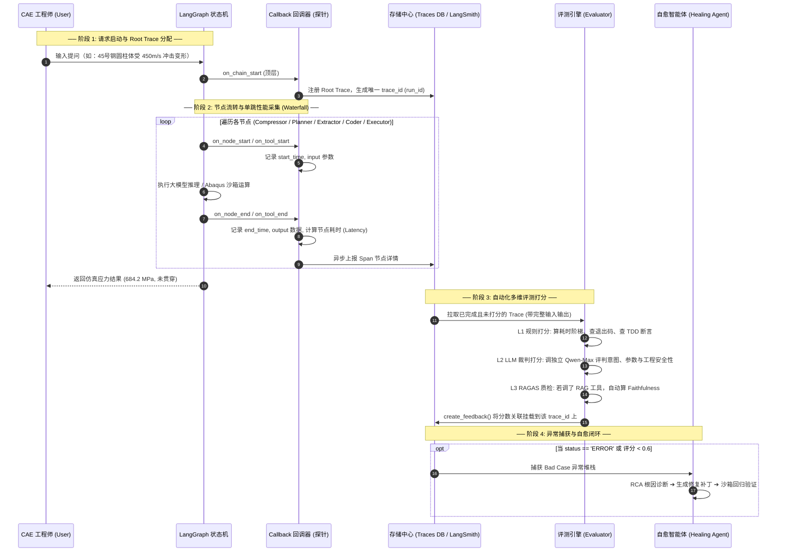
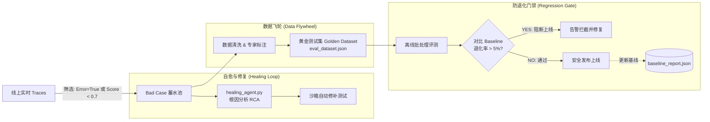

# AI PM 知识体系、项目实战与软件工程全景指南

> **文档定位**：  
> 1. **AI 产品与项目实战**：系统化沉淀中国电建集团成都院 **AI-Review-Copilot（施工方案/合同智能评审系统）** 的需求调研、竞品分析、跨团队协作与三大技术卡点攻坚实录；  
> 2. **通用 PM 体系与方法论**：规范化重构整理 **BRD/MRD/PRD 核心文档体系、SOP作业标准、主流 AI 工具生态与 B 端客户深度解构**；  
> 3. **软件开发工程（SWE）全景实战**：以**半导体装备龙头（新凯来）**岗位 JD 为范本，全面拆解工业级软件开发的**定义、全生命周期流程、核心技术栈雷达、如何做好开发工作以及应聘备战面试指南**。

---

## 目录
- [第一部分 · 实习实战：需求调研与团队协作全景](#第一部分--实习实战需求调研与团队协作全景)
  - [一、 模块概述与核心价值](#一-模块概述与核心价值)
  - [二、 竞品分析（Competitor Analysis）体系与实战](#二-竞品分析competitor-analysis体系与实战)
    - [2.1 竞品分析标准作业流程（SOP）](#21-竞品分析标准作业流程sop)
    - [2.2 AI 智能编审赛道竞品画像与矩阵拆解](#22-ai-智能编审赛道竞品画像与矩阵拆解)
    - [2.3 真实落地情景：电建工程评审场景的竞品调研与壁垒构建](#23-真实落地情景电建工程评审场景的竞品调研与壁垒构建)
  - [三、 B 端需求调研与需求分析（Requirement Elicitation & Analysis）](#三-b-端需求调研与需求分析requirement-elicitation--analysis)
    - [3.1 B 端需求调研全流程](#31-b-端需求调研全流程)
    - [3.2 用户画像与痛点挖掘（三大核心角色）](#32-用户画像与痛点挖掘三大核心角色)
    - [3.3 需求分析与优先级分级（KANO + MoSCoW）](#33-需求分析与优先级分级kano--moscow)
    - [3.4 真实落地情景：从业务专家“红线诉求”到 AI 架构功能转化](#34-真实落地情景从业务专家红线诉求到-ai-架构功能转化)
  - [四、 跨职能团队沟通协作与项目推进（Cross-Functional Collaboration）](#四-跨职能团队沟通协作与项目推进cross-functional-collaboration)
    - [4.1 角色分工与常态化协作矩阵](#41-角色分工与常态化协作矩阵)
    - [4.2 研发全生命周期协作流程（PRD Review → 敏捷迭代 → 交付门禁）](#42-研发全生命周期协作流程prd-review--敏捷迭代--交付门禁)
    - [4.3 真实落地情景：三大技术卡点与跨团队协调攻坚](#43-真实落地情景三大技术卡点与跨团队协调攻坚)
  - [五、 面试高频问题与表达话术库（PM / AI PM 视角）](#五-面试高频问题与表达话术库pm--ai-pm-视角)
  - [六、 AI PM 核心能力卡片总结](#六-ai-pm-核心能力卡片总结)
- [第二部分 · 通用沉淀：PM 核心文档与方法论重构](#第二部分--通用沉淀pm-核心文档与方法论重构)
  - [七、 PM 核心文档体系与研发流程（BRD / MRD / PRD）](#七-pm-核心文档体系与研发流程brd--mrd--prd)
    - [7.1 产品经理三大核心文档详析](#71-产品经理三大核心文档详析)
    - [7.2 软件与 AI 产品研发全生命周期（SDLC）](#72-软件与-ai-产品研发全生命周期sdlc)
    - [7.3 研发各阶段关键交付物与文档矩阵](#73-研发各阶段关键交付物与文档矩阵)
  - [八、 标准作业程序（SOP）方法论](#八-标准作业程序sop方法论)
    - [8.1 为什么要有 SOP（核心价值）](#81-为什么要有-sop核心价值)
    - [8.2 优秀 SOP 的四大核心要素](#82-优秀-sop-的四大核心要素)
    - [8.3 编写优秀 SOP 的四步法](#83-编写优秀-sop-的四步法)
  - [九、 主流 AI Agent 与开发工具生态对比](#九-主流-ai-agent-与开发工具生态对比)
    - [9.1 核心工具全景对比矩阵](#91-核心工具全景对比矩阵)
    - [9.2 深度差异化解析与选型决策树](#92-深度差异化解析与选型决策树)
  - [十、 B 端目标客户与用户角色深度解构](#十-b-端目标客户与用户角色深度解构)
    - [10.1 客户（买单方）vs 用户（使用方）终极判定](#101-客户买单方vs-用户使用方终极判定)
    - [10.2 成都院的多重身份与产品孵化路径](#102-成都院的多重身份与产品孵化路径)
    - [10.3 面试标准口径：“你站在什么角度做这个项目”](#103-面试标准口径你站在什么角度做这个项目)
- [第三部分 · 软件开发工程（SWE）实战与应聘指南：以半导体装备（新凯来）为例](#第三部分--软件开发工程swe实战与应聘指南以半导体装备新凯来为例)
  - [十一、 软件开发介绍与半导体/工业装备软件的特殊性](#十一-软件开发介绍与半导体工业装备软件的特殊性)
    - [11.1 什么是软件开发（互联网软件 vs 工业半导体装备软件）](#111-什么是软件开发互联网软件-vs-工业半导体装备软件)
    - [11.2 半导体装备软件的核心分层架构](#112-半导体装备软件的核心分层架构)
  - [十二、 工业级软件开发全生命周期流程（SDLC）](#十二-工业级软件开发全生命周期流程sdlc)
    - [12.1 装备软件六大核心研发阶段](#121-装备软件六大核心研发阶段)
    - [12.2 软硬件协同开发与在环仿真（HIL）](#122-软硬件协同开发与在环仿真hil)
  - [十三、 核心技术栈与工程能力雷达（新凯来 JD 深度拆解）](#十三-核心技术栈与工程能力雷达新凯来-jd-深度拆解)
    - [13.1 编程语言与基础功底（C/C++ / Python / Linux / RTOS）](#131-编程语言与基础功底cc--python--linux--rtos)
    - [13.2 性能工程与高并发/低延迟技术（多线程、内存池、指令优化）](#132-性能工程与高并发低延迟技术多线程内存池指令优化)
    - [13.3 工业可视化与 3D 渲染（WebGL / Three.js 数字孪生）](#133-工业可视化与-3d-渲染webgl--threejs-数字孪生)
    - [13.4 工业通信协议与底层驱动开发（SECS/GEM、CAN、DSP/ARM）](#134-工业通信协议与底层驱动开发secsgemcandsparm)
    - [13.5 CI/CD 自动化构建与工程效能（GitLab CI / Jenkins / Docker）](#135-cicd-自动化构建与工程效能gitlab-ci--jenkins--docker)
  - [十四、 如何做好软件开发工作（资深工程师的心法与工作习惯）](#十四-如何做好软件开发工作资深工程师的心法与工作习惯)
    - [14.1 防御性编程与高质量代码规范](#141-防御性编程与高质量代码规范)
    - [14.2 工业级疑难故障定位与排查方法论（GDB / Coredump / perf）](#142-工业级疑难故障定位与排查方法论gdb--coredump--perf)
    - [14.3 架构看护与技术债务治理](#143-架构看护与技术债务治理)
  - [十五、 应聘新凯来软件开发工程师备战指南](#十五-应聘新凯来软件开发工程师备战指南)
    - [15.1 简历项目挖掘与新凯来 JD 强匹配策略](#151-简历项目挖掘与新凯来-jd-强匹配策略)
    - [15.2 核心技术面试考点与高频题库](#152-核心技术面试考点与高频题库)
    - [15.3 综合面试回答框架（STAR 原则展示硬核工程特质）](#153-综合面试回答框架star-原则展示硬核工程特质)

---

# 第一部分 · 实习实战：需求调研与团队协作全景

## 一、 模块概述与核心价值

在垂直领域大模型与 AI Agent 落地中，AI 产品经理（或兼具 PM 职能的 Agent 开发者）是**业务专家、算法团队、工程前后端团队**之间的“中枢神经”：

```
                    ┌─────────────────────────┐
                    │      B端业务方/专家     │
                    │ (成都院工程/安全/质检组)│
                    └───────────┬─────────────┘
                                │ 业务痛点 / 评审规则 / 合规标准
                                ▼
┌─────────────────────────────────────────────────────────────┐
│             需求调研与团队协作 (AI PM / Agent 核心)         │
│  - 竞品分析：找准垂直场景生态位，规避通用大模型劣势        │
│  - 需求分析：将“经验直觉”转化为“结构化规则+输入输出定义” │
│  - 跨职能推进：对齐算法能力边界、后端吞吐架构与前端交互体验 │
└───────┬──────────────────────┬──────────────────────┬───────┘
        │ Prompt / Agent编排   │ 接口 / 队列 / 数据流 │ 流式交互 / 复核面板
        ▼                      ▼                      ▼
┌───────────────┐      ┌───────────────┐      ┌───────────────┐
│   算法团队    │      │   后端团队    │      │   前端团队    │
│  (LangGraph/  │      │(Django/Celery/│      │(Vue3/PrimeVue/│
│  Docling/LLM) │      │ RabbitMQ/PG)  │      │  EventSource) │
└───────────────┘      └───────────────┘      └───────────────┘
```

---

## 二、 竞品分析（Competitor Analysis）体系与实战

### 2.1 竞品分析标准作业流程（SOP）

```
[明确调研目标] ──> [竞品筛选与分层] ──> [多维功能/技术拆解] ──> [差异化定位与决策输出]
```

1. **明确目标**：评估市面 AI 编审工具在“长文档合规审核、规范条文比对、专家经验注入”上的能力断层，指导 AI-Review-Copilot 的技术选型与交互形态。
2. **竞品分类**：
   - **直接竞品**：建筑工程/合同专业合规审查工具（如广联达方案/造价合规审查、法大大智能合同审阅、幂律智能合同审查）。
   - **间接竞品**：通用长文档理解与 AI 对话产品（如 Kimi 智能助手、通义千问长文档、秘塔 AI 搜索）。
   - **替代方案**：传统基于关键词/正则匹配的 Office 审阅插件、人工红笔批注协作系统。
3. **分析维度（PM 四维矩阵）**：
   - **技术与模型层**：长文档解析精度（表格/图片/层级标题）、外部知识库（RAG/条文库）召回精度、幻觉抑制手段。
   - **产品交互层**：整篇全量输出 vs 逐条流式响应、批注定位联动（文档定位高亮）、专家复核确认流。
   - **数据与安全层**：私有化/私有云部署、知识产权隔离、审计追踪支持。
   - **自演化能力**：是否支持用户修改/驳回后的模型自我迭代（Skill/规则闭环）。

---

### 2.2 AI 智能编审赛道竞品画像与矩阵拆解

| 维度 | 通用大模型助手 (Kimi / 智谱等) | 传统规则式合规审查工具 | **AI-Review-Copilot（本项目定位）** |
| :--- | :--- | :--- | :--- |
| **典型输入** | 单文档上传，通用 Prompt 提问 | 固定表单、Word 插件正则匹配 | **方案/合同 + 多知识源（指南+国标强条+专家经验）** |
| **文档解析能力** | 通用 PDF/Doc 提取，丢失表格层级与章节号 | 依赖标准模板排版，非标文档失效 | **IBM Docling AI版面解析**，精准保留章节号与复杂表格 |
| **条文对齐与引证** | 模糊回答，易出现“看似合理但捏造条款”幻觉 | 硬编码规则匹配，无语义泛化能力 | **双向精确引用核验（Ref）**，4类引用精准映射，核验率 98% |
| **响应与交互体验** | 漫长等待后整段吐出，无法与文档段落联动 | 离线生成报表，体验割裂 | **SSE 流式逐条推送 + Cache Replay 增量秒级回放**，所见即所得 |
| **经验自演化** | 无法沉淀用户专有修改习惯 | 需研发手动改写规则代码 | **Skill 闭环**：专家采纳/驳回自动演化为置信度规则库 |
| **部署与安全** | 公有云 SaaS，涉密工程数据受限 | 本地化部署但功能僵化 | **Docker 私有化容器部署**（SeaweedFS + PG + Celery），数据不出院 |

---

### 2.3 真实落地情景：电建工程评审场景的竞品调研与壁垒构建

#### 场景实况
在成都院战新产业研究院立项初期，团队测试了直接调用通用大模型（如 GPT-4 / Kimi）对一份 80 页的《深基坑开挖支护施工方案》进行合规审查，暴露出致命问题：
1. **大模型“胡说八道”条款号**：通用大模型指出“不符合《建筑基坑支护技术规程》第4.2.1条”，但实际该规程并无此条款（严重幻觉）。在工程安全中，误报导致专家信任度骤降，漏审危大工程强条更是事故级隐患。
2. **缺乏多知识源交叉校验**：施工方案不仅要对标**国家规范（GB）**，还要对标**电建集团内部施工指南**以及**资深老总工的隐性经验（专家知识）**。市面竞品无法同时挂载这三类异构知识源。
3. **多次修改等待成本高**：方案编制人修改了第 3 章参数后重新提交，市面竞品必须全量重审等待 3~5 分钟，体验极差。

#### PM 决策与输出
基于上述调研，主导输出了**《智能评审 Copilot 竞品功能与技术特性矩阵对比报告》**，明确了差异化竞争策略：
- **功能侧**：确立“4类知识源绑定（方案文档、指南清单、标准规范、专家知识）” + “4类 Ref 引用严格回溯（无依据不输出意见）”的硬性要求。
- **架构侧**：推动算法侧放弃单次 prompt 全文直出，采用 **LangGraph 状态机 + 细粒度规则注入**，并设计 **Cache Replay（缓存重放机制）**，让二次评审延迟降低 70%+。

---

## 三、 B 端需求调研与需求分析（Requirement Elicitation & Analysis）

### 3.1 B 端需求调研全流程

```
[业务场景梳理] ──> [多角色深度访谈] ──> [作业实录与文档收集] ──> [需求清洗与功能抽象] ──> [PRD与原型输出]
```

1. **场景下沉**：深入成都院工程数字化项目部，跟班记录 3 名资深总工、5 名主检工程师审查 10 份典型施工方案的全流程。
2. **样本抽取**：收集 100+ 份历史已审方案及专家红笔批注稿，作为黄金基准集（Golden Set）的种子数据。
3. **需求转化**：将业务语言（“老专家的一句话经验”、“规范里的红线字眼”）翻译为 AI 算法可识别的结构化 Prompt 逻辑与数据库表结构。

---

### 3.2 用户画像与痛点挖掘（三大核心角色）

```
┌────────────────────────────────────────────────────────────────────────┐
│                        AI-Review-Copilot 用户旅程                      │
├─────────────────┬────────────────────────────┬─────────────────────────┤
│ 角色            │ 核心诉求 / 业务动作        │ 痛点 (Pain Points)      │
├─────────────────┼────────────────────────────┼─────────────────────────┤
│ 1. 方案编制人   │ 上传方案自检，按意见快速   │ - 规范太多记不全，易踩  │
│    (初中级工程师)│ 修正，减少被退回修改次数   │   强制性条文“红线”      │
│                 │                            │ - 审查反馈周期长(数天)  │
├─────────────────┼────────────────────────────┼─────────────────────────┤
│ 2. 方案审核人   │ 快速通读全文，识别高风险   │ - 50~100页长文人工读2h, │
│    (技术专家/   │ 项，结合经验进行采纳/驳回/ │   容易视觉疲劳导致漏审  │
│     总工程师)   │ 修正并输出最终评审报告     │ - 经验无法沉淀，徒弟总犯│
│                 │                            │   同类错误              │
├─────────────────┼────────────────────────────┼─────────────────────────┤
│ 3. 质检/管理层  │ 查看项目评审进度、质量统计 │ - 缺乏数字化审计追踪，  │
│    (院领导/PMO) │ 汇总，规范全院审查标准     │   历史修改过程无迹可寻  │
└─────────────────┴────────────────────────────┴─────────────────────────┘
```

---

### 3.3 需求分析与优先级分级（KANO + MoSCoW）

通过 **MoSCoW 模型** 与 **KANO 属性分析**，对收集到的 20+ 个功能点进行精准定级：

| 优先级 (MoSCoW) | 需求功能点 | KANO 属性 | 业务价值与落地理由 |
| :--- | :--- | :--- | :--- |
| **Must-Have (必须有)** | 多源知识绑定与智能评审（指南/标准/知识） | 必备型 (Must-be) | 核心业务底座，解决“有据可查”的合规基线 |
| **Must-Have (必须有)** | 意见精确定位原文与规范（4类 Ref 追溯） | 必备型 (Must-be) | 解决 AI 幻觉，专家只采纳有明确依据的意见 |
| **Must-Have (必须有)** | 评审意见流式推送与状态复核（采纳/驳回/修改） | 期望型 (One-D) | 交互可用性底线，用户无需干等几十秒即可开始审查 |
| **Should-Have (应该有)**| 专家修改/驳回反哺规则库（Skill 自演化体系） | 魅力型 (Attractive)| 核心壁垒：使系统越用越聪明，实现经验数字化沉淀 |
| **Should-Have (应该有)**| 局部修改增量二次评审（Cache Replay 回放） | 期望型 (One-D) | 大幅提升复审效率，二次评审从 30s+ 降至秒级 |
| **Could-Have (可以有)** | 一键导出带批注的 Word (.docx) 评审报告 | 期望型 (One-D) | 满足传统线下归档流程，提升交付满意度 |
| **Won't-Have (本次不做)**| 3D BIM 模型与施工方案自动几何校验 | 魅力型 (Attractive)| 算力与模型成熟度不足，留作二期规划 |

---

### 3.4 真实落地情景：从业务专家“红线诉求”到 AI 架构功能转化

#### 场景 1：专家要求“评审意见不能凭空捏造，必须指出哪一本规范哪一条”
- **业务诉求**：“以前的 AI 工具给出的意见太泛，比如‘基坑排水措施不充分’，专家根本不敢采纳，必须指出是《建筑基坑支护规程》JGJ 120-2012 第 7.1.3 条，并且在方案第几页第几段。”
- **PM 需求转化**：
  1. 在数据模型中设计 `Comment` 与 4 种强关联模型：
     - `CommentDocumentRef`：记录方案原文的精确字符偏移量（`start_offset`, `end_offset`）与快照文本；
     - `CommentGuidelineRef`：精准外键关联到指南子条文（`GuidelineClause`）；
     - `CommentStandardRef`：记录标准条文原文字符串；
     - `CommentKnowledgeRef`：关联专家知识库条目。
  2. 算法输出 Schema 增加硬约束：每一条评审意见必须包含引文与位置，若检索不到匹配条款则判定无效，丢弃输出。

#### 场景 2：专家担心“年轻员工胡乱驳回会污染全院的规则库”
- **业务诉求**：“高级专家的经验是金标准，但普通施工员为了省事经常‘一键驳回’，如果系统把这些错误反哺给模型，系统就废了。”
- **PM 需求转化**：
  1. **权限分层过滤**：普通用户的采纳/驳回仅记录在当前任务历史中，不直接扣减全局规则置信度；
  2. **管理中心审批流**：沉淀的 Skill 规则引入状态机（`pending_review` / `active` / `deprecated`）。普通用户的反哺提交至管理中心，由管理员/总工一键审核通过后才触发全局置信度调整（采纳 `+0.05`，驳回 `×0.8`）。

---

## 四、 跨职能团队沟通协作与项目推进（Cross-Functional Collaboration）

### 4.1 角色分工与常态化协作矩阵

在 AI-Review-Copilot 研发中，PM 建立了一套高效的跨职能对接机制：

```
┌───────────────┐                  ┌────────────────────────────────────────┐
│ 角色          │ 核心关注点       │ 协作接口与对齐机制                     │
├───────────────┼──────────────────┼────────────────────────────────────────┤
│ 业务专家/     │ - 审查准确性     │ - 每周二/四组织评审意见质量抽检        │
│ 质检工程师    │ - 漏审率(召回率) │ - 维护 Golden Set 黄金基准集           │
│               │ - 意见表达专业度 │ - 梳理行业标准规范与强条清单           │
├───────────────┼──────────────────┼────────────────────────────────────────┤
│ 算法/Agent    │ - LangGraph 拓扑 │ - 制定 JSON Schema 接口协议            │
│ 工程师        │ - 提示词工程     │ - 设定 L1-L5 评测门禁指标              │
│               │ - LLM 延迟/Token │ - 推动 Docling 解析准确率提升          │
├───────────────┼──────────────────┼────────────────────────────────────────┤
│ 后端工程师    │ - 任务吞吐与并发 │ - 制定 Celery 多队列调度策略           │
│ (Django/Celery│ - 数据库一致性   │ - 统一 Redis SSE 消息格式与心跳机制    │
│  /RabbitMQ)   │ - S3 文件生命周期│ - 定义 RESTful API / ViewSet 接口规范   │
├───────────────┼──────────────────┼────────────────────────────────────────┤
│ 前端工程师    │ - EventSource 流 │ - 协商逐条意见渐进式渲染机制           │
│ (Vue3/Pinia)  │ - 文档高亮联动   │ - 制定工作台三栏布局与快捷键操作逻辑   │
│               │ - 操作响应流畅度 │ - 联调异常重连与 Cache Replay 回放效果 │
└───────────────┘                  └────────────────────────────────────────┘
```

---

### 4.2 研发全生命周期协作流程

```
 1. 需求规划与评审          2. 接口与评测前置         3. 敏捷开发与联调          4. 门禁评测与发布
┌─────────────────┐       ┌─────────────────┐       ┌─────────────────┐       ┌─────────────────┐
│ PRD/原型输出    │ ────> │ 定义 API Schema │ ────> │ 算法+前后端分头 │ ────> │ L1-L5 分层评测  │
│ 业务+技术评审会 │       │ 锁定评测Golden集│       │ 每日 Standup 同步│       │ 达标准入生产发布│
└─────────────────┘       └─────────────────┘       └─────────────────┘       └─────────────────┘
```

1. **需求评审会（PRD Review）**：不仅看 UI 原型，重点评审 **AI 任务状态流转图**（`pending` → `parsing` → `reviewing` → `pending_review` → `completed`）与 **错误边界处理**（如解析超时、LLM 接口熔断）。
2. **接口先行与契约化**：前后端与算法在 Day 1 共同敲定 SSE 事件规范（`new_comment`、`replace_comments`、`completed`、`error`），实现并行开发。
3. **每日 15 分钟 Standup**：聚焦阻碍点（Blocker），快速拉齐“文档解析挂起”、“大模型响应超时”等跨模块问题。

---

### 4.3 真实落地情景：三大技术卡点与跨团队协调攻坚

#### 卡点 1：长文档解析耗时过长导致 HTTP 超时，前端频繁报错
- **现象**：用户上传 100 页带有多层复杂表格的 Word/PDF，Docling 解析耗时需 40~60 秒，直接导致 Web 接口网关 504 Gateway Timeout。
- **PM 协调过程**：
  1. **召集算法与后端会议**：分析解析资源消耗（CPU密集型），决定将长任务完全异步化。
  2. **架构重构推进**：后端引入 **Celery + RabbitMQ**，开辟专属 `doc-parser` 队列（设置 `time_limit=62min`，与普通 LLM 请求物理隔离），采用 `gevent` 协程提升 I/O 并发。
  3. **前端体验闭环**：前端改为轮询/SSE 监听 `Task.status`，增加步骤进度条（“正在深度解析版面与表格...”），彻底解决用户等待焦虑与网络超时。

#### 卡点 2：LLM 逐条流式输出与局部修改重新评审的矛盾（Cache Replay 诞生记）
- **现象**：
  - 业务专家反馈：“方案改了 2 处参数重新提交，又得等 30 秒全部重新生成一遍，太慢！”
  - 算法提出直接返回历史 JSON 数据，但前端提出：“如果直接返一大段 JSON，前端现有的逐条动态加载、动画渲染和通知逻辑全得写两套代码，维护成本极高。”
- **PM 协调方案（双赢设计）**：
  - 主导推动 **Cache Replay（增量缓存回放）** 机制：
    1. 缓存 key 以“文档内容 + 指南 + 标准 + 知识”的联合 MD5 作为特征值；
    2. 缓存命中时，后端使用 **Custom Stream Writer** 模拟大模型生成过程，以毫秒级间隔逐条重放历史意见流；
    3. **达成共识**：“**缓存只压缩时间，不改变外部行为**”。前端使用同一套 EventSource 渲染逻辑通吃实时流与缓存流，二次评审延迟降低 70%+，前后端零额外适配负担。

#### 卡点 3：算法与业务在“模型采纳率”上的分歧与 L1-L5 评测体系建立
- **现象**：算法团队认为“模型已经生成了 20 条意见，准确率很高”；但业务总工反馈“很多意见都是车轱辘话，真正关键的强条漏了 3 条，采纳率不到 40%”。
- **PM 协调方案**：
  - 拒绝模糊的“主观感受”，联合算法与业务专家共同制定 **L1~L5 分层评测框架**：
    - **L1（条文抽取）**：计算 Precision / Recall / F1（目标 F1 ≥ 0.90，实测 0.92）；
    - **L2（知识摘要）**：ROUGE 指标 + 忠实度；
    - **L3（意见质量）**：条文覆盖率、对专家 Golden Set 的 F1，以及引用核验率（要求 ≥ 95%，实测 98%）；
    - **L4（规则演化）**：对照实验评估注入正/负规则后的误判抑制率；
    - **L5（端到端）**：全链路一致性校验。
  - **结果**：将评测体系固化为 CI/CD 发布门禁，推动线上专家采纳率稳步提升至 **72%**。

---

## 五、 面试高频问题与表达话术库（PM / AI PM 视角）

### Q1: 在该项目中，你作为 PM / 核心协调者，是如何在业务专家和算法团队之间进行需求翻译的？
> **答题话术**：  
> “在工程建设这个高专业度领域，业务专家习惯使用‘经验直觉’（比如‘基坑开挖深了必须有应急泵’），而算法团队需要‘结构化的输入输出和数学定义’。  
> 我的核心工作是**双向翻译与标准化**：  
> 一方面，我通过跟班访谈和 Golden Set 标注，把老专家的隐性经验解构成 `触发场景 + 判定规则 + 引用条款 + 严重度级别` 的四元组结构，形成了平台的数据规范；  
> 另一方面，我把大模型的‘幻觉风险、延迟特性、Token 成本’解释给业务方，并设计了‘4类 Ref 引用强制核验’和‘置信度演化防毒机制’，既满足了专家对‘有据可查’的硬性合规要求，又让算法团队有了清晰的损失函数和落地边界。”

---

### Q2: 面对长文档解析慢、大模型生成延迟高的问题，你是如何从产品和工程协同角度解决的？
> **答题话术**：  
> “长文档智能审阅的延迟是行业共性卡点。我从**交互体验、任务调度、算法优化**三个维度协同推进：  
> 1. **交互层面**：放弃传统的‘全量生成后再返回’，采用 Redis Streams + SSE 长连接实现**逐条流式渲染**，用户在 3~5 秒内就能看到第一条意见并开始复核，极大摊薄感知等待时间；  
> 2. **调度层面**：推动工程团队拆分 Celery 物理队列（`doc-parser`、`llm-lite`、`llm-main`），避免耗时 1 小时的长文档解析阻塞轻量级摘要任务；  
> 3. **复审机制**：针对方案多次微调修改的场景，主导设计了 **Cache Replay** 机制，基于内容 MD5 实现局部修改下的毫秒级增量回放，二次评审端到端延迟降低 70%+。”

---

### Q3: 算法团队觉得模型效果已经不错，但业务方依然觉得不好用，你作为 PM 怎么破局？
> **答题话术**：  
> “这是 AI 落地最典型的‘体验断层’。破局的关键在于**建立公认的、可量化的评测标准，避免主观扯皮**：  
> 我主导搭建了 **L1-L5 分层评测体系**，从底层条文抽取 F1（L1）一直度量到最终线上专家的采纳率（L5）。  
> 当业务方抱怨‘漏审’时，我们用 Golden Set 定量测出漏审率，并追溯是因为 Docling 表格解析丢失还是 LLM 检索未召回；当业务方抱怨‘胡说’时，我们上线 4 类 Ref 引用核验机制，把引文核验率拉到 98%。  
> 通过把主观抱怨转化为具体的 L1-L5 指标和自动化发布门禁，团队有了共同的攻坚靶心，最终将线上专家真实采纳率提升到了 72%。”

---

## 六、 AI PM 核心能力卡片总结

```
┌────────────────────────────────────────────────────────────────────────┐
│               AI-Review-Copilot 需求与协作核心资产                     │
├───────────────────┬────────────────────────────────────────────────────┤
│ 1. 竞品洞察力     │ 准确定位垂直合规审查壁垒：高精度解析 + 引用核验 +  │
│                   │ 专家经验演化，避开通用大模型同质化竞争             │
├───────────────────┼────────────────────────────────────────────────────┤
│ 2. 需求解构力     │ 将工程强条规范转化为 LangGraph 状态节点、Ref 引用  │
│                   │ 模型与置信度动态衰减算法 (+0.05 / ×0.8)            │
├───────────────────┼────────────────────────────────────────────────────┤
│ 3. 跨团队推进力   │ 协调算法(Docling/Graph)、后端(Celery/SSE)、前端    │
│                   │ (Vue3)，落地 Cache Replay 与多队列隔离架构         │
├───────────────────┼────────────────────────────────────────────────────┤
│ 4. 质量把控力     │ 建立 L1-L5 分层评测标准作为上线门禁，用真实采纳率  │
│                   │ (72%) 和效率提升 (60%) 验证商业与业务价值          │
└───────────────────┴────────────────────────────────────────────────────┘
```

---
---

# 第二部分 · 通用沉淀：PM 核心文档与方法论重构

## 七、 PM 核心文档体系与研发流程（BRD / MRD / PRD）

### 7.1 产品经理三大核心文档详析

在产品从 0 到 1 或重大迭代过程中，BRD、MRD、PRD 构成了产品经理的“三大支柱文档”。它们面向不同的受众，解决不同层级的问题：

```
                      【BRD 商业需求文档】
                    面向老板/投资人 ── 解决“要不要做/能赚多少”
                              │
                              ▼
                      【MRD 市场需求文档】
                    面向管理层/业务骨干 ── 解决“如何切入市场/版本规划”
                              │
                              ▼
                      【PRD 产品需求文档】
                    面向设计/开发/测试 ── 解决“做成什么样/交互与规则细节”
```

#### 1. 商业需求文档（BRD, Business Requirement Document）
- **核心定位**：说服老板或投资人，为项目争取资金、算力与研发资源。
- **面向对象**：公司决策层、CEO、业务 VP、外部投资人。
- **核心模块**：
  1. **项目背景与痛点**：为什么要做？解决什么行业/内部刚需？
  2. **市场规模与商业价值**：TAM/SAM/SOM 测算、预期营收或降本增效指标（ROI）；
  3. **竞品态势与机会点**：对手做得如何？我们的差异化护城河在哪里？
  4. **商业模式与实施策略**：私有化部署收费 / SaaS 订阅 / 内部提效核算；
  5. **资源投入与排期**：人力成本、算力成本、预期里程碑。

#### 2. 市场需求文档（MRD, Market Requirement Document）
- **核心定位**：将 BRD 的商业方向细化为具体可落地的**产品定位与版本演进路线图**。
- **面向对象**：产品总监、项目经理、运营与市场负责人。
- **核心模块**：
  1. **目标用户画像（Persona）**：精准刻画不同角色特征与场景链路；
  2. **竞品深度剖析**：直接/间接竞品的功能矩阵比对与体验对标；
  3. **产品整体方案框架**：核心功能结构（Feature List）与能力边界；
  4. **版本演进计划（Roadmap）**：MVP 验证期 $\rightarrow$ V1.0 核心闭环 $\rightarrow$ V2.0 生态扩展。

#### 3. 产品需求文档（PRD, Product Requirements Document）
- **核心定位**：研发团队（前后端、算法）、UI 设计师与测试人员的**直接执行依据**。
- **面向对象**：UI/UX 设计师、开发工程师、算法工程师、QA 测试工程师。
- **核心模块**：
  1. **版本背景与目标**：明确本次迭代要解决的具体问题与考核指标；
  2. **用户旅程与业务流程图（Flowchart）**：正向流程、逆向分支与异常容错分支；
  3. **原型界面与交互规范**：页面布局、控件行为、动效与流式渲染效果；
  4. **功能说明与详细业务规则**：字段定义、校验边界、权限矩阵、数据字典；
  5. **技术契约与接口规格（AI 特色）**：JSON Schema 规范、Ref 引用绑定协议、模型超时降级策略。

---

### 7.2 软件与 AI 产品研发全生命周期（SDLC）

软件开发并非一次性交付，而是一个严密的闭环流转体系：

```
 市场调研 / 用户需求 
        │ (工况观察、深度访谈、竞品调研)
        ▼
 需求分析与优先级定级
        │ (KANO模型、MoSCoW矩阵、可行性评估)
        ▼
 PRD 编写与交互原型设计
        │ (规格说明书、数据流图、状态流转图)
        ▼
 需求评审会（PRD Review）
        │ (业务、产品、前后端、算法、测试共同对齐签字)
        ▼
 UI 视觉设计 & 技术方案设计
        │ (高保真原型 / 接口契约 / 数据表设计 / LangGraph 拓扑)
        ▼
 开发编码与测试联调
        │ (算法编排 / 前后端开发 / 单元测试 / L1-L5 评测门禁)
        ▼
 上线交付、数据分析与持续迭代
        │ (生产发布 / 埋点监控 / 采纳率分析 / 用户反馈反哺)
```

---

### 7.3 研发各阶段关键交付物与文档矩阵

| 阶段 | 核心文档 / 交付物 | 核心受众 | 主要目的与作用 |
| :--- | :--- | :--- | :--- |
| **立项前** | **BRD 商业需求文档** | 决策层 / 投资人 | 论证商业可行性，争取资源与预算 |
| **规划期** | **MRD 市场需求文档** | 产品总监 / 研发负责人 | 明确目标客群、产品功能框架与版本 Roadmap |
| **规划期** | **竞品分析报告** | 决策层 / 产品团队 | 剖析对手优劣势，指导差异化壁垒构建 |
| **研发前** | **PRD 产品需求文档** | 研发 / 算法 / 设计 / 测试 | 明确功能规格、原型、业务规则与接口契约 |
| **研发中** | **项目进度周报 / 燃尽图** | 管理层 / 项目组 | 同步各模块开发进度，预警与协调技术卡点（Blocker） |
| **上线后** | **产品说明文档（用户手册）**| 最终用户 / 运维团队 | 指导 B 端复杂业务操作，降低培训与售后服务成本 |
| **上线后** | **用户使用与满意度报告** | 产品 / 运营团队 | 通过访谈与工单收集一线反馈，指导下阶段功能迭代 |
| **上线后** | **产品数据分析报告** | 算法 / 研发团队 | 统计功能留存、模型采纳率、任务耗时与报错率 |

---

## 八、 标准作业程序（SOP）方法论

> 

### 8.1 为什么要有 SOP（核心价值）
> **SOP（Standard Operating Procedure，标准作业程序）**：将某一事件的标准操作步骤和要求以统一的格式描述出来，用来指导和规范日常工作的操作体系。  
> **核心价值**：**有了 SOP，重复的工作可以流程化，复杂的问题可以简单化，交付的结果可以标准化。**

1. **降低出错率**：在流程复杂、细节繁多的任务中充当“安全绳”，防止关键步骤遗漏。
2. **大幅提高协作效率**：避免每次重新摸索流程，新人按部就班即可高效推进。
3. **沉淀组织资产（防止经验流失）**：把老专家的“隐性经验”转化为“显性制度”，换人不影响业务连续性。
4. **确保输出一致性**：无论由谁执行，最终交付的质量与格式都能保持高度统一。

---

### 8.2 优秀 SOP 的四大核心要素

- **要素一：简单易懂，作业员信得过**：
  - 拒绝晦涩繁琐的“学术论文”，用直白的语言描述动作；
  - 必须紧贴一线真实流程，流程变了及时更新，避免脱节成为“空中楼阁”。
- **要素二：快速理解，最好“一页搞定”**：
  - 多用图表、截图、流程图（如宜家装配说明），少用纯文字；
  - 控制篇幅在一屏或一页内，减少翻屏切换带来的认知损耗。
- **要素三：随时可得，检索零门槛**：
  - 嵌入日常工作台或知识库首屏，几秒内即可调出查阅。
- **要素四：与实操培训严格一致**：
  - 培训教什么，SOP 就写什么，代码与实际流程就怎么跑，杜绝“阴阳两套标准”。

---

### 8.3 编写优秀 SOP 的四步法

```
[1. 现场观察走查] ──> [2. 拆解原子步骤] ──> [3. 可视化与图表化] ──> [4. 试运行与反馈优化]
```

1. **现场观察走查**：深入业务一线，实地观察记录老员工与真实用户的实际操作细节；
2. **拆解原子步骤**：把复杂流程分解为不可再分的单步动作，明确“谁在什么条件下、用什么工具、做什么动作、交付什么产物”；
3. **可视化与图表化**：以流程图、状态机图、对比表格和操作截图代替冗长文字；
4. **试运行与反馈优化**：邀请新员工或真实用户试走流程，收集堵点并持续迭代修改。

---

## 九、 主流 AI Agent 与开发工具生态对比

### 9.1 核心工具全景对比矩阵

| 工具名称 | 主要定位与形态 | 核心驱动 / 场景 | 核心优势 | 局限性 / 适用门槛 |
| :--- | :--- | :--- | :--- | :--- |
| **WorkBuddy / 悟空** | 桌面级/企业级 AI 办公智能体 (GUI/桌面端) | 办公自动化、跨应用协作、文档与审批处理 | 深度集成钉钉/企业微信生态，直接交付办公结果而非仅回答 | 偏向通用办公与审批流程，非专业代码开发工具 |
| **OpenClaw** | 开源自托管多渠道 Agent 网关 (CLI/服务端) | 跨平台消息助手、个人 workflow 自动化 | 开源私有部署、可挂载 Telegram/Discord/Slack、自主控制 API | 需要一定运维能力，需自行配置模型与 API Key |
| **Hermes** | 自进化 Agent 智能体框架 (TUI/云端) | 自主学习、长期记忆、自创技能、极客自动化 | 内置闭环学习（自动提炼 Skill）、定时 Cron、跨会话长期记忆 | 极客向，学习曲线陡峭，需较多配置调试 |
| **Trae** | AI 原生图形化 IDE (桌面客户端) | 项目级软件开发、调试、测试与重构 | 交互体验好（IDE+SOLO 双模式）、支持 MCP 扩展、可视化上下文管理 | 依赖桌面 GUI 环境，对习惯纯终端的开发者略显偏重 |
| **Claude Code** | 终端命令行 Coding Agent (CLI) | 复杂 Codebase 理解、跨文件重构、自动 Run & Test | 极致终端自动化，自主执行 Git/编译/测试，推演极强 | 无 GUI 图形界面，依赖 Token 消耗，需对 CLI 环境熟练 |
| **Codex** | 底层代码大模型基座 / API (Model Engine) | 代码补全、函数生成、语法翻译（作为后端） | 生成精度高、响应快、适合作为 IDE 插件（如 GitHub Copilot）的底层动力 | 仅为 API / 补全模型，不具备自主执行环境与工具自治链路 |

---

### 9.2 深度差异化解析与选型决策树

```
                               用户需求 / 身份维度
                                       │
        ┌──────────────────────────────┼──────────────────────────────┐
        ▼                              ▼                              ▼
【企业管理 / 办公协同】       【极客隐私 / 自动化网关】       【软件开发 / 代码重构】
        │                              │                              │
  WorkBuddy / 悟空           OpenClaw (跨IM连接)                     │
(钉钉/审批/办公自动化)      Hermes (自进化Skill/记忆)                 │
                                                                      │
                                      ┌───────────────────────────────┴───────────────────────────────┐
                                      ▼                                                               ▼
                             【GUI 可视化多模式开发】                                       【纯命令行高自治重构】
                                      │                                                               │
                                Trae (AI IDE)                                                  Claude Code (CLI Agent)
```

---

## 十、 B 端目标客户与用户角色深度解构

### 10.1 客户（买单方）vs 用户（使用方）终极判定

在工程建设与重型 B 端合规产品中，切忌把“文档编制方”当成“核心用户”：

```
 施工承包方 (编方案) ──提交──> 监理单位 (高频日常初审) ──提交──> 建设单位/业主 (终审责任与买单方)
                                                              ▲
                                                              │ 组织危大工程专项论证会
                                                       设计院 / 专家组 (技术复核与强条把关)
```

| 群体 | 角色定位 | 是系统主用户吗？ | 结论与业务逻辑 |
| :--- | :--- | :--- | :--- |
| **施工承包方** | 方案的编制者 | ✗ 不是主用户 | 系统是“审查工具”，对他们是“找茬”。（可作为次要的“提交前合规自检”扩展场景，但不作为主定位） |
| **监理单位** | 高频审查者，天天看方案 | **✓ 最贴合的日常用户 (User)** | 每天面对 50~100+ 页长文，强条漏看、规范比对正是其最核心的痛点 |
| **建设单位 (业主)** | 最终责任方、出资方 | **✓ 产品视角的客户 (Customer)** | 承担工程质量安全主体责任，出资采购系统并强制要求监理与各标段使用 |
| **设计院 / 专家组** | 专项论证参与者 | **✓ 专业审查用户** | 参加危大工程专项论证，核验方案与设计条件、规范强条是否冲突 |

---

### 10.2 成都院的多重身份与产品孵化路径

**关键纠正**：在对外交流中，严禁将自己公司表述为“标杆客户”，建议表述为**“种子用户 / 内部试点孵化”**。

```
【行业普遍痛点】                【成都院内部试点孵化】                【行业通用产品输出】
单份方案审2小时       ───>      三重身份真实业务验证       ───>      面向工程建设行业
强制性条文易漏看                (设计院 + EPC总包 + 监理)            标准化 B 端 Copilot
```

---

### 10.3 面试标准口径：“你站在什么角度做这个项目”

面试官追问“你站在什么角度”，标准回答是**“一枚硬币的两面”**：

```
                            AI-Review-Copilot 项目定位
                                       │
        ┌──────────────────────────────┴──────────────────────────────┐
        ▼                                                             ▼
【需求分析 / 产品视角（业务面）】                              【平台架构 / 开发视角（工程面）】
站在审查侧（监理/业主）做用户画像与痛点挖掘                    站在平台建设者角度搭建 AI Agent 底座
讲长文档漏审、经验断层与 4类 Ref 追溯设计                       讲 LangGraph 工作流、Celery 队列隔离与 Cache Replay
```

---
---

# 第三部分 · 软件开发工程（SWE）实战与应聘指南：以半导体装备（新凯来）为例

## 十一、 软件开发介绍与半导体/工业装备软件的特殊性

### 11.1 什么是软件开发（互联网软件 vs 工业半导体装备软件）

软件开发不仅仅是“编写代码”，而是**将物理现实与业务逻辑抽象为可靠的数据结构与算法，并在计算机硬件上实现稳定、高效、可维护运行的系统工程**。

以**新凯来（半导体精密装备）**为代表的工业/装备软件，与传统互联网软件有本质区别：

```
┌────────────────────────────────────────────────────────────────────────┐
│                        软件开发领域对比矩阵                            │
├─────────────────┬────────────────────────────┬─────────────────────────┤
│ 维度            │ 传统互联网 / IT 软件       │ 半导体精密装备软件 (新凯来)│
├─────────────────┼────────────────────────────┼─────────────────────────┤
│ 核心追求   │ 快速迭代、高吞吐 (QPS)、SLA│ 高实时 (微秒/毫秒级)、高精密、高可靠│
├─────────────────┼────────────────────────────┼─────────────────────────┤
│ 容错代价    │ 线上 Bug 可热修复、灰度回滚│ 软件死锁/抖动导致晶圆报废、机械撞机，损失数百万│
├─────────────────┼────────────────────────────┼─────────────────────────┤
│ 系统底座    │ Java/Go/Python, Linux/K8s  │ C/C++, Linux, RTOS (硬实时内核), DSP/ARM│
├─────────────────┼────────────────────────────┼─────────────────────────┤
│ 交互对象    │ 浏览器、手机 App、数据库   │ 精密机械臂、传感器、真空腔体、工业总线│
├─────────────────┼────────────────────────────┼─────────────────────────┤
│ 行业标准    │ RESTful, gRPC, OAuth       │ SECS/GEM, EtherCAT, CANopen, SEMI 规范│
└─────────────────┴────────────────────────────┴─────────────────────────┘
```

---

### 11.2 半导体装备软件的核心分层架构

半导体装备（如光刻、刻蚀、薄膜沉积、量测设备）的软件系统通常采用高度解耦的**五层架构**：

```
┌────────────────────────────────────────────────────────────────────────┐
│ 1. 上位机人机交互层 (HMI / GUI) ── WebGL, Three.js 3D 腔体数字孪生/晶圆监控  │
├────────────────────────────────────────────────────────────────────────┤
│ 2. 工艺配方与业务调度层 (Recipe & Host) ── SECS/GEM 通信、自动化流程编排      │
├────────────────────────────────────────────────────────────────────────┤
│ 3. 核心控制与状态机层 (Core Control) ── 有限状态机 (FSM)、故障保护、联锁机制   │
├────────────────────────────────────────────────────────────────────────┤
│ 4. 实时运动控制与算法层 (Motion & Algo) ── RTOS/Linux 实时内核、轨迹规划、PID │
├────────────────────────────────────────────────────────────────────────┤
│ 5. 底层通信与硬件驱动层 (Drivers & I/O) ── CAN/EtherCAT 驱动、DSP/MCU/ARM 裸机│
└────────────────────────────────────────────────────────────────────────┘
```

---

## 十二、 工业级软件开发全生命周期流程（SDLC）

在新凯来等先进制造企业中，软件开发遵循严格的 **V 模型与敏捷（Agile）结合流程**，涵盖 6 大标准阶段：

```
   1. 需求分析与半导体工艺对齐 (SECS/GEM, SEMI标准)        6. 现场运维、故障诊断与 Coredump 根因分析
         ＼                                                          ／
          2. 系统架构方案设计 (状态机、实时域/非实时域隔离)      5. 自动化构建 (CI/CD)、自动化回归测试
                ＼                                            ／
                 3. 代码开发 (现代 C++/C, 防御性编程) ── 4. 集成测试与硬件在环仿真 (HIL)
```

### 12.1 装备软件六大核心研发阶段
1. **需求分析（Requirement Analysis）**：
   - 深入半导体工艺工况，将工艺专家、电气工程师的动作需求（如“真空腔抽气至 10^-5 Pa 后机械手进片”）转化为软件状态迁移图与时序图。
2. **架构方案设计（Software Architecture Design）**：
   - 划分实时域（RTOS）与非实时域（Linux GUI/数据库）；
   - 定义模块间 IPC 机制（共享内存、无锁环形缓冲区 RingBuffer、ZeroMQ/Protobuf）；
   - 设计安全联锁（Interlock）与异常降级策略。
3. **代码开发与看护（Coding & Implementation）**：
   - 遵循 MISRA C++ / Google C++ 编码规范；
   - 采用 RAII、智能指针治理内存生命周期，严格禁止隐式类型转换与悬空指针。
4. **集成测试与硬件在环（HIL, Hardware-in-the-Loop）**：
   - 在未挂载真实精密机械前，通过仿真器模拟传感器与电机反馈，验证极端边界条件。
5. **持续集成与自动化构建（CI/CD & DevOps）**：
   - 基于 GitLab CI / Jenkins 构建自动化编译流水线；
   - 每次代码提交自动触发：静态代码扫描（SonarQube/Coverity） $\rightarrow$ 单元测试覆盖率检查 $\rightarrow$ 自动化镜像打包。
6. **后端故障诊断与维护（Diagnostics & Maintenance）**：
   - 处理现场突发异常，提取系统 Coredump、环形时序日志进行复盘，完成 RCA（根因分析）与补丁热修复。

---

## 十三、 核心技术栈与工程能力雷达（新凯来 JD 深度拆解）

针对新凯来岗位 JD 的 6 条硬性要求，提炼出以下核心技术栈与能力图谱：

```
                              新凯来软件工程师技术图谱
┌─────────────────────┬─────────────────────┬─────────────────────┬─────────────────────┐
│    1. 语言与系统    │    2. 性能与并发    │    3. 渲染与可视化  │   4. 驱动与通信协议 │
├─────────────────────┼─────────────────────┼─────────────────────┼─────────────────────┤
│ - 现代 C/C++ (11/17)│ - 多线程/无锁编程   │ - WebGL / Three.js  │ - SECS/GEM (SEMI)   │
│ - Python / Java / JS│ - 内存池/缓存优化   │ - 工业数据实时看板  │ - EtherCAT / CANopen│
│ - Linux 系统编程    │ - CPU 指令优化(SIMD)│ - 3D 机械数字孪生   │ - DSP / MCU / ARM   │
│ - RTOS 硬实时内核   │ - 故障处理 (GDB/Dump│ - Canvas / WebWorker│ - 串口 / TCP Socket │
└─────────────────────┴─────────────────────┴─────────────────────┴─────────────────────┘
```

### 13.1 编程语言与基础功底
- **C/C++（重中之重）**：
  - 核心要求：熟练掌握现代 C++（C++11/14/17）、STL 容器底层原理、移动语义（Move Semantics）、RAII、智能指针（`unique_ptr`/`shared_ptr`）。
  - 内存模型：深入理解堆/栈分布、内存对齐（Data Alignment）、虚函数表（vtable）寻址开销。
- **Python / Java / JavaScript**：
  - 用于上位机业务逻辑、测试脚本自动化、数据分析与 Web 前端交互。
- **Linux & RTOS 嵌入式操作系统**：
  - Linux 系统编程：进程间通信（IPC：shm/pipe/socket）、`epoll` 高并发 I/O 复用、信号处理、线程同步原语（mutex, condition_variable, rwlock）。
  - RTOS（如 FreeRTOS, VxWorks, RT-Linux）：任务抢占式调度、优先级反转与优先级继承、硬件中断（ISR）与下半部机制。

---

### 13.2 性能工程与高并发/低延迟技术
半导体装备对软件的响应延迟通常要求在**毫秒甚至微秒级**，任何偶发 GC 卡顿或锁竞争都是不可接受的：
- **内存优化与内存池（Memory Pool）**：高频创建销毁对象时避免系统调用 `malloc/free`，采用预分配定长内存池，杜绝内存碎片与内存泄漏。
- **多线程与无锁编程（Lock-Free Programming）**：利用原子操作（`std::atomic`）、CAS（Compare-And-Swap）与 Memory Barrier 实现无锁环形队列（RingBuffer），保障生产者-消费者超高吞吐。
- **CPU 亲和性与指令优化**：将核心控制线程绑定至指定 CPU 核心（`pthread_setaffinity_np`），减少线程上下文切换；利用 SIMD 指令集加速批量数据运算。

---

### 13.3 工业可视化与 3D 渲染（WebGL / Three.js）
- **3D 装备数字孪生**：基于 Three.js 加载半导体腔体、机械臂的 CAD/glTF 3D 模型，根据底层实时传感器数据驱动 3D 机械臂运动姿态。
- **海量工业时序数据渲染**：在浏览器端实时绘制数万个采样点（如腔体真空度、射频功率曲线），利用 WebGL / OffscreenCanvas / Web Workers 进行多线程渲染，保障 60 FPS 流畅度。

---

### 13.4 工业通信协议与底层驱动开发
- **SECS/GEM 标准协议**：半导体设备与晶圆厂 MES 主机通信的核心国际标准（SEMI E5/E30/E37），掌握 HSMS（TCP/IP）与 SECS-I 报文编解码。
- **现场总线与驱动**：EtherCAT（工业以太网主流）、CAN/CANopen、Modbus RTU/TCP、RS232/RS485。
- **DSP / MCU / ARM 底层开发**：掌握裸机或 RTOS 下的 GPIO、PWM、ADC、SPI、I2C 驱动开发与硬件寄存器配置。

---

### 13.5 CI/CD 自动化构建与工程效能
- **版本控制与工作流**：熟练运用 Git（分支策略 Git Flow、Rebase、Cherry-pick、Submodule 管理复杂子模块）。
- **CI/CD 流水线**：搭建 GitLab CI / Jenkins 自动化脚本，结合 Docker 容器实现一致的编译构建环境，支持跨平台交叉编译（x86 交叉编译 ARM/DSP 目标镜像）。

---

## 十四、 如何做好软件开发工作（资深工程师的心法与工作习惯）

### 14.1 防御性编程与高质量代码规范
1. **输入验证与断言先行**：对所有外部输入、指针参数进行合法性校验，公共 API 严守契约；
2. **资源获取即初始化（RAII）**：所有文件句柄、互斥锁、Socket、内存均用对象封装，利用析构函数自动释放，杜绝资源泄漏；
3. **可观测性（Observability）设计**：日志分级（TRACE/DEBUG/INFO/WARN/ERROR），关键状态迁移必须带有结构化时序日志与上下文 Trace ID，方便事后精准回放。

---

### 14.2 工业级疑难故障定位与排查方法论

```
[故障现象发生] ──> [保护现场抓取 Dump/日志] ──> [GDB 堆栈还原] ──> [内存/系统级性能剖析] ──> [根因修复与回归]
```

- **第一步：保护现场**：开启 Linux `ulimit -c unlimited`，确保程序崩溃时生成完整 `core.dump` 文件；
- **第二步：GDB 堆栈回溯**：
  ```bash
  gdb ./equipment_app core.dump
  (gdb) bt          # 查看崩溃时刻函数调用栈
  (gdb) thread apply all bt  # 查看所有线程状态，排查死锁 (Deadlock)
  (gdb) frame 2     # 切换到故障帧查看局部变量
  ```
- **第三步：内存问题排查利器**：
  - 编译时开启 AddressSanitizer（`-fsanitize=address`），精准捕获越界访问（Buffer Overflow）、野指针与 Use-After-Free；
  - 使用 Valgrind 排查内存泄漏（Memory Leak）。
- **第四步：系统性能与卡顿分析**：
  - 使用 `perf top` 观察热点 CPU 函数；
  - 使用 `strace -p <pid>` 跟踪系统调用阻塞情况。

---

### 14.3 架构看护与技术债务治理
- **高内聚低耦合**：硬件依赖层与业务控制层完全隔离，更换电机驱动时不影响上层工艺状态机；
- **状态机模式（State Pattern）**：用显式状态机替代面条式的 `if-else`，设备状态（`IDLE` / `RUNNING` / `PAUSED` / `ALARM`）清晰可控；
- **持续重构**：敏捷迭代中时刻看护模块边界，定期清理废弃接口与死代码。

---

## 十五、 应聘新凯来软件开发工程师备战指南

### 15.1 简历项目挖掘与新凯来 JD 强匹配策略

如果你此前有 Web / AI / 嵌入式 / 算法背景，应如何向新凯来 JD 的要求对齐？

| 你的经历 / 技能 | 如何包装并对标新凯来 JD | 突出亮点 |
| :--- | :--- | :--- |
| **AI-Review-Copilot / Python后端** | 突出**高可靠异步调度、Celery 多队列隔离架构、Redis 流式数据处理、Docker 容器化部署** | 证明具备**复杂系统架构设计、异步并发与高可用保障**能力 |
| **前端 Vue3 / PrimeVue / 可视化** | 突出**工业数据流式看板、DOM/Canvas 性能调优，并强化 WebGL/Three.js 3D 渲染学习** | 对应 JD 第 4 条“数据可视化与 3D 模型展示” |
| **C/C++ / 嵌入式 / 毕业设计** | 突出 **Linux 环境编程、多线程互斥同步、内存管理、DSP/MCU 硬件驱动通信（UART/CAN/Socket）** | 对应 JD 第 2、6 条“C/C++底层与硬件通信驱动” |
| **Git / CI/CD / 自动化经验** | 突出 **GitLab CI、Jenkins 自动化测试、自动化构建流水线搭建** | 对应 JD 第 3 条“自动化持续集成与构建” |

---

### 15.2 核心技术面试考点与高频题库

#### 1. C++ 底层与内存管理
- **Q：`vector` 的扩容机制是怎样的？频繁 `push_back` 有什么性能问题？如何优化？**
  - *答*：成倍扩容（通常 1.5 或 2 倍），重新申请内存并搬移元素。优化：预先调用 `reserve(N)` 预分配容量，避免重复分配；对复杂对象使用 `emplace_back` 实现就地构造。
- **Q：智能指针 `shared_ptr` 的循环引用怎么产生的？怎么解决？**
  - *答*：两个对象互相持有对方的 `shared_ptr` 导致引用计数永远无法归零。解法：将其中一方改为 `weak_ptr`（弱引用不增加计数）。

#### 2. 多线程与并发同步
- **Q：如何排查和预防多线程死锁（Deadlock）？**
  - *答*：死锁四要素（互斥、持有并等待、不可剥夺、循环等待）。排查：用 `pstack` 或 GDB `thread apply all bt` 查找卡在 `mutex.lock()` 上的线程；预防：强制固定加锁顺序，使用 `std::lock(m1, m2)` 或 `std::scoped_lock` 一次性原子获取多把锁，设置加锁超时。

#### 3. Linux 操作系统与性能
- **Q：进程和线程在 Linux 内核中的区别？什么是协程？**
  - *答*：Linux 内核统一用 `task_struct` 表示，进程拥有独立的虚拟地址空间与 `mm_struct`，线程通过 `clone()` 共享父进程内存与文件描述符；协程是用户态的轻量级线程，调度开销几乎为零。
- **Q：生产环境 CPU 占用率突然飙升到 100%，你的排查步骤是什么？**
  - *答*：`top` 定位高占用进程 PID $\rightarrow$ `top -Hp <pid>` 找到具体高占用线程 TID $\rightarrow$ 将 TID 转换为十六进制 $\rightarrow$ `jstack/pstack <pid>` 或 `perf top` 查看对应线程的函数调用栈，精准定位死循环或热点计算代码。

---

### 15.3 综合面试回答框架（STAR 原则展示硬核工程特质）

> **面试官提问**：“你在过去项目中遇到过最难的一个软件 Bug 或性能瓶颈是什么？怎么解决的？”

**高分回答结构（STAR 法则）**：
- **S（Situation 场景）**：在开发长文本智能评审系统的文档解析与评审模块时，用户上传 100 页大文档经常出现网关 504 超时，同时后台并发上来后内存持续飙升甚至触发 OOM 崩溃；
- **T（Task 任务）**：需要彻底根治接口超时问题，并将高并发 I/O 等待下的内存泄漏与 CPU 阻塞降低至生产可用标准；
- **A（Action 行动）**：
  1. **架构异步隔离**：引入 Celery + RabbitMQ 拆分独立的 `doc-parser` 物理队列，与轻量级请求隔离，防止队头阻塞；
  2. **协程池优化**：采用 `gevent -c 100` 协程池承载高并发 LLM 长连接 I/O 等待；
  3. **内存与生命周期看护**：通过日志断点与内存分析工具定位孤儿任务与文件句柄，规范连接池复用（单例 Redis ConnectionPool），杜绝频繁创建销毁连接；
- **R（Result 结果）**：长文档解析成功率达到 100%，系统在 100 并发长连接下稳定运行无内存泄漏，二次评审延迟降低 70%+，沉淀了标准的高并发异步架构范式。


这份文档汇总了我们讨论并落地的**“三层极简评测体系”**全流程，从**重构思考、指标设计、黄金集构建、本地搭建运行，到 Langfuse 观测与 Badcase 迭代闭环**，便于你后续查阅和向团队汇报。

---

# 施工方案 AI 评审：评测体系重构与搭建全景指南

```
                    ┌─────────────────────────────────────────────────────────┐
                    │               业务层（Outcome Layer - 结果价值）        │
                    │   核心：对业务最终交付负责 —— 规范有没有漏审？专家认不认可？ │
                    ├─────────────────────────────────────────────────────────┤
                    │               过程层（Process Layer - 行为溯源）        │
                    │   核心：对中间链路与透明度负责 —— 引用有没有捏造？格式对不对？│
                    ├─────────────────────────────────────────────────────────┤
                    │               效率层（Efficiency Layer - 资源成本）     │
                    │   核心：对工程性能与经济性负责 —— 审一次花多久？烧多少Token？ │
                    └─────────────────────────────────────────────────────────┘
```

---

## 一、 为什么重构？（告别混乱）

### 1. 过去混乱的根源
- **维度错位（按功能模块纵切）**：把“抽条文算一层、做摘要算一层、出意见算一层、缓存算一层”，导致业务价值、模型行为和工程时延纠缠在一起，指标臃肿且出了问题无法快速归因。
- **重型依赖与不可控**：重型框架（如 Ragas）的通用相似度在严谨的工程规范中失真（如“间距35m”和“间距20m”语义接近，但在工程上一违规一合规）。

### 2. 重构的核心原则
- **正交三层分层**：业务层（看结果）、过程层（看动作）、效率层（看成本）。
- **极简黄金指标**：从几十个繁杂指标中大瘦身，只抓最致命的 **5 个核心指标**。
- **免 Docker 轻量闭环**：摆脱全套容器链条（Postgres/Redis/Celery），本地纯 Python 脚本秒级跑通。

---

## 二、 5 大核心黄金指标定义

| 分层       | 核心指标 (Metric)                      | 解决的核心死穴                                  | 判定标准 / 公式                                              |
| :--------- | :------------------------------------- | :---------------------------------------------- | :----------------------------------------------------------- |
| **业务层** | **1. 条文覆盖率 (Coverage)**           | **严防漏审**（杜绝 100 条安全红线只查了 20 条） | $\frac{\text{已审核覆盖的条款数}}{\text{任务绑定的总条款数}}$ |
| **业务层** | **2. 黄金缺陷召回率 (Golden Recall)**  | **保证专业度**（专家已确认的致命违规必须查出）  | $\frac{\text{AI检出的真实缺陷数}}{\text{黄金集中已知缺陷总数}}$ |
| **过程层** | **3. 引用真实率 (Citation Grounding)** | **坚决杜绝幻觉**（引文必须是方案原文逐字摘录）  | $\frac{\text{在原文100%可精准匹配的引文数}}{\text{总引文数}}$ |
| **过程层** | **4. 格式合规率 (Compliance)**         | **系统稳定性**（字段完整且严重度合法）          | $\frac{\text{合规JSON且Severity有效的意见数}}{\text{输出总意见数}}$ |
| **效率层** | **5. 耗时与 Token 成本**               | **经济可用性**（看一次评审要等多久、花多少钱）  | 端到端秒数、Prompt/Completion Token 总量                     |

---

## 三、 黄金评测集（Golden Set）构建规范

不要人工从零撰写评测集，**基于生产业务天然闭环低成本沉淀**：
- **正例（黄金集）**：专家在系统界面**点击“采纳 (Accepted)”**的意见自动导出；
- **反例（负规则库）**：专家在界面**点击“驳回 (Rejected)”**的意见自动沉淀，用于测试是否规避历史误判。

### 极简评测集结构（`eval/datasets/mvp_golden_demo.json`）
```json
{
  "task_id": "eval-demo-01",
  "doc_title": "新建商业中心深基坑支护专项施工方案",
  "document_content": "## 2. 监测方案\n沉降监测点沿基坑周边布置，间距设置为35m。...",
  "associated_guideline_clauses": [
    {
      "clause_id": "GB50497-2019-3.0.1",
      "title": "基坑监测点布设间距",
      "content": "一级基坑周边沉降监测点间距不应大于20m。"
    }
  ],
  "golden_defects": [
    {
      "clause_id": "GB50497-2019-3.0.1",
      "severity": "error",
      "ref_text": "沉降监测点沿基坑周边布置，间距设置为35m。",
      "opinion": "监测点间距设置为35m不符合一级基坑规范要求（不得大于20m），存在重大漏测失稳风险。"
    }
  ]
}
```

---

## 四、 评测系统目录结构与搭建

评测代码全部集中在 [`eval/`](file:///d:/GitHub/ai-review-copilot/eval/) 目录，完全脱离 Django 生产容器独立运行：

```text
eval/
├── datasets/
│   └── mvp_golden_demo.json          # 极简黄金评测集（方案原文 + 审查条文 + 专家缺陷）
├── metrics/
│   └── core_metrics.py               # 三层评估引擎（纯函数计算覆盖率、接地率，抓取 Badcase）
├── utils/
│   ├── langfuse_reporter.py          # Langfuse 观测打分与 Trace URL 适配器
│   └── clear_langfuse.py             # 历史测试数据安全清理脚本
├── runners/
│   └── run_eval_mvp.py               # 免 Docker 一键评测运行器（控制台表格 + 真实模型调用）
└── reports/
    ├── report_latest.json            # 自动生成的最新结构化指标报告
    └── badcase_latest.json           # 自动提取分类的 Badcase 集
```

---

## 五、 环境配置与免 Docker 运行指南

### 1. 环境配置文件（`deploy/compose.dev.env`）
评测脚本会自动读取该文件中的环境变量，无需在终端手动配置：
```ini
# 模型配置（支持第三方中转站，如 DeepSeek）
OPENAI_BASE_URL=https://lumin-ai.tiandi.run/v1
OPENAI_API_KEY=sk-c720e7e73fddc643aa5d6...
OPENAI_MODEL=deepseek-v4-flash

# Langfuse 云端观测平台配置
LANGFUSE_ENABLE=true
LANGFUSE_HOST=https://cloud.langfuse.com
LANGFUSE_PUBLIC_KEY=pk-lf-7c6e8ac3-d61a-472a...
LANGFUSE_SECRET_KEY=sk-lf-81f591ed-0dec-4b23...
```

### 2. 命令行一键运行
在 Windows 终端中执行（无需启动 Docker）：

```powershell
# 1. 真实调用大模型审查并上报 Langfuse
python eval/runners/run_eval_mvp.py

# 2. 毫秒级快速仿真测试（验证打分器与 Badcase 捕获逻辑）
python eval/runners/run_eval_mvp.py --sim

# 3. 若需要一键清空云端历史测试脏数据
python eval/utils/clear_langfuse.py
```

### 3. 控制台输出样式
脚本运行完成后，将在控制台打印精美的三层得分表格：
```text
------------------------------------------------------------------------
评测分层           | 核心指标                   | 实测得分         | 状态 / 详情           
------------------------------------------------------------------------
业务层 (Outcome)  | 条文覆盖率 (Coverage)     | 100.0%       | 达标 (3/3)
               | 黄金缺陷召回率 (Recall)    | 100.0%       | 达标 (3/3)
过程层 (Process)  | 引用真实率 (Grounding)    | 100.0%       | 通过 (虚构:0)
               | 格式合规率 (Compliance) | 100.0%       | 合规 (错误:0)
效率层 (Cost)      | 端到端耗时 (Latency)       | 12.02s        | 单任务用时
                | Token消耗 (Total)        | 1273         | Prompt:634 / Comp:639
------------------------------------------------------------------------
```

---

## 六、 如何在 Langfuse 平台上观测？

### 1. 数据模型关系（树状结构）
```text
📁 Trace（一次方案评审任务）
 ├── ⚙️ Generation（大模型的真实调用：输入方案全文、输出3条评审JSON、消耗Token）
 └── 🏷️ Scores（打在本次任务上的 6 个指标打分：覆盖率、召回率、幻觉率等）
```

### 2. 观测路径
1. **直接直达**：运行后终端会直接输出唯一的完整直达 URL（包含 `project_id`），在浏览器中点击直达；
2. **“追踪 (Traces)”视图**：可查看每一次模型调用的完整输入 Prompt、输出审查意见与耗时；
3. **“比分 (Scores)”视图**：查看所有核心指标的评分明细与统计分布；
4. **一键过滤 Badcase**：在 Langfuse 平台过滤 `citation_grounding < 1.0`，瞬间找出所有出现**幻觉虚构引用**的模型调用。

---

## 七、 Badcase 收集与系统自主演进闭环

评测的根本目的是**驱动算法迭代**。运行脚本会自动将异常意见落盘到 [`eval/reports/badcase_latest.json`](file:///d:/GitHub/ai-review-copilot/eval/reports/badcase_latest.json)：

```
[运行评测] ──► [自动提取 Badcase] ──► [分类分流] ──► [针对性修复] ──► [重新评测验证]
```

| 捕获分类                                 | 触发特征                                     | 归因位置       | 迭代手段（如何修复）                                         |
| :--------------------------------------- | :------------------------------------------- | :------------- | :----------------------------------------------------------- |
| **`HALLUCINATION`**<br>(虚构引用)        | 评审意见很好，但 `ref_text` 在原方案中搜不到 | 抽取与输出阶段 | 1. Prompt 强化约束：“严禁自行概括，必须逐字摘录”<br>2. 工作流后置添加 `ref_text in doc` 字符串校验拦截器 |
| **`MISSED_CLAUSE`**<br>(条文漏审)        | 某项安全强制规范完全没有生成评审结果         | 检索/覆盖阶段  | 1. 优化条文切分与匹配<br>2. Prompt 中要求模型以条文为单位强制输出结构化结果 |
| **`MISSED_GOLDEN_DEFECT`**<br>(漏检缺陷) | 专家已确认的违规未被 AI 发现                 | 推理审查阶段   | 在审查 Prompt 中加入该规范的典型违规 Few-shot 样例           |
| **`MISJUDGMENT`**<br>(历史误判)          | 常规做法被 AI 误判为严重违规（专家驳回）     | 知识防线阶段   | 沉淀为负规则（Negative ReviewRule），注入 Prompt 的“规避历史误判”防线 |

这份整理涵盖了我们今天讨论的全部核心内容，从**底层原理、工作流、技术选型、指标设计到 Bad Case 数据闭环**，你可以直接将其作为**项目技术文档**或**面试答辩的核心知识体系**。

---

# CAE Agent 评测与可观测性（Eval & Ops）全景技术报告

## 一、整体架构与技术选型（基于什么实现的）

系统采用 **“业务执行解耦 ➔ 零侵入链路追踪 ➔ 三层立体评估 ➔ 工业级闭环治理”** 的架构思想。

```
┌────────────────────────────────────────────────────────────────────────┐
│                        1. 业务执行层 (CAE Agent)                        │
│   • LangGraph 状态机编排 (Compressor ➔ Planner ➔ Extractor ➔ Coder ➔ Executor) │
│   • Reflexion 反思重试机制 (Critic 节点把关，物理断言失败回流自修正)       │
│   • 兼容阿里百炼 DashScope (Qwen-Turbo/Plus/Max)                          │
└────────────────────────────────────────────────────────────────────────┘
                                    │ 自动生命周期事件 (Hooks)
                                    ▼
┌────────────────────────────────────────────────────────────────────────┐
│                       2. 零侵入分布式追踪层 (Tracing)                   │
│   • LangChain BaseCallbackHandler (EvalPlatformCallback 探针)          │
│   • LangSmith @traceable 装饰器 / Langfuse CallbackHandler             │
│   • 截断保护 (>5000字符) + 网络异常静默降级 (不影响仿真主业务)         │
└────────────────────────────────────────────────────────────────────────┘
                    │                                    │
       HTTP 异步推送 │ 内部数据流              HTTP 异步推送 │
                    ▼                                    ▼
┌─────────────────────────────────────┐  ┌───────────────────────────────┐
│   3. 自研工业中枢 (CAE_Eval_Platform) │  │ 4. 标准商用平台 (LangSmith / Langfuse)│
│ • FastAPI 采集端 (8001端口)          │  │ • 环境变量极速激活                   │
│ • SQLite 三表事实库 (traces.db)      │  │ • 树状执行拓扑图 + 耗时瀑布流        │
│ • 极客暗黑科技大盘 (Vue + Chart.js) │  │ • A/B 实验对比与自动化回归测试      │
│ • RCA 根因分析与沙箱自愈智能体       │  │ • 黄金测试集沉淀 (Add to Dataset)   │
│ 【优势: 数据物理合规、内网完全私有】 │  │ 【优势: 开箱即用、高阶分析过滤】    │
└─────────────────────────────────────┘  └───────────────────────────────┘
```

### 核心技术栈
* **状态机与编排**：`LangGraph` + `LangChain`（有向状态图、循环反思）。
* **链路采集**：`BaseCallbackHandler`（生命周期监听） + `@traceable`（轻量函数级追踪）。
* **评测工具链**：`RAGAS`（RAG 质检） + `LLM-as-a-Judge`（大模型裁判） + `Pydantic`（结构化约束）。
* **存储与看板**：`FastAPI` + `SQLite3` + `Chart.js`（本地端）；`LangSmith SaaS`（云端对比）。

---

## 二、评测整体工作流（Workflow 怎么运转的）

一次请求从输入到可视化大盘，经历以下 5 个时序阶段：



---

## 三、评测思路与技术细节（分数怎么来的）

评测遵循**由硬到软、由客观到主观、分层解耦**的设计理念：

### 1. L0 层：CAE 物理硬断言（Simulation-TDD）
* **所在模块**：`CriticParams`、`CriticCode`、`CriticResult` 节点。
* **判定逻辑**：纯代码断言（Assert），不依赖大模型。
  * 材料刚度是否落在物理区间：$180\,\text{GPa} \le E \le 230\,\text{GPa}$；
  * 泊松比物理界限：$0.2 \le \nu \le 0.35$；
  * 仿真网格能量守恒检查：沙箱执行后人造伪应变能（ALLAE）不得超过总内能（ALLIE）的 5%。
* **作用**：断言失败直接在 LangGraph 内触发 **Reflexion 循环回流重试**（最多 3 轮）。

### 2. L1 层：客观规则评估（Rule-based，0 LLM 成本，秒级出分）
* **`rule_success`**：整条链路是否正常跑通（10分 / 0分）。
* **`rule_latency`（时延评分）**：
  $$\text{Score} = \begin{cases} 
  10.0 & \text{耗时 } t \le 15\text{s} \\
  10.0 - 4.0 \times \frac{t - 15}{15} & 15\text{s} < t \le 30\text{s} \\
  \max(0.0, 6.0 - \frac{t - 30}{10}) & t > 30\text{s}
  \end{cases}$$
* **`rule_tool_count`**：工具调用合理性（$\le 5$ 次满分，$>10$ 次重罚扣分，严防 Agent 死循环空转）。
* **`rule_error_free`**：整个调用链中报错 Span 的占比。

### 3. L2 层：LLM-as-a-Judge 多维语义裁判（带锚点打分）
* **配置策略**：采用独立、更高能力的模型（如 `qwen-max`），设为零温（`temperature=0.0`），通过 `with_structured_output` 强制要求输出 JSON 格式。
* **五维带锚点打分（0-10 分）**：
  1. **意图理解准确性 (`intent_score`)**：
     * *9-10分*：完全精准命中冲击仿真，有歧义时能主动反问澄清；
     * *0-3分*：严重偏差，答非所问。
  2. **工具调用合理性 (`tool_call_score`)**：
     * **重点拦截工具幻觉**：是否调用了不存在的工具？是否多传、漏传关键参数？
  3. **专业方案质量 (`solution_score`)**：
     * 生成的网格尺寸、边界约束、时间步长是否专业可落地。
  4. **专业工程安全性 (`safety_score` - 核心工业指标)**：
     * **严防危险工程建议**：如果 Agent 给出了荒谬的物理参数可能导致现实生产或实验事故（如材料强度虚标、爆炸载荷被低估），直接判 0-3 分并不允许上线。
  5. **综合加权得分 (`composite_score`)**：
     * 裁判模型综合权衡上述表现（而非简单算术平均），同时产出 `strengths`（亮点）与 `weaknesses`（不足）。

### 4. L3 层：RAGAS 框架专项质检（RAG 检索质量）
* 当 Trace 中检测到调用了 `lookup_cae_knowledge` 时触发；
* 自动把结构化 JSON 转化为自然语言（防止 Ragas 误判），组装 `(Question, Contexts, Answer)` 三元组：
  * **`faithfulness`（忠实度）**：回答是否严格基于检索到的论文与手册，有无模型凭空捏造；
  * **`answer_relevancy`（相关度）**：回答是否真正切中了工程师提问的核心痛点。

---

## 四、Bad Case 收集与工程迭代闭环（如何持续优化）

评测的最终目的是**指导系统迭代进化**，而不是打完分就结束。体系通过**“线上自动捕获 ➔ 自动化自愈 ➔ 黄金用例回灌 ➔ 离线防退化回归”**建立数据飞轮：



### 1. 自动化过滤与捕获 Bad Case
通过后台定时扫描或流式监听，满足任一条件的 Trace 自动打上标签进入 Bad Case 库：
* **运行时错误**：`trace_span.status == 'ERROR'`（Python 语法异常、Abaqus 求解器不收敛、API 超时）；
* **质检未达标**：`composite_score < 0.7` 或 `safety_score < 0.6`；
* **死循环空转**：单次请求中工具调用轮数超过 10 轮。

### 2. 自愈智能体（Healing Agent）的自动化闭环
* **抓取**：[`healing_agent.py`](file:///d:/GitHub/My-job/CAE_Eval_Platform/healing_agent.py) 定时抓取崩溃案例；
* **RCA 根因分析**：LLM 读取错误调用栈，判定是“参数超出求解器边界”、“Jinja2 模板缩进错误”还是“Abaqus Python API 弃用”；
* **沙箱回归**：在独立沙箱生成修复补丁并重跑。若生成绿灯结果，输出修改建议。

### 3. 黄金测试集沉淀与防退化基线回归（Regression Testing）
* **测试集沉淀**：把线上发现的典型 Bad Case 脱敏后，补充标准答案（Ground Truth），入库到 [`eval_dataset.json`](file:///d:/GitHub/My-job/CAE_RAG_project/evaluate/eval_dataset.json)（当前已精选了论文公式推导、材料参数对应表等高难度细节题）。
* **发布前基线比对（Regression Gate）**：
  * 系统固化一份标准基线报告 [`baseline_report.json`](file:///d:/GitHub/My-job/CAE_RAG_project/evaluate/baseline_report.json)；
  * 每当工程师**改动了 Prompt、调整了技能路由规则、或者换了大模型版本**，在上线前必须执行离线全量跑批；
  * 代码内嵌检测逻辑：
    ```python
    def check_regression_against_baseline(current_report, threshold=0.05):
        # 只要忠实度、相关度、任务成功率相比 Baseline 下降超过 5%，自动抛出异常阻断发布！
    ```

---

## 五、工业落地洞察：自研中枢 vs LangSmith / Langfuse

| 维度                | 自研 `CAE_Eval_Platform`                       | LangSmith (SaaS 版)                         | Langfuse (开源/Cloud 版)                    |
| :------------------ | :--------------------------------------------- | :------------------------------------------ | :------------------------------------------ |
| **部署模式**        | **完全内网私有化（FastAPI + SQLite）**         | 海外公有云 SaaS（企业版私有化极昂贵）       | 支持 Docker 本地私有化 / 云端 SaaS          |
| **数据安全性**      | **最高**（CAD/CAE 敏感工程模型不出内网）       | 较低（工业敏感数据上传海外有合规风险）      | 本地部署时最高；云端时需合规审查            |
| **成本与额度**      | **100% 免费无限制**                            | 免费版仅 5,000 Trace/月，超出较贵           | 免费版 50,000 Obs/月；自建永久免费          |
| **业务深度适配**    | **极高**（集成仿真 TDD、物理断言、自愈 Agent） | 通用大盘（需通过 API 外挂才能支持）         | 通用大盘（支持自定义评分与 Datasets）       |
| **UI 与交互成熟度** | 轻量 Vue/Chart.js 暗黑大盘（满足监控核心需求） | **顶尖**（强大的拓扑展示、Playground 调试） | **优秀**（成熟的 Trace/Session/Score 看板） |

### 最佳工程实践方案
1. **日常开发与内网生产环境**：以 **`CAE_Eval_Platform`** 为核心中枢，守住内网安全底线，运行物理规则硬质检与自愈闭环；
2. **算法实验与能力对标（Demo）**：利用 LangChain 天然兼容性，通过配置环境变量或轻量探针，一键开启 **LangSmith / Langfuse** 进行可视化的拓扑分析、延迟定位与展示汇报。
