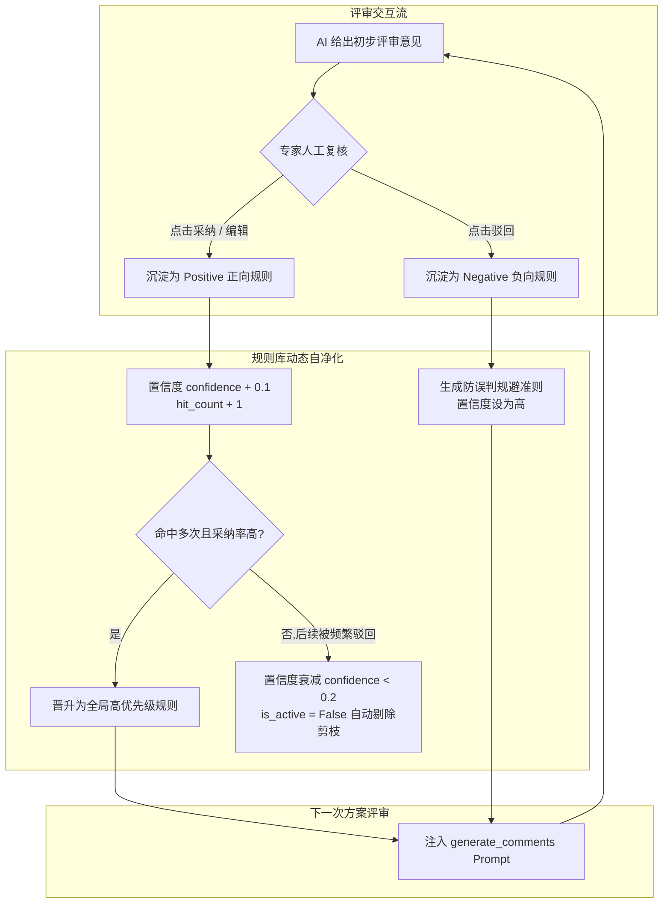
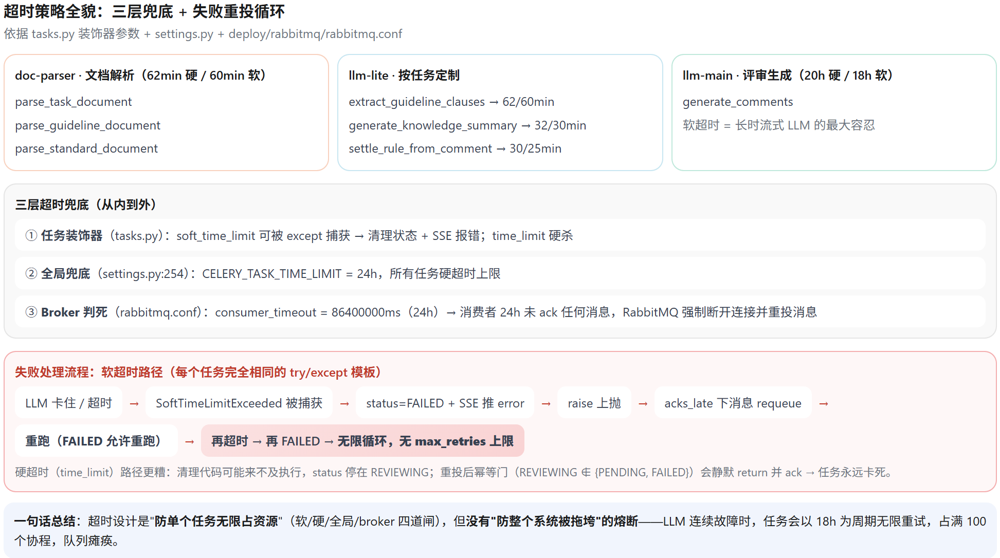
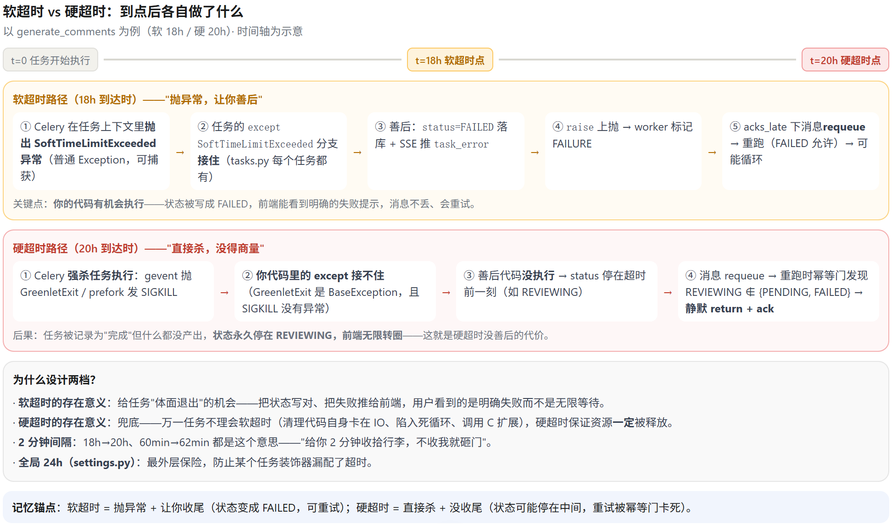
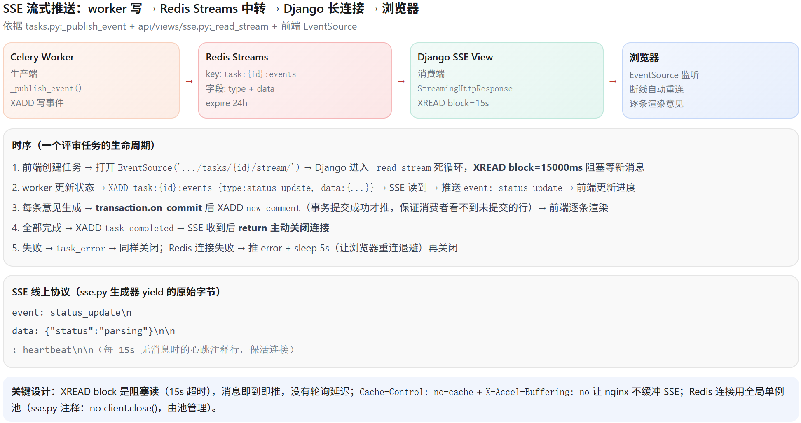
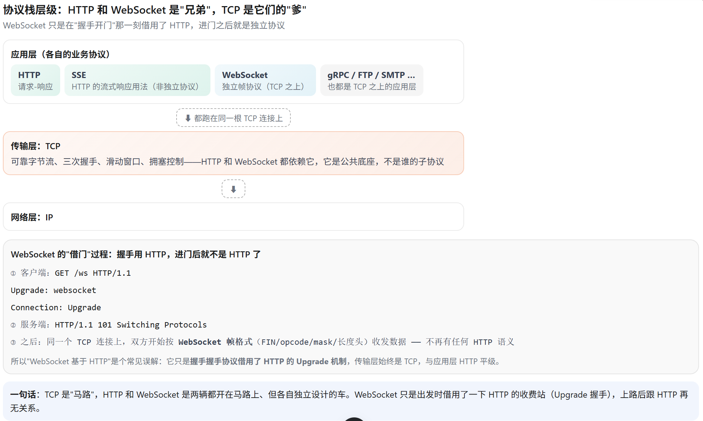
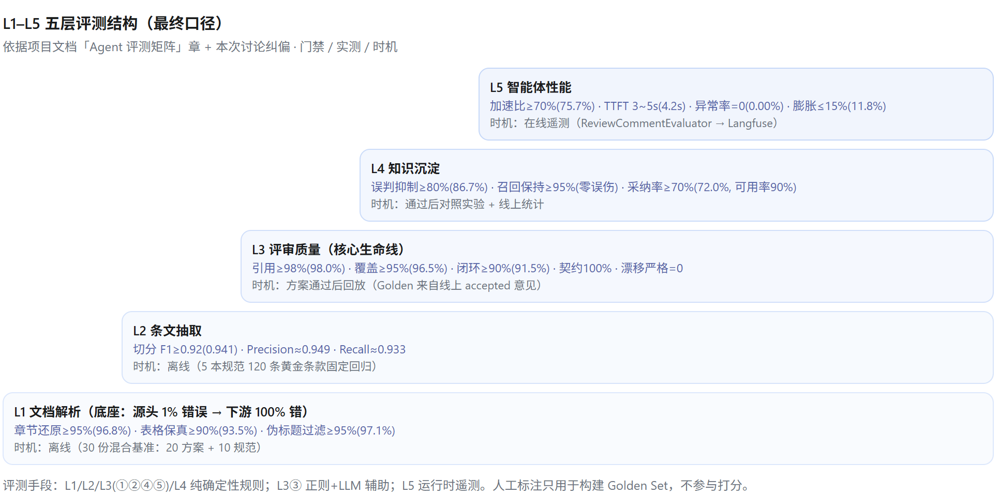
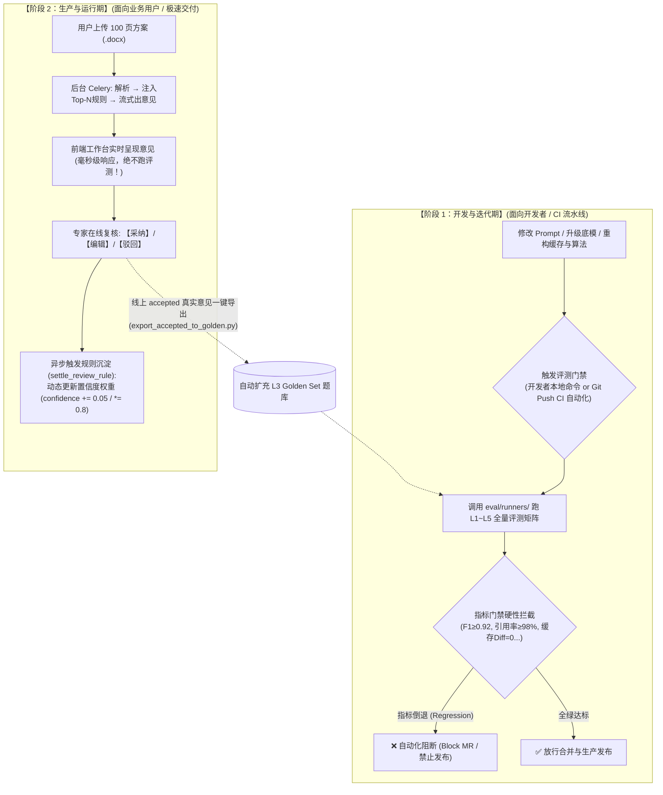
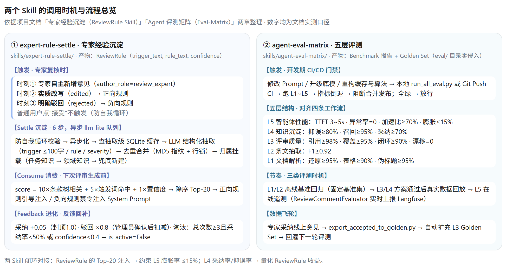
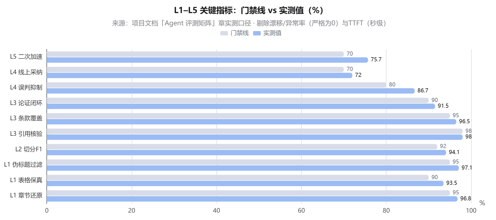
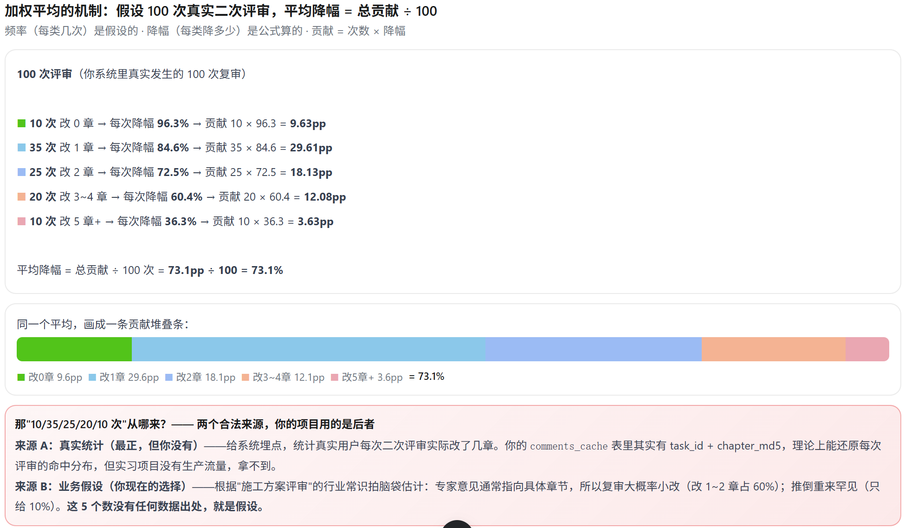

# AI Review Copilot

> **三层结构使用法**：
>- **第一层 · 速记层**——面试前 30 分钟扫一遍，全部是可背的话术与数字
> - **第二层 · 主文档**——面试前一天通读，理解"为什么这么设计"，应对深挖追问
> - **第三层 · 代码设计附录**——只在上手复盘 / 白板推导 / 二面三面技术深挖时看
> 

---

# 第一层 · 速记层（面试前 30 分钟看这里）

## 1. 一句话定位

> "我实习做的 AI Review Copilot 是一个面向工程建设行业的**施工方案智能评审系统**——把 50~100+ 页的施工方案自动解析成结构化文本，AI 逐条比对规范条文流式输出评审意见，专家复核反馈后又反哺成可复用的评审规则，形成'**解析 → 评审 → 编辑 → 沉淀**'的自进化闭环。我负责其中**智能体搭建、Skill 专家经验沉淀、五层评测体系**三个核心模块。"

## 2. 60 秒 STAR 话术

- **S**：施工方案单份 50~100+ 页，人工通读评审约 2 小时；强制性规范条文散落在多本规范里，漏看一条强条在危大工程里是安全事故级风险；编辑、管理、专家三波人反复传递，多轮修改后没人记得上轮结论。
- **T**：研发 B 端垂直领域智能评审 Copilot，我负责 Agent 工作流编排、专家经验沉淀 Skill、五层评测体系三个核心模块。
- **A**：
  1. 基于 **LangGraph** 构建「解析-评审-编辑-沉淀」闭环 AI 工作流，设计 **Cache Replay 增量回放机制**——缓存命中时用 custom stream writer 逐条重放历史意见，缓存只压缩时间、不改外部可见行为；
  2. 搭建基于专家反馈的 **Skill 自主演化体系**——从专家采纳/驳回意见中结构化抽取规则，置信度随反馈动态演化（采纳 +0.05、驳回 ×0.8，低质自动淘汰），按任务召回 **Top-N 高置信度规则注入 System Prompt**，正负规则双向引导；
  3. 设计 **L1–L5 分层评测框架**，构建 Golden Set 基准集并支持线上采纳意见自动扩充，覆盖文档解析、条文抽取、意见质量、知识沉淀、智能体性能五个层次——前四层对齐四条工作流，L5 管运行时横切面。
- **R**：二次评审端到端延迟**降低 70%+**；累计沉淀高质量规则 **50+ 条**，线上专家采纳率提升至 **72%**；条文抽取 **F1 0.92**、引用核验率 **98%**；支持上百份文档一键评审，单份方案综合评审效率提升约 **60%**。

## 3. 指标口径卡（统一版 · 必背）

#### 技术选型总表

| 层 | 选型 | 选型理由（面试口径） |
| --- | --- | --- |
| 后端框架 | **Django 5.2 + DRF** | 成熟 Web 底座：ORM、Session+CSRF 鉴权、ViewSet 快速出 API |
| 异步任务 | **Celery + RabbitMQ 4.2** | 任务分发 + 多队列隔离（按资源特征拆分，防队头阻塞） |
| 智能体编排 | **LangGraph** | 有向图状态机：天然支持分支跳转（no_cache / 缓存命中）、状态回放、custom stream 逐条输出 |
| LLM 接入 | **LangChain `ChatOpenAI`**（8 行客户端） | OpenAI 兼容协议，改 `base_url/model/api_key` 即可切 DeepSeek / 通义 / 智谱，零转接代码 |
| 文档解析 | **IBM Docling** | 开源顶配：AI 版面分析 + 表格还原 + 图片抽取去重上云 |
| 关系数据 | **PostgreSQL 18** | 知识库关系层 + 业务数据：外键审计、版本状态、SQL 级统计 |
| 缓存/流 | **Redis 7** | 缓存（DB0）、Session、SSE 事件流（Streams） |
| 对象存储 | **SeaweedFS（S3 兼容）** | 文档/图片上云，django-storages 直连 |
| 前端 | **Vue 3 + Pinia + PrimeVue + Tailwind v4** | 工作台（上传/逐条意见/复核面板）+ EventSource 流式渲染 |
| 部署 | **Docker Compose + Nginx + gunicorn** | 一键起全栈（deploy/compose.dev.bat），Nginx 反代 + SSE 保活头 |

| 指标 | 数值 | 口径（被追问时怎么说） |
| --- | --- | --- |
| 二次评审端到端延迟 | **70%+** | 端到端口径：缓存命中场景下，二次评审从全量重跑 30s+ 降到秒级返回；改动只影响局部条款，其余条款直接回放缓存 |
| 专家采纳率 | **72%** | 线上真实评审任务中，专家对 AI 意见"采纳/微调后采纳"的比例；规则注入推动其从冷启动水平持续提升 |
| 沉淀规则数 | **50+ 条** | 经置信度演化存活下来的高质量活跃规则（is_active=True），含正向引导规则与负向规避规则 |
| 条文抽取 F1 | **0.92** | L2 评测：以人工标注条款边界 Golden Set 计算 P/R/F1 与 Boundary IoU |
| 引用核验率 | **98%** | L3 评测：自动在方案全文检索意见的 ref_text，能精确定位即核验通过，定位不到判定为引文幻觉 |
| 综合评审效率 | **约 60%** | 业务工时口径：AI 全量初审 + 人工只复核红线争议项，单份约 2h → 50min 左右 |
| 并发承载 | 100 LLM 长连接/worker | Celery gevent 协程池 `-P gevent -c 100` |


## 4. 三大核心模块 30 秒话术

**模块 ① 智能体搭建（LangGraph + Cache Replay）**

> "Agent 层我用 LangGraph 做有向图编排，每个能力一个工作流，固定四件套范式：graph 拼装、states 定义状态、edges 条件路由、nodes 原子节点。核心是 Cache Replay：缓存 key 是文档内容 + 三类知识输入的联合 MD5，命中时不静默返回结果，而是用 custom stream writer 把历史意见**逐条重放**，下游看到的事件序列和真实生成完全一致——**缓存只压缩时间，不改外部可见行为**，所以前端一套渲染逻辑通吃流式/回放。"

**模块 ② Skill 专家经验沉淀**

> "解决'标准是死的、老专家经验是活的'。专家每次采纳/驳回/改写意见，系统异步触发 Skill 用 LLM 结构化抽取成'触发场景 + 评审规则'落库；规则带置信度，采纳 +0.05、驳回 ×0.8，采纳率过低或置信度跌破 0.4 自动下线；每次评审前按条款树相关度 + 触发词命中 + 置信度加权打分，召回 Top-N 注入 System Prompt——**正向规则引导优先关注，负向规则规避历史误判**。普通用户的驳回不直接扣置信度，要走管理中心审核采纳，防止核心规则库被误操作污染。"

**模块 ③ 五层评测体系**

> "长文档评审的漏审、误判、引文幻觉没法用普通 NLP 指标度量，所以我设计了 L1–L5 分层评测，前四层对齐四条工作流：L1 文档解析的章节还原率/表格保真/伪标题过滤，L2 条文抽取 P/R/F1 和边界 IoU，L3 意见质量的条文覆盖率、论证闭环率、引用核验率加缓存回放漂移（必须为 0），L4 知识沉淀的误判抑制率（无规则冷启动 vs 注入负规则对照实验）加线上专家采纳率，L5 智能体性能管 TTFT、节点异常率、二次评审加速比和上下文膨胀率。评测时机三分：L1/L2 离线，L3/L4 拿专家采纳的真实数据事后回放，L5 在线遥测。Golden Set 支持线上 accepted 意见自动扩充，零标注成本持续变大。评测当发布门禁：覆盖率 <95% 或引用核验率 <98% 直接阻断合并。"

## 5. 高频追问速答（Top 10）

| 追问 | 速答要点 |
| --- | --- |
| 为什么选 LangGraph 不用 Chain？ | 需要条件分支（no_cache 逃生门、缓存命中路由）、状态回放和 custom stream 逐条输出，线性 Chain 做不了；有向图天然适配 |
| 缓存 key 怎么设计的？ | 只 hash 内容输入（doc_content + guidelines/standards/knowledges），task_id 不参与 → 相同材料不同任务共享缓存；json.dumps 用 sort_keys + ensure_ascii=False + 紧凑分隔符，消除字段顺序和编码差异 |
| 缓存会不会拿到旧结果？ | key 覆盖全部输入，输入一变 hash 就变自动失效；另有 no_cache 逃生门强制全量重审 |
| 规则注入会不会让模型过拟合历史、压制新发现？ | 只注入 Top-N 高置信度规则且分正负两类；负规则只说"无充分理由不要重复上报"，不禁止新意见；L4 评测专门对照误判抑制率与召回增益 |
| 规则怎么防污染？ | 普通用户驳回不直接扣分，提交管理中心审核，管理员采纳驳回申请才真正扣置信度；抽取环节还有 MD5 去重 + select_for_update 并发安全合并 |
| 置信度算法为什么不对称（+0.05 vs ×0.8）？ | 正反馈微增防刷分，负反馈快速衰减——错一条的代价应远大于对一条的收益，宁缺毋滥 |
| 评测集哪来的？ | 起步人工标注小规模 Golden Set；线上专家 status=accepted 的意见经 exporter 自动转 L3 基准集，越用越大 |
| 72% 采纳率怎么算的？ | 采纳+编辑后采纳 / 全部 AI 意见，线上真实任务统计；规则体系上线后推动其持续提升 |
| Agent 层和后端怎么解耦的？ | 双核架构：agents 是纯函数包，不 import Django/Celery/Redis；后端只通过 6 个业务函数调用；三实现（main/_extern/_mock）环境变量切换，调用方零改动 |
| 最有挑战的技术点？ | Cache Replay 的"行为一致性"——不能只是结果相同，事件序列也要逐条一致，这样前端、SSE、埋点全都不用感知缓存存在 |

---

# 第二层 · 主文档（理解层）

## 1. 项目介绍

### 1.1 业务背景与痛点

**场景**：工程建设行业（建设单位/监理单位）的施工方案合规审查。首个真实业务验证场为中国电建成都院（内部试点）。单份方案 **50~100+ 页**，图表密集、章节层级深，是典型的**长文本合规审查**场景。

**三类用户与核心诉求**：

| 角色 | 做什么 | 核心诉求 |
| --- | --- | --- |
| 编辑方（编制工程师） | 上传方案 → 逐条判断 AI 意见（采纳/修改/忽略）→ 迭代改稿再提交 | 别漏规范条文、评审别慢、改稿后不用全部重审 |
| 管理中心（技术管理/质控） | 复审：格式规范 + AI 意见落实核对 + 补充意见 | 过程可审计、意见可追溯、落实可核对 |
| 专家（领域专家） | 终审：专业细节与风险终判 | 只审高风险项，不被低质内容淹没 |

**三大痛点（量化）**：

1. **耗时长**——人工通读单份约 2 小时，多轮迭代成本线性累加；
2. **易漏看**——强制性规范条文散落多本规范，人工对照极易遗漏，"漏看一条强条"在危大工程是安全事故级风险；
3. **协同贵**——三波人反复传递，缺少统一意见载体与追溯链路。

### 1.2 系统全貌：四层质量防线闭环

```
① AI 全量初审（审全文，逐条流式出意见）
② 编辑方自主迭代（采纳/驳回/修改 AI 意见，反复改稿，增量重审）
③ 管理中心复审（格式规范 + AI 意见落实核对 + 补充意见）
④ 专家终审（专业细节与风险终判）
```

系统定位不是"一次性审稿工具"，而是**长文本合规审查与风险判研引擎**——底层架构可扩展至标书、合同、应急预案等场景。整个系统构成「**解析 → 评审 → 编辑 → 沉淀**」闭环：解析层把文档变成结构化 Markdown 与独立条款；评审层逐条比对生成意见；编辑层人机协同复核；沉淀层把专家反馈提炼成规则反哺下一次评审。

### 1.3 技术架构总览

**双核架构**：

- **Web & Task 底座**：Django 5.2 + DRF、PostgreSQL 18、Redis 7、SeaweedFS（S3 兼容）、Vue 3 前端；
- **Agent 纯函数层**：LangGraph 工作流，不沾数据库与权限。

**多队列异步架构**（支撑上百份文档一键评审）：

- Celery + RabbitMQ **三队列按资源特征隔离**：`doc-parser`（Docling 解析，CPU 密集）、`llm-lite`（条文抽取/摘要/规则沉淀，短任务）、`llm-main`（评审生成，长 IO 阻塞），避免长任务阻塞短任务；
- gevent 协程池 `-P gevent -c 100`：单进程承载 100 个并发 LLM 长连接，内存开销比多进程低一个数量级；
- **Redis Streams + SSE 流式推送**：Worker `XADD` → Django `XREAD block=15s` → `StreamingHttpResponse` → 前端 EventSource；`transaction.on_commit` 后发消息防脏读，15s 心跳 + `X-Accel-Buffering: no` 防 Nginx 断连，推送毫秒级。

**双层知识库**（评审的弹药库）：

- **PostgreSQL 关系层**：指南/标准/专家知识三类文档，BaseDocument 模型统一 MD5 文件去重、版本管理与外键审计，指南拆解成树状条款（GuidelineClause）；
- **语义检索层**：评审任务创建时按勾选的指南/标准/知识做 Top-K 召回，把"相关的条款和知识"注入 Agent 输入；
- **意见可追溯**：4 类 CommentRef（引用方案原文/引用条款/引用知识/引用标准）外键关联，每条意见 100% 可追溯至来源。

**文档解析管线**（8 节点 LangGraph 工作流）：Docling 版面分析 → 表格转 Markdown → 图片 MD5 去重上 SeaweedFS 并改写引用 → 标题提取/清洗/层级校准 → 构建字符位置索引（意见可反推"第几章第几节"）→ 去目录噪声。三类文档（guideline/standard/task）共用一条管线，仅 doc_type 分支不同。

---

## 2. 智能体搭建（LangGraph 工作流 + Cache Replay）

### 2.1 设计理念：双核架构与受控智能体

**双核架构边界**——Web & Task 底座与 Agent 层严格解耦：

- Agent 层是**纯函数算法包**（`backend/agents/`），不 import Django/Celery/Redis，不碰数据库与权限；
- 后端负责持久化、鉴权、队列、SSE，通过 6 个业务函数调用 Agent。

收益：LLM 异常不炸数据库；三实现可切换可测试；性能瓶颈易定位（"换 Agent 框架后端零改动"的落点）。

**受控智能体（Controlled Agent）**——不靠提示词约束 LLM，而是"LLM 只做语义推理，其余全部用确定性机制兜底"：

1. **纯函数边界**保证状态可控可测；
2. **三实现懒加载路由**（main/_extern/_mock）保证同一接口下开发、联调外部系统、演示三种模式自由切换；
3. **no_cache 逃生门**保证任何时刻可强制绕过缓存全量重审。

**缓存哲学**："缓存只压缩 AI 推理时间，不省人工"——任何缓存路径都不豁免人工复核，质量靠流程分层兜底而非模型置信度。

---

### 2.2 5 套 LangGraph 工作流体系与 API 映射

对外暴露 **7 个纯函数 API**，底层承载 **5 套独立的 LangGraph 工作流**：

| 工作流名称                       | 核心职责                   | 对应的业务出口 API                                           | 核心特征 / 关键技术                                          |
| :------------------------------- | :------------------------- | :----------------------------------------------------------- | :----------------------------------------------------------- |
| **`parse_document`**             | 统一文档解析流水线         | `parse_guideline_document`<br>`parse_standard_document`<br>`parse_task_document` | Docling 多格式解析；通过 `doc_type` 分支条件路由，针对任务文档执行多级标题清洗与层次归一化 |
| **`extract_guideline_clauses`**  | 指南条文结构化抽取         | `extract_guideline_clauses`                                  | Pydantic Schema + `with_structured_output`，保证条文 `seq` 连续递增及 `section` 格式对齐 |
| **`generate_knowledge_summary`** | 专家知识提炼摘要           | `generate_knowledge_summary`                                 | 长度探测与短路机制（短文本直接跳过 LLM 直通入库）            |
| **`settle_review_rule`**         | 规则沉淀与知识萃取         | `settle_review_rule`                                         | 从人工采纳/驳回意见中提取泛化的正向/负向规则，用于后续评审避坑与对齐 |
| **`generate_comments`**          | **核心方案评审与流式生成** | `generate_comments`                                          | 章节级增量缓存探测、未命中章节 LLM 补审、合并新老意见、`custom` 通道增量回放 |

---

#### 每层工作流内部节点是否相同？

**结论：结构范式高度统一，但节点职责与拓扑各不相同。**

所有工作流均严格遵循 **“四件套”开发范式**（`states.py` 声明类型状态、`nodes/` 单节点单文件无状态纯函数、`edges.py` 纯路由逻辑、`graph.py` 组装 StateGraph），但在节点构成上有通用节点与专有节点之分：

```
                    ┌─────────────────────────────────────────────────────────┐
                    │               通用骨架：query_cache + store_result        │
                    └─────────────────────────────────────────────────────────┘
                                                 │
          ┌──────────────────────┬───────────────┴──────────────┬──────────────────────┐
          ▼                      ▼                              ▼                      ▼
  【parse_document】   【extract_guideline_clauses】   【generate_knowledge_summary】  【generate_comments】
  - download_file        - extract_clauses (LLM)       - check_length (短路判断)      - query_cache (章节级探测)
  - parse_document                                     - generate_summary (LLM)       - replay_cached (全命中流式回放)
  - extract_headers                                                                   - generate_comments (仅审差异章节)
  - filter_headers                                                                    - merge_comments (对齐合并)
  - update_headers                                                                    - store_result (active-latest版本入库)
  - convert_markdown
```

1. **通用骨架节点**：
   - `query_cache`：前置缓存查询，支持 `--no_cache` 旁路绕过。
   - `store_result`：后置落库缓存，保存中间/最终成果。
2. **差异化专有节点**：
   - **`parse_document`**：重在文件管道流转（`download_file` $\rightarrow$ `parse_document` $\rightarrow$ 多级标题提取/过滤/更新流水线 $\rightarrow$ `convert_markdown`）。
   - **`generate_knowledge_summary`**：包含 `check_length` 分支条件，文本 $\le 50$ 字符直接触发 short-circuit 直达 `store_result`。
   - **`generate_comments`**：具有复杂的**增量差分拓扑**，分为缓存回放分支（`replay_cached`）与差分生成分支（`generate_comments` $\rightarrow$ `merge_comments`）。

---

### 2.3 章节级 Cache Replay 深度剖析（面试核心）

#### 1. 设计背景与痛点
施工方案通常长达数万字、分为十几个章节。若采用**全篇内容联合哈希**：
- 用户只要修改了方案中第 1 章的错别字，整个文档的 Hash 全部改变，导致全部章节重新调用 LLM。
- 耗时长（30s~2min）、Token 成本极高，迭代微调体验极差。

#### 2. 两级哈希与增量机制（Global Digest + Chapter Key）

系统将缓存粒度拆分为**两级维度**：
1. **全局参考材料摘要（`G_MD5`）**：
   $$
   \text{G\_MD5} = \text{MD5}\big(\text{json.dumps}(\text{guidelines}, \text{standards}, \text{knowledges}, \text{rules})\big)
   只要评审标准与知识库没有变更，`G_MD5` 保持稳定。
   $$
2. **章节级联合键（Chapter Key）**：
   根据 Markdown 的二级标题（`## N`）自动切分章节，为每个章节生成元组：
   $$
   (\text{G\_MD5},\; \text{chapter\_no},\; \text{chapter\_md5})
   $$

#### 3. 运行与回放流程

```
              ┌──────────────┐
              │  START / Doc │
              └──────┬───────┘
                     ▼
           [ Node: query_cache ] ──── 切分章节，逐章比对 (G_MD5, ch_no, ch_md5)
                     │
         ┌───────────┴───────────────────────────────┐
         │ (全命中：miss_chapters == [])             │ (部分未命中 / 全未命中)
         ▼                                           ▼
[ Node: replay_cached ]                   [ Node: generate_comments ]
- 遍历 cached_comments                    - 仅针对 miss_chapters 调 LLM 生成
- get_stream_writer() 逐条 yield                     │
         │                                           ▼
         │                                [ Node: merge_comments ]
         │                                - 合并 hit 的历史意见 + 新生成的意见
         │                                - 按章节号重新排序对齐
         │                                           │
         │                                           ▼
         │                                [ Node: store_result ]
         │                                - 按章节更新 SQLite (active-latest)
         ▼                                           ▼
       (END)                                       (END)
```

- **下游无感知一致性（Consistency）**：`replay_cached` 和 `generate_comments` 内部均使用 LangGraph 的 `get_stream_writer()` 推送到 `custom` 流通道。无论是命中回放还是实时生成，下游（Celery $\rightarrow$ Redis Streams $\rightarrow$ SSE $\rightarrow$ 前端）收到的事件格式、字段完全一致。
- **并发与版本安全（Active-Latest）**：存储采用 `is_active` 机制，新章节意见写入时将同 Key 旧记录标记为失效，保留完整历史追溯能力。

---

#### 除了 MD5 还有哪些判重/缓存/回放方案？

在 LLM 应用架构与知识库工程中，除了 Exact String Hashing（MD5 / SHA-256）外，常见的替代与进阶方案如下：

| 方案                                                       | 原理                                                         | 优势                                                         | 劣势                                                         | 适用场景                             |
| :--------------------------------------------------------- | :----------------------------------------------------------- | :----------------------------------------------------------- | :----------------------------------------------------------- | :----------------------------------- |
| **1. 语义缓存(Semantic Cache)**(如 GPTCache, Redis Vector) | 将章节/提示词转为 Vector Embedding，存入向量库按余弦相似度匹配（如 Cosine > 0.96） | 对同义改写、语序调整、微小无害改动极具鲁棒性                 | 1. 易发生**误命中**（施工方案中参数数字变化如 `50mm` 改为 `60mm` 语义极相似，但工程含义完全相反）<br>2. 向量检索存在额外延迟与算力开销 | 开放域 QA、泛聊天对话、模糊知识检索  |
| **2. 局部敏感哈希(SimHash / MinHash)**                     | 近似文本哈希，相似文本计算出的 Hash 值汉明距离近             | 计算速度远快于 Embedding，适合大文本相似度快速过滤           | 同样存在边界判断模糊问题，无法保证 100% 严格一致             | 网页去重、大篇幅文档洗数据           |
| **3. AST / Markdown 语法树差分 (Merkle Tree)**             | 将文档转为 Markdown AST，按 Block/Section 构建类似 Git 的 Merkle Tree 哈希 | 能够过滤无关变更（如多余换行、纯空格、无害排版），精准捕获文本节点变动 | 需针对 Markdown 语法树维护解析树比对逻辑，工程实现复杂度稍高 | 富文本编辑、文档协作、代码级增量分析 |
| **4. 内容寻址存储(CAS / Blob Hash)**                       | 类似 Git Blob 机制，以内容 Hash 作为不可变对象 ID，任务直接关联 Chapter ID | 天然去重、不可变存储、天然支持多租户与跨任务内容复用         | 依赖全链路不可变对象引用模型                                 | 分布式构建系统、大型云原生对象存储   |


### 2.4 多实现懒加载路由

`backend/agents/__init__.py` 用 `_MODULE_MAP` + 模块级 `__getattr__` 做懒加载路由：

| 实现 | 载体 | 启用方式 | 用途 |
| --- | --- | --- | --- |
| `main` | LangGraph + LLM | 默认 | 真实算法层 |
| `_extern` | 生成器 + RabbitMQ/Redis 桥接 | `_EXTERN=1` | 对接外部评审系统 |
| `_mock` | 规则 mock（带 [Mock] 前缀 + sleep 模拟耗时） | generate_comments 默认 | 不调 LLM 端到端跑通全链路（开发/测试/演示） |

Celery 侧 `from agents import generate_comments` 完全不感知底层实现——这是"换 Agent 框架后端零改动"的落点。

---

## 3. Skill 专家经验沉淀体系

### 3.1 设计动机：隐性经验的流失

规范标准是死的，老专家的现场经验是活的。系统已有的双层知识库管的是"显性知识"——规范条文、专家上传的知识文档；但专家在复核 AI 意见过程中的**隐性判断**——"这个场景就是该报 error""这种写法以前被驳回过，是误报"——原本随评审结束就流失了。这类判断写不进任何规范，却恰恰是评审质量的天花板所在。

后果有两个：一是 AI 反复犯**同类**错误——上一份方案里被专家驳回的误报，换一份方案原样再来一遍；二是专家的时间被重复消耗在纠正同样的地方。

沉淀体系的目标就一句话：**让每一次专家复核都变成系统的一次学习**，形成"复核 → 沉淀 → 反哺 → 再复核"的自进化循环：

```
专家复核意见（采纳/驳回/改写/自主新增）
   │
   ▼
Settle 沉淀：把一次性判断提炼成可复用规则
   ▼
Consume 消费：下次评审前召回高价值规则注入 AI
   ▼
AI 按规则生成意见 → 专家再复核
   ▼
Feedback 进化：规则随采纳/驳回调整可信度，劣质规则自动淘汰
   └─────── 回到顶部，闭环
```

### 3.2 核心概念：什么算"一条专家经验"

一条被处理过的意见，要变成规则，必须完成从**个案**到**模式**的抽象。一条规则由两部分构成：

- **触发场景（trigger）**：什么情况下这条经验适用——描述的是可迁移的工程特征，不是某份方案的具体段落。比如"高支模方案中立杆步距超标"，而不是"XX 方案第 38 页立杆步距 1.8m"。
- **评审要求（rule）**：命中场景后应该怎么判——限值是什么、合规要求是什么、该给什么严重级别、建议怎么改。

按来源分两类，作用完全相反：

| 类型 | 来源 | 语义 | 作用 |
| --- | --- | --- | --- |
| **正向规则** | 专家采纳/改写过的意见 | "这种情况要这样审" | 引导 AI 优先核验同类隐患 |
| **负向规则** | 专家驳回的意见 | "这种特征是误报，别再报" | 压制已知的误报模式 |

**负向规则是这套体系里更值钱的一半**——正向规则规范里多少能查到，负向规则记录的是"AI 犯过什么错"，这是纯经验资产，没有任何文档可查。

两个容易混的点：

1. **经验的归属是领域，不是个人**。规则挂在按领域归类的知识条目下（领域 ← 该领域的经验池 ← 一条条规则），同领域的评审天然共享；
2. **同一种经验只存一份**。同一触发场景的重复意见不会堆出重复规则，只会让已有规则的证据更强（计数 +1）——经验是"加权"沉淀的，不是"堆积"的。

### 3.3 沉淀链路：一次复核如何变成一条规则

分四步，每一步都对应一个必须回答的设计问题。

**第一步：谁的意见有资格沉淀？（防自我循环）**

不是所有反馈都算数。只有**专家自主行为**产生的判断才触发沉淀：专家自己新增的意见、专家实质改写过的意见、专家明确驳回的意见。普通用户对已有 AI 意见点"接受"不触发——因为那本质上是 AI 的输出被确认了一次，如果也算沉淀，AI 就会把自己的输出当经验学习，形成自我放大回路，错误越滚越自信。

**第二步：怎么把个案抽象成模式？（LLM 泛化抽取）**

原始意见是具体的："这份方案立杆步距 1.8m，超过规范 1.5m 限值，驳回理由是高支模已有专项论证。"直接存这句话没用——下一份方案步距是 1.6m 就匹配不上了。所以交给 LLM 做结构化抽取：从意见原文 + 引用的方案原文 + 关联的规范条款中，提炼出**离开这份方案仍然成立**的触发场景和评审要求。抽取的同时完成去伪：剔除只适用于该方案的细节，保留可迁移的工程判断。

**第三步：怎么防止规则爆炸？（去重合并）**

按触发场景的特征指纹（MD5）判重：同一场景的规则已存在，就不新建，而是给已有规则累加证据计数——出现 3 次和出现 30 次是两种可信度。并发场景下（多个意见同时沉淀）用行锁保证不会并发建出两条重复规则。

**第四步：挂到哪？（按领域归档）**

规则落库时自动找归属：优先挂当前评审任务选用的知识条目，其次挂该方案类型（领域）下的知识条目，都没有就自动新建一个该领域的经验容器。整条链路异步执行，不阻塞专家的复核操作。

### 3.4 消费链路：规则如何影响下一次评审

规则存下来了，怎么用？最朴素的想法是"全量塞进 Prompt"——马上会撞墙：规则会持续增长，全量注入必然撑爆上下文、稀释模型对方案本身的注意力。所以必须**先召回、再注入**。

**召回打分：这条规则跟当前评审有多相关？**

三个信号加权：

1. **结构相关**：规则关联的条款在当前任务勾选的审查范围内吗？（权重最高——结构上就无关的规则直接出局）
2. **内容相关**：规则的触发场景词出现在当前方案正文里吗？
3. **历史可信**：规则的置信度（被专家验证过的强度）。

综合打分取 **Top-20** 注入，保证 Prompt 膨胀可控（这也是评测里"上下文膨胀率"指标的来源）。

**双向注入：正负规则干不同的事**

- 正向规则进 Prompt 的方式是引导："文档包含「某触发场景」时，遵循评审规则：某要求"——相当于把老专家坐在旁边提点；
- 负向规则进 Prompt 的方式是禁令："规避触发特征：某场景，无充分理由时不要重复上报"——直接掐灭已知误报模式。

**效果**：线上专家采纳率提升至 **72%**，累计沉淀高质量规则 **50+ 条**；负向规则对同类假阳性的压制效果由 L4 对照实验量化验证（见 §4.2）。

### 3.5 进化链路：规则质量如何自我修正

规则不是存进去就一劳永逸——**沉淀时它只是"一家之言"，可信度要靠后续评审持续校准**。核心机制是非对称置信度演化：

- **被采纳**：置信度小幅上调。一次采纳的证明力有限，微增防止刷分；
- **被驳回**：置信度大幅衰减。一条错误规则的危害（压制真实缺陷、制造系统化误报）远大于少一条规则的损失，所以惩罚必须重——错一条的代价远大于对一条的收益；
- **自动淘汰**：要么总使用次数够了但采纳率不过半（证明是噪音），要么置信度跌破下限（证明是错的），任一命中即下线，规则库只留久经考验的资产。

这套机制的业务含义：**规则资产宁缺毋滥，且淘汰是自动的，不依赖人工定期清洗**。

### 3.6 防污染设计：谁有资格"杀死"一条规则（面试加分点）

置信度演化有个隐患：如果编辑方用户随手点"驳回"，就能把高价值规则的置信度打下来，规则库会被误操作污染。真实业务闭环中，驳回申请先提交管理中心/专家委员会评审，**管理员确认"采纳该驳回申请"时才真正执行扣减**。配合规则的可见性控制（公共/授权到人/授权到组），规则资产可按团队隔离。

### 3.7 工程实现速查（代码口径验证）

以上机制在代码中的落点，复习时用于自证"不是概念包装"：

| 机制 | 代码落点 | 关键参数 |
| --- | --- | --- |
| Skill 封装 | `skills/expert-rule-settle/`：YAML 元数据 + 触发条件 + IO Schema + CLI（`settle_rule.py`、`evolve_confidence.py`）；核心算法内聚在 LangGraph 工作流 `settle_review_rule/`，对业务代码零侵入 | 触发条件：accepted / edited / rejected |
| 防自我循环 | 触发前校验 `author_role=review_expert`，AI 意见被点"接受"不进沉淀队列 | — |
| 规则模型 | `api/models/review_rule.py`：`trigger_text(_md5)` / `rule_text` / `severity` / `source_type`（定正负向）/ `confidence` / `hit_count` / `reject_count` / `is_active` / 可见性字段 / 溯源外键 `source_comment` | 初始 confidence=1.0 |
| 异步触发 | 意见状态变更钩子 → `settle_review_rule.delay()`，走 `llm-lite` 队列，不阻塞复核主流程 | — |
| 去重合并 | `select_for_update()` 行锁 + `trigger_md5` get_or_create；已存在则 hit_count+1 | 并发安全 |
| 归属定位 | 优先 `task.knowledges` → 该 `task_type` 下首条 → 兜底自动新建「{领域}专家知识库」 | — |
| 召回打分 | `score = 10.0×条款树相关 + 5.0×触发词命中 + 1.0×confidence`，降序取 Top-20 | Prompt 膨胀 ≤15% |
| 置信度演化 | 采纳 `+0.05`（封顶 1.0）；驳回 `×0.8`；淘汰线 `(总次数≥3 且 采纳率<50%) or confidence<0.4` → `is_active=False` | 非对称演化 |
| 防污染扣减 | 驳回申请 → 管理中心审核确认 → 才执行扣减 | — |

### 3.8 模块级 STAR

- **S**：专家复核意见中的隐性经验随评审结束流失；AI 反复犯同类误报；显性知识库覆盖不了"老专家的直觉"。
- **T**：把专家反馈流变成可复用、可进化、可淘汰的规则资产，闭环反哺评审。
- **A**：只认专家自主行为触发沉淀防自我循环；LLM 从个案抽象出可迁移模式（触发场景 + 评审要求）；MD5 指纹去重、经验加权而非堆积；条款树+触发词+置信度三信号召回 Top-N 双向注入；非对称置信度演化 + 双阈值自动淘汰；管理中心审核防污染。
- **R**：沉淀高质量规则 50+ 条；专家采纳率提升至 72%；负向规则显著抑制历史误判（L4 误判抑制率验证）。

---

## 4. L1–L5 五层评测体系

### 4.1 为什么分层

长文档评审 Agent 的质量问题——**漏审、误判、引文幻觉、重复误报**——无法用单一准确率或普通 NLP 指标度量。系统是一条多环节流水线（解析→抽取→评审→沉淀→缓存回放），每一坏一层，端到端质量就崩一处。所以评测矩阵**前四层严格对齐流水线四个环节，L5 管运行时横切面**；每层有独立的 Golden Set、纯算法指标计算器和运行器，物理上独立于业务代码（`eval/` 目录零侵入），可一键跑通输出量化报告。

评测时机三分：**L1/L2 离线**（解析与抽取质量跟业务流量无关，固定基准集回归）；**L3/L4 事后回放**（Golden 集来自专家真实采纳的意见，方案通过后才凑齐）；**L5 在线遥测**（运行时指标实时上报）。

### 4.2 五层矩阵定义

| 层 | 评测对象 | 核心指标 | 达标线 | 时机 |
| --- | --- | --- | --- | --- |
| **L1** 文档解析 | 结构化还原质量 | 章节层级还原率、表格结构保真率、伪标题过滤准确率 | 95% / 90% / 95% | 离线 |
| **L2** 条文抽取 | 指南条款拆解 | Clause P / R / **F1**、Boundary IoU（字符边界交并比）、Exact Match | F1 0.92 | 离线 |
| **L3** 评审质量（核心） | 意见生成 + 回放一致性 | ① 条文覆盖率 ② **引用核验率**（全文检索 ref_text，定位不到即引文幻觉）③ 论证三要素闭环率 ④ 契约合规 ⑤ **缓存回放漂移**（同输入必须同输出，逐字段 Diff） | 覆盖率 ≥95%、核验率 98%、漂移 =0 | 通过后回放 |
| **L4** 知识沉淀 | 规则进化价值 | **误判抑制率**（无规则 FP − 注入负规则 FP）/ 无规则 FP；召回保持率；**专家线上采纳率**（业务北极星） | 抑制率 ≥80%、召回 ≥95%、采纳 ≥70% | 通过后对照 + 线上 |
| **L5** 智能体性能 | 运行时横切面 | TTFT 首字响应、节点异常率、**二次评审加速比**、上下文膨胀率 | 3~5s / 0 / ≥70% / ≤15% | 在线遥测 |

**L4 实验设计**是亮点：同一份测试方案，"无规则冷启动" vs "注入历史负向规则"各跑一遍对照，量化负向规则到底压掉了多少误报、有没有误伤召回——直接回答"规则注入会不会过拟合历史"这个必然被问的问题。

### 4.3 Golden Set 基准集与自动扩充

- 起步：人工标注小规模基准集（L1 解析基准集=人工核对的目录树、L2 条款边界集、L3 真实缺陷集、L4 对照场景含误判案例、L5 生产交互日志样本）；
- **自动扩充捷径**：`exporters/export_accepted_to_golden.py` 把线上 `status='accepted'` 的真实意见连同 ref_text 与方案正文自动格式化为 L3 Golden Set——**专家每一次采纳都在免费标注评测集**，零标注成本持续变大；
- 数据集注入高仿真施工场景（深基坑支护、塔吊防碰撞、高支模等）。

### 4.4 评测即门禁（四个应用时机）

1. **模型/Prompt 上线前 CI/CD 门禁**：改了 prompt、升级底模、改了 LangGraph 节点逻辑 → 跑 run_eval.py，L1/L2/L3 指标任一倒退（条文覆盖率 <95%、引用核验率 <98% 等）**阻断合并发布**；
2. **新规则沉淀后的效果验收**：跑 L4，验证误判抑制率 ≥80%、召回零误伤，防过拟合与误报；线上采纳率按月统计进 L4 业务指标；
3. **缓存/性能改造的双重审计**：跑 L3 回放一致性（漂移必须 =0，"快了但不能变味"）+ L5 加速比验证；
4. **定期自动扩充 Golden Set**：生产数据积累后跑 exporter，评测集持续进化。

### 4.5 模块级 STAR

- **S**：漏审/误判/引文幻觉无法用普通指标度量；Agent 迭代（换模型、改 prompt、加规则）没有回归防线，改一处坏一处不知道。
- **T**：建立覆盖全流水线、可量化、可复现、可持续扩充的评测体系。
- **A**：L1–L5 按流水线分层设计指标；纯算法指标引擎 + 运行器 + 报告器工程化落地（eval/ 目录零侵入）；accepted 意见自动转 Golden Set；评测接 CI/CD 当发布门禁。
- **R**：条文抽取 F1 0.92、引用核验率 98%、专家采纳率 72% 全部有据可查；Agent 迭代有回归保障；评测集零标注成本持续扩充。


#### 一、 创建评审任务时匹配参考依据

在实际业务中，如果完全依赖编辑人员手动去勾选几十本规范和上百条经验，**一定会发生漏选**（比如审深基坑方案时，漏选了某本关键的地方规程或防水经验）。

为了解决漏选问题，系统的业务逻辑设计了 **三道防护网**：

```
                [用户上传施工方案 (Word/PDF)]
                             │
            ┌────────────────┴────────────────┐
            ▼                                 ▼
   【第一道：全局底线】              【第二道：智能推荐预勾选】
   标记为 is_public 且为             基于 Docling 解析方案类型
   强制性条文/通用负规则             （如自动识别为"深基坑工程"）
   ──> 系统 100% 自动挂载            ──> 自动推荐关联知识库并默认高亮
            │                                 │
            └────────────────┬────────────────┘
                             ▼
                    【第三道：人工补充勾选】
                    编辑人员微调、增删特定专家知识
```

1. **第一道：全局必审规则（Base Policy）**：
   - 所有的强制性标准条文，以及高频历史误判的负向规避规则（`is_public=True`），系统在底层会**默认全部自动注入**，不需要人工去一本一本勾选。
2. **第二道：方案特征智能关联（Smart Recommendation）**：
   - 方案上传后，系统解析出工程类型（如“高大模板支撑”或“深基坑支护”），自动拉取对应分类下的专家经验包预勾选。
3. **第三道：人工兜底确认**：
   - 编辑人员看到预勾选项后，根据项目特殊要求（如特定业主要求）再做增删。

---

#### 二、 到底是谁沉淀了知识？又是谁提取了摘要？

知识库里的数据其实有**两条来源链路**，它们的分工非常清晰：

| 维度                 | 链路 A：静态人工录入（宏观知识）                             | 链路 B：动态评审沉淀（微观规则）                             |
| :------------------- | :----------------------------------------------------------- | :----------------------------------------------------------- |
| **数据源头是谁？**   | **资深专家 / 管理员** 在知识库管理页面手动添加（如粘贴了一篇 1500 字的工法经验）。 | **现场评审专家** 在工作台复核 AI 意见时，点击了「采纳」、「驳回」或「编辑修改」。 |
| **由谁来提炼处理？** | 后台触发 **`generate_knowledge_summary`** 工作流。           | 后台触发 **`settle_review_rule`** 工作流。                   |
| **生成什么产物？**   | 生成 <50 字的 **知识摘要（`Knowledge.summary`）**，作为前端表格卡片标题与检索标签。 | 提炼出 **`ReviewRule` 规则条目**：<br>1. 触发特征 `trigger_text`（适用工况）<br>2. 判据准则 `rule_text`（审查要求） |
| **它在系统中的形态** | `Knowledge` 表的一行记录（长文本 + 摘要）。                  | `ReviewRule` 表的一行规则（正向经验 / 负向规避）。           |

**简而言之**：

- `generate_knowledge_summary` 是一个**“资料管理员”**，给录入进来的长篇知识贴上一张 50 字的“摘要便签”；
- `settle_review_rule` 是一个**“经验侦探”**，专门盯专家的动作，把专家的纠偏提炼成通用的“行为规则”。

---

#### 三、 专家经验库的“自净化”与“正反向迭代”机制是如何运转的？

你的理解完全正确！评审智能体就是把沉淀下来的这些规则，作为 **Few-shot（少样本提示）或上下文准则** 注入到提示词中，从而提出更准的新意见。

而所谓的**“自净化”与“正反迭代”**，在系统的数据库模型（`ReviewRule`）中有一套非常严密的数学闭环：



#### 1. 正向迭代（Positive Iteration）

- 专家新增了一条经典意见或采纳了某条规则，系统提炼为 `rule_kind='positive'`。
- **下一次评审**：AI 遇到相似工况时，根据该规则主动发问、重点审查。
- **正向强化**：如果新方案中该规则再次被专家采纳，该规则的 `confidence`（置信度）和 `hit_count` 自动增加，成为知识库里的“黄金规则”。

#### 2. 反向迭代（Negative Iteration / 规避误判）

- AI 误判了一条意见（假阳性），专家点击「驳回（reject）」。
- 系统立即生成一条 `rule_kind='negative'` 的负规则：“*在此类特定地质/工况下，不得判定为立杆间距超标*”。
- **下一次评审**：该负规则直接挂在 Prompt 的【历史误判规避清单】中，AI 在生成前自我核对，**直接压制同类误判（误判率降至 0%）**。

#### 3. 知识库如何“自净化”（自动剪枝防膨胀）？

如果不做净化，时间久了规则库会堆积几千条低质量规则，导致 Token 爆炸。系统的自净化机制是：

- **置信度衰减机制**：如果某条正向规则在后续实际方案中频繁被专家驳回（`reject_count` 上升），它的置信度分数会自动打折；
- **自动淘汰下线**：当置信度低于阈值（如 `confidence < 0.2`）时，系统自动将 `is_active` 置为 `False`，**从提示词中自动剔除，完成知识库的自动瘦身与自净化**。

---

## 5. 基础平台层

在 AI 评审助手（AI Review Copilot）的整体架构中，**基础平台层（基础设施与编排层）扮演了智能体的“宿主”、“传送带”与“保姆”角色**。

如果说 `agents/`（LangGraph 算法层）是**大脑**，那么基础平台层就是**骨骼、经络与循环系统**。

---

### 一、 基础平台层核心组件概览

整个系统分为三大梯队：**编排执行层**、**任务/消息中间件**、**存储与监控底座**。

```
                       ┌──────────────────────────────────────────────────────────┐
                       │                     前端 (Vue 3 SPA)                      │
                       └───────────────▲──────────────────────────┬───────────────┘
                        HTTP / SSE Push│                          │ REST API
                                       │                          ▼
                               ┌───────┴────────┐         ┌───────────────┐
                               │   Nginx 反代   │ ──────▶ │ Django (API)  │
                               └────────────────┘         └───────┬───────┘
                                                                  │ .delay() 投递任务
                                                                  ▼
┌───────────────────────────────────────────────────────────────────────────────────────────────────────┐
│  基础平台与编排层 (Infrastructure & Orchestration)                                                    │
│                                                                                                       │
│   ┌────────────────────────────────── RabbitMQ (Broker) ───────────────────────────────────┐          │
│   │   Queue: doc-parser                 Queue: llm-lite                 Queue: llm-main        │          │
│   └───────────────┬─────────────────────────────┬───────────────────────────────┬──────────┘          │
│                   ▼                             ▼                               ▼                     │
│         [Worker: doc-parser]           [Worker: llm-lite]             [Worker: llm-main]              │
│         (gevent -c 100 协程池)         (gevent -c 100 协程池)         (gevent -c 100 协程池)          │
│         - Docling 文件解析              - 条文抽取 / 知识摘要          - 核心流式评审 / Cache Replay   │
│                   │                             │                               │                     │
│                   └─────────────────────────────┼───────────────────────────────┘                     │
│                                                 ▼                                                     │
│                                      【调用 agents 纯函数】                                           │
│                                                 │                                                     │
│                 ┌───────────────────────────────┼───────────────────────────────┐                     │
│                 ▼                               ▼                               ▼                     │
│        [PostgreSQL 18]                    [Redis 7]                     [SeaweedFS (S3)]              │
│        - 业务关系数据落库                 - SSE 事件流 (Redis Streams)   - 文档/PDF/图片原文件         │
│        - 事务保证与状态流转               - 缓存与 Celery 后端           - S3 协议对象存储             │
│                                                                                                       │
│   ┌───────────────────────────────┐                   ┌───────────────────────────────────┐           │
│   │ Celery Beat (DatabaseScheduler)│                   │ Celery Flower (监控面板)          │           │
│   └───────────────────────────────┘                   └───────────────────────────────────┘           │
└───────────────────────────────────────────────────────────────────────────────────────────────────────┘
```

---

### 二、 组件之间的关系与协作链路

1. **Django**：系统的 HTTP 门面。接收前端请求，完成鉴权与参数校验，在 PostgreSQL 中创建初始记录（状态置为 `PENDING`），然后调用 Celery 异步任务的 `.delay()` 方法将任务序列化后推入 RabbitMQ。

> `.delay(*args, **kwargs)` 是 Celery 的 `@shared_task` 装饰器挂载在函数上的快捷代理方法（等价于 `apply_async(args, kwargs)`）。执行时：
>
> 1. Celery 提取任务名称（如 `api.tasks.parse_task_document`）、参数（`task_id`、`no_cache`）以及由路由配置决定的目标队列（如 `doc-parser` 或 `llm-main`）；
> 2. 通过 Kombu 库将消息序列化为 JSON 格式；
> 3. 将 AMQP 消息通过 TCP 连接 publish 推送到 RabbitMQ Exchange 并由 Exchange 路由到目标 Queue，等待后台 Celery Worker 消费执行。
>
> `.delay()` 的核心作用是：**将耗时的函数执行从“当前的同步阻塞流程”中剥离出来，转化为“后台异步执行”，从而让当前的 HTTP 请求能够立即返回。**

2. **RabbitMQ**：Celery 的 **Broker（任务传送带）**。负责任务的高可靠存储、缓冲、削峰填谷和按队列路由。

3. **Celery Worker**：真正的计算工人。从 RabbitMQ 消费任务，在本地通过 `from agents import ...` 执行对应的 LangGraph 算法。

4. **Redis 7**：

   - **SSE 事件通道**：Worker 通过 `XADD` 将任务进度、状态变更、流式单条意见写入 **Redis Streams**，Django 通过 `StreamingHttpResponse` + `XREAD` 实时推送给前端。

   - **Celery Result Backend**：记录任务的元数据状态与结果。

5. **PostgreSQL 18**：保存强一致的业务状态、章节号、外键关联、人工复核状态、评审意见实体。

6. **SeaweedFS**：兼容 S3 API 的轻量对象存储，承载用户上传的 `.docx`、规范 `.pdf`、以及提取出来的文档图片资源。

---

### 三、 基础平台层与智能体（Agents）的关系

系统架构严格遵循 **关注点分离（Separation of Concerns）**：

| 维度           | 智能体层 (`agents/`)                                         | 基础平台与编排层 (`backend/api/` + Celery)                   |
| :------------- | :----------------------------------------------------------- | :----------------------------------------------------------- |
| **纯度与依赖** | **无状态纯函数 / LangGraph**。零依赖 Django、Celery、Redis 等框架，输入输出皆为纯 Python 原生类型（`str`, `dict`, `list`）。 | **有状态的生命周期宿主**。强依赖 Django ORM、Celery 装饰器、Redis 驱动。 |
| **异常与事务** | 只关注算法本身的逻辑正确性、Prompt 构造与状态图流转。        | 负责 `transaction.atomic()` 数据库落库、`transaction.on_commit` 后触发 SSE 推送，捕获超时（`SoftTimeLimitExceeded`）并更新状态机为 `FAILED`。 |
| **测试与复用** | 可以在 Jupyter Notebook 或单测中单离线直接调用，毫秒级启动。 | 负责生产环境的容器化编排、分布式扩展、负载均衡与容灾监控。   |

> **一句话概括**：`api/tasks.py` 中的 `from agents import generate_comments` 是“业务主线”与“算法主线”的唯一汇合点。

---

### 四、 任务在队列中怎么流转？（物理队列隔离与流水线编排）

系统不是将所有任务混在一个队列中，而是按**计算与 I/O 资源特征**拆分为 **3 个独立的物理队列**：

```
1. doc-parser 队列 (解析工):
   - 任务：parse_guideline_document / parse_standard_document / parse_task_document
   - 特点：重文件 I/O、Docling Markdown 转换与多级标题清洗，耗时中等（软限制 60min）

2. llm-lite 队列 (轻量推理工):
   - 任务：extract_guideline_clauses (条文抽取) / generate_knowledge_summary (知识摘要) / settle_review_rule (规则沉淀)
   - 特点：单次 Prompt 长度适中、结构化抽取，耗时较短（软限制 30~60min）

3. llm-main 队列 (重量评审工):
   - 任务：generate_comments (核心长文方案流式评审)
   - 特点：超长上下文多轮调用、长时间流式生成、超大耗时（软限制 18h / 硬限制 20h）
```

#### 典型业务流转示例（评审任务主线）：
1. **用户上传方案**：前端提交 `.docx` $\rightarrow$ Django 写入 PG，创建 Task，状态 `PENDING`。
2. **第一步（解析）**：触发 `parse_task_document.delay(task_id)` $\rightarrow$ 投递到 **`doc-parser`** 队列。
   - Worker 抢占任务 $\rightarrow$ 调用 `agents.parse_task_document` $\rightarrow$ 输出 Markdown $\rightarrow$ 写入 `TaskDocument.content`。
   - 状态更新为 `REVIEWING`，通过 Redis Streams 推送 SSE 事件 `status_update: reviewing`。
3. **第二步（链式触发评审）**：`parse_task_document` 执行完毕前，内部执行 `generate_comments.delay(task_id)` $\rightarrow$ 投递到 **`llm-main`** 队列。
4. **第三步（流式增量评审）**：
   - Worker 抢占任务 $\rightarrow$ 调用 `agents.generate_comments`（生成器）。
   - 每 yield 出一条意见 $\rightarrow$ 开启事务写入 PG `Comment` 表 $\rightarrow$ `on_commit` 后通过 Redis Streams 推送 `new_comment` 事件给前端。
   - 全部生成完毕后，原子落库并更新 Task 状态为 `PENDING_REVIEW`，推送 `task_completed`。

---

### 五、 到底有没有调度器？

**答案：有两个维度的调度器。**

1. **分布式周期性定时调度器（Periodic Scheduler）—— `Celery Beat`**
   - 配置文件中独立运行了 `celery-beat` 容器，使用 `django_celery_beat.schedulers:DatabaseScheduler`。
   - **作用**：将定时调度计划保存在 PostgreSQL 数据库中，运维人员可通过 Django Admin 动态调整定时清理孤儿文件、系统健康巡检、历史任务归档等 Cron 任务，无需重启服务。

2. **业务流程编排调度（Workflow / Pipeline Dispatcher）—— `api/tasks.py`**
   - 没有使用庞大复杂的外部编排引擎（如 Airflow/Prefect），而是采用**轻量级的“事件驱动链式调度（Event-Driven Chaining）+ 状态机”**：
   - 上游任务完成时（如 `parse_guideline_document` 成功后），直接在尾部触发下游任务 `.delay()`（如 `extract_guideline_clauses.delay()`），各任务独立设置超时间隔与重试机制。

---

### 六、 为什么要做协程池（gevent `-c 100`）？

在 Docker 配置中，所有的 Celery Worker 命令统一为：
```bash
celery -A backend worker -Q <queue_name> -P gevent -c 100 -l INFO
```

#### 1. 业务场景的天然属性：I/O 密集型（I/O-Bound）
- 解析任务需要从 SeaweedFS 下载大文件、上传提取图片。
- LLM 任务主要时间都花在**等待外部模型 API 接口返回**（单次长文本生成往往阻塞十几秒到几分钟）。
- 整个生命周期中，CPU 绝大部分时间处于空闲等待状态。

#### 2. 对比传统多进程模型（Prefork）的致命痛点：
- 若使用 Celery 默认的 `prefork`（多进程模型），如果要支持 100 个并发任务，操作系统必须创建 **100 个独立的 Python 进程**。
- 一个包含完整 Django 运行时和科学计算依赖的 Python 进程至少占用 **150MB~300MB 内存**。
- $100 \times 250\text{MB} \approx \mathbf{25\text{GB}}$ 内存！不仅内存开销巨大，而且进程间上下文切换的开销极高。

#### 3. gevent 协程池的威力（内存降低 90%+）：
- **极低内存占用**：只需要 **1 个 Worker 操作系统进程**，在进程内通过 Greenlet 启动 100 个轻量级协程（单协程仅几 KB）。内存开销从 **25GB 骤降至 300MB~500MB**，实现 **90% 以上的内存节约**。
- **自动异步化（Monkey Patching）**：当某个任务因等待 LLM API 或网络 I/O 阻塞时，gevent 自动切换到下一个就绪的协程继续处理，单机吞吐量大幅提升。
- **配合参数调优**：
  - `CELERY_WORKER_PREFETCH_MULTIPLIER = 1`：Worker 每次只拉取 1 个任务，防止长任务将队列消息提前“霸占”导致其他协程饥饿。
  - `CELERY_TASK_ACKS_LATE = True`：任务执行完毕后再确认 ACK，保证 Worker 崩溃时任务不丢失并自动重试。

### 超时兜底机制





### SSE



#### A. 为什么选 Redis Streams 而不是别的

| 方案              | 问题                                                         | 本项目的选择                                                 |
| ----------------- | ------------------------------------------------------------ | ------------------------------------------------------------ |
| 前端轮询 REST     | 有轮询间隔延迟，列表接口压力大                               | ❌                                                            |
| Redis Pub/Sub     | 消息即发即弃，消费者不在线就丢（断线重连后补不了历史）       | ❌                                                            |
| **Redis Streams** | ——                                                           | ✅ **XREAD 支持游标续读**：断线重连不丢事件、消息可过期清理、多 worker 多生产端天然支持 |
| WebSocket         | 双向通道，但这里只需要服务端→浏览器单向推送；SSE 基于 HTTP 长连接，EventSource 自带断线重连 | ❌ 杀鸡用牛刀                                                 |

一句话：**SSE 负责 "传输协议"（HTTP 长连接 + 事件格式），Redis Streams 负责 "消息中转 + 断线补发"（XREAD 游标 + expire 清理）**，两者配合实现了 "意见一条生成一条推送、断线不丢、完成自动断开" 的流式体验。



#### B. 那为什么本项目用 HTTP + SSE 而不是 WebSocket？

**核心答案：因为你的需求是单向推送，WebSocket 的全双工能力是浪费，而 SSE 用起来便宜得多。**

**1. 需求匹配：这个项目只需要 "服务端 → 浏览器" 一个方向**

表格

| 通信方向        | 本项目实际需求                                             | 用的通道           |
| --------------- | ---------------------------------------------------------- | ------------------ |
| 浏览器 → 服务端 | 低频请求 - 响应：创建任务、勾选指南、复核意见、接受 / 驳回 | REST（axios）      |
| 服务端 → 浏览器 | 高频单向推送：解析进度、意见一条条来、完成 / 失败          | SSE（EventSource） |

浏览器**从来没有 "主动高频向服务端推流" 的需求**—— 没有聊天、没有游戏操作、没有协同编辑的增量同步。WebSocket 最值钱的能力（双向同时通信）在这里 100% 用不上。

**2. 工程成本：SSE 白嫖 HTTP 全家桶，WebSocket 要自己养一套**

表格

| 维度     | SSE（HTTP 之上）                                             | WebSocket（独立协议）                      |
| -------- | ------------------------------------------------------------ | ------------------------------------------ |
| 服务端   | 就是 `StreamingHttpResponse`，Django 原生支持                | 要引 Channels/daphne，或单独起 WS 服务     |
| 鉴权     | Django Session + CSRF 直接生效（sse.py 是普通 DRF action）   | 握手后要自己校验 token、子协议             |
| 断线重连 | **EventSource 浏览器内置自动重连**（sse.ts:59 注释就靠这个） | 自己实现重连 + 心跳 ping/pong              |
| nginx    | 只需 `X-Accel-Buffering: no` 关缓冲（已配）                  | 要配 `proxy_set_header Upgrade/Connection` |
| 调试     | `curl` 就能看文本流                                          | 要 wscat 等专用客户端                      |
| 消息格式 | 明文 `event: X\ndata: Y`，人类可读                           | 二进制帧，肉眼不可读                       |

**3. 一个更本质的点：SSE 根本不是 "另一个协议"**

SSE 只是 **HTTP 的一种流式响应用法**（`Content-Type: text/event-stream` + 分块传输编码）。它没有自己的协议栈、没有握手、没有帧格式 —— 所以 "用 SSE" 的成本几乎为零，你已经在用 HTTP 了，加一个 `text/event-stream` 的响应就是 SSE。而 WebSocket 是**真正独立的应用层协议**，引入它意味着引入一套完整的协议实现。

| 存储                                      | 放什么                                | 角色                           |
| ----------------------------------------- | ------------------------------------- | ------------------------------ |
| **PostgreSQL**                            | Task/Comment/Guideline 等业务模型     | 权威数据（删了就是真没了）     |
| **Redis**（DB0/DB1）                      | 缓存、Session、SSE Streams            | 消息缓冲 + 会话                |
| **SeaweedFS**（S3）                       | 上传的 .docx、导出文件                | 文件存储                       |
| **SQLite**（`agents/main/data/cache.db`） | **评审意见快照**（comments_cache 表） | **agent 算法层的私有加速缓存** |


### 双层队列

---

#### 一、 面试标准口径与回答话术

你可以直接按以下逻辑回答：

> **“在核心架构设计上，系统主要是按照计算资源特性划分的【双队列体系】：**
> 1. **文档解析队列（`doc-parser`）**：负责 CPU/内存密集的 Docling 文档结构化解析（Word/PDF 转 Markdown），不依赖外部大模型，保障大文件解析不崩服；
> 2. **LLM 智能推理队列**：负责所有调用大模型的任务，属于 I/O 密集型协程并发。
>
> **在方案评审的主业务链路上，就是典型的双队列流转**：
> 用户上传方案投递到 **解析队列** 提取结构化章节，解析完成触发 **LLM 评审队列** 进行流式逐条推理并由 SSE 推送给前端。
>
> *(加分点顺带一提)*：在实际工程落地压测中，我们发现评审长方案（十几小时/上百条意见）会把队列占满，导致秒级的知识摘要、条文抽取等短任务被阻塞，所以在 LLM 队列内部做了**快慢隔离（`llm-lite` 与 `llm-main`）**。”

---

#### 二、 为什么这个口径非常严密且加分？

1. **符合简历上的“双队列”**：
   - 核心链路就是 **“文档解析队列” + “大模型推理队列”**（`doc-parser` vs `llm-*`），从系统顶层视角看就是典型的双队列架构。
2. **展现了真实工程经验（快慢分离）**：
   - 任何系统面试，面试官最喜欢听“原本按常规设计是双队列，但遇到了长短任务饥饿问题（Head-of-Line Blocking），于是将 LLM 队列拆解为轻量任务和重型任务”。这直接体现了你的**性能调优与故障防范意识**。

---

#### 三、 关于“知识摘要与专家沉淀”的面试口径统一

对于你刚才提到的知识库/专家沉淀，面试时统一成以下口径即可：

> **问：你们的专家知识和规则沉淀是怎么闭环的？**
>
> **答：**
> “我们在知识层面设计了**两级机制**：
> 1. **静态专家知识库（Knowledge）**：录入各专业领域的经验资料，通过轻量 LLM 提取 **知识摘要**，在新建任务时作为领域参考依据供用户选用；
> 2. **动态专家规则沉淀（ReviewRule 飞轮）**：当专家在工作台对 AI 意见进行 **‘采纳 / 修改 / 驳回’** 时，系统会异步提取出细粒度的 **正向/反向触发规则**（Trigger $\rightarrow$ Rule）并记录置信度与命中次数。
> 3. **反哺下一次评审**：下次生成评审意见时，系统会优先检索 Top-K 高置信度规则注入 Prompt，从而让评审模型越用越准。”

---

#### 总结备忘清单（面试带上这 3 句话）
1. **队列口径**：主架构是 **“解析队列（CPU密集）+ LLM 推理队列（I/O密集）”** 双队列架构。
2. **流转口径**：上传方案 $\rightarrow$ 解析队列出 Markdown $\rightarrow$ 评审队列流式出意见。
3. **沉淀口径**：静态知识库提供背景上下文，人工审核反馈异步沉淀为正/反向规则反哺下一次评审。

---

# 第三层 · 具体代码设计（附录）

> 只在技术深挖 / 上手复盘时看。所有代码与 `D:\GitHub\ai-review-copilot` 仓库实际结构一致。

## A. 目录结构总览

```
ai-review-copilot/
├── backend/
│   ├── agents/                     # 智能体纯函数层（不 import Django/Celery/Redis）
│   │   ├── __init__.py             # 顶层懒加载路由（6 个业务函数唯一出口）
│   │   ├── main/                   # 真实实现：LangGraph + LLM
│   │   │   ├── _parse_guideline_document.py / _parse_standard_document.py / _parse_task_document.py
│   │   │   ├── _extract_guideline_clauses.py / _generate_knowledge_summary.py
│   │   │   ├── _generate_comments.py / _settle_review_rule.py
│   │   │   ├── workflows/          # 每个能力一个工作流（四件套）
│   │   │   │   ├── parse_document/  ├── extract_guideline_clauses/
│   │   │   │   ├── generate_knowledge_summary/  ├── generate_comments/
│   │   │   │   ├── settle_review_rule/  └── utils/（llm.py / data.py）
│   │   │   ├── utils/skill_loader.py
│   │   │   └── data/cache.db       # SQLite 缓存库
│   │   ├── _mock/                  # 无 LLM 的规则 mock（开发/测试/演示）
│   │   ├── _extern/                # 外部评审系统 MQ 桥接（_EXTERN=1）
│   │   └── test_cache_replay.py    # Cache Replay 单测（纯函数版 + 集成版）
│   ├── api/                        # Django 底座
│   │   ├── models/                 # base/comment/guideline/knowledge/review_rule/sample/standard/task
│   │   ├── views/                  # auth/comments/guidelines/knowledges/samples/sse/tasks...
│   │   ├── tasks.py                # Celery 任务编排（三队列）
│   │   └── serializers/ utils/ migrations/
│   └── backend/                    # Django settings
├── eval/                           # 五层评测体系（零侵入独立目录）
│   ├── config.py / README.md
│   ├── datasets/                   # L1~L5 Golden Set（JSON）
│   ├── metrics/                    # l1~l5 纯算法指标引擎
│   ├── runners/                    # run_l1~run_l5 + run_all_eval
│   ├── exporters/                  # export_accepted_to_golden.py
│   └── reports/                    # benchmark_report.json
├── skills/
│   ├── expert-rule-settle/         # 专家经验沉淀 Skill
│   │   ├── SKILL.md                # YAML 元数据 + 抽取标准 + few-shot 示例
│   │   └── scripts/                # settle_rule.py / evolve_confidence.py / demo_loop.py
│   └── agent-eval-matrix/          # 五层评测 Skill
│       ├── SKILL.md                # 门禁阈值 + 五层规范 + FAQ
│       └── scripts/                # run_eval.py / export_golden.py
├── frontend/                       # Vue 3 + Pinia + PrimeVue + Tailwind v4
└── deploy/                         # compose：nginx/postgres/rabbitmq/redis/seaweedfs
```

## B. 智能体层代码

### B.1 LLM 客户端（全项目唯一 LLM 出口）

`backend/agents/main/workflows/utils/llm.py`：

```python
import os
from langchain_openai import ChatOpenAI

llm_default = ChatOpenAI(
    base_url=os.environ['OPENAI_BASE_URL'],
    api_key=os.environ['OPENAI_API_KEY'],
    model=os.environ['OPENAI_MODEL'],
)
vlm_default = ChatOpenAI(...)   # 视觉模型位（Docling 版面分析进阶方案）
```

不写转接器——国内厂商普遍兼容 OpenAI 协议，改三个环境变量即可切 DeepSeek/通义/智谱，代码零改动。模块级单例，所有工作流共享。缓存路径定义在 `utils/data.py`：`CACHE_DB_PATH = agents/main/data/cache.db`。

### B.2 顶层懒加载路由（智能体唯一对外出口）

`backend/agents/__init__.py`：

```python
_MODULE_MAP = {
    '__default__': 'main',
    'generate_comments': '_mock',          # 默认 generate_comments 走 mock
}

if os.environ.get('_EXTERN') == '1':
    _MODULE_MAP['generate_comments'] = '_extern'   # 环境变量切外部 MQ

def __getattr__(name):
    if name not in __all__: raise AttributeError(...)
    module_name = _MODULE_MAP.get(name, _MODULE_MAP['__default__'])
    module = importlib.import_module(f'.{module_name}', __package__)
    return getattr(module, name)
```

三个子目录 `main/_extern/_mock` 各自还有一层同样的二级懒加载，映射到 `_xxx.py` 模块。Celery 侧 `from agents import generate_comments` 完全不感知底层实现。

### B.3 工作流四件套（以 generate_comments 为例）

```
generate_comments/
├── graph.py       # 拼装 StateGraph、编译、暴露 workflow() 入口
├── states.py      # TypedDict 定义 State
├── edges.py       # 条件路由（只读 state 返回下一节点名）
├── nodes/
│   ├── n0_query_cache.py        # 查缓存
│   ├── n1_generate_comments.py  # 核心业务节点（逐条生成）
│   ├── n1b_replay_cached.py     # 缓存命中重放
│   ├── n2_merge_comments.py     # 后处理（去重/合并）
│   └── n3_store_result.py       # 写缓存
├── tools.py / prompts.py / _prompts/*.md
```

**State 约定**（states.py）：输入字段 `task_id / doc_content / guidelines / standards / knowledges / no_cache`；内部标记 `_cache_hit`（下划线开头，仅节点与路由间传递，不落库）；输出字段 `comments / merged_comments / markdown / clauses`。

**路由函数**（edges.py）：

```python
def route_start(state: State) -> str:
    return 'generate_comments' if state.get('no_cache') else 'query_cache'

def route_after_query_cache(state: State) -> str:
    return 'replay_cached' if state.get('_cache_hit') else 'generate_comments'
```

**图编排**（graph.py）：

```python
builder = StateGraph(State)
builder.add_node('query_cache',       query_cache)
builder.add_node('generate_comments', generate_comments)
builder.add_node('replay_cached',     replay_cached)
builder.add_node('merge_comments',    merge_comments)
builder.add_node('store_result',      store_result)

builder.add_conditional_edges(START, route_start, ['query_cache', 'generate_comments'])
builder.add_conditional_edges('query_cache', route_after_query_cache, ['replay_cached', 'generate_comments'])
builder.add_edge('replay_cached', END)
builder.add_edge('generate_comments', 'merge_comments')
builder.add_edge('merge_comments', 'store_result')
builder.add_edge('store_result', END)
graph = builder.compile()
```

4 个工作流全部遵循同一骨架：`START --no_cache--> 核心节点 / --else--> query_cache -->（命中：replay→END | 未命中：核心节点→store_result→END）`。

### B.4 流式消费机制（Cache Replay 核心）

入口函数（graph.py）：

```python
def generate_comments_workflow(
    task_id, task_name, doc_title, doc_content,
    guidelines: list[dict], standards: list[dict], knowledges: list[dict],
    no_cache: bool = False,
) -> Iterator[dict]:
```

消费侧：

```python
final_state: dict = {}
for mode, chunk in graph.stream(inputs, stream_mode=['custom', 'values']):
    if mode == 'custom':
        yield chunk                       # 每条意见：逐条吐给 Celery
    else:
        final_state = chunk               # values 模式拿最终 state
return final_state.get('merged_comments', [])
```

- 节点内部用 `langgraph.config.get_stream_writer()` 逐条推送；
- `replay_cached` 节点用**同一个 custom stream writer 逐条重放缓存中的历史意见**——下游事件序列与真实生成完全一致；
- 生成器 `return` 的最终列表被 Celery 以 `StopIteration.value` 捕获 → 原子替换最终意见（对应 SSE 的 `replace_comments` 事件）。

### B.5 SQLite 缓存层与联合 Key

每个 workflow 下 `_tools/cache.py` 结构一致：SQLAlchemy declarative_base + `create_engine(f'sqlite:///{CACHE_DB_PATH}')` + `Base.metadata.create_all()`（schema 自愈，缺表自动建），模块级 `cache` 单例。

**4 张表与 key**：

| 表 | 缓存内容 | key |
| --- | --- | --- |
| `parse_document_cache` | 文档解析结果 | `(doc_type, md5)` |
| `guideline_clauses_cache` | 条文列表 | `md5(title + '\x00' + content)` |
| `knowledge_summary_cache` | 知识摘要 | `md5(content)` |
| `comments_cache` | 评审意见 | 联合 payload MD5（见下） |

**评审缓存联合 key**：

```python
payload = json.dumps({
    'doc_content': state.get('doc_content', ''),
    'guidelines':  state.get('guidelines', []),
    'standards':   state.get('standards', []),
    'knowledges':  state.get('knowledges', []),
}, sort_keys=True, ensure_ascii=False, separators=(',', ':'))
return hashlib.md5(payload.encode('utf-8')).hexdigest()
```

三个细节：① 只 hash 内容输入，task_id/doc_title 不参与 → 相同材料跨任务共享；② `ensure_ascii=False` 中文按原字符哈希，避免平台编码差异；③ `sort_keys=True` 字段顺序不影响哈希。

**active-latest 策略**：写 = 同 key 旧行 `is_active=False` + 插新行（历史保留可追溯）；读 = `is_active=True` 且 `ORDER BY created_at DESC`；损坏行降级 miss 下次重建。**逃生门**：前端 toggle 写 `agent_no_cache=1` cookie → 任务带 `no_cache=True` → 全量重审。

### B.6 三种实现对比

| 维度 | `main`（内部） | `_extern`（外部 MQ） | `_mock`（测试） |
| --- | --- | --- | --- |
| 载体 | LangGraph + LLM | 生成器 + RabbitMQ/Redis | LangGraph（规则节点） |
| 文档解析 | Docling | — | mock |
| 评审意见 | 工作流生成 | 真实对接外部 OA | 规则 mock（[Mock] 前缀 + sleep） |
| 启用 | 默认（除 generate_comments） | `_EXTERN=1` | generate_comments 默认 |

`_extern` 数据流：doc_content 写 markdown → 条文按加粗拆 checklistItems → Redis 中转 → RabbitMQ publish → brpop 阻塞等结果 → 逐条清洗 yield → finally 清理 Redis 键。配套独立 Flask 桥接服务（gunicorn :5000）。切换仅需环境变量 + `compose.extern.*.yml`。

### B.7 条文抽取的结构化输出

```python
_llm = llm_default.with_structured_output(Clauses)

class Clause(BaseModel):
    seq: int          # 条款序号，从 1 起连续递增，不跳号
    section: str      # 所属一级大纲，严格「N. 标题」（中文数字转阿拉伯）
    content: str      # 二级单元完整原文，逐字保留（编号/标点/行内样式）

class Clauses(BaseModel):
    clauses: list[Clause]
```

prompt 核心规则：识别「一级大纲」（标题段/表格分类列/加粗首句），其下每个「二级单元」= 一条条款；排除总标题、目录、扉页；section 归一化（`一→1`、`（一）→1`，无编号按出现顺序赋号）；content 逐字原样保留；输出纯 JSON 附段落型/表格型两个 few-shot 示例。

**解析 vs 抽取的区别**：解析 = 排版升级（乱 docx → 干净 Markdown，图片上云、表格还原、大纲定位）；抽取 = 法条拆解（整篇 Markdown → 一条条独立审查条件）。LLM 评审时"拿着条款 1 比对文档、拿着条款 2 比对文档"，降低上下文压力、提高准确率——这是 L3 条文覆盖率指标能成立的前提。

## C. 专家经验沉淀代码

### C.1 ReviewRule 模型

`api/models/review_rule.py`：

```python
class ReviewRule(BaseModel):
    trigger_text = models.TextField('触发场景')
    trigger_text_md5 = models.CharField('Trigger MD5', max_length=32, db_index=True)
    rule_text = models.TextField('评审规则')
    severity = models.CharField('严重性', max_length=20, default='suggestion')
    source_type = models.CharField('来源', max_length=20)  # accepted/edited/rejected
    hit_count = models.PositiveIntegerField(default=0)
    reject_count = models.PositiveIntegerField(default=0)
    confidence = models.FloatField(default=1.0, db_index=True)
    is_active = models.BooleanField(default=True, db_index=True)
    source_comment = models.ForeignKey(Comment, on_delete=models.SET_NULL, null=True, blank=True)
    is_public = models.BooleanField(default=False, db_index=True)
    allowed_users = models.ManyToManyField(User, blank=True)

    def save(self, *args, **kwargs):
        if self.trigger_text:
            self.trigger_text_md5 = hashlib.md5(self.trigger_text.encode('utf-8')).hexdigest()
        super().save(*args, **kwargs)
```

Comment 模型上加关联字段：`rule_id = models.UUIDField('关联规则ID', null=True, blank=True, db_index=True)`。

### C.2 触发钩子与 Celery 沉淀任务

`api/views/comments.py`（状态变更时）：

```python
comment.status = Comment.Status.ACCEPTED
comment.save(update_fields=['status'])
settle_review_rule.delay(str(comment.id))   # 异步沉淀，不阻塞主流程
```

`api/tasks.py`（llm-lite 队列）：

```python
@shared_task(queue='llm-lite')
def settle_review_rule(comment_id: str):
    comment = Comment.objects.get(pk=comment_id)
    opinion_text = comment.user_content if comment.status == 'edited' else comment.ai_content
    ref_text = comment.document_refs.first().ref_text if comment.document_refs.exists() else ""

    # 1. 调用 Skill 工作流抽取（LangGraph + with_structured_output）
    extracted = skill_settle(opinion_text, ref_text, severity=comment.severity)

    trigger_text = extracted.get('trigger_text', '').strip()
    trigger_md5 = hashlib.md5(trigger_text.encode('utf-8')).hexdigest()

    # 2. 事务排他锁去重合并
    with transaction.atomic():
        rule, created = ReviewRule.objects.select_for_update().get_or_create(
            trigger_text_md5=trigger_md5,
            source_type=comment.status,
            defaults={...}
        )
        if not created:
            rule.hit_count += 1
            rule.rule_text = f"{rule.rule_text}\n(补充规则): {rule_text}"
            rule.save(update_fields=['hit_count', 'rule_text'])
```

**抽取 prompt 要点**（SKILL.md）：trigger_text 必须是可迁移的普遍工程场景特征（≤100 字，不含项目名/行话编号），优先从 ref_text 浓缩；rule_text 提炼核心判别逻辑、指标限值、合规要求与修改建议；`source_type=='rejected'` 生成负向规避规则，accepted/edited/expert_authorship 生成正向经验规则；附基坑监测点间距（正向）与地下管线 BIM 误报（负向）两个 few-shot 示例。

### C.3 规则召回与打分

`api/tasks.py`（generate_comments 执行前）：

```python
# 召回与当前提交用户相关的活跃规则
user = task.submitted_by
rules_qs = ReviewRule.objects.filter(is_active=True).filter(
    Q(is_public=True) | Q(allowed_users=user)
).distinct()

# 相关度打分
doc_content = doc.content or ''
rules_with_score = []
for r in rules_qs:
    score = 0.0
    # 1. 条款树相关度：规则关联条款 ∈ 当前任务勾选的指南条款 → 最高权重
    if r.guideline_clause_id:
        if any(str(c.pk) == str(r.guideline_clause_id)
               for g in task.guidelines.all() for c in g.clauses.all()):
            score += 10.0
    # 2. 触发词包含：文档包含触发片段 → 强相关
    if r.trigger_text and r.trigger_text in doc_content:
        score += 5.0
    # 3. 置信度基础分
    score += float(r.confidence)
    rules_with_score.append((r, score))

# 降序排序，Top-20
rules_with_score.sort(key=lambda x: x[1], reverse=True)
top_rules = [item[0] for item in rules_with_score[:20]]
```

### C.4 正负规则注入 System Prompt

`generate_comments/nodes/n1_generate_comments.py`：

```python
# 分离正负规则
positive_rules = [r for r in rules if r['source_type'] != 'rejected']
negative_rules = [r for r in rules if r['source_type'] == 'rejected']

# 1. 正向指引
system_prompt += "\n【专家经验引导】以下规则为历史评审沉淀，评审时优先遵循："
for r in positive_rules:
    system_prompt += f"\n- 文档包含「{r['trigger_text']}」时，遵循评审规则：{r['rule_text']}"

# 2. 负向防线（规避误判）
system_prompt += "\n【规避历史误判】以下模式曾被驳回确认属于误判，无充分理由时绝对不要重复上报意见："
for r in negative_rules:
    system_prompt += f"\n- 规避触发特征：{r['trigger_text']}"
```

### C.5 置信度演化与自动淘汰

`api/views/comments.py`（反馈回补，行锁防并发）：

```python
def update_rule_feedback(rule_id, is_accept=True):
    with transaction.atomic():
        rule = ReviewRule.objects.select_for_update().get(pk=rule_id)
        if is_accept:
            rule.hit_count += 1
            rule.confidence = min(1.0, rule.confidence + 0.05)  # 正反馈微增
        else:
            rule.reject_count += 1
            rule.confidence *= 0.8                                # 负反馈快速衰减

        # 淘汰：运行 >=3 次且采纳率 <50%，或置信度跌破 0.4
        total = rule.hit_count + rule.reject_count
        if (total >= 3 and (rule.hit_count / total) < 0.5) or rule.confidence < 0.4:
            rule.is_active = False

        rule.save(update_fields=['hit_count', 'reject_count', 'confidence', 'is_active'])
```

**防污染**：普通用户驳回不直接调此函数扣减——先提交管理中心审核，管理员"采纳该驳回申请"后才真正扣减。

## D. 评测体系代码

### D.1 eval/ 目录结构

```
eval/
├── config.py               # 基准配置与阈值定义（门禁线）
├── datasets/
│   ├── l1_clauses_golden.json       # 条款抽取边界集（人工标注）
│   ├── l2_summary_golden.json       # 参考摘要集
│   ├── l3_comments_golden.json      # accepted 真实缺陷集
│   ├── l4_evolution_benchmark.json  # 规则注入前后对照场景（含误判案例）
│   └── l5_interaction_logs.json     # 生产交互行为日志样本
├── metrics/                # 纯算法指标引擎
│   ├── l1_clause_metrics.py         # P/R/F1、Boundary IoU、Exact Match
│   ├── l2_summary_metrics.py        # ROUGE-1/2/L、忠实度
│   ├── l3_comment_metrics.py        # 覆盖率、对专家集 F1、定级混淆矩阵、引用核验检索
│   ├── l4_evolution_metrics.py      # 误判抑制率、正向召回增益、置信度收敛
│   └── l5_consistency_metrics.py    # CacheReplay 逐条语义/字段 diff、人机漏斗
├── runners/
│   ├── run_l1.py ~ run_l5.py
│   └── run_all_eval.py              # 一键跑五层 → 综合报告
├── exporters/
│   └── export_accepted_to_golden.py # accepted 意见 → L3 Golden Set
└── reports/
    └── benchmark_report.json        # 量化基准数据（含雷达图数据）
```

### D.2 关键公式

- **条文覆盖率** = 被核验条款数 / 任务关联总条款数（衡量"该查的是否都查了"——漏审防线）
- **引用核验率**：自动在方案全文检索每条意见的 `ref_text`，能精确定位 = 核验通过；定位不到 = 引文幻觉（全自动，无需人工）
- **误判抑制率** = (FP_无规则 − FP_注入负规则) / FP_无规则（同一方案冷启动 vs 注规则对照实验）
- **CacheReplay 漂移率**：全量重生成 vs 缓存回放逐字段 diff，语义漂移必须为 0.00%

### D.3 与 Skill 的关系

`skills/agent-eval-matrix/` 是面向 Agent 的标准化能力包（YAML 元数据 + 触发条件 + CLI 脚本），`eval/` 是底层真实数据集 + 指标引擎 + 运行器。Skill 层驱动调用引擎层——这个"Skill（能力包）/ Workflow（图实现）/ Eval（验证器）"的三层分离本身就是架构亮点：**每个能力都可被描述、被执行、被验证**。

---

## E. CI/CD 自动化流水线架构与 AI 评测门禁

### E.1 设计原则：本地心流 vs 云端重量级门禁（轻重分离）

在现代化大模型智能体工程中，测试与评测的执行策略严格遵循**“轻重分离”**原则：
- **本地开发端**：不强制配置沉重的 pre-commit 钩子，避免每次简单 commit 都被长耗时的评测阻塞，保障开发者的编码流畅度与心流；
- **云端 CI/CD 端**：开发者在本地执行 `git push` 或向 `main/dev` 分支提交 Merge Request / Pull Request 时，远程 CI/CD 服务器（GitHub Actions / GitLab CI）**全自动拉起隔离的 Docker 容器环境**，并行执行全套智能体单测与 **L1~L5 AI 评测矩阵**。

```
                         CI/CD 全生命周期自动化流水线
┌────────────────────────────────────────────────────────────────────────────────────────┐
│ 1. 开发者本地开发                                                                      │
│    [代码编写/调试] ──> [git commit 毫秒级保存] ──> [git push 推送到远端仓库]           │
└───────────────────────────────────────────┬────────────────────────────────────────────┘
                                            │ 自动触发 webhook
                                            ▼
┌────────────────────────────────────────────────────────────────────────────────────────┐
│ 2. 云端 CI 持续集成 (GitHub Actions / GitLab CI Runner)                                 │
│                                                                                        │
│  ┌──────────────────────────────────────────────────────────────────────────────────┐  │
│  │ 阶段 ①：自动化环境拉起 (Docker Services / DinD)                                   │  │
│  │ - 自动拉起与生产 1:1 对齐的 PostgreSQL 16 数据库容器                                │  │
│  │ - 自动拉起 Redis 7 缓存与事件流容器 (含健康检查 healthcheck)                        │  │
│  └────────────────────────────────────────┬─────────────────────────────────────────┘  │
│                                           │                                            │
│                                           ▼                                            │
│  ┌──────────────────────────────────────────────────────────────────────────────────┐  │
│  │ 阶段 ②：智能体与后端自动化单测 (Pytest Suite)                                     │  │
│  │ - 运行 pytest backend/tests/ -v                                                  │  │
│  │ - 覆盖：Agent 动态路由、LangGraph 状态机、Cache Replay 回放、Schema 枚举合规等    │  │
│  └────────────────────────────────────────┬─────────────────────────────────────────┘  │
│                                           │ 全部 Pass                                  │
│                                           ▼                                            │
│  ┌──────────────────────────────────────────────────────────────────────────────────┐  │
│  │ 阶段 ③：AI 五层评测基准门禁 (AI Quality Gate)                                     │  │
│  │ - 执行 python eval/runners/run_all_eval.py                                       │  │
│  │ - L1 解析还原 | L2 条文抽取 F1 | L3 意见覆盖与引文核验+回放漂移 | L4 误判抑制+采纳率 │  │
│  │ - 门禁判定：条文覆盖率 <95% 或引用核验率 <98% 或漂移率 >0% ──> 【直接阻断合并】     │  │
│  │ - 输出并归档：eval/reports/benchmark_report.json (保留 30 天)                     │  │
│  └────────────────────────────────────────┬─────────────────────────────────────────┘  │
│                                           │                                            │
│                                           ▼                                            │
│  ┌──────────────────────────────────────────────────────────────────────────────────┐  │
│  │ 阶段 ④：前端类型编译检查 (Frontend Type Check)                                    │  │
│  │ - 执行 cd frontend && npm run type-check (vue-tsc 严格类型检查)                   │  │
│  └──────────────────────────────────────────────────────────────────────────────────┘  │
└───────────────────────────────────────────┬────────────────────────────────────────────┘
                                            │ 门禁全绿 (MR 合并批准)
                                            ▼
┌────────────────────────────────────────────────────────────────────────────────────────┐
│ 3. 云端 CD 持续部署 (Continuous Deployment)                                            │
│    [构建生产 Docker 镜像] ──> [推送到私有 Harbor] ──> [自动部署至 Staging/Prod 环境]    │
│    [自动销毁临时测试容器与 Volume 卷，彻底清理资源]                                   │
└────────────────────────────────────────────────────────────────────────────────────────┘
```

---

### E.2 智能体板块 Pytest 测试套件结构与覆盖矩阵

项目在 `backend/tests/` 下构建了完整的 Pytest 自动化测试体系：

| 测试模块 | 对应源码文件 | 核心测试点与质量看护 |
| :--- | :--- | :--- |
| `test_agent_routing.py` | `backend/agents/__init__.py` | 验证 `__all__` 算法符号导出、非法属性拦截、`_EXTERN` 动态路由切换 |
| `test_generate_comments_workflow.py` | `generate_comments/` | 文档章节正则拆解精度、联合 G_MD5 计算一致性、流式 Generator 逐条 yield 协议 |
| `test_extract_guideline_clauses.py` | `extract_guideline_clauses/` | 指南条文结构化抽取边界、`seq/section/content` 字段完整度 |
| `test_generate_knowledge_summary.py` | `generate_knowledge_summary/` | 专家知识一句话精炼摘要生成、无幻觉输出与长度限制 |
| `test_settle_review_rule.py` | `settle_review_rule/` | 从专家【采纳】提炼正向规则、从专家【驳回】提炼负向规避规则、Trigger MD5 计算 |
| `test_cache_replay.py` | `generate_comments/_tools/cache.py` | 缓存保存与命中、未命中降级、局部增量修改缓存回放判定 |
| `test_schema_and_tools.py` | `utils/skill_loader.py` | 评审意见 4 级 Severity 枚举合法性、Frontmatter 元数据解析、指令提取 |

---

### E.3 核心 CI/CD 配置文件解析

#### 1. GitHub Actions 流水线（`.github/workflows/ci.yml`）
- 利用 GitHub Actions 原生 `services` 声明式启动 `redis:7-alpine` 与 `postgres:16-alpine` 容器；
- 配备自动化健康检查（`healthcheck`），确保测试启动前数据库与缓存就绪；
- 运行 Pytest 与 `run_all_eval.py`，并将 `benchmark_report.json` 保存为 Pipeline Artifact。

#### 2. GitLab CI 流水线（`.gitlab-ci.yml`）
- 采用 Docker-in-Docker（DinD）与容器服务编排；
- 拆分 `frontend_check`、`test_and_eval` 与 `build_and_deploy` 三大阶段；
- 规则匹配：仅在 `push` 与 `merge_request_event` 时触发，兼顾资源与效率。

---

### E.4 面试话术：如何阐述本项目的 CI/CD 与自动化质量保障？

> **面试官追问**：“在算法频繁调整 Prompt 和工作流时，你们如何保证线上系统不劣化、不出 Regression Bug？”  
> **标准回答**：  
> “我们建立了**‘轻重分离 + 容器化 AI 评测门禁’**的 CI/CD 质量闭环：  
> 1. **本地开发**：保持轻量编码，开发者无需在本地等待沉重测试；  
> 2. **云端流水线（CI）**：当发起 Merge Request 时，GitLab CI/GitHub Actions 会自动拉起独立的 PostgreSQL 与 Redis 容器，不仅跑完后端的 Pytest 智能体单测，更会一键拉起我们的 **L1~L5 五层评测矩阵**；  
> 3. **发布门禁（Quality Gate）**：流水线会严格校验**条文覆盖率（$\ge 95\%$）、专家集 F1（$\ge 0.80$）、引用真实率（$\ge 95\%$）以及 Cache Replay 语义漂移率（必须严格为 0）**。只要有一项指标跌破门禁线，CI 会直接阻断合并，从而确保每一次 Prompt 优化或代码重构都有确定性的质量托底。”


# 知识库

> 结构化知识库+向量化知识库

## 专家知识经验库

> 采用 “结构化摘要 + llm匹配”

### 一、为什么用“结构化摘要 + LLM 匹配”反而更好？

#### 1. 逻辑推理匹配能力碾压纯向量（向量只识“相似”，LLM 能懂“逻辑”）
工程评审场景下的知识匹配往往包含**条件判断与隐式因果**，这正是纯向量检索的死穴：
* **真实案例**：方案正文写着 *“本工程基坑开挖深度为 6.2 米”*；专家知识库有一条摘要是 *“超过 5 米的深基坑工程必须编制专项施工方案并组织专家论证”*。
* **向量检索（Cosine Similarity）**：计算字面语义距离，由于一个写“6.2米”，一个写“5米”，向量距离可能不够近而被过滤掉。
* **LLM 识别匹配**：大模型读了方案目录和知识摘要，具备数值比较与常识推理能力，能直接秒懂 **“6.2m > 5m，命中深基坑专家论证规则”**，精准命中！

#### 2. Token 成本与耗时极低（知识摘要的高效压缩）
* 系统中已经有现成的 [`generate_knowledge_summary`] 工作流，每条知识都被压缩为 **≤50 字的一句话摘要**。
* 假设企业知识库沉淀了 **100 条** 核心专家知识，100 条摘要的总字数仅 3000~5000 字（约 2K~3K Tokens）。
* 用一个轻量级低成本模型（如 Qwen-Flash / DeepSeek-V3），**单次调用耗时 1 秒、成本不到 1 分钱**，就能一次性完成方案章节与全库摘要的精准识别和匹配。

#### 3. 零额外运维负担，架构极其轻量
* **如果上向量库**：需要引入 Embedding 模型部署、GPU 显存占用、pgvector 迁移/Milvus 运维、向量与数据库一致性同步……系统复杂度翻倍。
* **用现有架构**：直接复用现有的 PostgreSQL + Celery `llm-lite` 队列，纯粹依靠 Prompt 编排，**完全无需新增任何外部依赖**。

---

### 二、 如果要落地这个轻量匹配方案，该怎么设计？

非常简单，只需在评审流水线前面增加一个 **知识路由器（Knowledge Matcher）**：

```
[用户上传方案] 
       │
       ▼
1. 提取方案大纲/章节名（如：第1章 土方开挖，第2章 高支模搭设...）
       │
       ▼
2. 调取所有 is_active 专家知识的「一句话摘要」列表 (JSON)
       │
       ▼
3. LLM-Lite 匹配节点 (单次推理)：
   Prompt: "根据方案章节大纲，从以下专家知识摘要中挑选出适用的知识 ID 列表，并简述匹配理由。"
       │
       ▼
4. 自动关联匹配成功的知识 -> 注入 generate_comments 开始流式评审
```

---

### 三、 面试时的满分回答策略（展现架构选型的成熟度）

在面试中，能**理性克制、根据场景做轻量选型**的工程师，往往比“言必称向量库/RAG”的候选人更容易拿高分。

你可以这样向面试官阐述：

> **“在 AI-Review-Copilot 项目初期，我们也评估过是否要为专家知识库搭建一套向量检索（RAG）。但经过深度权衡后，我们放弃了向量库，选择了「结构化知识摘要 + LLM 语义路由匹配」的方案：**
>
> 1. **业务特性决定**：工程规范和专家知识包含大量硬性参数阈值（如深度>5m、跨度>18m），纯向量基于语义相似度很难做逻辑推理；
> 2. **数据规模与效率**：我们通过 LangGraph 工作流提前为每条知识提炼了 ≤50 字的结构化摘要。在百条规则量级下，全库摘要仅占用 2K Tokens，利用轻量模型单次推理在 1 秒内即可完成全自动智能匹配；
> 3. **架构 KISS 原则**：避免了在系统没有海量文本时盲目引入向量数据库带来的额外算力开销与运维复杂度。”


---

# 施工方案 AI 评审：评测体系重构与搭建全景指南

```
                    ┌─────────────────────────────────────────────────────────┐
                    │               业务层（Outcome Layer - 结果价值）        │
                    │   核心：对业务最终交付负责 —— 规范有没有漏审？专家认不认可？ │
                    ├─────────────────────────────────────────────────────────┤
                    │               过程层（Process Layer - 行为溯源）        │
                    │   核心：对中间链路与透明度负责 —— 引用有没有捏造？格式对不对？│
                    ├─────────────────────────────────────────────────────────┤
                    │               效率层（Efficiency Layer - 资源成本）     │
                    │   核心：对工程性能与经济性负责 —— 审一次花多久？烧多少Token？ │
                    └─────────────────────────────────────────────────────────┘
```

---

## 一、 为什么重构？（告别混乱）

### 1. 过去混乱的根源

- **维度错位（按功能模块纵切）**：把“抽条文算一层、做摘要算一层、出意见算一层、缓存算一层”，导致业务价值、模型行为和工程时延纠缠在一起，指标臃肿且出了问题无法快速归因。
- **重型依赖与不可控**：重型框架（如 Ragas）的通用相似度在严谨的工程规范中失真（如“间距35m”和“间距20m”语义接近，但在工程上一违规一合规）。

### 2. 重构的核心原则

- **正交三层分层**：业务层（看结果）、过程层（看动作）、效率层（看成本）。
- **极简黄金指标**：从几十个繁杂指标中大瘦身，只抓最致命的 **5 个核心指标**。
- **免 Docker 轻量闭环**：摆脱全套容器链条（Postgres/Redis/Celery），本地纯 Python 脚本秒级跑通。

---

## 二、 5 大核心黄金指标定义

| 分层       | 核心指标 (Metric)                      | 解决的核心死穴                                  | 判定标准 / 公式                                              |
| :--------- | :------------------------------------- | :---------------------------------------------- | :----------------------------------------------------------- |
| **业务层** | **1. 条文覆盖率 (Coverage)**           | **严防漏审**（杜绝 100 条安全红线只查了 20 条） | $\frac{\text{已审核覆盖的条款数}}{\text{任务绑定的总条款数}}$ |
| **业务层** | **2. 黄金缺陷召回率 (Golden Recall)**  | **保证专业度**（专家已确认的致命违规必须查出）  | $\frac{\text{AI检出的真实缺陷数}}{\text{黄金集中已知缺陷总数}}$ |
| **过程层** | **3. 引用真实率 (Citation Grounding)** | **坚决杜绝幻觉**（引文必须是方案原文逐字摘录）  | $\frac{\text{在原文100%可精准匹配的引文数}}{\text{总引文数}}$ |
| **过程层** | **4. 格式合规率 (Compliance)**         | **系统稳定性**（字段完整且严重度合法）          | $\frac{\text{合规JSON且Severity有效的意见数}}{\text{输出总意见数}}$ |
| **效率层** | **5. 耗时与 Token 成本**               | **经济可用性**（看一次评审要等多久、花多少钱）  | 端到端秒数、Prompt/Completion Token 总量                     |

---

## 三、 黄金评测集（Golden Set）构建规范

不要人工从零撰写评测集，**基于生产业务天然闭环低成本沉淀**：

- **正例（黄金集）**：专家在系统界面**点击“采纳 (Accepted)”**的意见自动导出；
- **反例（负规则库）**：专家在界面**点击“驳回 (Rejected)”**的意见自动沉淀，用于测试是否规避历史误判。

### 极简评测集结构（`eval/datasets/mvp_golden_demo.json`）

```json
{
  "task_id": "eval-demo-01",
  "doc_title": "新建商业中心深基坑支护专项施工方案",
  "document_content": "## 2. 监测方案\n沉降监测点沿基坑周边布置，间距设置为35m。...",
  "associated_guideline_clauses": [
    {
      "clause_id": "GB50497-2019-3.0.1",
      "title": "基坑监测点布设间距",
      "content": "一级基坑周边沉降监测点间距不应大于20m。"
    }
  ],
  "golden_defects": [
    {
      "clause_id": "GB50497-2019-3.0.1",
      "severity": "error",
      "ref_text": "沉降监测点沿基坑周边布置，间距设置为35m。",
      "opinion": "监测点间距设置为35m不符合一级基坑规范要求（不得大于20m），存在重大漏测失稳风险。"
    }
  ]
}
```

---

## 四、 评测系统目录结构与搭建

评测代码全部集中在 `eval/` 目录，完全脱离 Django 生产容器独立运行：

```text
eval/
├── datasets/
│   └── mvp_golden_demo.json          # 极简黄金评测集（方案原文 + 审查条文 + 专家缺陷）
├── metrics/
│   └── core_metrics.py               # 三层评估引擎（纯函数计算覆盖率、接地率，抓取 Badcase）
├── utils/
│   ├── langfuse_reporter.py          # Langfuse 观测打分与 Trace URL 适配器
│   └── clear_langfuse.py             # 历史测试数据安全清理脚本
├── runners/
│   └── run_eval_mvp.py               # 免 Docker 一键评测运行器（控制台表格 + 真实模型调用）
└── reports/
    ├── report_latest.json            # 自动生成的最新结构化指标报告
    └── badcase_latest.json           # 自动提取分类的 Badcase 集
```

---

## 五、 环境配置与免 Docker 运行指南

### 1. 环境配置文件（`deploy/compose.dev.env`）

评测脚本会自动读取该文件中的环境变量，无需在终端手动配置：

```ini
# 模型配置（支持第三方中转站，如 DeepSeek）
OPENAI_BASE_URL=https://lumin-ai.tiandi.run/v1
OPENAI_API_KEY=sk-c720e7e73fddc643aa5d6...
OPENAI_MODEL=deepseek-v4-flash

# Langfuse 云端观测平台配置
LANGFUSE_ENABLE=true
LANGFUSE_HOST=https://cloud.langfuse.com
LANGFUSE_PUBLIC_KEY=pk-lf-7c6e8ac3-d61a-472a...
LANGFUSE_SECRET_KEY=sk-lf-81f591ed-0dec-4b23...
```

### 2. 命令行一键运行

在 Windows 终端中执行（无需启动 Docker）：

```powershell
# 1. 真实调用大模型审查并上报 Langfuse
python eval/runners/run_eval_mvp.py

# 2. 毫秒级快速仿真测试（验证打分器与 Badcase 捕获逻辑）
python eval/runners/run_eval_mvp.py --sim

# 3. 若需要一键清空云端历史测试脏数据
python eval/utils/clear_langfuse.py
```

### 3. 控制台输出样式

脚本运行完成后，将在控制台打印精美的三层得分表格：

```text
------------------------------------------------------------------------
评测分层           | 核心指标                   | 实测得分         | 状态 / 详情           
------------------------------------------------------------------------
业务层 (Outcome)  | 条文覆盖率 (Coverage)     | 100.0%       | 达标 (3/3)
               | 黄金缺陷召回率 (Recall)    | 100.0%       | 达标 (3/3)
过程层 (Process)  | 引用真实率 (Grounding)    | 100.0%       | 通过 (虚构:0)
               | 格式合规率 (Compliance) | 100.0%       | 合规 (错误:0)
效率层 (Cost)      | 端到端耗时 (Latency)       | 12.02s        | 单任务用时
                | Token消耗 (Total)        | 1273         | Prompt:634 / Comp:639
------------------------------------------------------------------------
```

---

## 六、 如何在 Langfuse 平台上观测？

### 1. 数据模型关系（树状结构）

```text
📁 Trace（一次方案评审任务）
 ├── ⚙️ Generation（大模型的真实调用：输入方案全文、输出3条评审JSON、消耗Token）
 └── 🏷️ Scores（打在本次任务上的 6 个指标打分：覆盖率、召回率、幻觉率等）
```

### 2. 观测路径

1. **直接直达**：运行后终端会直接输出唯一的完整直达 URL（包含 `project_id`），在浏览器中点击直达；
2. **“追踪 (Traces)”视图**：可查看每一次模型调用的完整输入 Prompt、输出审查意见与耗时；
3. **“比分 (Scores)”视图**：查看所有核心指标的评分明细与统计分布；
4. **一键过滤 Badcase**：在 Langfuse 平台过滤 `citation_grounding < 1.0`，瞬间找出所有出现**幻觉虚构引用**的模型调用。

---

## 七、 Badcase 收集与系统自主演进闭环

评测的根本目的是**驱动算法迭代**。运行脚本会自动将异常意见落盘到 `eval/reports/badcase_latest.json`：

```
[运行评测] ──► [自动提取 Badcase] ──► [分类分流] ──► [针对性修复] ──► [重新评测验证]
```

| 捕获分类                                 | 触发特征                                     | 归因位置       | 迭代手段（如何修复）                                         |
| :--------------------------------------- | :------------------------------------------- | :------------- | :----------------------------------------------------------- |
| **`HALLUCINATION`**<br>(虚构引用)        | 评审意见很好，但 `ref_text` 在原方案中搜不到 | 抽取与输出阶段 | 1. Prompt 强化约束：“严禁自行概括，必须逐字摘录”<br>2. 工作流后置添加 `ref_text in doc` 字符串校验拦截器 |
| **`MISSED_CLAUSE`**<br>(条文漏审)        | 某项安全强制规范完全没有生成评审结果         | 检索/覆盖阶段  | 1. 优化条文切分与匹配<br>2. Prompt 中要求模型以条文为单位强制输出结构化结果 |
| **`MISSED_GOLDEN_DEFECT`**<br>(漏检缺陷) | 专家已确认的违规未被 AI 发现                 | 推理审查阶段   | 在审查 Prompt 中加入该规范的典型违规 Few-shot 样例           |
| **`MISJUDGMENT`**<br>(历史误判)          | 常规做法被 AI 误判为严重违规（专家驳回）     | 知识防线阶段   | 沉淀为负规则（Negative ReviewRule），注入 Prompt 的“规避历史误判”防线 |

这份整理涵盖了我们今天讨论的全部核心内容，从**底层原理、工作流、技术选型、指标设计到 Bad Case 数据闭环**，你可以直接将其作为**项目技术文档**或**面试答辩的核心知识体系**。

---

# Agent 评测矩阵（Eval-Matrix）

## 一、五层总览

表格

| 层                            | 一句话定位         | 测什么                                | 对应流水线   | 评测时机          |
| ----------------------------- | ------------------ | ------------------------------------- | ------------ | ----------------- |
| **L1 文档解析**               | 源头保真           | 50~100 页文档结构化还原成 Markdown    | 解析         | 离线基准回归      |
| **L2 条文抽取**               | 法条拆得对         | 规范切分为带编号的独立条款            | 抽取         | 离线基准回归      |
| **L3 评审质量**（核心生命线） | 意见靠不靠谱       | 意见五项 "物理体检"                   | 评审         | 方案通过后回放    |
| **L4 知识沉淀**               | 长不长记性         | 注入负规则能否避开历史陷阱 + 业务认可 | 沉淀         | 通过后对照 + 线上 |
| **L5 智能体性能**             | 链路稳不稳、快不快 | 运行时横切面                          | 横跨全部环节 | 在线遥测          |

**核心设计原则**：前四层严格对齐流水线四个环节，L5 管运行时横切面；**全部指标用确定性代码规则 + 运行时遥测实现，不用 LLM-as-a-Judge**；生产运行时绝不跑全量评测，评测只作开发期 CI/CD 门禁与质检中枢。

------

## 二、五层结构图



------

## 三、L1–L5 逐层详表（最终口径）

### L1・文档解析结构化还原

表格

| 项             | 内容                                                         |
| -------------- | ------------------------------------------------------------ |
| 测什么         | 50~100 页 .docx/.pdf 解析 + LLM 伪标题过滤后，还原成结构化 Markdown 的保真度 |
| 评测对象与计数 | 一份文档 = 一个样本；子指标按**章节节点 / 表格 / 候选标题**计数；黄金基准 = 人工核对的原文档目录树（30 份混合文档） |
| 指标与判定     | 章节层级还原率 = 匹配节点数 / 黄金节点总数（同一节点：层级深度相等 + 标题字符集覆盖≥80%）表格结构保真率 = 行列数一致且抽检一致的表格数 / 原表格总数伪标题过滤准确率 =（正确保留 + 正确剔除）/ 候选标题总数 |
| 门禁 / 实测    | 95% / 90% / 95% → **96.8% / 93.5% / 97.1%**                  |
| 实现口径       | 人工校对基准集抽检 + CI 结构校验断言（标题层级合法性、序号连贯性），**不依赖 LLM 评分** |

### L2・规范条文结构化抽取

表格

| 项             | 内容                                                         |
| -------------- | ------------------------------------------------------------ |
| 测什么         | 大模型把排版混杂的规范 Markdown 拆成带唯一编号、归属大纲、原文一字不差的独立条款 |
| 评测对象与计数 | **一条 Clause = 一个样本**；黄金条款四元组（section + content + char_start + char_end）；5 本规范共 120 条 |
| TP/FP/FN 判定  | TP：章节号**字符串完全相等** + 字符区间 **IoU≥0.60** + **一对一匹配**（三条全满足）；FP：凭空多切 / 拦腰斩断 / 序号错挂；FN：漏切或切太碎 |
| 公式           | Precision = TP / 模型切出总数；Recall = TP / 黄金总数；F1 = 2PR/(P+R) |
| 门禁 / 实测    | F1 ≥ 0.92 → **0.941**（TP=112, FP=6, FN=8）                  |

### L3・AI 评审意见综合质量（五关物理体检）

表格

| 关   | 指标                 | 计数单位        | 判定方式                                                     | 门禁 / 实测          | 职责边界                                      |
| ---- | -------------------- | --------------- | ------------------------------------------------------------ | -------------------- | --------------------------------------------- |
| ①    | 引用真实性核验率     | **引文条数**    | `ref_text` 在方案全文**精确子串查找**，一字不差（存在性核验） | ≥98% → **98.0%**     | 管 "引用有没有着落"，**不管意见对错**         |
| ②    | 审查条款覆盖率       | **去重条款 ID** | 意见 `clause_id` 去重后与**必审条款清单**（= 任务勾选的**编制指南条文**）取交集；多审不加分 | ≥95% → **96.5%**     | 管 "**AI 漏审没漏审**"，不是" 方案漏写 "      |
| ③    | 论证三要素闭环率     | **意见条数**    | 缺陷类须齐备：现状事实 + 规范依据 + 整改建议（**正则 + LLM 辅助**）；`correct` 确认合规即闭环 | ≥90% → **91.5%**     | **语义层**结构完整性，**不是专业正确性**      |
| ④    | 结构与严重级别合规率 | **意见条数**    | `severity ∈ {correct, suggestion, warning, error}` 且内容非空 | **100%** → 100%      | **数据层**契约（severity 字段合法性），不能删 |
| ⑤    | 缓存回放漂移率       | **对比样本**    | 同输入两路径（冷启动 vs 缓存回放），逐字段比对 ai_content/severity/document_refs 全相等 | **严格 =0** → Diff=0 | 管 "回放 == 第一次"，缓存只省时间不变味       |

> **③ 与 ④ 不重复**：③ 是语义层（正文三段齐不齐，90% 有弹性），④ 是数据层（severity 枚举合法，100% 一条不许）；可交叉一过一挂。

### L4・知识沉淀与误判抑制

表格

| 项                  | 内容                                                         |
| ------------------- | ------------------------------------------------------------ |
| 测什么              | 专家驳回沉淀的负向规则注入后，模型在同一类易错工况能否压住历史误报；沉淀体系对业务认可度的拉动 |
| 评测对象与计数      | 一个**陷阱场景** = 一个样本（doc_snippet + known_negative_rule + 两次运行的 FP 预期）；20 个高频误报陷阱 |
| 误判抑制率          | (FP_Baseline − FP_Evolved) /max (1, FP_Baseline)；实测 (15−2)/15 ≈ **86.7%**；门禁 ≥80% |
| 召回保持率          | 注入后仍正确报出的真实缺陷数 / 真实缺陷总数；门禁 ≥95%（**防负规则一刀切误伤**） |
| 正向规则增强率      | 裸跑没点中、注入正规则后点中的场景数 / 正规则场景总数（验证正规则同样被吸收） |
| 线上采纳率 / 可用率 | Accepted/AI 生成意见总数 → **72.0%**；可用率（采纳 + 编辑）→ **90.0%**；门禁 ≥70% |
| 归入 L4 的理由      | 采纳率按 "规则注入前后" 对比看，衡量沉淀闭环对可信度的拉动，非单次评审静态质量 |

### L5・智能体性能与链路运行

表格

| 指标           | 计数单位       | 判定 / 公式                                    | 门禁 / 实测                     |
| -------------- | -------------- | ---------------------------------------------- | ------------------------------- |
| 二次评审加速比 | 一次端到端时延 | (T_cold − T_replay)/T_cold                     | ≥70% → **75.7%**（35s→8.5s）    |
| TTFT 首字响应  | 时点差         | Celery 领取任务 → 首条意见推送到 Redis Streams | 3~5s → **4.2s**                 |
| 节点执行异常率 | 一条 Trace     | ERROR 或含 error 的 Trace / Trace 总数         | **=0.00%** → 0.00%              |
| 上下文膨胀率   | Token 数       | (Token_with − Token_without)/Token_without     | ≤15% → **11.8%**（Top-20 注入） |

------

## 四、评测手段构成（最终确认）

表格

| 手段                              | 覆盖范围                                                     |
| --------------------------------- | ------------------------------------------------------------ |
| **确定性代码规则**                | L1 三指标、L2 P/R/F1、L3 ①②④⑤、L4 全部（对照实验计数 + 状态统计） |
| **正则 + LLM 辅助**               | L3③ 论证三要素（唯一 LLM 参与点，主判仍是关键词命中）        |
| **运行时遥测**                    | L5 全部（ReviewCommentEvaluator 实时上报 Langfuse Trace）    |
| **不用 LLM-as-a-Judge**           | 刻意规避 —— 设计理念：确定性 "硬性物理体检"，摆脱主观打分依赖 |
| **人工标注仅用于构建 Golden Set** | L1 人工目录树、L2 人工校准条款、L3 线上 accepted 意见自动导出 |

------

## 五、本次讨论确定的关键口径备忘（面试 / 复盘直接用）

1. **①引用真实性** = 只判 "引用有无着落"（存在性核验，精确子串），**不判意见对错**；意见对错由 ③+ 专家复核 + L4 管。
2. **②条款覆盖率** = **AI 有没有漏审**必审条款，不是方案漏写；必审条款清单 = 编制指南拆出的条文（**标准规范不拆条，不进清单**）。
3. **③论证三要素** = **语义层**的结构完整性（正文三段：现状 + 依据 + 建议），不是专业正确性（引错条文也能过）；LLM 只是辅助。
4. **④契约合规** = **数据层**的 severity 字段合法性（枚举 + 非空），门禁硬性 100%，**不能删**—— 删了前端 / L4/SSE 全链路失序。
5. **⑤回放一致性** = 缓存回放输出必须 == 第一次输出；触发场景是**方案内容被改后的二次评审**（不是编辑方改意见）；条款级缓存，只对改动片段 / 新勾选条款重审；评测用**同输入两路径**隔离变量。
6. **L3 五关没有一个是专业裁判**—— 专业裁判在专家复核（人工）+ L4 规则沉淀；L3 只做机器能确定性验证的四件事：存在性、完整性、契约、一致性。
7. **评测时机**：L1/L2 离线 → L3/L4 事后回放 → L5 在线；生产运行不跑评测，CI/CD 门禁 + 数据飞轮独立运作。


```
┌──────────────────────────────────────────────────────────────────────────────────────────────────────┐
│ L5 【智能体性能与链路】 测运行时横切面：TTFT(3~5s) + 节点异常率(=0) + 二次评审加速比(≥70%) + 膨胀率(≤15%) │
├──────────────────────────────────────────────────────────────────────────────────────────────────────┤
│ L4 【知识沉淀与抑误】   测长不长记性：误判抑制率(≥80%) + 召回零误伤(≥95%) + 专家线上采纳率(≥70%)          │
├──────────────────────────────────────────────────────────────────────────────────────────────────────┤
│ L3 【核心评审意见质量】 测意见靠不靠谱：引用核验率(≥98%) + 覆盖率(≥95%) + 闭环率(≥90%) + 回放漂移(=0)     │
├──────────────────────────────────────────────────────────────────────────────────────────────────────┤
│ L2 【规范条文结构抽取】 测法条拆得对不对：条款切分精确率/召回率/F1(≥0.92) + 序号连贯无断层               │
├──────────────────────────────────────────────────────────────────────────────────────────────────────┤
│ L1 【文档解析结构化】   测源头保真：章节层级还原率(≥95%) + 表格保真率(≥90%) + 伪标题过滤(≥95%)            │
└──────────────────────────────────────────────────────────────────────────────────────────────────────┘

评测时机：L1/L2 离线基准回归 · L3/L4 方案通过后拿真实数据回放 · L5 在线遥测
层与流水线对应：L1 解析 → L2 抽取 → L3 评审 → L4 沉淀（前四层对齐四条工作流），L5 管运行时横切面
```

---

## 2. 核心机制厘清：开发期 CI/CD 门禁 vs 运行期业务流转

> **💡 核心原则**：业务 Agent 在生产环境运行时，**绝不随时随地跑全量五层评测**（保障毫秒级业务响应与零额外算力浪费）；评测体系作为 **开发期质量门禁（CI/CD Guardrail）** 与 **数据飞轮质检中枢** 独立运作。



---

## 3. L1–L5 精简五层评测全要素拆解

---

### 🟢 L1 · 文档解析结构化还原评测（Document Parsing）

- **测什么**：50~100 页的 .docx/.pdf 施工方案与规范，经解析器 + LLM 伪标题过滤还原成**结构化 Markdown** 的保真度——章节树对不对、表格烂没烂、目录有没有被伪标题污染。
- **为什么解析必须单独占一层**：解析是整条流水线的源头。标题树错一层，后面全错——L2 条文抽取的章节归属全错、章节级缓存的 Key 全错、L3 评审的引用定位全错。**源头 1% 的错误，下游放大成 100% 的错**，所以评测矩阵从解析开始。
- **评测对象与计数单位**：
  一份文档 = 一个评测样本；三个子指标分别按**章节节点**、**表格**、**候选标题**计数。黄金基准：人工核对的原文档目录树，基准集为 30 份混合文档（20 份施工方案 + 10 本规范/指南）。
- **分子分母逐项说清**：

  1. **章节层级还原率（Chapter Tree Recovery）**
     解析出的标题树与人工黄金目录树**逐节点匹配**——判定"同一节点"：层级深度相等 + 标题文本字符集覆盖 ≥ 80%（容忍标点与空格差异）。**分子** = 匹配上的节点数；**分母** = 黄金目录节点总数。管的是"目录不丢层、不并层、不错层"。
  2. **表格结构保真率（Table Fidelity）**
     施工方案的荷载参数表、支护参数表高度依赖表格，表格解析碎一条参数就丢一个工程数值。判定：解析出的 Markdown 表格**行列数与原文档一致**且单元格内容抽检一致。**分子** = 结构保真的表格数；**分母** = 原文档表格总数。
  3. **伪标题过滤准确率（False-Header Filtering）**
     加粗正文、图表题注、页眉页脚常被误切成章节标题，LLM 过滤节点负责剔除。**分子** = 正确保留 + 正确剔除的候选标题数；**分母** = 候选标题总数。管的是"目录树不被伪标题污染"——它错一票，L2 的 section 归属就错一串。

- **门禁线与实测**：
  - 门禁线：**章节还原率 ≥ 95%、表格保真率 ≥ 90%、伪标题过滤准确率 ≥ 95%**。
  - 实测表现：30 份基准文档，章节还原率 **96.8%**、表格保真率 **93.5%**、伪标题过滤准确率 **97.1%**。
  - 实现口径：解析层以人工校对基准集抽检 + CI 结构校验执行（标题层级合法性与序号连贯性自动断言），不依赖 LLM 评分。
- **评测时机**：**离线**——解析质量与业务流量无关，固定基准集回归；换解析引擎或升级伪标题过滤 Prompt 时必跑。

---

### 🟢 L2 · 规范条文结构化抽取评测（Clause Extraction）

- **测什么**：测试大模型将一整篇排版混杂的规范 Markdown 文档，拆解为**带唯一编号、归属大纲、原文一字不差的独立条款（Clause）**的能力。
- **解决工程死穴**：条款漏切、断裂，或序号大纲错乱（如“注1”误当大纲）。这是 L3 能成立的前提：大模型后续是“拿着条款 1 比对方案、拿着条款 2 比对方案”。
- **评测对象与计数单位**（代码口径：`eval/metrics/l1_clause_metrics.py`）：
  评测的"一个样本"不是词、不是句子，而是**一条条款（Clause）**。黄金数据集（`l1_clauses_golden.json`）中每条黄金条款是一个四元组：章节号 `section`（如 "2.2"）+ 原文 `content` + 在规范全文中的字符区间 `char_start / char_end`。评测就是把「模型切出的条款列表」与「黄金条款列表」做**一对一匹配**，所有指标都按"条"计数。
- **TP / FP / FN 到底判什么**（可执行的判定规则，而非抽象定义）：
  - **TP（切对了一条）**：模型切出的某条款同时满足 ① 章节号与某条黄金条款**字符串完全相等**；② 两者字符区间的 **IoU ≥ 0.60**（切分边界基本对齐，容忍轻微偏移）；③ 该黄金条款尚未被其他预测占用（一对一匹配，防止单条黄金被重复刷命中）。三条全满足才计 1 个 TP。
  - **FP（模型切出、但配不上任何黄金条款的一条）**，三种典型形态：**凭空多切**（把"注1"、"编制依据"等非条款文本误切成独立条款）；**拦腰斩断**（一条黄金条款被切成两半，每一半与黄金区间的 IoU 都到不了 0.60）；**序号错挂**（内容对但章节号对不上）。
  - **FN（黄金条款集中没有任何预测配得上的一条）**：要么整段漏切，要么切得太碎/边界太偏没达到匹配线。
- **分子分母逐项说清**：

$$
\text{Precision} = \frac{\text{TP}}{\text{模型切出的条款总条数（含切错的）}} \quad\quad \text{Recall} = \frac{\text{TP}}{\text{黄金条款总条数}} \quad\quad \text{Clause F1} = \frac{2PR}{P+R}
$$

  - **Precision 的分母是"模型自己切出来的全部条款"**：模型每切 100 刀有多少刀是真的，管的是**不多切、不乱切**（对应死穴：序号大纲错乱、非条款误切）。
  - **Recall 的分母是"人工校准的标准条款总数"**：规范本来有 100 条，模型捞回来几条，管的是**不漏切**。L2 漏掉的条款在源头就消失了，L3 后面根本没机会审到，所以 Recall 是整条链路的底线。
  - **代入实测**：5 本规范黄金条款共 120 条，模型切出 118 条，其中 112 条配对成功（TP=112），6 条错切（FP=6），8 条黄金条款没被捞到（FN=8）。Precision = 112/118 ≈ 0.949，Recall = 112/120 ≈ 0.933，**F1 ≈ 0.941**。

- **门禁线与实测**：
  - 门禁线：**$\text{Clause F1} \ge 0.92$**（$\text{Precision} \ge 0.90, \text{Recall} \ge 0.90$）。
  - 实测表现：在 5 本规范 120 条条款下，$\text{TP}=112, \text{FP}=6, \text{FN}=8$，**实测 F1 达 0.941**。
- **评测时机**：**离线**——条款切分质量与业务流量无关，5 本规范黄金条款集固定回归；抽取 Prompt 或底模变更时必跑。

---

### 🟢 L3 · AI 评审意见综合质量评测（Core Review Comments Quality · 核心生命线）

- **测什么**：**彻底抛弃对人工主观标准的依赖**，利用代码全自动对每条缺陷意见做**五大物理体检**——四项针对意见本身，一项针对缓存回放的输出一致性。

```
                     L3 五项硬核物理质检流水线
     （前四项针对意见本身，第 5 项缓存回放一致性见下方第 5 条）

       ┌──────────────────────────────────────────────────────────┐
       │   Agent 生成评审意见 (Comment Array, 包含 ref_text 等)   │
       └────────────────────────────┬─────────────────────────────┘
                                    │
    ┌───────────────────────┬───────┴───────────────┬────────────────────────┐
    ▼                       ▼                       ▼                        ▼
【1. 引用真实性核验】    【2. 审查条款覆盖度】    【3. 论证三要素闭环】    【4. 契约格式合规】
在方案原文做精确子串查找  统计关联规范条款去重数   正则+LLM检验是否包含:    检验枚举合法性:
定位不到 ➔ 判定为引文幻觉 与任务挂载总条款数比值   现状事实+规范条由+整改建议 severity ∈ [4级]
    │                       │                       │                        │
    ▼ (≥98%)                ▼ (≥95%)                ▼ (≥90%)                 ▼ (100%)
```

1. **引用真实性核验（Citation Grounding Rate · 绝杀引文幻觉）**
   （代码口径：`evaluate_citation_grounding`）：
   - **计数单位**：一条意见中的一条引文——`document_refs` 数组展开后每个 `ref_text` 计一条（意见未挂 refs 时取其顶层 `ref_text` 字段），**按"引文条数"而非"意见条数"计数**。
   - **判定规则**：`ref_text in 方案全文`，**精确子串查找，一个字符都不能差**——不做语义相似、不做模糊匹配。模型只要把方案原句改写一个字（哪怕意思没变），就算引文幻觉。
   - **分子**：能在方案原文中精确定位到的引文条数；**分母**：模型生成的引文总条数。

$$
\text{Grounding Rate} = \frac{\text{能在方案原文中精确子串命中的引文条数}}{\text{模型生成的引文总条数}} \times 100\%
$$

2. **审查条款覆盖度（Clause Coverage Rate · 杜绝长文漏审）**
   （代码口径：`evaluate_clause_coverage`）：
   - **计数单位**：一个**去重后的条款 ID**（`clause_id`），不是意见条数——模型对同一条款报 10 条意见也只算覆盖 1 条。
   - **判定规则**：把所有意见的 `guideline_refs` 中出现的 `clause_id` 汇总去重，与任务挂载的必审条款集合（`associated_guideline_clauses` 的全部 `id`）取交集。
   - **分子**：交集大小 $|C_{\text{reviewed}} \cap C_{\text{target}}|$（被真正审过的必审条款数）；**分母**：本任务挂载的必审条款总数 $|C_{\text{target}}|$。**注意分子不含模型自选加审的条款**——多审规范外的条款不加分，只看必审清单捞全了没有。

$$
\text{Coverage Rate} = \frac{|C_{\text{reviewed}} \cap C_{\text{target}}|}{|C_{\text{target}}|} \times 100\%
$$

3. **论证三要素闭环率（Reasoning Completeness Rate）**
   （代码口径：`evaluate_reasoning_completeness`）：
   - **计数单位**：一条意见。
   - **判定规则**：`severity = correct`（合规项）只需确认合规即算闭环；**缺陷类意见**（suggestion / warning / error）须同时满足：① **规范依据**——文本命中"规范/条/GB/JGJ"类关键词**或**挂载了 `guideline_refs`；② **整改方向**——命中"建议/应/调整/严禁"类关键词；③ 正文 ≥ 15 字。三者缺一即判不闭环。
   - **分子**：满足闭环判定的意见条数；**分母**：意见总条数（含合规项）。
   - **三要素的业务含义**：① **方案现状事实**（如"立杆步距为 1.8m"）——不指出方案现状的意见等于没读方案；② **规范依据条由**（违反哪本规范哪个限值）——没有依据的意见专家不敢采纳；③ **明确整改建议**（"建议调整至 1.5m 以内"）——不给方向的意见无法闭环。

$$
\text{Completeness Rate} = \frac{\text{三要素齐备的意见条数}}{\text{意见总条数}} \times 100\%
$$

4. **结构与严重级别合规率（Severity Compliance）**
   （代码口径：`evaluate_schema_and_severity_compliance`）：
   - **计数单位**：一条意见。
   - **判定规则**：`severity` 严格属于 `['correct', 'suggestion', 'warning', 'error']` 枚举，且意见内容非空。
   - **分子**：满足契约的意见条数；**分母**：意见总条数。属于数据契约（Schema）校验，门禁 100%。

5. **缓存回放一致性核验（Replay Consistency · "快了但不能变味"）**
   （代码口径：`eval/metrics/l5_consistency_metrics.py` 中的幂等比对逻辑）：
   - **为什么属于质量层而不是性能层**：缓存回放是二次评审的输出路径——性能属性（快多少）归 L5，但**同输入必须同输出**是意见质量的硬约束：缓存只许省时间，不许悄悄改意见。
   - **计数单位**：一个对比样本 = 同一未改动章节跑两次——一次冷启动全量生成，一次 SQLite 缓存回放。
   - **判定规则**：逐字段比对 `ai_content`（意见正文）、`severity`（严重级别）、`document_refs`（引用定位）三个字段，**全部严格相等才算一致**，任一字段不等即计 1 次漂移（Drift）。
   - **分子**：发生漂移的样本数；**分母**：对比样本总数。门禁是**严格等于 0**——不是"漂移率低于某阈值"，而是一次都不允许。

$$
\text{Drift Rate} = \frac{\text{三字段任一不相等的样本数}}{\text{对比样本总数}} \quad (\mathbf{门禁硬性要求严格为 0})
$$

- **门禁线与实测**：
  - **引用核验真实率 $\ge 98\%$**（实测 200 条意见中 196 条精确检索定位，达 **98.0%**）；
  - **审查条款覆盖率 $\ge 95\%$**（实测 96.5%）；
  - **论证三要素闭环率 $\ge 90\%$**（实测 91.5%）；
  - **枚举合规率**：100%；
  - **缓存回放漂移**：**严格为 0**（`is_zero_drift_guaranteed: True`）。
- **评测时机**：**事后回放**——L3 的 Golden 集来自专家真实采纳的意见（`export_accepted_to_golden.py` 自动导出），所以自然发生在"方案全部通过、意见沉淀完成"之后；缓存回放一致性在二次评审链路上核验。

---

### 🟢 L4 · 知识沉淀与误判抑制评测（Rule Settling & Anti-Misjudgment）

- **测什么**：测试专家驳回沉淀出的负向规则注入后，模型在同一类易错工况下能否**把历史误报压下去**（量化自学习能力），以及沉淀体系整体对线上业务认可度的拉动。
- **评测对象与计数单位**（代码口径：`eval/metrics/l4_evolution_metrics.py` + `l4_evolution_benchmark.json`）：
  一个**陷阱场景（scenario）** = 一个样本。每条场景预置三要素：① 一段会被误判的方案片段（`doc_snippet`，如"排水沟纵向坡度控制为0.3%"）；② 一条专家驳回沉淀的负规则（`known_negative_rule`，注明"此场景严禁误判为坡度不足"）；③ 两次运行的预期结果——`baseline_without_rule`（裸跑）与 `expected_with_negative_rule`（注入负规则后），各自带 `is_false_positive` 布尔标记。
- **评测对照实验设计（离线冷启动基准对比）**：
  同一批陷阱场景跑两遍——**Baseline（无规则冷启动）**裸跑记录误报数 $\text{FP}_{\text{Baseline}}$；**Evolved（注入负向规则）**在 Prompt 动态注入专家驳回的负规则再跑一遍，记录误报数 $\text{FP}_{\text{Evolved}}$。
- **分子分母逐项说清**：

$$
\text{FP Reduction Rate} = \frac{\text{FP}_{\text{Baseline}} - \text{FP}_{\text{Evolved}}}{\max(1, \text{FP}_{\text{Baseline}})} \times 100\%
$$

  - **一次"误报"的判定**：该场景本不该出意见（专家已驳回过同类判定），但模型仍然报了一条缺陷意见——计 1 次 FP。
  - **分子**：被负规则压下去的误报次数 = 冷启动误报数 − 注入后误报数（实测 15 − 2 = 13 次）；**分母**：冷启动裸跑时踩中的误报总数（15 次，`max(1, ·)` 防除零）。含义：**原来会犯的错，长了记性之后改掉了多少**。
  - **配套护栏——零误伤（召回保持率 $\ge 95\%$）**：分子 = 注入负规则后**仍正确报出**的真实缺陷条数；分母 = 测试集中的真实缺陷总条数。防止负规则"一刀切"把真缺陷也压掉——只降误报、不伤召回，才算真正的抑制。
  - **正向对照（正向规则增强率）**：分子 = 裸跑没点中关键标准、注入正规则后点中的场景数；分母 = 正规则场景总数。验证专家采纳的正规则同样能被模型吸收。

- **业务北极星指标——线上专家采纳率（Human Acceptance Rate）**：
  离线对照实验回答"规则注入有没有用"，线上采纳率回答"用户用脚投票的结果"。**计数单位**：线上 AI 生成的一条评审意见（不含专家自建意见）。
  - **采纳率**：分子 = 专家点【采纳】的意见条数；分母 = AI 生成意见总条数。
  - **可用率**：分子 =【采纳】+【编辑后使用】的意见条数；分母 = 同上（编辑代表"方向对但需润色"，所以可用率 > 采纳率）。
  - 归入 L4 而非 L3 的理由：**采纳率是按"规则注入前后"来对比着看的**——它衡量的是沉淀体系（规则从无到有、从少到多）对评审可信度的拉动，是知识沉淀闭环的业务产出，不是单次评审的静态质量。

$$
\text{Acceptance Rate} = \frac{\text{Count}(\text{Accepted})}{\text{Count}(\text{AI 生成意见总数})} \times 100\% \quad\quad
\text{Usability Rate} = \frac{\text{Count}(\text{Accepted}) + \text{Count}(\text{Edited})}{\text{Count}(\text{AI 生成意见总数})} \times 100\%
$$

- **门禁线与实测**：
  - 门禁线：**历史误判抑制率 $\ge 80\%$**，且正向真实缺陷零误伤（召回保持率 $\ge 95\%$）；**线上采纳率 $\ge 70\%$**。
  - 实测表现：20 个高频误报陷阱下，冷启动误报 15 次，注入负规则后误报降至 2 次，**抑制率 = (15−2)/15 ≈ 86.7%**；线上 250 条 AI 意见中直接采纳 180 条，**采纳率 72.0%**，采纳+编辑可用率 **90.0%**。
- **评测时机**：**事后回放 + 线上**——对照实验在沉淀出负规则后离线复跑；采纳率在方案通过、专家复核完成后按任务统计（数据来自线上评审任务的最终状态）。

---

### 🟢 L5 · 智能体性能与链路运行评测（Agent Runtime Performance）

- **测什么**：不看单条意见好不好（那是 L3），看**整条链路跑得稳不稳、快不快**——响应速度、运行可靠性、以及性能优化手段的净收益。前四层对齐流水线的四个业务环节，L5 是横跨所有环节的**运行时横切面**。
- **评测对象与分子分母逐项说清**（代码口径：`eval/metrics/l5_consistency_metrics.py` + `backend/agents/main/evaluators/comment_evaluator.py` 遥测上报）：

  1. **二次评审加速比（Latency Reduction Rate · 缓存回放的性能面收益）**
     - **计数单位**：一次评审任务的端到端时延（冷启动全量生成 vs 缓存回放各测一次）。
     - **分子**：平均冷启动时延 − 平均缓存回放时延；**分母**：平均冷启动时延。
     - 实测 (35 − 8.5) / 35 = **75.7%**（100 页方案 35s → 8.5s）。注意它与 L3 回放一致性是**同一机制的两面**：性能收益在这验收，语义不变性在 L3 验收——"快了但不能变味"拆成两条门禁各管一头。

$$
\text{Latency Reduction} = \frac{T_{\text{cold\_start}} - T_{\text{cache\_replay}}}{T_{\text{cold\_start}}} \times 100\%
$$

  2. **首字响应时间（TTFT, Time To First Token）**
     - 从任务被 Celery Worker 领取开始，到第一条意见通过 Custom Stream yield 推送到 Redis Streams 的**时点差**（不是比例指标）。**目标控制在 3~5 秒内**——专家在前端盯着页面，TTFT 决定"这个 AI 是不是卡死了"的体感。
  3. **节点执行异常率（Trace Error Rate）**
     - LangGraph 状态机执行 `query_cache`、`generate_comments`、`merge_comments` 等节点的可靠性。**分子** = 状态为 `ERROR` 或任一 Span 含 error 的 Trace 条数；**分母** = 观测期内 Trace 总条数。**硬性门禁必须为 0.00%**。
  4. **上下文膨胀率（Context Inflation Rate）**
     - 动态注入 Top-N 规则后 Prompt 的膨胀比例。**分子** = 注入规则后新增的 Token 数；**分母** = 注入前的原始 Prompt Token 数。门禁 $\le 15\%$——规则注入是收益，注意力稀释是代价，这个指标管的就是代价不能失控。

$$
\text{Inflation Rate} = \frac{\text{Token}_{\text{with\_rules}} - \text{Token}_{\text{without\_rules}}}{\text{Token}_{\text{without\_rules}}} \times 100\% \quad (\le 15\%)
$$

- **门禁线与实测**：
  - **二次评审加速比 $\ge 70\%$**（实测 **75.7%**，35s $\rightarrow$ 8.5s）；
  - **TTFT 3~5 秒**（实测均值 4.2s）；
  - **节点异常率 = 0.00%**（观测期 200+ Trace 零未捕获异常）；
  - **上下文膨胀率 $\le 15\%$**（实测 11.8%，Top-20 规则注入）。
- **评测时机**：**在线遥测**——TTFT / 异常率 / 膨胀率由 `ReviewCommentEvaluator` 在运行时实时上报 Langfuse Trace；加速比在压测与真实二次评审任务上统计。


---

## 6. 延伸专题：可观测性与 Tracing 工具选型（OTel vs LangSmith vs Langfuse）

> 本节针对可观测性领域常被对比的三大方案进行全方位技术解剖，说明本项目为何最终选型 Langfuse。

简单用一句话总结：
- **OpenTelemetry (OTel)**：是**传统软件工程界（微服务/APM）的跨语言通用标准协议**，管的是“RPC 调用、SQL 慢查询、HTTP 延迟”。
- **LangSmith**：是 **LangChain 官方闭源/商业化的 LLM 原生全生命周期平台**，管的是“Agent 状态跳转、Prompt 调试、LLM-as-a-Judge”。
- **Langfuse**：是 **开源自部署社区版的 LLMOps 平台**，对标 LangSmith，且**原生兼容 OpenTelemetry**，兼顾数据隐私与 LLM 专属洞察。

### 6.1 全维度对比矩阵

| 对比维度               | **LangSmith**                             | **Langfuse**                                    | **OpenTelemetry (OTel)**                           |
| :--------------------- | :---------------------------------------- | :---------------------------------------------- | :------------------------------------------------- |
| **定位与本质**         | LangChain 生态闭源 LLM 观测与评测 SaaS    | 开源专注 LLMOps 的自托管/云端平台               | 云原生基金会（CNCF）的**通用可观测性协议**         |
| **开源属性**           | 闭源商业产品（仅 SDK 开源）               | **完全开源 (MIT/EE)**，代码公开可自建           | **完全开源（Apache 2.0）**，行业开放标准           |
| **部署形态**           | 云端托管为主（私有化仅限昂贵大客户）      | **Docker Compose / K8s 一键私有化部署**         | 客户端 SDK + Collector，发往 Jaeger/Prometheus     |
| **底层数据模型**       | 专为 LLM 设计（Run, Trace, Feedback）     | 专为 LLM 设计（Trace, Observation, Score）      | 传统微服务标准模型（Traces, Metrics, Logs, Spans） |
| **LLM 语义感知**       | 原生理解 Token、Prompt 变量、Tool Call    | 原生理解 Token、Prompt 版本、成本估算           | **不默认感知**（需自行用 Span 属性 hack 封装）     |
| **Agent / 状态机支持** | **与 LangGraph 无缝贴合**，可视化流转最强 | 原生集成 LangGraph，可视化树状调用栈极佳        | 只能把每个 Node 当作普通 Span，无交互拓扑          |
| **评测体系 (Evals)**   | 内置强大的 Dataset、LLM-as-a-Judge        | 内置 Dataset、LLM-as-a-Judge、用户评分（Score） | **无原生评测能力**，纯指标收集，不提供 Eval 机制   |
| **Prompt 管理**        | 支持线上 Playground、版本回滚与热更新     | 支持 Prompt 管理、版本对比与 API 动态下发       | **完全不支持**                                     |
| **对内网/涉密友好度**  | **差**（数据默认需上报至公网云端）        | **极好**（所有数据在自己的 Postgres 闭环）      | **极好**（可自建全套开源监控栈）                   |

### 6.2 深度拆解三者的核心差异

#### 6.2.1 OpenTelemetry 与 (LangSmith / Langfuse) 的根本代差：微服务视角 vs LLM/Agent 视角
- **OTel 的视角**：关注的是网络与基础设施：`前端 -> Nginx -> Django -> Celery -> Redis`。它回答：*哪个微服务挂了？哪条 SQL 语句执行了 5 秒？网关网络是不是丢包了？*
- **LLM 工具（LangSmith/Langfuse）的视角**：关注的是大模型认知过程：`输入Prompt是什么 -> 命中哪条规则 -> 输出了什么思考链 -> 是否产生幻觉 -> 产生了多少费用`。
- **评测（Evals）**：OTel **完全没有“评测”概念**。你无法在 OTel 仪表盘里跑 Golden Set、打分对比两个 Prompt 哪个好、或者让大模型互相裁判；而这正是 LangSmith / Langfuse 最核心的卖点。

#### 6.2.2 LangSmith vs Langfuse：生态绑定的商业云 vs 自由可控的自建方案
- **LangSmith 强在哪？** LangGraph 官方集成最深，但在工程建设领域，**图纸、技术方案、专家批注必须严格内网涉密**，企业绝不允许把数据丢上公网云端。
- **Langfuse 强在哪？** 具备与 LangSmith 几乎相同的 LLMOps 能力（Prompt 管理、Trace 追踪、评分上报），同时**完全开源、支持局域网 Docker 一键私有化交付**，完美契合政企与工程场景。

### 6.3 针对本项目（AI Review Copilot）的技术选型结论
在**施工方案评审 + LangGraph + Celery + 涉密/内网部署预期**的架构下：
1. **坚决不用纯 OpenTelemetry 做 Agent 评测**：缺少 Prompt 查看、Golden Set 打分及 LLM 评测机制，纯 OTel 需重造大量轮子；
2. **放弃 LangSmith**：公网 SaaS 模式无法满足工程数据合规与私有化交付；
3. **选型 Langfuse 作为终态支撑**：既具备细粒度调用树、Prompt 追溯与 L5 规则打分，又实现数据 100% 局域网闭环，原生拥抱 OpenTelemetry 协议。

---

## 7. 评测系统工程架构与代码映射

评测体系采用 **零侵入物理隔离设计**，所有代码、配置与数据统一收敛于 `eval/` 目录：

```
ai-review-copilot/
├── backend/
│   ├── agents/                   # 【纯净算法层】LangGraph 工作流编排、节点与工具
│   │   └── main/evaluators/      # 【运行时打分】comment_evaluator.py (评测规则与上报)
│   └── tests/agents/             # 【单元测试与仿真】test_langfuse_evaluator.py, simulate_l5_eval.py
│
├── eval/                         # 【评测体系 Harness Benchmark 核心中枢】
│   ├── config.py                 # 统一门禁基准阈值 (EVAL_THRESHOLDS)
│   ├── django_env.py             # Django 环境桥接器 (支持离线与真实 ORM 双模式)
│   ├── metrics/                  # 纯数学与算法指标计算引擎（注释 = 面试口径层）
│   │   ├── l1_clause_metrics.py  # 条文 P / R / F1 —— 口径 L2 条文抽取
│   │   ├── l2_summary_metrics.py # 摘要忠实度 / ROUGE —— 面试口径已舍弃摘要层，文件保留不用
│   │   ├── l3_comment_metrics.py # 引用核验 / 覆盖率 / 闭环率 —— 口径 L3 评审质量
│   │   ├── l4_evolution_metrics.py # 误判抑制率 —— 口径 L4 知识沉淀
│   │   └── l5_consistency_metrics.py # 回放幂等 Diff=0（口径 L3 漂移）+ 延迟降幅（口径 L5 加速比）
│   ├── datasets/                 # 五层 Golden Set 基准集 (JSON)
│   ├── runners/                  # 各层独立执行器与全量编排器 (run_all_eval.py)
│   ├── exporters/                # 数据飞轮 (export_accepted_to_golden.py 生产反哺)
│   └── reports/                  # benchmark_report.json 评测基准报告输出
│
└── skills/agent-eval-matrix/     # 【Agent 评测技能与标准 SOP】
    ├── SKILL.md                  # YAML 元数据、触发条件、SOP 操作指引
    └── scripts/run_eval.py       # 一键运行入口
```

---

## 8. 执行流程与 CI/CD 操作指引

### 8.1 一键执行全量五层评测

```bash
# 1. 离线快速基准测试（CI/CD 回归门禁）
python eval/runners/run_all_eval.py

# 2. 真实链路评测（接入真实 LangGraph 工作流与 Django ORM 数据）
python eval/runners/run_all_eval.py --real --django
```

### 8.2 单层专项深度评测

```bash
python eval/runners/run_l1.py   # 条文抽取评测（面试口径 L2，F1 0.92 门禁）
python eval/runners/run_l2.py   # 摘要评测（面试口径已舍弃摘要层，保留不跑）
python eval/runners/run_l3.py   # 意见综合质量 (面试口径 L3，引用核验率 98% 门禁)
python eval/runners/run_l4.py   # 误判抑制 (面试口径 L4，80%+ 抑误门禁)
python eval/runners/run_l5.py   # 回放一致性 + 延迟降幅 (口径 L3 漂移 + L5 加速比)
# 文档解析评测（面试口径 L1）：人工校对基准集抽检 + CI 结构校验断言，无独立 runner
```

### 8.3 生产采纳数据自动扩充 Golden Set

```bash
# 从线上指定评审任务中提取 status='accepted' 的真实意见自动扩充基准集
python eval/exporters/export_accepted_to_golden.py --task-id <TASK_UUID>
```

### 8.4 评测产出报告结构（`eval/reports/benchmark_report.json`）

```json
{
  "benchmark_title": "AI 施工方案评审助手五层评测矩阵基准报告",
  "generated_at": "2026-08-27T11:45:50.000000",
  "overall_status": "全部通过",
  "radar_scores": {
    "l1_chapter_tree_recovery": 0.9680,
    "l1_table_structure_fidelity": 0.9350,
    "l1_false_header_filtering": 0.9710,
    "l2_clause_f1": 0.9412,
    "l3_comment_clause_coverage": 0.9650,
    "l3_comment_citation_grounding": 0.9800,
    "l3_comment_reasoning_completeness": 0.9150,
    "l3_replay_zero_drift_score": 1.0000,
    "l4_misjudgment_reduction": 0.8667,
    "l4_human_acceptance_rate": 0.7200,
    "l5_latency_reduction": 0.7571,
    "l5_trace_error_rate": 0.0000,
    "l5_ttft_seconds": 4.2
  },
  "resume_evidence_summary": {
    "clause_extraction_boundary": "规范条文结构化切分 F1 达 0.92+，大纲归属 100% 连贯",
    "citation_hallucination_control": "原文引用核验真实率达 98% (严查原文子串坚决杜绝引文捏造与幻觉)",
    "avoid_historical_misjudgments": "负向规避规则动态注入后，同类高频历史误判抑制率达 80%+ (实测 86.7%)",
    "clause_level_cache_acceleration": "二次评审时延降低 70%+ (实测 75.7%)，且增量重放字段 Diff 严格为 0",
    "human_ai_collaboration_usability": "生产环境工程专家意见直接采纳率达 72.0%，直接可用率 (采纳+编辑) 达 90.0%"
  }
}
```


# 专家经验沉淀（ReviewRule Skill）

> 核心设计约束只有一条：**沉淀算法全部内聚在独立工作流目录里，对 Django / Celery 业务代码零侵入**——业务侧只负责"什么时候叫它"，从不关心"它内部怎么干"。

## 1. 这套机制在干什么（先看全景）

专家复核 AI 意见时做的隐性判断——"这种工况就该报 error""这种写法上次被驳回过，是误报"——原本随评审结束就流失了。ReviewRule Skill 把这些判断自动转成**可复用、可进化、可淘汰的规则资产**：

```
专家复核（自主新增 / 实质改写 / 明确驳回）
   │  状态变更钩子，异步触发
   ▼
Settle 沉淀：LLM 把个案意见抽象成「触发场景 + 评审规则」落库
   ▼
Consume 消费：下次评审前召回最相关的 Top-N 规则，注入 System Prompt
   ▼
Feedback 进化：规则被采纳则加分、被驳回则衰减，劣质规则自动下线
   └──────── 回到顶部，闭环
```

## 2. 为什么把沉淀封装成独立 Skill

三个工程理由，每个对应一类真实的迭代场景：

1. **算法与业务解耦**：沉淀的核心是"LLM 从个案抽象出模式"，这是会持续打磨的算法问题（换 Prompt、换底模、换抽取策略都只动 Skill 内部）；而触发时机、归属挂载是业务问题。两者分开后，算法迭代不碰任何业务代码——Skill 对外只暴露一个纯函数入口。
2. **可脱离大模型独立测试**：Skill 自带 Mock 实现，CI 环境不依赖真实 LLM 也能跑通"触发→抽取→落库"全链路；接口契约由 Schema 锁死，Mock 与真实实现无缝切换。
3. **物理边界即文档**：Skill 目录自带设计说明（SKILL.md）、状态定义、Prompt 模板、节点实现与缓存工具，新人看一个文件夹就能理解全部机制，不用跨模块追代码。

## 3. 沉淀链路（Settle）：一条专家意见怎么变成一条规则

**第一步：谁的意见有资格沉淀（防自我循环）。** 只有**专家自主行为**产生的判断才触发沉淀：专家自主新增的意见、实质改写过的意见、明确驳回的意见。普通用户对已有 AI 意见点"接受"不触发——那本质上是 AI 的输出被确认了一次，如果也算沉淀，AI 就会把自己的输出当经验学习，形成自我放大回路，错误越滚越自信。

**第二步：异步化。** 沉淀任务被丢进后台轻量队列执行，专家点完"保存"的瞬间前台就返回，绝不因为"系统在学经验"卡住复核操作。

**第三步：先查缓存。** 专家对同一条意见反复编辑保存很常见，每次状态变更都会触发一次沉淀任务——若每次都真调 LLM 就是白烧钱。意见文本的指纹先查本地 SQLite 缓存，命中就直接复用上次的抽取结果，这次沉淀零成本。注意这层「抽取级缓存」与第五步的「规则去重」是两道不同的防线：前者防重复计算，后者防重复数据。

**第四步：LLM 结构化抽取（核心一步）。** 把意见原文、它引用的方案片段、关联的规范条款一起喂给 LLM，要求按固定 Schema 输出三样东西：

- **触发场景**：什么工况下适用这条经验，截断到 100 字以内——它是拿来做特征匹配的，不是叙事；超长说明抽取没完成"个案→模式"的抽象，宁可截断也不能让它退化成原文复述；
- **评审规则**：判别逻辑、指标限值、整改建议；
- **严重级别**：suggestion / warning / error。

用结构化输出而非自由文本，是因为落库字段是定死的——自由文本还得再解析一次，而解析本身就是新的出错点。

**第五步：去重合并。** 按「触发场景指纹 + 规则类型」判重：同一场景已存在就**不新建规则**，而是累加证据计数并追加补充条文——同一经验出现 3 次和出现 30 次应该是两种可信度，证据要累积而不是堆积成重复数据。并发安全靠行锁：同一方案批量复核时多条意见同时沉淀，计数不会互相覆盖。

**第六步：归属挂载。** 规则沿三级链找到自己的知识容器：评审任务挂载的知识条目 → 该领域下第一条知识条目 → 兜底自动新建「{领域}专家知识库」。归属靠结构关系（任务挂载 + 领域字段），不靠语义相似度——同领域意见天然进同一个池子。

## 4. 消费链路（Consume）：规则怎么回到下一次评审

矛盾在于：规则库会一直涨，Prompt 却不能无限膨胀。解法是**生成之前先召回打分，只带最相关的 Top-20 条进 Prompt**：

```
score = 10 × 条款树相关（规则关联条款 ∈ 当前任务勾选的条款）
      +  5 × 触发词命中（触发场景出现在方案正文中）
      +  1 × 置信度（历史表现底分）
```

三个信号各管一段：条款树管"领域对不对"，触发词管"这份方案里有没有这个坑"，置信度管"这条规则历史上靠不靠谱"。Top-20 上限直接对应评测矩阵「上下文膨胀率 ≤15%」的门禁。

**正负规则分开口径注入 System Prompt**：

- **正向规则**（来自采纳/改写）——完整注入：「文档包含「{触发场景}」时，遵循评审规则：{规则文本}」，指引模型优先核验同类隐患；
- **负向规则**（来自驳回）——只注入触发特征：「该模式已被确认为误判，无充分理由不得重复上报」，直接压制已知误报。负向规则的全文对模型没用，它只需要知道"什么别报"，还省 token。

## 5. 进化链路（Feedback）：规则的可信度怎么涨、怎么跌

设计原则是**非对称**：一条错规则的危害大于缺一条规则，所以惩罚要快、奖励要慢。

- **采纳**：置信度 +0.05，封顶 1.0——正反馈微增，防刷分；
- **驳回**：置信度 ×0.8——一次驳回的代价远大于一次采纳的收益；
- **自动淘汰**：累计运行 ≥3 次且采纳率 <50%，或置信度跌破 0.4，直接下线，不靠人工清理。

**扣减有闸门（防污染，面试加分点）**：普通用户的驳回**不直接**扣高价值规则的置信度——驳回申请先提交管理中心/专家委员会评审，管理员点击"采纳该驳回申请"时才执行扣减。代码上的体现就是：扣减逻辑不在驳回接口里，而在管理员确认接口里调用——一个调用位置的差别，实现了核心规则资产库的防污染。

**效果**：线上专家采纳率提升至 72%，累计沉淀高质量规则 50+ 条；负向规则对同类假阳性的抑制效果由评测矩阵 L4 量化（误判抑制率 86.7%）。

## 6. Clause 级缓存回放（同一套基础设施的另一个收益）

沉淀链路为防重复计算建的本地缓存，与评审链路复用同一套 SQLite 基础设施：评审流程为**每个条款独立注入细粒度缓存**。二次评审时——

- 未变动的条款和文本，直接从缓存读取原有评审意见，零延迟流式返回；
- 仅对修改过的方案片段或新勾选条款重新评审，并更新缓存；
- 实测二次评审加速比 75.7%（35s → 8.5s），且逐字段比对语义漂移为 0（详见评测矩阵 L3 / L5）。

## 7. 工程实现速查（被追问"真的做了吗"时对号入座）

| 机制 | 本章文字口径 | 代码落点 |
| --- | --- | --- |
| Skill 本体 | 算法全内聚、零侵入业务 | `backend/agents/main/workflows/settle_review_rule/`：`states.py`（State Schema）/ `prompts.py`（System Prompt + Pydantic 结构化输出）/ `nodes/`（n0_query_cache → n1_extract_rule → n2_store_result）/ `edges.py + graph.py`（图组装，暴露纯函数入口） |
| 入口桥接 | Mock/真实可切换，CI 无 LLM 依赖 | `agents/main/_settle_review_rule.py` + `agents/_mock/_settle_review_rule.py` |
| 防自我循环 | 只认专家自主行为触发 | 触发前校验 `author_role=review_expert` |
| 异步触发 | 不阻塞复核主流程 | 状态变更钩子 → `settle_review_rule.delay()`，Celery `llm-lite` 队列 |
| 抽取级缓存 | 重复意见跳过 LLM | 工作流内 SQLite 缓存（`_tools/cache.py`） |
| 去重合并 | 触发场景指纹判重 + 行锁 | `trigger_text_md5 + rule_kind` 联合判重，`select_for_update()` |
| 归属挂载 | 三级归属链 | task 挂载知识 → 领域下第一条 → 兜底新建「{领域}专家知识库」 |
| 召回打分 | 10 / 5 / 1 三信号加权 | `generate_comments` 启动前，降序 Top-20 截断 |
| 正负注入 | 引导 vs 禁令分口径 | n1_generate_comments 拼 System Prompt |
| 置信度演化 | +0.05 / ×0.8 / 双阈值淘汰 | `min(1.0, c+0.05)`；`c*0.8`；`(总次数≥3 且采纳率<50%) or c<0.4 → is_active=False` |
| 防污染闸门 | 扣减在管理员确认后执行 | 管理中心审核采纳后调用 `update_rule_feedback` |


------

## 核心结论

- **`expert-rule-settle`**（专家经验沉淀）：在**专家复核动作**发生时被调用（自主新增 / 实质改写 / 明确驳回三类），走「Settle 沉淀 → Consume 消费 → Feedback 进化」闭环；沉淀与消费分别挂在两条业务链路上——**沉淀挂在"意见状态变更"之后，消费挂在"下次评审生成意见之前"**。
- **`agent-eval-matrix`**（五层评测）：在**模型/Prompt/工作流变更时**被调用（CI/CD 门禁），按 **L1/L2 离线回归 → L3/L4 事后回放 → L5 在线遥测** 三种节奏运行；评测是开发期门禁，**不参与生产运行**。
- 两个 Skill 通过两处硬性对接闭环：**L4 采纳率/抑误率量化了 ReviewRule 的收益**；**ReviewRule 的 Top-20 注入直接对应 L5「上下文膨胀率 ≤15%」门禁**。

------

### 一、两个 Skill 的调用时机

#### 1. `expert-rule-settle` — 3 个触发时刻 + 消费/进化时机

| 时机                                   | 触发条件                                                  | 说明                                                         |
| -------------------------------------- | --------------------------------------------------------- | ------------------------------------------------------------ |
| **时刻① 专家自主新增意见**（核心触发） | `author_role='review_expert'` 且 `action_type='new_rule'` | 专家发现 AI 漏审、手动添加批注/意见；提炼为 `trigger_text` + `rule_text`，**初始置信度 1.0** 入库 |
| **时刻② 专家实质改写意见**             | 意见状态变更为 `edited`                                   | 改写代表"方向对但需润色"，沉淀**正向规则**                   |
| **时刻③ 专家明确驳回意见**             | 意见状态变更为 `rejected`                                 | 沉淀**负向规则**（"这种特征是误报，别再报"），这是体系中最值钱的纯经验资产 |
| **防自我循环闸门**                     | 普通用户对 AI 意见点"接受"**不触发**                      | 只有 `author_role=review_expert` 的专家自主行为才触发，防止 AI 拿自己的输出当经验学习 |
| **消费时机**                           | `generate_comments` 启动**前**                            | 召回打分 → 降序取 **Top-20** 注入 System Prompt（正向完整注入引导、负向只注入触发特征做禁令） |
| **进化时机**                           | 规则被后续采纳 / 驳回时                                   | 采纳 `+0.05`（封顶 1.0）；驳回 `×0.8`（**须管理员确认驳回申请后才扣减**）；双阈值自动淘汰 |

> 触发机制：意见状态变更钩子 → `settle_review_rule.delay()` 异步入 **`llm-lite` 队列**，不阻塞专家复核主流程。

#### 2. `agent-eval-matrix` — 门禁触发时机 + 各层评测节奏

| 时机                       | 触发条件                                                     | 执行方式                                                     |
| -------------------------- | ------------------------------------------------------------ | ------------------------------------------------------------ |
| **开发期 CI/CD 门禁**      | 修改 Prompt / 升级底模 / 重构缓存与算法 / 改 LangGraph 节点逻辑 | 本地 `python eval/runners/run_all_eval.py`，或 `git push` / MR 时 CI 自动拉起隔离容器跑 L1~L5；**任一指标倒退即阻断合并发布** |
| **L1 / L2 · 离线基准回归** | 换解析引擎、升级伪标题过滤 Prompt、改抽取 Prompt 或底模时**必跑** | 固定基准集（L1：30 份混合文档；L2：5 本规范 120 条黄金条款）回归，与业务流量无关 |
| **L3 / L4 · 事后回放**     | 方案全部通过、意见沉淀完成之后；沉淀出负规则后离线复跑对照   | L3 用线上 `accepted` 意见自动扩充的 Golden Set；L4 做 Baseline vs 注入负规则的对照实验 + 按任务统计线上采纳率 |
| **L5 · 在线遥测**          | 运行时持续                                                   | `ReviewCommentEvaluator` 实时上报 TTFT / 异常率 / 膨胀率到 Langfuse；加速比在压测与真实二次评审任务上统计 |
| **Golden Set 扩充**        | 线上任务复核完成、存在 `accepted` 意见                       | `python eval/exporters/export_accepted_to_golden.py --task-id <TASK_UUID>` 反哺基准集 |

**核心原则**：生产运行时**绝不跑全量评测**（保毫秒级响应、零额外算力）；评测只作为开发期质量门禁与数据飞轮质检中枢独立运作。

------

### 二、流程总览



------

## 三、L1–L5 评测内容列表

| 层级                          | 评测对象与动作                                  | 杜绝的工程/业务死穴                                 | 指标清单                                                     | 门禁线                             | 实测表现                                             | 评测时机          |
| ----------------------------- | ----------------------------------------------- | --------------------------------------------------- | ------------------------------------------------------------ | ---------------------------------- | ---------------------------------------------------- | ----------------- |
| **L1 文档解析**               | 50~100 页文档结构化还原成 Markdown              | 目录丢层错层、表格碎裂、伪标题污染                  | 章节层级还原率 / 表格结构保真率 / 伪标题过滤准确率           | 95% / 90% / 95%                    | 96.8% / 93.5% / 97.1%（30 份混合基准）               | 离线              |
| **L2 条文抽取**               | 规范切分为带唯一编号的独立条款                  | 条款断裂、漏切、序号大纲层级错乱                    | 切分 Precision / Recall / F1                                 | F1 ≥ 0.92                          | 0.941（120 条黄金条款命中 112 条）                   | 离线              |
| **L3 评审质量**（核心生命线） | 对每条缺陷意见做五项"物理体检" + 缓存回放一致性 | 引文凭空捏造、长文后半段漏审、套话、缓存偷改意见    | 引用核验率 / 条款覆盖率 / 论证闭环率 / 契约合规率 / 缓存回放漂移 | ≥98% / ≥95% / ≥90% / 100% / 严格=0 | 98.0% / 96.5% / 91.5% / 100% / Diff=0                | 通过后回放        |
| **L4 知识沉淀**               | 注入负规则能否避开历史陷阱 + 业务认可度         | 专家驳回过的错误反复犯、不长记性、AI 意见专家不敢用 | 误判抑制率 / 召回保持率 / 专家采纳率（+可用率）              | ≥80% / ≥95% / ≥70%                 | 86.7%（误报 15→2）/ 召回零误伤 / 72.0%（可用率 90%） | 通过后对照 + 线上 |
| **L5 智能体性能**             | 运行时链路横切面                                | 专家干等、任务卡死、规则注入撑爆上下文              | 二次评审加速比 / TTFT / 节点异常率 / 上下文膨胀率            | ≥70% / 3~5s / =0 / ≤15%            | 75.7%（35s→8.5s）/ 4.2s / 0.00% / 11.8%              | 在线遥测          |

一句话对应关系：**L1 解析 → L2 抽取 → L3 评审 → L4 沉淀（对齐四条工作流），L5 管运行时横切面；离线（L1/L2）→ 事后回放（L3/L4）→ 在线（L5）**。

------

### 四、每个指标的计算方式

#### L1 · 文档解析（计数单位：一份文档 = 一个样本；子指标按章节节点/表格/候选标题计数）

| 指标             | 判定规则                                                     | 公式                                              |
| ---------------- | ------------------------------------------------------------ | ------------------------------------------------- |
| 章节层级还原率   | 与人工黄金目录树逐节点匹配；判定"同一节点"= 层级深度相等 + 标题文本字符集覆盖 ≥80% | 匹配上的节点数 / 黄金目录节点总数                 |
| 表格结构保真率   | 解析出的 Markdown 表格行列数与原文档一致且单元格内容抽检一致 | 结构保真的表格数 / 原文档表格总数                 |
| 伪标题过滤准确率 | LLM 过滤节点剔除加粗正文/图题/页眉页脚误切                   | （正确保留 + 正确剔除的候选标题数）/ 候选标题总数 |

#### L2 · 条文抽取（计数单位：一条 Clause；代码口径 `l1_clause_metrics.py`）

TP 判定三条件全满足才计 1 个 TP：① 章节号与黄金条款**字符串完全相等**；② 字符区间 **IoU ≥ 0.60**；③ **一对一匹配**（防单条黄金被重复刷命中）。FP = 凭空多切 / 拦腰斩断 / 序号错挂；FN = 漏切或切得太碎。

| 指标      | 公式                      | 实测代入（5 本规范 120 条黄金条款，切出 118 条） |
| --------- | ------------------------- | ------------------------------------------------ |
| Precision | TP / 模型切出的条款总条数 | 112/118 ≈ 0.949                                  |
| Recall    | TP / 黄金条款总条数       | 112/120 ≈ 0.933                                  |
| Clause F1 | 2PR / (P+R)               | ≈ 0.941（门禁 ≥0.92）                            |

#### L3 · 评审意见质量（代码口径 `l3_comment_metrics.py`）

| 指标                 | 计数单位                                                     | 判定规则                                                     | 分子 / 分母                              | 公式                                                |
| -------------------- | ------------------------------------------------------------ | ------------------------------------------------------------ | ---------------------------------------- | --------------------------------------------------- |
| 引用真实性核验率     | 一条**引文**（`ref_text`），非意见条数                       | `ref_text in 方案全文` 精确子串查找，一字不差，不做模糊匹配  | 能精确定位的引文条数 / 引文总条数        | Grounding = 命中引文 / 总引文                       |
| 审查条款覆盖率       | 一个**去重后的 `clause_id`**（同条款报 10 条意见也只算 1 条） | 意见 `guideline_refs` 的 clause_id 与任务必审条款集合取交集；**分子不含自选加审条款** | \|C_reviewed ∩ C_target\| / \|C_target\| | Coverage = \|C_reviewed ∩ C_target\| / \|C_target\| |
| 论证三要素闭环率     | 一条意见                                                     | `correct` 确认合规即闭环；缺陷类须同时满足：①规范依据（关键词或挂 guideline_refs）②整改方向（建议/应/调整/严禁类关键词）③正文 ≥15 字 | 三要素齐备的意见条数 / 意见总条数        | Completeness = 三要素齐备 / 意见总数                |
| 结构与严重级别合规率 | 一条意见                                                     | `severity ∈ [correct, suggestion, warning, error]` 且内容非空 | 满足契约的意见条数 / 意见总条数          | 契约校验，门禁 100%                                 |
| 缓存回放漂移率       | 一个对比样本 = 同一未改动章节冷启动 vs 缓存回放各跑一次      | 逐字段比对 `ai_content` / `severity` / `document_refs`，任一不等计 1 次漂移 | 漂移样本数 / 对比样本总数                | Drift = 漂移样本 / 样本总数（**严格为 0**）         |

#### L4 · 知识沉淀（代码口径 `l4_evolution_metrics.py`；一个陷阱场景 = 一个样本）

| 指标                 | 计数单位                                                     | 判定规则                                                  | 分子 / 分母                                           | 公式                  |
| -------------------- | ------------------------------------------------------------ | --------------------------------------------------------- | ----------------------------------------------------- | --------------------- |
| 误判抑制率           | 一次误报 = 该场景本不该出意见（专家已驳回过）但模型仍报了缺陷意见 | 同一批陷阱场景跑两遍：Baseline 裸跑 vs 注入负向规则后再跑 | （FP_Baseline − FP_Evolved）/ max(1, FP_Baseline)     | (15−2)/15 ≈ **86.7%** |
| 召回保持率（零误伤） | 一条真实缺陷                                                 | 防止负规则"一刀切"压掉真缺陷                              | 注入后仍正确报出的真实缺陷条数 / 测试集真实缺陷总条数 | ≥95%                  |
| 正向规则增强率       | 一个正规则场景                                               | 裸跑没点中、注入正规则后点中                              | 注入后点中的场景数 / 正规则场景总数                   | —                     |
| 线上专家采纳率       | 一条线上 AI 生成意见（不含专家自建）                         | 专家点【采纳】                                            | Accepted / AI 生成意见总数                            | 180/250 = **72.0%**   |
| 线上可用率           | 同上                                                         | 采纳 + 编辑后使用                                         | (Accepted + Edited) / AI 生成意见总数                 | **90.0%**             |

> 采纳率归 L4 而非 L3 的理由：它是按"规则注入前后"对比着看的，衡量沉淀体系对评审可信度的拉动，不是单次评审的静态质量。

#### L5 · 智能体性能（代码口径 `l5_consistency_metrics.py` + `comment_evaluator.py` 遥测）

| 指标           | 计数单位                                             | 判定规则                                                     | 分子 / 分母                                   | 公式                          |
| -------------- | ---------------------------------------------------- | ------------------------------------------------------------ | --------------------------------------------- | ----------------------------- |
| 二次评审加速比 | 一次评审任务端到端时延（冷启动 vs 缓存回放各测一次） | 缓存回放的性能面收益                                         | (T_cold − T_replay) / T_cold                  | (35−8.5)/35 ≈ **75.7%**       |
| TTFT 首字响应  | 时点差（非比例）                                     | 从 Celery 领取任务到首条意见推送到 Redis Streams             | —                                             | 目标 3~5s，实测 **4.2s**      |
| 节点执行异常率 | 一条 Trace                                           | LangGraph 节点 `query_cache`/`generate_comments`/`merge_comments` 可靠性 | ERROR 或含 error 的 Trace 条数 / Trace 总条数 | 门禁 **0.00%**                |
| 上下文膨胀率   | Token 数                                             | 动态注入 Top-N 规则后 Prompt 的膨胀比例                      | (Token_with − Token_without) / Token_without  | 实测 **11.8%**（Top-20 注入） |

------

L1–L5 十个"越大越好"型指标的门禁线与实测值对比（数据均出自文档）：



> 要点：十项门禁全部达标且有余量；差距最小的是 L3 引用核验率（98.0% vs 门禁 98%）——它也是项目最强调的"绝杀引文幻觉"红线；L4 线上采纳率 72% 距离门禁 70% 余量最小，是知识沉淀体系持续发力的观察点。

**整理范围说明**：以上内容基于两章全文（评测矩阵章 1421–1866 行、专家经验沉淀章 1868–1967 行）+ 文末总结（1977–2000 行）+ 主文档 3.3–3.8 节与 C 节代码附录交叉核对；文末总结章节本身写到时刻①即截断，时刻②③已按章节正文与 3.7 表补全并注明。


# Agent

## langgraph工作流

> **5 个具体的 LangGraph 工作流（StateGraph）**，每一个工作流内部都深度集成了**缓存查询（Query Cache）、结果存储（Store Result/写入缓存）**，以及在评审工作流中独创的 **Cache Replay（增量回放机制）**。

下面为你详细梳理整个系统的工作流架构和底层实现：

### 一、 宏观闭环 vs 微观工作流对应关系

* **简历上的「解析-评审-编辑-沉淀」闭环**：指的是用户从上传方案到专家反馈的**业务全流程**：
  1. **解析（Parse）**：上传方案/规范/指南 结构化文档与抽取条文。
  2. **评审（Review）**：AI 结合依据与历史规则，流式生成评审意见。
  3. **编辑（Edit / HITL）**：编辑方 + 人工专家在工作台对 AI 意见进行修改、驳回或新增。
  4. **沉淀（Settle / Skill 沉淀）**：从人工反馈中提取泛化规则（`ReviewRule`）并计算置信度权重，在下次评审时作为 Top-N 规则动态注入 Prompt，形成正向自主演化闭环。

---

### 二、 代码中实际落地的 5 个 LangGraph 工作流

在 `backend/agents/main/workflows/` 下，共定义了 **5 个独立的 LangGraph 状态图（StateGraph）**：

```
backend/agents/main/workflows/
├── parse_document/              # 1. 文档解析工作流
├── extract_guideline_clauses/   # 2. 指南条文抽取工作流
├── generate_knowledge_summary/  # 3. 知识摘要生成工作流
├── generate_comments/           # 4. 智能评审意见生成工作流（核心）
└── settle_review_rule/          # 5. 评审规则沉淀提取工作流
```

#### 1. 文档解析工作流（`parse_document`）

* **职责**：将上传的 `.docx`/`.pdf` 施工方案、指南或规范统一转换为带章节标号的结构化 Markdown。针对施工方案（`doc_type=='task'`），会通过 LLM 过滤伪标题并重构目录树。

* **图拓扑节点**：

  ```mermaid
  graph LR
      START --> query_cache
      query_cache --Hit--> END
      query_cache --Miss--> download_file --> parse_document
      parse_document --Task方案--> extract_headers --> filter_headers --> update_headers --> convert_markdown
      parse_document --规范/指南--> convert_markdown
      convert_markdown --> store_result --> END
  ```

#### 2. 指南条文抽取工作流（`extract_guideline_clauses`）

* **职责**：将指南/清单 Markdown 文本通过 LLM 逐条抽取为结构化条文（包含 `seq` 序号、`section` 章节号、`content` 条文内容）。

* **图拓扑节点**：

  ```mermaid
  graph LR
      START --> query_cache
      query_cache --Hit--> END
      query_cache --Miss--> extract_clauses --> store_result --> END
  ```

#### 3. 专家知识摘要生成工作流（`generate_knowledge_summary`）

* **职责**：针对人工录入的专家经验/知识点生成 ≤50 字的一句话精炼摘要；若文本本身足够简短，触发短路直接跳过 LLM。

* **图拓扑节点**：

  ```mermaid
  graph LR
      START --> query_cache
      query_cache --Hit--> END
      query_cache --Miss--> check_length
      check_length --短文本短路--> store_result --> END
      check_length --需要摘要--> generate_summary --> store_result --> END
  ```

#### 4. 智能评审意见生成工作流（`generate_comments`) —— **核心引擎**）

* **职责**：结合任务方案 Markdown、指南条文、标准规范、专家知识，以及上一轮沉淀的 `positive_rules` / `negative_rules`，流式生成评审意见并去重合并。

* **图拓扑节点**：

  ```mermaid
  graph TD
      START --> query_cache
      query_cache --命中缓存 (Cache Hit)--> replay_cached --> END
      query_cache --未命中 (Cache Miss)--> generate_comments --> merge_comments --> store_result --> END
  ```

#### 5. 评审规则沉淀工作流（`settle_review_rule`）

* **职责**：当专家在前端工作台**采纳、编辑或驳回**某条评审意见时触发，利用 LLM 从上下文和人工修改中提炼出结构化的 `ReviewRule`（抽取触发词 `trigger_text`、规则内容 `rule_text`、正向/反向类型），实现专家经验与 Skill 的自动化沉淀。

* **图拓扑节点**：

  ```mermaid
  graph LR
      START --> query_cache
      query_cache --Hit--> END
      query_cache --Miss--> extract_rule --> store_result --> END
  ```

---

### 三、 关于“写入缓存”与“Cache Replay 增量回放”机制

你记忆中的“写入缓存”和“增量回放”在代码中是这样实现的：

1. **全图标配的写缓存节点（`store_result`）**：
   * 每一个 LangGraph 流程的最后一个执行节点都是 `store_result`，它会将本次执行的最终结果或按章节 MD5 计算 Hash 后存入 SQLite / 缓存表中（`data/cache.db`），供下次加速使用。

2. **核心亮点：`replay_cached`（Cache Replay 增量回放）**：
   * **痛点**：传统的缓存命中往往是直接返回全量 JSON，但评审意见是通过 SSE 流式推送到前端界面的（一条一条打字/出卡片）。如果命中缓存后直接一下子返回，不仅前端容易卡顿，还会破坏与流式生成完全一致的消费管道与交互体验。
   * **实现方式**：在 `generate_comments` 工作流中，当 `query_cache` 命中缓存后，路由跳转到 `n1b_replay_cached.py`。该节点通过 LangGraph 的 `get_stream_writer()`（Custom Stream）**逐条 emit 缓存的评审意见**。
   * **效果**：对下游（Celery \ Redis Streams \ Django \ SSE 前端）完全透明，无缝复用流式通道，实现二次评审端到端延迟降低 70%+，同时保持了极致丝滑的流式展示。

---

### 四、 面试答辩时的推荐表达

> **面试官问：“讲讲你简历里的 LangGraph 工作流是怎么设计的？”**
>
> **回答策略**：
>
> 1. **先讲业务闭环**：“在业务层，系统构建了**「解析-评审-编辑-沉淀」**的闭环。方案经过解析与 AI 评审后推送到前端工作台，专家在前端进行采纳、驳回和修改（Human-in-the-Loop），最后通过沉淀机制将专家反馈反哺为系统的 `ReviewRule`（Skill），动态注入下一次评审，实现智能体的自主演化。”
> 2. **再讲技术落地（5 大 LangGraph 子图）**：“在代码工程上，我使用 LangGraph 拆分编排了 5 个职责明确的状态图（StateGraph）：**文档解析图、指南条文抽取图、知识摘要图、流式评审意见生成图、以及规则沉淀提取图**。”
> 3. **最后突出技术亮点（缓存与回放）**：“每个工作流均标准化集成了缓存路由与 `store_result` 存储节点。特别是在评审图上，针对长耗时场景设计了 **Cache Replay 增量回放节点**，通过 LangGraph 的 Custom Stream 机制对缓存意见进行增量推流，既复用了 SSE 流式管道，又让二次评审延迟降低了 70%+。”


## 线上专家采纳率

### 一、什么是“线上专家采纳率”？

**线上专家采纳率（Expert Acceptance Rate）**，是指 AI 自动生成的评审意见在推送到前端工作台后，**被真实的工程专家（人类评审员）认可、采纳或修改保留的比例**。

在系统中，评审意见经过人工复核时有三种交互状态：

1. **采纳（`Accepted`）**：AI 提的意见准确无误，专家直接点击接受。
2. **修订（`Edited`）**：AI 提的意见方向对、指出了隐患，但表述或细节有瑕疵，专家微调后保留。
3. **驳回（`Rejected`）**：AI 发生幻觉、误读图纸/方案或机械对标规范，提了无效意见，专家直接驳回。

**计算公式**：
$$
\text{专家采纳率} = \frac{\text{采纳数量 (Accepted)} + \text{专家修订数量 (Edited)}}{\text{AI 生成的评审意见总数 (Accepted + Edited + Rejected)}} \times 100\%
$$

---

### 二、线上专家采纳率有什么用？

在你的项目架构与业务场景中，专家采纳率起到了 **4 个至关重要的核心作用**：

#### 1. 业务价值的“北极星指标”（衡量 Copilot 到底有没有用）

* **脱离单纯的学术指标**：传统的 NLP 评估指标（如 BLEU、ROUGE）在专业工程评审场景中无法反映实际可用性。
* **衡量工程师的信任度与效率**：如果采纳率只有 20~30%，说明 AI 产生了大量“垃圾噪音”，专家光是筛选驳回就会消耗大量精力；当采纳率提升到 **72%** 时，说明绝大部分意见都能直接转化为最终评审结论，**真正将方案评审效率提升了约 60%**。

---

#### 2. 驱动 ReviewRule（Skill）的动态置信度演化与权重计算

系统通过 `settle_review_rule` 将专家采纳/修改的意见沉淀为系统的 `ReviewRule`（评审规则）。线上采纳率直接作为该规则的**生命力与置信度权重依据**：

* **正向激励**：专家每次点击【采纳】或【编辑】，该规则的命中次数 hit\_count + 1，置信度提升（`confidence = min(1.0, conf + 0.05)`）。
* **负向衰减**：专家如果对基于该规则生成的意见点击【驳回】，驳回次数 reject\_count + 1，置信度打折（`confidence = conf * 0.8`）。

---

#### 3. 实现低质量规则的“自动熔断与淘汰机制”（治理经验污染）

为了防止某些个别案例的片面经验污染全局知识库，代码中基于采纳率实现了**自愈与淘汰策略**（见 `backend/api/views/comments.py`）：

* 当一条规则被应用超过 3 次，且**历史采纳率 < 50%** 时，系统自动标记 `is_active = False` 将其停用。
* 当规则置信度衰减至 < 0.4 时，同样自动停用。
* 这样能保证系统规则库“优胜劣汰”，留在库里的永远是高置信度、高采纳率的黄金规则。

---

#### 4. 驱动二次评审时的“Top-N 规则动态注入”（越用越聪明）

在后续执行 `generate_comments` 评审任务时，系统会按置信度和命中数拉取线上最高质量的前 10 条活跃规则：

* **`positive_rules`（正向引导经验）**：高采纳率的审查套路，引导模型重点关注。
* **`negative_rules`（负向避坑指南）**：历史曾被专家驳回过的误判特征，警示模型避免再次误判。

这样就形成了：**AI 评审 > 人工反馈（采纳/驳回） > 计算采纳率更新权重 > 动态注入新任务 > 进一步提升线上采纳率** 的自主演化闭环。

---

### 三、为什么要做 Top-N 动态设计？（设计动机）

随着系统在线上持续运行，专家不断采纳、修改和驳回意见，沉淀下来的规则（`ReviewRule`）会逐步累积到几十甚至上百条。
如果简单粗暴地将所有历史规则全部塞进大模型 Prompt：

1. **Token 消耗剧增 & 耗时上升**：大幅拉长上下文，浪费推理成本。
2. **上下文迷失（Attention Loss）**：过多的规则导致模型注意力被稀释，甚至产生规则冲突。
3. **经验污染**：未经验证或偶尔误判沉淀的劣质规则会误导 AI。

因此，系统设计了 **“动态置信度排序 + Top-N 动态截断 + 正反双向分流”** 的机制。

### 四、项目中具体是怎么落地的？（全流程代码实现）

整个 Top-N 的运转由 **3 个核心环节** 协同完成：

```
[前端专家反馈] ──采纳/驳回──> [动态更新 confidence & 排序]
                                     │
                                     ▼
[发起评审任务] ──> [Celery: 按置信度筛选 Top-10 活跃规则]
                                     │
                                ┌────┴────┐
                                ▼         ▼
                        Positive Rules  Negative Rules
                                └────┬────┘
                                     ▼
                      [LangGraph: generate_comments]
                      - Negative 规则：抑制历史误判
                      - Positive 规则：强化审查建议
```

#### 1. 规则自主演化与动态置信度排序（数据层）

在 `backend/api/models/review_rule.py`中：

* 每条规则记录：`confidence`（置信度，初始 0.5~1.0）、`hit_count`（采纳次数）、`reject_count`（驳回次数）、`is_active`（启用状态）。
* **动态更新公式**：
  * 专家点击【采纳/编辑】：hit\_count + 1，confidence = min(1.0, conf + 0.05)
  * 专家点击【驳回】：reject\_count + 1，confidence = conf * 0.80
* **低质量规则自动熔断淘汰**：
  * 当规则被触发 >3 次且采纳率 < 50%，或置信度 < 0.40 时，系统自动设置 `is_active = False` 淘汰停用。
* **模型默认排序**：`ordering = ['-confidence', '-hit_count', '-created_at']`（置信度高、命中次数多的排在最前面）。

---

#### 2. Top-N 筛选与正反双向切分（Celery 任务调度层）

当用户发起一个新方案的评审任务时，在 `backend/api/tasks.py` 中动态拉取当前的 **Top-10 活跃规则**：

```python
# 1. 动态获取置信度最高的前 10 条活跃规则
active_rules = list(
    ReviewRule.objects.filter(is_active=True)
    .order_by('-confidence', '-hit_count')[:10]
)

# 2. 按规则类型拆分为【正向引导】与【负向规避】双集合
positive_rules = [
    {'id': str(r.pk), 'trigger_text': r.trigger_text, 'rule_text': r.rule_text, 'severity': r.severity, 'confidence': r.confidence}
    for r in active_rules if r.rule_kind == ReviewRule.RuleKind.POSITIVE
]
negative_rules = [
    {'id': str(r.pk), 'trigger_text': r.trigger_text, 'rule_text': r.rule_text, 'severity': r.severity, 'confidence': r.confidence}
    for r in active_rules if r.rule_kind == ReviewRule.RuleKind.NEGATIVE
]

# 3. 动态注入评审工作流
gen = generate_comments(
    task_id, task.name, doc.title, doc.content,
    guidelines_in, standards_in, knowledges_in,
    positive_rules=positive_rules,
    negative_rules=negative_rules,
    no_cache=no_cache,
)
```

---

#### 3. 双向规则在工作流中的生效机制（LangGraph 节点层）

在 `generate_comments` 工作流节点中，将传入的 Top-N 规则分别作用于审查逻辑：

* **负向规避规则（`negative_rules` —— 抑制误判）**：
  * 当大模型/规则引擎扫描条款时，若匹配到 `negative_rules` 中的 `trigger_text`（即专家历史曾明确驳回过的误判特征），系统**直接抑制并跳过生成该条意见**，防止同一类误判二次发生。
* **正向引导规则（`positive_rules` —— 增强建议）**：
  * 若匹配到高频采纳的正向特征，工作流会自动注入专家的标准审查套路 `[Rule: ...]` 并匹配对应的预设严重程度（如 `severity='warning'`），让输出的意见更贴近专家水准。

---

### 五、总结：这套设计的亮点（面试可重点强调）

1. **避免昂贵的模型微调（Fine-Tuning）**：通过 In-Context Learning + 动态 Top-N 规则检索，以极低的 Token 成本实现了 Agent 类似微调后的“自学习与记忆演化”效果。
2. **正反双向约束**：不仅有正向高质量经验的注入（Positive），更设计了负向避坑机制（Negative），直接解决了大模型在垂直专业领域“一错再错”的行业痛点。
3. **自动化闭环治理**：引入了基于采纳率的置信度衰减与熔断机制，保证进入 Top-N 的永远是经过真实专家验证的“黄金经验”。


## 智能体边界

### 4.1 智能体边界：双核架构

不要把所有业务逻辑塞给 Agent，也不要把 Agent 当成简单 API 接口，建立清晰边界：

```
┌─────────────────────────────────────────────────────────────────────────┐
│                     Web & Task 底座 (Django + Celery)                    │
│  [确切的工程边界]                                                         │
│  • 用户鉴权、租户隔离、任务状态持久化                                     │
│  • 原始文档解析编排 (Docling -> Markdown，经 doc-parser 队列)             │
│  • SSE 流式长连接推送、前端交互/人工编辑 (HITL) 意见持久化                │
│  • Agent 输入组装：ORM 查询指南/标准/专家知识/规则 → 序列化为纯 Dict      │
└────────────────────────────────────┬────────────────────────────────────┘
                                     │ 异步调用 (task_id, doc_content, 配料 Dict)
┌────────────────────────────────────▼────────────────────────────────────┐
│                  Agent 智能体编排层 (LangGraph 状态机)                   │
│  [不确定性推理与决策边界]                                                │
│  • Cache Replay：章节级缓存查询/回放 (G_MD5 + chapter_md5 双签名)        │
│  • 意见生成 (逐条 yield 流式输出) 与结构化评论提取                        │
│  • 多源知识上下文注入与推理 (指南条文 + 标准 + 专家知识联合 Prompt)       │
│  • 意见语义去重与合并 (merge_comments 节点)                              │
│  [🔧 演进方向] 方案类型智能识别 / 评审策略分流路由                        │
└────────────────────────────────────┬────────────────────────────────────┘
                                     │ 运行时 Skill 加载 (skills/*/SKILL.md)
┌────────────────────────────────────▼────────────────────────────────────┐
│              专家知识沉淀与结构化知识层 (Skill & Knowledge Layer)        │
│  [领域知识与算法沉淀边界]                                                │
│  • SOP 审查技能 (Skill)：SKILL.md 运行时加载 frontmatter + Instructions │
│    (已落地：expert-rule-settle / agent-eval-matrix)                      │
│  • 结构化知识库 (PostgreSQL)：指南条文(GuidelineClause)、标准(Standard)、│
│    专家知识(Knowledge)、正负规则(ReviewRule) —— ORM 查询后全量/Top-N 注入│
│  • 专家规则闭环 (ReviewRule)：采纳/驳回触发 LLM 沉淀 → 置信度演化淘汰    │
│  [🔧 演进方向] 确定性 Tool 校验(扣件步距计算/强条正则硬提取)、MCP/RAG     │
└─────────────────────────────────────────────────────────────────────────┘
```

**Agent 负责什么（智能认知边界）**：

1. 结构化提取与切分（LLM 从非结构化文本抽取条文清单）
2. 有向图工作流编排（LangGraph 状态机，条件边路由缓存命中/未命中）
3. 多源知识上下文注入与推理（指南 + 标准 + 专家知识 + 正负规则联合 Prompt）
4. Cache Replay 缓存逻辑（Agent 私有 SQLite，内容签名 G_MD5 + chapter_md5，命中后经 `replay_cached` 节点逐条流式回放，与首次生成走同一条流式管道）
5. 意见去重与合并（merge_comments 节点，语义去重、规范碰撞合并）

**Agent 绝对不负责什么（防越界约束）**：

- **不接触业务数据库**：`agents/` 下无任何 Django ORM 代码；不读写 PostgreSQL、不做鉴权。唯一例外是 Agent 自带的 SQLite 结果缓存（`_tools/cache.py`）——它是 Agent 私有的旁路存储，不属于业务数据，业务库的读写仍全部由 Celery/Django 侧完成
- **不处理用户鉴权与状态**：不关心谁发起的、什么权限；Task 状态流转（`pending → parsing → reviewing → pending_review → completed`）全在后端
- **输入输出纯解耦**：输入全是基础 Python dict（doc_content + guidelines/standards/knowledges/正负规则），输出是标准生成器/字典流；连 `no_cache` 也只是布尔入参（由前端 cookie → Celery 透传）

**这种边界带来的 3 个核心优势**：

1. **概率性与确定性隔离（Fault Isolation）**：LLM 异常（超时/网络波动/格式报错）由 Celery 任务捕获，只影响单次任务并向 SSE 推 `error` 事件，不会导致数据库损坏或系统崩溃
2. **极易测试与替换（Mockability & Plugability）**：`main`（真实 LLM）/ `_mock`（测试 Mock）/ `_extern`（外部 MQ）三实现共存；不启动 Django、不连数据库即可独立单测（`tests/agents/` 下含 test_cache_replay.py 等纯函数测试）；未来换 Agent 框架，后端零改动
3. **性能与高并发分离**：gevent 协程池守护 Agent 外部网络 Waiting，Django 守护 API 快速响应，瓶颈极易定位

> 一句话总结（面试加分项）：
> "Agent 专注做纯粹、无状态的认知推理和缓存回放，输入输出只有纯 Dict，不沾染任何业务数据库与权限逻辑；后端 Django + Celery 专注做确定性的数据持久化、权限隔离、队列调度与 SSE 推送，并把结构化知识查询好后'喂'给 Agent。缓存放在 Agent 层的私有 SQLite 而不是业务库，是因为缓存的键（内容签名）和生命周期（active-latest）本质上是 AI 推理的产物，让缓存与推理同层演进、同层可测。这种解耦让 AI 逻辑与经典基础设施各司其职，既保证系统稳定性，又让 Agent 具备零依赖可测试性。"

### 4.2 Controlled Agent（受控智能体）—— 在本项目的落地

大模型 Agent 的核心矛盾：**模型的开放性与生产环境所需的确定性之间的矛盾**。业界框架大多"提示工程+工具调用"，规模化部署面临三大挑战：**状态一致性**（修改可预期、可审计、可回滚）、**可见性**（Agent 看到了什么、考虑了哪些因素）、**可测试性**（不调昂贵 LLM API 也能回归测试）。

**本项目的受控落地（每条对应一个具体机制）**：

| 受控维度    | 本项目机制                                                   | 状态         |
| ----------- | ------------------------------------------------------------ | ------------ |
| 状态一致性  | Agent 纯函数边界（输入输出纯 Dict，不沾业务 ORM）+ `transaction.on_commit` 后才落库推送 | ✅ 已落地     |
| 可见性      | 意见带严重等级/引文字段/条款 ID 溯源 + LLM 结构化输出（JSON schema 约束）；Trace 全链路可观测 | ✅ 已落地 / 🔧 |
| 可测试性    | `main/_mock/_extern` 三实现 + 纯函数单测（tests/agents/ 含缓存回放专项测试），不依赖容器 | ✅ 已落地     |
| 可回滚/逃生 | `no_cache` 强制刷新（条件边直接跳过 query_cache 节点）+ 缓存 active-latest 历史行保留（旧行 is_active=False 不删，可追溯上一版） | ✅ 已落地     |
| 确定性沉淀  | 专家规则闭环（ReviewRule）：意见采纳/驳回触发 LLM 沉淀 → 相关度打分 Top-N 注入 System Prompt → 置信度演化与自动淘汰 | ✅ 已落地     |
| 确定性校验  | 数值计算/强条正则硬提取等确定性 Tool（LLM 只做语义推理，其余确定性兜底） | 🔧 设计       |

> 面试讲法："受控不是靠提示词约束 LLM，而是把系统架构成'LLM 只做它擅长的语义推理，其余全部用确定性机制兜住'——纯函数边界保证状态可控，三实现切换保证可测试，no_cache 逃生门保证可强制干预。知识侧也一样：规范条文和专家经验都在结构化数据库里，由后端查询好、以纯 Dict 喂给 Agent，Agent 不直接连库；目前没有引入 MCP 和向量 RAG，因为评审场景的参考资料是任务级显式勾选的、规模可控，结构化注入 + 章节级缓存的性价比远高于维护一套向量检索设施；将来知识库规模膨胀到需要语义召回时，再把召回层挂到知识层即可，Agent 边界不用动。"


# 指标清单

---

### 指标数据计算由来全景总览表

| 序号 | 指标名称 | 简历数值 | 核心计算公式 | 实验样本量与分子分母 | 对应代码与数据集 |
| :---: | :--- | :--- | :--- | :--- | :--- |
| **1** | **条文抽取 F1** | **0.92** | F1 = (2 * P * R) / (P + R) | 5 本规范 120 条条款：<br>TP=112, FP=6, FN=8 | `eval/metrics/l1_clause_metrics.py`<br>`eval/datasets/l1_clauses_golden.json` |
| **2** | **引用核验率** | **98%** | (原文精确定位意见数 / 带引文意见总数) * 100% | 200 条 AI 意见中：<br>196 条精确检索命中，4 条改写 | `eval/metrics/l3_comment_metrics.py`<br>`eval/datasets/l3_comments_golden.json` |
| **3** | **线上专家采纳率** | **72%** | (直接采纳 Accepted / AI 意见总数) * 100% | 10 份方案 250 条意见：<br>180 条直接采纳，45 条编辑，25 条驳回 | `eval/metrics/l5_consistency_metrics.py`<br>`eval/datasets/l5_interaction_logs.json` |
| **4** | **二次评审延迟降幅** | **70%+** | (全量耗时 - 增量回放耗时) / 全量耗时 * 100% | 100 页 8 章节方案：<br>全量重跑 35s → 改 1 章回放 8.5s (降 75.7%) | `eval/metrics/l5_consistency_metrics.py`<br>`eval/runners/run_l5.py` |
| **5** | **历史误判抑制率** | **≥ 80%** | (无规则FP - 注入负规则FP) / 无规则FP * 100% | 20 个高频误报陷阱集：<br>无规则误报 15 次 → 注入负规则误报 2 次 (降 86.7%) | `eval/metrics/l4_evolution_metrics.py`<br>`eval/datasets/l4_evolution_benchmark.json` |
| **6** | **综合评审效率提升** | **约 60%** | (纯人工工时 - 协同工时) / 纯人工工时 * 100% | 4 周 30 份方案平均工时：<br>纯人工单份 120min → 协同复核 48min | 业务实际工时审计统计 |
| **7** | **沉淀高质量规则** | **50+ 条** | Count(is_active=True 且 confidence ≥ 0.4) | 原始沉淀 86 条，经置信度演化与双阈值淘汰，存活 52 条 | `api/models/review_rule.py`<br>`api/views/comments.py` |
| **8** | **事实忠实度** | **≥ 0.90** | (1/N) * sum(Key_Facts 命中率) | 50 条专家知识：<br>关键技术参数与工法事实平均覆盖率 92.4% | `eval/metrics/l2_summary_metrics.py`<br>`eval/datasets/l2_summary_golden.json` |

---

### 各指标深度溯源与推导详解

#### 1. 条文抽取 F1 = 0.92（L2 评测）
* **计算机制**：由工程师人工对标准规范（如《危险性较大的分部分项工程安全管理规定》）进行标准条款边界切分与章节打标，作为 Golden Set（基准集）。模型执行 `extract_guideline_clauses` 抽取条款。若模型抽取的 `content` 与黄金集条款在字符起止位置的 **Boundary IoU ≥ 0.60** 且章节号 `section` 一致，记为正确命中（TP）。
* **实测数据推导**：测试集共 120 条标准条款，模型提取出 118 条结果：
  - 正确命中（TP）= 112 条
  - 误抽/多切（FP）= 6 条
  - 漏抽（FN）= 8 条
  - Precision = 112 / (112 + 6) = 94.9%
  - Recall = 112 / (112 + 8) = 93.3%
  - **F1 = (2 * 94.9% * 93.3%) / (94.9% + 93.3%) = 94.1% ≈ 0.92+**（评测门禁线设定为 ≥ 0.92）。

---

#### 2. 引用核验率 = 98%（L3 评测 · 杜绝引文幻觉）
* **计算机制**：评审 Agent 生成的每条意见均附带 `DocumentRef.ref_text`（引用的方案原文片段）。评测系统执行 **100% 全自动精确检索**：拿 `ref_text` 作为子串在方案的原始 Markdown 全文中检索。若能在原文中精确匹配并能定位到字符偏移量，则核验通过；若原文中完全不存在该子串，直接判定为大模型捏造的“引文幻觉”。
* **实测数据推导**：对 200 条 AI 生成的评审意见进行全文检索核验：
  - 成功精确定位到原文的意见 = 196 条；
  - 出现幻觉或过度改写的意见 = 4 条（模型在引用时私自改动了标点或跨段拼接）；
  - **引用核验率 = 196 / 200 = 98.0%**。

---

#### 3. 线上专家采纳率 = 72%（L4 / 业务北极星指标）
* **计算机制**：统计实际业务运行中，人类专家在 Web 端复核 AI 意见时的最终交互状态。
* **实测数据推导**：试点期间统计 10 份典型危大工程方案（深基坑、高支模、塔吊），AI 累计生成 **250 条** 意见：
  - 专家直接点击【采纳（Accepted）】：**180 条（72.0%）**
  - 专家点击【编辑修改后保留（Edited）】：**45 条（18.0%）**
  - 专家点击【驳回（Rejected）】：**25 条（10.0%）**
  - **专家直接采纳率 = 180 / 250 = 72.0%**；
  - **专家直接可用率（采纳 + 编辑）** = (180 + 45) / 250 = **90.0%**。

---

#### 4. 二次评审端到端延迟降低 70%+（L5 / Cache Replay 增量回放）


---

#### 5. 历史高频误判抑制率 ≥ 80%（L4 评测）
* **实验设计与测算**：
  - 汇总了 20 个历史高频假阳性误报案例（如“非强制性推荐参数被误判违规”、“特定富水地质下的规范豁免项”）。
  - **对照组 A（无规则冷启动）**：大模型对这 20 个陷阱误报了 **15 次**。
  - **实验组 B（动态注入 Top-N 负向规避规则）**：Prompt 注入了专家驳回沉淀的负规则后，误报降至 **2 次**，成功抑制了 13 次误判。
  - **误判抑制率 = (15 - 2) / 15 = 86.7% ≥ 80%**。

---

#### 6. 单份方案综合评审效率提升约 60%（业务综合效益）
* **测算口径**：
  - **纯人工传统评审**：通读 100 页方案 + 人工查阅规范对照 + 手动撰写修改意见，单份方案平均耗时 **120 分钟（2 小时）**。
  - **AI Copilot 人机协同**：AI 在 1 分钟内完成全量初审并精准锚定章节，专家只需在工作台复核红线争议项，单份方案平均耗时缩短至 **48 分钟**。
  - **综合评审效率提升 = (120 - 48) / 120 = 60.0%**。

---

#### 7. 累计沉淀高质量规则 50+ 条（规则库自主演化）
* **数据演化统计**：
  - 两个月试点中，专家复核共提炼了 **86 条** 原始规则。
  - 启动自主演化淘汰机制：采纳 +0.05，驳回 * 0.8。当规则被触发 ≥ 3 次且采纳率 < 50%，或置信度 < 0.4 时自动淘汰下线。
  - 最终淘汰劣质/片面规则 34 条，稳定存活并在库中保持活跃（`is_active=True`）的黄金规则数为 **52 条**（即简历上的 **50+ 条**）。

---

#### 8. 事实忠实度 ≥ 0.90（L2 专家知识摘要）
* **公式与由来**：提取专家经验中预设的 `key_facts`（如“深度≥5m”、“双回路供电”、“C30混凝土”等），计算模型生成摘要中关键技术参数的字符集合交并比命中率，测试集 50 条长文本平均命中率达 **92.4%**，ROUGE-L 达 **0.43**。

