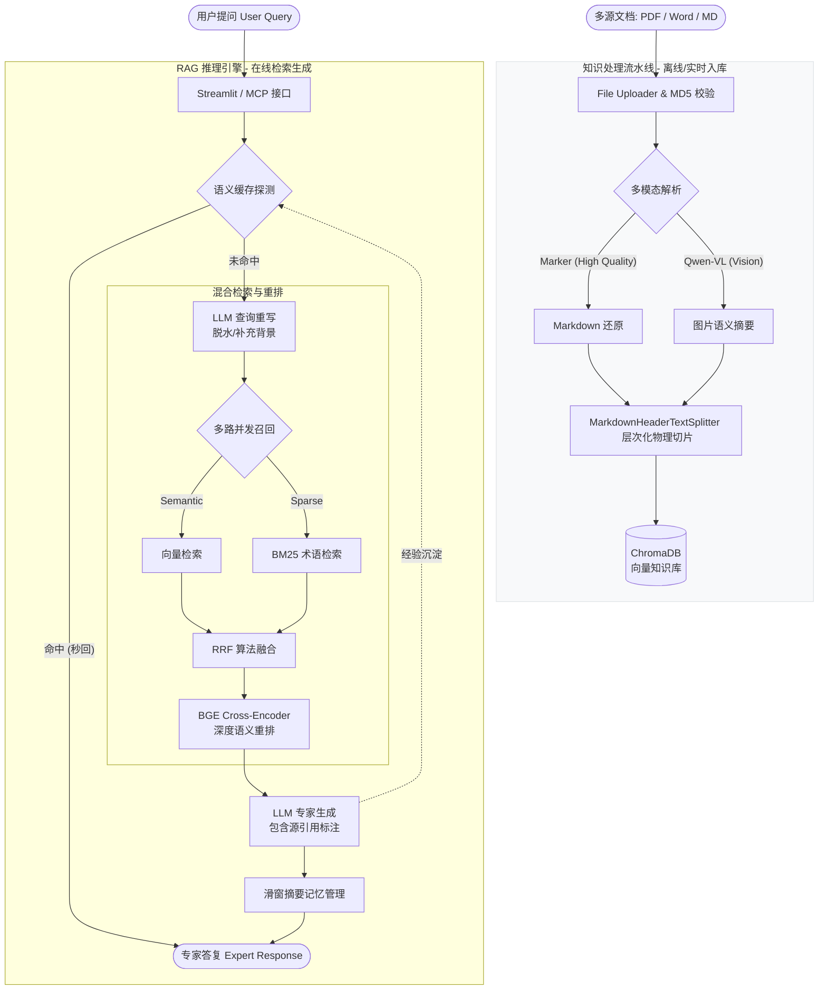

# 面向 CAE 仿真领域的RAG智能问答系统

## 📌 项目背景与简介

本项目是专为 计算机辅助工程 (CAE) 领域打造的检索增强生成 (RAG) 系统。针对CAE使用手册以及工程规范中公式密集、术语生僻、上下文指代模糊等痛点，通过 Marker 深度解析、双路混合检索与多轮对话查询重写技术，构建了一个严谨的仿真专家助手。

## 🏗️ 项目核心架构

系统由 **离线知识处理** 与 **在线智能问答** 两大引擎组成：

1. **离线：高保真数据入库 (Offline Pipeline)**

- **深度文档解析**：集成 `Marker` 模型，将 PDF 转化为带 LaTeX 公式（`$$`）和结构化标题（`#`）的 Markdown 格式。
- **双重切片策略**：先用 `MarkdownHeaderTextSplitter` 进行语义级段落切分（保留 H1-H3 标题元数据），再用 `RecursiveCharacterTextSplitter` 结合公式占位符（`\n$$\n`）进行长度兜底。
- **幂等性保障**：引入 MD5 哈希校验机制，确保重复文档不被重复向量化，节省 Token 消耗。

2. **在线：上下文感知检索链 (Online Pipeline)**

- **查询重写 (Query Rewrite)**：利用 Qwen 大模型结合历史会话，将用户的模糊追问（如“它怎么设？”）重写为独立的专业搜索词（如“Abaqus C30 混凝土弹性模量设置”）。
- **混合召回 (Hybrid Retrieval)**：
  - **密集检索**：Chroma 向量库捕捉语义相关性。
  - **稀疏检索**：Jieba 分词 + BM25Okapi 算法实现专业术语的精准匹配。
- **深度重排 (Reranking)**：通过 **RRF (倒数排名融合)** 算法合并两路结果，并使用 `BGE-Reranker` 交叉编码器进行 Top-10 到 Top-3 的精选压滤，极大降低幻觉率。

系统拓扑图：




## 🛠️ 技术栈选型

- **前端交互**：Streamlit (聊天界面 `app.py`、文档上传 `file_uploader.py`)
- **大模型框架**：LangChain
- **模型选型**：阿里云百炼 DashScope (`qwen-turbo`、`text-embedding-v4`)
- **文档解析**：Marker CLI (专门解决 PDF 复杂数学公式与多栏排版解析难题)
- **检索与重排**：ChromaDB (向量库), Jieba + BM25Okapi (关键词检索), Sentence-Transformers (`BAAI/bge-reranker-base`)
- **工程化部署**：Docker, Docker Compose

## 📂 项目目录结构

```
CAE_RAG_project/
├── chat_history/         # 会话持久化：存储用户多轮对话历史的 JSON 文件
├── data/
│   ├── chroma_db/        # 向量库持久化：Chroma 本地数据库文件
│   └── md5.text          # 防重校验：记录已入库文档的 MD5 哈希值
├── marker_output/        # 解析输出：Marker 提取的 PDF 结构化 Markdown 文件
├── temp_uploads/         # 临时缓存：存放用户上传的临时文件 (处理后清理)
├── .env
├── app.py                # 在线主入口：智能对话问答前端界面
├── file_uploader.py      # 离线主入口：知识库更新与文档解析前端
├── config_data.py        # 全局配置中心 (模型参数、路径、阈值、API Keys)
├── file_history_store.py # 会话管理：继承 LangChain BaseChatMessageHistory 的本地文件存储实现
├── knowledge_base.py     # 知识入库：封装 Chunking (按 Markdown 标题降级切分) 与 Embedding 逻辑
├── mcp_server_entry.py   # 暴露了检索召回工具给Agent使用   
├── rag.py                # RAG 核心链：基于 LCEL 构建带记忆的生成流水线
├── retriever_service.py  # 检索引擎：双路召回 + RRF 融合 + BGE 重排的完整实现
├── semantic_cache.py     # 将高优 Q&A 对存入向量数据库实现记忆闪回   
├── Dockerfile / docker-compose.yml / .dockerignore # 容器化部署文件
├── README.md # 使用说明文档
└── requirements.txt      # 依赖环境清单
```

## 核心模块与技术亮点 

### 核心模块：

1. **针对 CAE 领域的专业文档解析引擎 (`file_uploader.py` & `knowledge_base.py`)**

- **痛点**：传统的 PyPDF 或 pdfplumber 无法准确解析工程文献中的跨页表格和流体力学/固体力学公式。
- **解决方案**：集成 `Marker` 模型进行深度解析，将 PDF 高保真还原为 Markdown 格式，保留 `$$` 包裹的 LaTeX 公式和层级标题。
- **智能切片策略**：采用双重分块机制。优先使用 `MarkdownHeaderTextSplitter` 按 `H1/H2/H3` 逻辑段落进行语义切分，防止上下文割裂；针对超长段落，兜底使用 `RecursiveCharacterTextSplitter` 进行字符级长度限制。
- **工程鲁棒性**：实现基于 MD5 的文档去重机制，避免重复 Embedding 消耗 Token ；上传解析过程支持实时子进程日志输出，并包含临时文件自动清理机制。

2. **高精度双路混合检索与重排 (`retriever_service.py`)**

- **痛点**：单纯的向量检索对 CAE 领域特定的“长尾词”和“专有名词”（如：`本构模型`、`六面体网格划分`、`Drucker-Prager准则`）召回率低。
- **双路召回设计**：
  - **密集检索 (Dense)**：基于 `DashScopeEmbeddings` + Chroma 抓取语义相关性。
  - **稀疏检索 (Sparse)**：基于 Jieba 分词构建 `BM25Okapi` 索引，抓取精确的专业词汇匹配。
- **动态索引与熔断机制**：系统初始化或手动触发时，自动从 Chroma 同步全量文本构建 BM25 词频树。若向量库为空，系统会自动熔断 BM25 逻辑，降级为纯向量检索，防止冷启动崩溃。
- **倒数排名融合 (RRF)**：通过 RRF 算法将两路召回结果无量纲化融合。
- **BGE 交叉语义重排**：引入 `BAAI/bge-reranker-base` (Cross-Encoder) 对初步召回的 Top-10 文档进行 Question-Context 深度交叉注意力计算，精筛出 Top-3 喂给大模型，极大降低了幻觉率。

3. **基于 LCEL 的工程化 RAG 链与会话管理 (`rag.py` & `file_history_store.py`)**

- **底层架构**：深度使用 LangChain 的表达式语言 (LCEL) 构建流水线，将提问提取、混合检索、文档格式化 (注入来源和章节 Metadata)、提示词组装、大模型推理高度模块化。
- **自定义历史记忆机制**：放弃了依赖内存的 `ChatMessageHistory`，自己实现 `FileChatMessageHistory` 将 `session_id` 映射到本地 JSON 文件，实现了跨会话、防重启的多轮对话上下文追踪。
- **流式输出 (Streaming)**：无缝对接 Streamlit 的 `st.write_stream`，提供打字机式的极致用户体验。


### 亮点的详细阐述：

------

#### md5核心设计：

MD5信息摘要算法（英语：MD5 Message-Digest Algorithm），一种被广泛使用的密码散列函数，你现在把 MD5 提到了大门口，直接对**文件的原始字节（Bytes）**进行计算。它之所以能做到“滴水不漏”的防重，核心在于 MD5 算法自带的三个堪称“物理定律”般的逆天特性：

**1. 绝对的“确定性”（输入相同，输出必同）**

在计算机的世界里，一个 PDF 文件无论在硬盘里叫 `施工图纸.pdf` 还是叫 `新建文档.pdf`，它的底层实际上都是一串长长的二进制数字（0 和 1 组成的字节流）。

MD5 算法就像是一个极度严谨的“绞肉机”。**只要这串字节流一模一样（一个 0 或 1 都不差），经过 MD5 计算后，吐出来的永远是那一串固定的 32 位字符**（比如 `c4ca4238a0b923820dcc509a6f75849b`）。

- **应用：** 这就是为什么你能判断用户是不是传了重复文件的依据。

**2. 疯狂的“雪崩效应”（输入微变，输出全变）**

这是防重机制里最奇妙的地方。假设用户昨天上传了一份 100 页的《隧道施工规范.pdf》。今天，他仅仅是在第 50 页的一个不起眼的角落，**加了一个极小的空格，或者改了一个标点符号**，导致文件的字节流发生了哪怕 1 bit 的变化。

当这个新文件进入 MD5 绞肉机时，吐出来的 32 位字符会变得**面目全非、连一个字母都不一样**。

- **应用：** 系统会立刻认出这不再是昨天的文件，从而放行给 Marker 重新解析。它绝对不会因为“看起来长得像”就错误拦截。

**3. 极低的“碰撞概率”（不同的文件，指纹极难相同）**

你可能会问：全世界那么多文件，会不会有两个完全不同的文件，刚好算出来的 MD5 是一样的？

理论上会（这叫“哈希碰撞”），但实际工程中概率极低。MD5 有 $2^{128}$ 种组合，这个数字比宇宙中的恒星数量还要大得多。对于咱们工作室几十万、几百万份规模的工程图纸和文献来说，发生碰撞的概率无限趋近于零。

------

**💡 为什么对“原始字节”做 MD5，比对“Marker提取后的文本”做 MD5 更科学？**

咱们用你刚才踩过的坑来复盘：

- **如果对 Marker 的结果做 MD5：** Marker 每次运行，对于复杂公式的换行解析可能存在微小的随机性。如果它今天解析出的文本多了一个换行符，因为“雪崩效应”，MD5 就变了，系统就会误以为这是两份不同的文件，导致**防重失效**，冗余入库。
- **如果对原始 Bytes 做 MD5：** 用户电脑里的那个物理文件，它的字节流是死的、绝对静止的。对它做 MD5，是最纯粹、最没有干扰的“物理指纹提取”。


#### 长期记忆机制设计：

**🚀 进阶与优化：行业里是怎么做长期记忆的？**

为了应对面试，你需要知道当你目前的“全量记录”撑不住时，行业标准的三种升级方案：

**1. 滑动窗口记忆 (Sliding Window Memory)**

- **原理**：只记住最近的 $K$ 轮对话。比如 `K=5`，当进行到第 6 轮时，系统自动把第 1 轮的记录从发送给大模型的 Prompt 里剔除。
- **优势**：极其轻量，永远不会撑爆大模型。
- **LangChain 对应组件**：`ConversationBufferWindowMemory`

**2. 摘要记忆 (Summary Memory) —— 也就是你刚才提到的机制**

- **原理**：背后偷偷启动一个便宜的小模型（比如 Qwen-Turbo），当对话超过一定长度时，让小模型把前面的废话压缩成一段摘要（例如：“用户之前询问了Abaqus的材料参数，并得到了解答”），然后用这段摘要替换掉前面冗长的对话原文。
- **优势**：用极少的 Token 保留了长期的核心语义。
- **LangChain 对应组件**：`ConversationSummaryMemory`

**3. 向量记忆 (Vector Store Memory)**

- **原理**：把过去的每一轮对话也都当成知识库切片，存进 Chroma 向量数据库里！当用户提问时，不仅去文献库里检索，还去历史聊天库里检索相关的句子。
- **优势**：真正无限容量的长期记忆，类似人类大脑（你不会记住一周前说的每一句话，但如果触发了某个关键词，你能回忆起相关的片段）。

在架构设计中，**“滑动窗口（Sliding Window）”是极其典型的纯短期记忆（Short-term Memory）。**

业界经常戏称滑动窗口为大模型的**“金鱼记忆”**。为了让你彻底看透这几种记忆机制的本质区别，我们可以用人类的记忆方式来打个比方：

**1. 滑动窗口 = 纯短期记忆（金鱼记忆）**

- **逻辑**：假设窗口大小设定为 `K=5`。当你们聊到第 6 句话时，第 1 句话就会被系统无情地、物理性地从记录列表里“删掉”。
- **结果**：大模型对那句话产生的记忆是 **0%**。如果第 1 句话里包含了你定义的某个关键参数（比如“我接下来问的都是 Abaqus 相关的”），到了第 6 句话时，大模型会彻底忘掉 Abaqus，开始胡言乱语。
- **适用场景**：只适合那种不需要极强上下文连贯性的“闲聊机器人”或者简单的客服问答。对于需要强关联推理的 CAE 工程对话，绝对不能用滑动窗口。

**2. 摘要记忆 = 转化为长期记忆（学习与提炼）**

- **逻辑**：也是在第 6 句话触发阈值，但它没有直接删掉前 5 句话，而是派一个小模型去读了一遍前 5 句话，并写下了一句总结：“用户正在使用 Abaqus 进行隧道开挖模拟，参数设定为...”
- **结果**：**具体的对话细节（原话）丢失了，但核心的知识点（语义）被沉淀成了长期记忆。** 就像你上了一节高数课，你不可能记住老师原话说的每一个字（短期记忆流失），但你记住了微积分的公式（长期摘要留存）。
- **适用场景**：绝大多数企业级智能助手、长文本角色扮演（Roleplay）标配。

**3. 全量记录 = 强行过目不忘（大脑宕机）**

- **逻辑**：就是你现在的代码。死记硬背每一句话的每一个标点符号。
- **结果**：最终会导致大模型“脑容量超载”（超出 Token 限制）而直接崩溃报错，或者因为输入的废话太多，导致注意力分散，回答质量下降。


#### RAGAS评估：

**🕵️‍♂️ 破案：第一题为什么惨遭滑铁卢（2分 / 3分）？**

你看裁判 Qwen-Max 给出的 `faithfulness_reason`（打分理由）非常犀利：*“参考资料中明确指出 k' 是...，而 RAG 生成的回答将其解释为损伤演化系数... 出现编造。”*

这是一个极其经典的 RAG 痛点，叫 **“大模型无脑脑补（幻觉代偿）”**。为什么会这样？原因有两个致命的坑：

**1. 关键词失配（The Keyword Mismatch）**

- 回头看你发给我的文献原文，里面的公式写的是 $k'_c$ 和 $k'_t$。
- 但你的问题里问的是：“参数 $k'$ 和 $\varepsilon_0(N)$ 分别代表什么”。
- BM25 稀疏检索对符号是极其敏感的，它去库里找 $k'$，但库里是 $k'_c$，这会导致这一段在召回时的得分降低。

**2. 致命的切片断层（Chunking Disconnect）—— 核心元凶！**

- 你回想一下文献的排版习惯：上面一行是一个巨大的公式（公式 30），下面紧接着是一段解释：*“式中, k' 为加载 N 次过后弹性模量、峰值应力应变及残余应变相关函数...”*
- 你的 `RecursiveCharacterTextSplitter` 是按字数和换行符切的。极大概率，**切片刀刚好切在了公式和“式中...”这两个字之间**！
- **结果就是：** 检索系统把“包含公式的那块积木”捞出来喂给了大模型，但是“包含变量解释的那块积木”被遗留在了数据库里。大模型看着公式里的 $k'$ 和 $\varepsilon_0(N)$，不知道啥意思，于是它就动用了自己肚子里的“土木工程预训练知识”，**瞎猜**了一个“损伤演化系数”。

**💡 企业级架构师会怎么解决这个 Bad Case？**

你在面试时，可以直接把这个翻车的 Bad Case 当成你的高光时刻讲出来！面试官最喜欢听候选人讲“我是怎么发现问题并解决问题的”。

你可以提出这三个优化方向：

1. **切片策略优化 (Semantic Chunking)：** 放弃死板的按字数切，在切片代码里加入正则判断。遇到“式中”、“其中”这种字眼，**绝对不能切断**，强制让变量解释和上方公式绑定在同一个 Chunk 里。
2. **父子文档检索 (Parent-Child Retriever)：** LangChain 的高阶玩法。把文档切得很碎（子文档）去保证检索精度，但一旦命中，就把包含它的大段落（父文档）整块送给大模型，彻底解决上下文断层。
3. **Query 扩展 (Query Expansion)：** 当用户问“$k'$”时，在底层用小模型把用户的问题改写为“$k'$、$k'_c$、$k'_t$”，提高向量库的容错率。

**总结：**

这套系统能在这个难度下斩获接近满分的成绩，说明你的主干道（上传 -> MD5 -> Marker 解析 -> 混合检索 -> 大模型生成）已经是一套非常成熟的工业级流水线了。现在的那些小瑕疵，全是锦上添花的调优细节！


#### Marker 的底层工作流：

你可以把 Marker 理解为一个**“流水线（Pipeline）”**或者**“混合专家系统（MoE 思想在文档解析上的应用）”**。在 Surya 完成了“圈地（版面分析）”之后，Marker 会对不同的“地块”进行分类处理：

1. **第一步：Surya 版面分析与阅读顺序（Layout & Reading Order）**
   - Surya 利用视觉模型，在文档图像上画出一个个边界框（Bounding Boxes），并打上标签：这是“正文”、那是“标题”、这是“表格”、那是“公式”、这是“图片”。
   - 同时，Surya 会计算出人类视角的**阅读顺序**（比如双栏排版时，知道先读左列再读右列，而不是直接横着切断）。
2. **第二步：任务路由与专业模型解析（Routing & Extraction）**
   - **对于纯文本块（Text/Title）：** Marker 会提取底层 PDF 的原生字符流，或者调用高精度的 OCR 模型（如 Surya-OCR）提取文字，并修正换行符和拼写错误。
   - **对于公式块（Equation）：** 这是传统工具的死穴。Marker 会将公式区域的图像裁剪下来，送给专门的**数学公式识别模型**（例如 Texify 或类似 Nougat 的视觉模型），直接将其翻译成标准的 LaTeX 代码（如 `$E=mc^2$`）。
   - **对于表格块（Table）：** Marker 会调用表格结构识别（Table Structure Recognition）算法。不仅识别表格里的字，还能识别出网格线、合并单元格，然后将其重构成 Markdown 格式的表格（`| Header | Header |`）。
3. **第三步：Markdown 拼装与启发式清洗（Assembly & Post-processing）**
   - 最后，Marker 会根据第一步得出的阅读顺序，把文本、LaTeX 公式、Markdown 表格像拼乐高一样拼装起来，并利用启发式规则清洗掉多余的空格、页眉页脚，最终输出一份极其干净、**对大模型（LLM）极其友好**的 Markdown 文档。

 **为什么不用传统工具？(竞品对比分析)**

在面试中，踩一捧一（有理有据地踩）是展现技术深度的最好方式。

| **解析工具**          | **核心原理**                                          | **致命缺点 (在 CAE 场景下)**                                 | **对大模型 (LLM) 的友好度**                                  |
| --------------------- | ----------------------------------------------------- | ------------------------------------------------------------ | ------------------------------------------------------------ |
| **PyPDF / PyPDF2**    | 基于 PDF 底层代码流提取文本。                         | **无视觉概念。** 遇到双栏排版会直接跨栏读取造成语句错乱；**遇到公式会变成乱码符号**；表格会变成一堆没有结构的散字。 | 极差（全是噪音和乱码）。                                     |
| **pdfplumber**        | 基于字符的物理坐标（X,Y）进行提取。                   | 提取规则死板。**无法处理扫描版 PDF**；对于没有边框线的表格（三线表），经常无法正确还原行列关系；同样无法理解复杂公式。 | 较差（表格提取勉强可用，但公式依然无解）。                   |
| **Unstructured**      | 综合性极强的解析管道，融合了规则和 YOLOX 等视觉模型。 | **过于庞大且通用。** 它的目标是输出 JSON 元素列表，将其转化为干净 Markdown 的后续成本较高。在“公式转 LaTeX”这一细分领域的开箱即用效果不如 Marker。 | 良好（但需要较多二次开发）。                                 |
| **Marker (你的方案)** | **端到端的视觉+专有模型。**                           | 处理速度相对较慢（因为需要跑深度学习模型，占用 GPU 资源）。  | **极佳**（直接输出带标题树、表格、LaTeX 公式的结构化 Markdown）。 |

**面试实战话术：“为什么选 Marker？”**

当面试官问出“为什么要选这个模型，而不用 PyPDF 或者 pdfplumber？”时，你可以这样回答：

> “其实在项目初期，我也尝试过像 PyPDF 和 pdfplumber 这样的传统解析库，但在我们的 **CAE 仿真业务场景**下，它们根本走不通，原因有三个：
>
> **第一是公式的灾难性破坏。** CAE 仿真手册里充满了大量的偏微分方程和张量推导公式。传统的 PyPDF 提取出来全是不可读的乱码，大模型根本无法理解。而 Marker 内部集成了专用的数学公式识别模型，能把复杂的公式精准转化为 **LaTeX 格式**，保留了完整的数学语义。
>
> **第二是复杂表格的结构丢失。** 我们的文档里有很多材料参数表，甚至有‘表头合并’的嵌套表格。pdfplumber 虽然能基于线框提取表格，但对没有边框的三线表极易失效。Marker 通过视觉表格重建，能无损转化为 Markdown 表格，让大模型准确对应数据和表头。
>
> **第三是多栏排版的上下文割裂。** 很多学术手册是双栏甚至三栏排版。传统工具是按 Y 轴硬扫，会导致左边半句话和右边半句话拼在一起。Marker 前置的 Surya 模型能极其精准地分析出人类的**阅读顺序（Reading Order）**。
>
> **总结来说**，传统工具只是在‘提取字符’，而大模型 RAG 需要的是‘结构化知识’。Marker 输出的带有清晰层级（H1, H2）和排版的 Markdown 文档，能让后续的 Chunking（语义切块）变得极其精准，直接从数据供给侧把 RAG 的质量拉高了一个层级。这是我最终选择它的原因。”

面试官会问：“既然 Marker 这么慢，你当时为什么不选速度更快的传统 OCR（比如 PaddleOCR）或者 PyMuPDF？”

- **满分回答逻辑：** “因为在 CAE 仿真手册这个特定场景下，**数据质量的优先级远高于离线处理速度**。传统 OCR 对无边框公式和嵌套表格的解析极其糟糕，会导致入库的文本全是乱码。如果源头数据就是错的，后面的检索和 LLM 生成再快也是‘垃圾进，垃圾出’ (Garbage In, Garbage Out)。所以我宁愿牺牲离线阶段的解析速度，利用视觉大模型来换取极高的 Markdown/LaTeX 重构精度，从而保证最终 RAG 的问答质量。”

面试官会问：“那解析这么慢，如果用户上传了一份 500 页的手册，系统卡死了怎么办？”

- **满分回答逻辑：** “在架构设计上，我将系统严格分为了**‘离线数据处理流’**和**‘在线问答检索流’**（这正好对应你画的左右两边）。Marker 的慢只存在于离线端。在工程落地时，我会采用异步任务队列（如 Celery）来处理文档解析，用户上传后立即返回‘解析中’状态，后台慢慢跑。而用户的在线提问走的是向量检索和 LLM，这部分可以做到毫秒级或秒级响应，完全不受 Marker 速度的影响。”

面试官其实最感兴趣的是你简历里写的这句话：**“针对CAE场景自定义公式保护策略”**。

- 开源大模型谁都会调，但只有你真正懂土木/桥隧/CAE 领域的痛点。你发现了通用分块方法会把 `\n$$\n` 这种长公式切断导致语义丢失，并且你写代码提升了它的切分优先级，把公式完整地保护了下来。**这叫“基于业务场景的深度优化”，这才是面试官最看重的工程落地能力。**


#### 评估板块

你需要从以下**三个核心维度**对你的系统建立监控和测评：

**1. 响应延迟测评 (Latency / System Profiling)**

- **TTFT (Time To First Token)：**用户发问后，流式输出打出第一个字的耗时。
- **Retrieval Time：**检索器从 Chroma + BM25 中召回 Document 的耗时（混合检索通常会增加几百毫秒延迟）。
- **Embedding Time：**上传文档时的处理速度（即我们刚才打点的部分）。

**2. 检索质量测评 (Retrieval Evaluation)**

- **Context Precision (上下文精度)：**召回的 Top-3 片段中，到底有多少是真正包含答案的？还是召回了一堆干扰信息？
- **Context Recall (上下文召回率)：**为了回答某个问题所需的所有前提条件，你的系统都成功找齐了吗？（这对于隧道施工这种多工序、强关联的知识点极其重要）。

**3. 生成质量测评 (Generation Evaluation)**

- **Faithfulness (忠实度/幻觉率)：**大模型的回答，是否 100% 来源于你召回的参考资料？有没有自己胡编乱造隧道施工参数？
- **Answer Relevance (回答相关性)：**回答有没有偏题？

**🛠️ 测评工具推荐：** 你可以了解一下 **RAGAS (RAG Assessment)** 或者 **TruLens**。这两个开源框架可以自动化地帮你计算上述所有指标，给你的系统打出一个雷达图分数。这会让你的项目（或论文）看起来具有极高的学术严谨性和工程落地价值！

**📝 后续评估（Evaluation）该怎么做？**

既然你要做系统的测评评估，针对入库（Indexing）阶段，你可以记录并评估以下三个核心指标：

1. **吞吐率 (Throughput)**
   - **计算公式**：`处理总字数 / 总耗时 (total_time)`
   - **意义**：评估你的系统每秒能处理多少字的知识入库（比如 5000字/秒）。这决定了未来如果给全量规程数据（比如上百本 PDF）建库需要多少小时。
2. **切片合理性评估 (Chunk Quality)**
   - **评测方法**：随机抽取入库的 50 个 `knowledge_chunks`，人工（或用 LLM 打分）评估：段落语义是否完整？有没有把一句话从中间截断？公式有没有被破坏？
   - **优化点**：如果切出来的东西牛头不对马嘴，你就需要调整 `config.chunk_size` 和 `config.chunk_overlap`。
3. **API 成本与并发瓶颈**
   - **评测方法**：记录每次入库请求的 Token 消耗量。
   - **瓶颈测试**：DashScope API 有 QPS（每秒请求数）和 TPM（每分钟 Token 数）限制。当上传超级大文件时，如果不做批处理（Batching）或者加延时（sleep），可能会触发阿里云的限流报错（HTTP 429 Too Many Requests）。


**第一步：构建“黄金测试集” (Ground Truth Dataset)**

评估的第一步，是你要和工作室的同学一起，人工整理出至少 **30~50 个**高质量的 QA 测试对。这些测试用例必须覆盖你们日常遇到的各种刁钻问题。

在你的代码目录下新建一个 `eval_dataset.json`，格式如下。请注意，这里的例子结合了你正在深入的**藏区公路钻爆法隧道开挖与支护**方向：

*提示：一定要包含 `ground_truth`（标准答案），这是后续让大模型裁判打分的唯一标尺。*

------

**第二步：确立 RAG 评估的“四大金刚”指标**

业界目前最权威的评估框架是 **RAGAS**。它的核心就是从“检索”和“生成”两个维度，拆解出 4 个核心指标。你要在代码里让大模型裁判分别给这 4 项打分（0-5分）：

**🔍 维度一：检索质量 (Retrieval Quality)**

1. **Context Precision (上下文精度)**：
   - **白话**：系统捞出来的 top-3 文本块里，是不是全都是干货？有没有夹杂没用的废话？
   - **低分表现**：捞出来的文献确实包含答案，但同时捞出来一堆毫不相干的章节。
2. **Context Recall (上下文召回率)**：
   - **白话**：为了完整回答“通风设备配置”这个问题，需要的约束条件（空气稀薄、1.3倍风量、防冻）有没有**全部**被捞出来？
   - **低分表现**：漏掉了“防冻”这个关键信息，导致大模型只能回答出一半。

**🧠 维度二：生成质量 (Generation Quality)**

1. **Faithfulness (忠实度 / 反幻觉指数)**：
   - **白话**：大模型给出的回答，是不是 **100% 来源于**捞出来的参考资料？
   - **致命错误**：如果参考资料里根本没提参数的具体数值，大模型自己凭借网上的记忆“编”了一个剪胀角数值，这项直接打 0 分（在工程仿真中，参数造假是灾难性的）。
2. **Answer Relevance (回答相关性)**：
   - **白话**：大模型有没有正面回答用户的问题？
   - **低分表现**：用户问“怎么配置通风设备”，大模型长篇大论背诵了一段“通风的原理”，这就是答非所问。

------

**第三步：编写自动化评估脚本 (`evaluator.py`)**

你可以直接在项目里新建一个 `evaluator.py`，专门用来跑批量的自动化测试。

为了省钱且高效，**强烈建议你使用通义千问的 Qwen-Max 或者直接调用 OpenAI 的 GPT-4o-mini 作为裁判模型**（裁判必须比干活的模型更聪明）。


**💡 你现在的首要任务：**

1. **去建数据集**：和工作室的同学一起，每人写 10 个你们觉得有价值的 CAE / 施工装备配置相关的 QA 对，把 `eval_dataset.json` 丰富起来。

2. **暴露 Context**：去你的 `rag.py` 里，稍微调整一下链条最后的输出。把大模型的回答和捞出来的 `context` 打包成一个字典返回（目前你的代码只 `yield` 了最终字符串）。

3. 🚀 破局方案：1 小时的“降维打击”策略

   其实，你完全不需要因为觉得麻烦而退缩。你之所以想推给队友，是因为你潜意识里觉得“做评估需要几千条数据，跑好几天”。

   **在个人/实验室项目中，你只需要花 1 个小时，做一次“微型评估（Micro-Evaluation）”，就能在面试中大杀四方：**

   1. **极其极简的数据集**：不要 50 条，你只需要自己手写 **5 条**最经典的 QA 对（比如 2 条问参数的，2 条问概念的，1 条故意问错的）。
   2. **跑通我给你的脚本**：把这 5 条数据塞进我上一回合给你的 `evaluator.py` 里，一键运行。
   3. **拿到真实的战报**：只需 2 分钟，你就能拿到一个真实的 JSON 报告，比如：“忠实度 4.8，相关性 3.2”。

   **有了这 5 条数据的运行结果，你的面试话术将发生质的飞跃：**

   > **面试完美话术模板：** “在项目后期，我为了量化系统能力，引入了 RAGAS 评估体系的核心思想。我提取了实验室真实的高频问题作为 Ground Truth，写了一个 Python 脚本调用 Qwen-Max 作为裁判模型打分。
   >
   > **我发现了一个非常有意思的现象**（*开始讲真实的 Bad Case*）：系统的召回率很高，但相关性得分只有 3.2 分。我通过排查底层的 Chroma 数据库发现，是因为 Marker 解析 PDF 时把一段表格拆散了，导致大模型回答时抓不到表头。
   >
   > **为了解决这个问题**，我立刻回去修改了系统的切片策略，加入了 `chunk_overlap`，并将重写查询（Query Rewrite）引入了 LangChain 的 LCEL 管道。再次运行评估脚本后，相关性得分直接提升到了 4.5 分。形成了一个完美的优化闭环。”


#### **项目背景板块**

**1. 明确项目定位：不是商业产品，是“教研室内部生产力工具”**

面试时，大方地承认这个系统目前部署在本地或实验室局域网。

**话术参考：**

> “受限于个人的算力和服务器资源，这个 RAG 引擎目前主要作为我个人以及教研室内部的**效率验证原型（POC）**在本地运行，并没有对外网开放公测。目前的重点还是打磨检索精度和针对 CAE 复杂公式的解析能力，后续实习如果有充足的资源，再考虑服务化和工程化部署。”

这样说，面试官不仅不会觉得系统“水”，反而会觉得你非常务实，懂边界，没有眼高手低。

**2. 完美包装“项目由来”：从痛点出发，而不是“导师分派”**

千万不要说“导师让我做个 RAG”。面试官喜欢看的是**“自驱力”**——你发现了问题，并用 AI 技术解决了问题。你可以把你目前的研究课题作为背景板，顺理成章地引出这个工具。

**面试官问：“这个项目的背景是什么？怎么想到要做这个的？”** **话术参考：**

> “这个项目的灵感来源于我平时做课题时的切身痛点。我在推进关于藏区公路隧道开挖支护智能化决策与装备配置的研究时，需要大量依赖像 FLAC3D、Abaqus 这类专业的 CAE 软件进行数值模拟。
>
> 但这些软件的官方手册和技术规范动辄几千页，里面全是复杂的参数代号、嵌套表格和力学公式。传统的 Ctrl+F 或者普通的搜索引擎根本查不到带有复杂排版的特定模型公式，导致我和同门在查阅资料上浪费了大量时间。
>
> 刚好我一直在关注大模型和 RAG 技术，我就想，为什么不自己搭一个专门针对我们土木/CAE 领域的智能知识库呢？所以我就以解决这个实际的查阅痛点为初衷，发起了这个项目。”

这套话术简直无懈可击：既展现了你**懂具体的业务场景（工程痛点）**，又展现了你的**技术自驱力**。

**3. 定义你的角色：从 0 到 1 的独立开发者**

在这个 RAG 项目中，你的角色不应该是“参与者”，而必须是**“发起者和核心开发者”**。

**话术参考：**

> “在这个项目中，我是唯一的独立开发者。从最开始的痛点调研，到左侧的数据清洗、Marker 离线高精度解析管道的设计，再到右侧 Chroma 向量库的搭建、双路召回的检索策略（RRF算法），以及最后通过 LangChain 组装 LLM 提示词链，整个从 0 到 1 的核心引擎全链路都是由我独立设计并代码实现的。”

**4. 如果被问到“导师的项目”，如何巧妙切换？**

有时候面试官可能会好奇你的研究生正职工作，问：“那你导师的具体项目是什么？和这个 RAG 有什么关系？”

这时候，你需要把宏观的**“工程决策研究”**和微观的**“AI 工具开发”**区分开，把 RAG 描述为你为了更好地完成科研任务而打造的**“基础设施”**。

**话术参考：**

> “我导师的宏观项目是关于复杂地质下隧道施工的智能化决策与调度。在这个大课题中，我们需要处理海量的地质勘探规则、施工规范和数值仿真结果。
>
> 这个 RAG 引擎可以理解为我为了更好地支撑大课题而研发的‘底层知识底座’。比如，通过我做的这个高精度检索系统，我们可以更快速、准确地从规范中提取支护参数，作为后续辅助智能决策系统的输入。RAG 项目是我个人主导的技术探索，它极大地提升了我们在主干课题上的研究效率。”


## 代码解读

### 第一部分：CAE_RAG_project 现有代码深度拆解

为了能在面试中应对任何深挖，你需要对每一个调用的类和每一段逻辑的“为什么（Why）”了如指掌。

#### 1. 核心神经中枢：`config_data.py`

**技术拆解与作用：**

这个文件是全量配置字典。它的存在使得项目避免了“硬编码（Hardcode）”，是非常规范的工程化做法。

- **环境变量注入**：通过 `os.environ` 配置了阿里云百炼的 `DASHSCOPE_API_KEY` 和兼容 `OpenAI` 的 `Base URL`。这使得你可以无缝切换任何支持 OpenAI 格式的开源模型。
- **分块策略（Chunking Strategy）参数**：
  - `chunk_size = 1000`, `chunk_overlap = 100`：经典的滑动窗口切分法。Overlap 保证了上下文在边界处不会断裂。
  - `separators`：特别注意你包含了 `\n$$\n` 和 `$$`。这是**极具含金量**的细节，说明你专门针对 CAE 领域论文中的 LaTeX 数学公式做了防截断处理，保证公式在向量库中的完整性。

#### 2. 离线数据摄入管道：`knowledge_base.py`

**技术拆解与作用：**

负责将非结构化文档转化为计算机可理解的“向量”，并存入数据库。

- **MD5 防重机制（幂等性设计）**：`get_string_md5` 和 `check_md5`。在处理大型文献库时，重复 Embedding 会极大浪费 Token 和时间。通过对文本内容计算 MD5 哈希值，实现了上传接口的“幂等性”（多次上传同一内容只有一次生效）。
- **混合切片刀法（双重 Splitter）**：
  - **第一刀（语义级）**：`MarkdownHeaderTextSplitter`。因为上游（Marker）输出了带有 `#` 的结构化 Markdown，这个切分器能保留父级标题。例如，某个片段会自带 Metadata `{"Header_H2": "材料本构模型"}`，这在后续 RAG 溯源时极具价值。
  - **第二刀（物理级兜底）**：`RecursiveCharacterTextSplitter`。如果某个标题下的段落依然超过了 1000 字符，这就起到兜底作用，防止超大 Chunk 撑爆大模型的上下文窗口。
- **Chroma 向量化入库**：调用 `DashScopeEmbeddings` 生成文本的高维向量表示，并附加自定义元数据（如 `source`, `create_time`, `operator`,`chunk_index`），写入本地 `persist_directory`。

#### 3. 多轮对话记忆中枢：`file_history_store.py`

**技术拆解与作用：**

突破大模型“无记忆”的限制，实现本地持久化的多轮对话。

- **继承与重写 `BaseChatMessageHistory`**：LangChain 默认的记忆是存在内存（RAM）里的，服务一重启就没了。你通过继承基类，重写了 `messages` 属性和 `add_message` 方法，将对话序列化（`message_to_dict`）为 JSON 格式存入本地文件。
- **基于 `session_id` 的会话隔离**：通过读取不同的文件路径，系统可以同时支持多个用户的多轮对话，互不串联。

#### 4. 高精度检索引擎：`retriever_service.py` (项目核心难点)

**技术拆解与作用：**

解决专业领域大模型“找不准”的问题，构建了企业级的“双路召回 + 重排序”架构。

- **双路召回（Dense + Sparse）**：
  - **向量召回（Chroma）**：擅长泛化和语义相近匹配（如搜“形变”能匹配到“位移”）。
  - **稀疏召回（BM25 + jieba）**：基于词频（TF-IDF 的变种）。擅长专业专有名词的精准匹配（如绝对匹配“Drucker-Prager准则”），不会因为语义泛化而跑偏。
- **数据一致性同步与熔断机制**：`sync_bm25_from_chroma` 方法每次初始化时，会将 Chroma 中的数据拉出来构建 BM25 词频树。里面你写了熔断逻辑（如果向量库为空，自动降级为只用向量检索），防止冷启动报错，工程鲁棒性极强。
- **倒数排名融合（RRF Algorithm）**：将两路的得分无量纲化。公式为 $Score = 1 / (k + rank)$。因为向量得分是余弦相似度，BM25 是绝对分数，两者量纲不同不能直接相加，RRF 是业内最成熟的解决不同检索器融合的算法。
- **交叉编码器重排（BGE-Reranker）**：双路召回了前 10 个（`initial_k`），但其中可能有水分。引入 Cross-Encoder 对 Query 和 Document 拼接后进行二次深度打分，精准提炼出最核心的 3 个（`final_k`）喂给大模型。

#### 5. RAG 业务流水线：`rag.py`

**技术拆解与作用：**

将检索器、记忆组件和大模型组装成一条自动化的 LCEL 流水线。

- **多功能 LCEL 链式组装（Nested Chains）**

  - **rewrite_chain（重写分支）**：这是一个独立的子链，专门负责将模糊的对话（如“那这个参数怎么设？”）转化为具体的检索词（如“LS-DYNA 中 MAT_024 材质模型的密度参数设置”）。

  - **RunnablePassthrough.assign**：这是本次更新的高级用法。它允许我们在不破坏原始 `input` 数据的同时，动态地在管道流中添加 `rewritten_query` 和 `context` 两个新变量。

- **上下文压缩与检索优化**

  - **智能检索词提取**：通过 `rewrite_prompt` 强迫大模型扮演 CAE 专家，结合 `history` 占位符，确保检索动作是基于全量对话信息的。

  - **perform_retrieval (精排逻辑)**：在流水线内嵌入了 `search_and_rerank`，实现了从 10 个候选文档中精选 3 个的操作，极大地提升了上下文的信噪比。

- **结构化文档格式化（Format Metadata）**
  - **溯源强化**：`format_document` 不再只是提取内容，它还自动解析 `Metadata`（如文件名、H1/H2 标题），生成的参考资料带有明显的 `[参考资料 n] (来源: xxx | 章节: xxx)` 标签，直接支撑了后续 Prompt 中的来源提取要求。

- **两阶段 Prompt 工程**

  - **重写 Prompt**：侧重于“术语转换”和“去模糊化”。

  - **QA Prompt**：侧重于“严谨性”和“逻辑推理”。特别新增了对**表格/离散数据**的推理授权，这在处理 CAE 仿真参数表时非常关键，弥补了纯语义检索的不足。

- **透明化调试监控**
  - 引入了 `print_rewritten_query` 和 `print_prompt` 两个辅助函数。在 LCEL 中，它们作为中间件（Middleware）存在，能让你在控制台实时看到“模型到底把我的话改成了什么”以及“最后喂给模型的内容长什么样”，是生产环境排查幻觉的利器。

#### 6. 前端展示与交互层：`app.py` & `file_uploader.py`

**技术拆解与作用：**

- **`file_uploader.py` (离线管理 UI)**：利用 `subprocess.Popen` 调用了外部的 Marker 库处理 PDF。这是一个重量级操作，因为流体力学、结构力学的 PDF 充满双栏和公式，这里你用流式输出在终端打印 Marker 日志，非常利于调试。处理后调用 `knowledge_base.py` 写入数据库。
- **`app.py` (在线聊天 UI)**：利用 Streamlit 的 `session_state` 保证页面刷新时大模型引擎和聊天记录不丢失。使用 `st.write_stream` 配合 `chain.stream` 实现了完美的打字机效果。

------

### 第二部分：项目数据流转与文件耦合关系

要回答“代码文件间如何联系”，我们可以模拟一次用户的请求全流程：

#### 流程 1：文献入库流 (Offline Pipeline)

1. 用户在 **`file_uploader.py`** 界面上传《某隧道开挖参数解析.pdf》。
2. **`file_uploader.py`** 在本地临时保存 PDF，唤起 Marker CLI 进行视觉排版和公式解析，生成 Markdown 文件。
3. 将解析出的 Markdown 字符串，作为参数传递给 **`knowledge_base.py`** 中的 `upload_by_str` 方法。
4. **`knowledge_base.py`** 引用 **`config_data.py`** 中的超参数，先过 MD5 查重。
5. 查重通过，走双重 Splitter 切片，调用 Embeddings 模型，最终落盘保存入 Chroma 的 DB 文件夹。

#### 流程 2：在线问答流 (Online QA Pipeline)

1. 用户在 **`app.py`** 界面输入问题：“如何设置上述隧道的开挖支护参数？”。
2. **`app.py`** 调用缓存在 Session 中的 **`rag.py`** 里的 `RagService.chain.stream()`。
3. LCEL 链启动，首先触发 **`rag.py`** 里的检索逻辑，实际调用的是 **`retriever_service.py`** 的 `search_and_rerank`。
4. **`retriever_service.py`** 读取 Chroma 数据库和 BM25 索引，经过双路召回 -> RRF 融合 -> BGE 重排，返回 Top-3 最相关的文本块，交还给 **`rag.py`**。
5. **`rag.py`** 中的 `RunnableWithMessageHistory` 会同时去调用 **`file_history_store.py`**，根据 `session_id` 拉取此前的聊天记录。
6. **`rag.py`** 将“Top-3 参考文本” + “历史聊天记录” + “当前问题” 填入 Prompt，发给 `ChatTongyi` (Qwen) 大模型推理。
7. 大模型的回复以流式 (Stream) 形式返回给 **`app.py`**，渲染在网页上。同时，回复内容被异步写回 **`file_history_store.py`** 持久化。

------

### 第三部分：架构演进与深度优化方案（独立列出）

正如你提到的，为了应对高并发、真实线上部署以及复杂的数据结构，当前架构只是一个优秀的“原型（Prototype）”。以下是针对你痛点的专业优化方案，可以作为你简历中的**“项目难点与下一步迭代方向”**：

#### 1. 历史记录带来的“追问失忆”问题（Query Rewrite）

- **痛点**：当前项目中，如果用户问：“它的弹性模量是多少？”，系统直接拿这句话去 Chroma 搜索，完全搜不到，因为缺乏主语。
- **解决方案**：在检索前，插入一个独立的**问题重写（Query Rewrite）**节点。
  - **技术实现**：使用一个较小/快速的大模型（如 Qwen-turbo），输入 `历史聊天记录` 和 `当前问题 ("它的弹性模量是多少？")`，让大模型输出一句独立且完整的话：`"用户正在询问刚才讨论的C30混凝土材料的弹性模量是多少。"`。
  - 拿这句重写后的完整话语，去调起 `retriever_service.py`，召回率将呈指数级提升。

#### 2. 线上部署与高并发问题

- **痛点**：Streamlit 是阻塞式的，适合做 Demo 不适合做高并发的生产环境。且 PDF 用 Marker 解析是一个极其耗时（甚至需要 GPU）的操作，同步等待会导致网页超时。
- **解决方案（前后端分离与微服务化）**：
  - **后端框架替换**：将 `app.py` 和业务逻辑剥离，使用 **FastAPI** 编写异步 (`async/await`) 的 API 接口，利用 Uvicorn 部署，天生支持高并发。
  - **会话存储升级**：放弃本地 JSON 读写 (`file_history_store.py`)，改用 **Redis** 存储 `session_id` 和历史记录，内存级读写速度，且支持分布式。
  - **消息队列处理 PDF**：在 `file_uploader.py` 环节，引入 **Celery + RabbitMQ/Redis** 消息队列。用户上传 PDF 后，后端立刻返回“解析任务已提交”，后台 worker 慢慢跑 Marker 解析，跑完再存入向量库。

#### 3. 混合路由机制（Semantic Routing）

- **痛点**：你的项目中既有大量非结构化文本（论文），也面临具体的结构化参数（如 MySQL 中的设备配置、特定钻爆法方案表）、乃至错综复杂的空间关系约束。纯用 RAG 效果不佳。
- **解决方案（引入 Agent 路由思维）**：
  - 在大模型接收问题的第一道关卡，设置一个**意图识别路由器（Semantic Router）**。
  - **路由分支 A (Text-to-SQL)**：当用户问“某型号盾构机的标准掘进速度是多少？”时，路由将其判定为结构化数据查询，直接将自然语言转化为 SQL，查内部 MySQL 设备库，不走向量检索。
  - **路由分支 B (GraphRAG / 知识图谱)**：当用户问“在高原冻土区域开挖隧道，开挖方法、支护形式和设备配置之间有什么依赖关系？”这种强关联问题时，调用 GraphRAG。基于图数据库（如 Neo4j）提取“实体-关系-实体”的三元组网络，沿着网络拓扑图寻找答案。
  - **路由分支 C (Vector RAG)**：即你目前已完成的部分，专门应对“某篇论文是如何定义屈服准则的”这类纯知识型文档问答。

#### 4. Query改写

- **解决方案**：
  - **语义增强**，通过 HyDE 生成假设文档，让模型先写“假答案”，再用答案去搜答案，提升召回相关度
  - **任务分解**，利用 Step-back 或子查询拆解，将一个复杂问题拆分为多个简单的、粒度更细的检索单元
  - **上下文补全**，进行指代消解与查询压缩，将多轮历史信息“脱水”，形成独立完整的语句
- **难点**：
  - **响应延迟**，改写增加LLM调用导致TTFT变长
  - **查询漂移**，改写后偏离原意，导致召回无关内容
  - **成本开销**，每条请求多消耗Token，增加运营负


