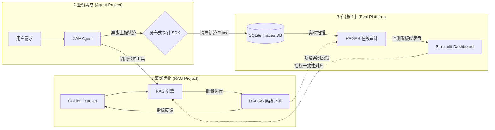
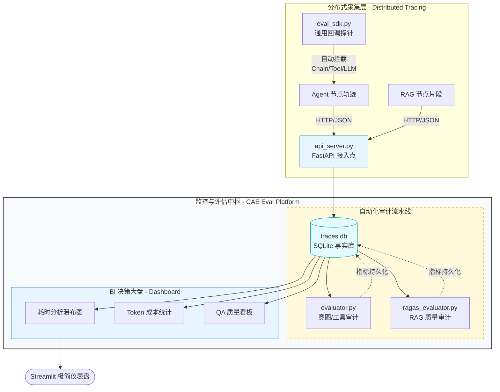
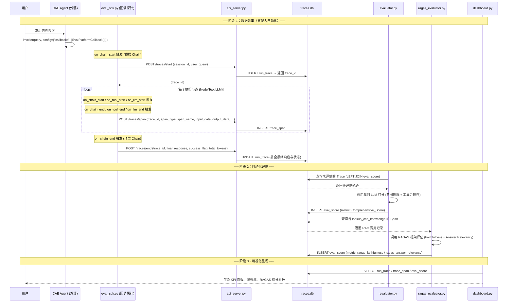

# 面经

## 一、开场面试问答

#### 1. 匹配JD的自我介绍（2~3min）

> 我是谁+我做过什么+我为什么适合这个岗位（卖点组合）
>
> 通用：面试官您好，我叫梅傲寒，目前是西南交通大学桥梁与隧道工程专业的研二学生。
>
> 我的研究方向聚焦于智慧交通大模型应用以及智能建造。在校期间，我获得了10余项国家级和校级荣誉，其中包括**首届中国研究生智能建造创新大赛全国三等奖**是关于优化A*路径规划算法的装备调度系统 。
>
> 在技术实践上，我致力于将前沿大模型框架转化为可落地的工业级应用 ，主导了两个核心项目：
>
> 第一，是作为项目发起人做了一个**面向 CAE仿真与工程规范的 RAG 智能检索系统**，是通过引入**marker**这样的视觉大模型解析复杂的工程文档与数学公式 ，在检索方面搭建了向量+关键词混合检索，结合RRF倒排提取出top10，然后利用交叉重排完成检索架构 ，大幅提升了垂直领域核心知识的提取精度。
>
> 第二，是**面向复杂仿真的 Agent 自动化工作流平台**，在实践中我发现，让大模型直接写底层仿真代码极易产生幻觉和量纲越界，**导致系统频发崩溃**。所以，我基于 LangGraph 引入了**状态机与 MCP 微服务生态**。我把大模型的能力严格限制在高维参数提取上，提取后再通过 **Jinja2 模板精准反填**。这个设计从物理根源上消除了代码幻觉。
>
> 除了技术研发，我曾担任学院学生会轮值主席，主导过12项大型活动并统筹过上千人次的晚会 ，这锻炼了我极其出色的抗压能力、跨部门协同与复杂项目的推进能力 。
>
> 作为一名具备跨学科自驱力的开发者 ，我非常渴望能加入贵团队，将我的架构思维与大模型工程经验转化为实际的产品价值。以上是我的自我介绍，谢谢！
>
> 
>
> English：Good evening, interviewer. My name is Aohan Mei. I am a master's student at Southwest Jiaotong University.
>
> Although my major is Civil Engineering, I have a very strong passion for Artificial Intelligence, especially in LLM and Agent development.
>
> In the past year, I have led two core AI projects. First, I built an Agentic workflow platform using LangGraph. I separated the task control flow from domain knowledge, and used Jinja2 templates to generate code. This successfully prevented the LLM from making hallucination mistakes. Second, I developed a RAG system. I used visual models to parse complex engineering documents, and built a hybrid search system to improve accuracy.
>
> I am a very fast learner and a heavy user of AI tools. I really want to join the Antom team to turn my engineering skills into real product value.
>
> That's all about me. Thank you!
>
> 
>
> TME系统测试：面试官您好，我叫梅傲寒，目前是西南交通大学桥梁与隧道工程专业的研二学生 。 我的研究方向聚焦于智慧交通大模型应用以及智能建造，负责系统开发与质量保障，具备扎实的 Python 编程功底，像 SQL 查数据，Linux 敲命令，还有 HTTP 这些网络协议平时也经常在用。
>
> 在校期间我参与了多个AI应用系统开发的项目，
>
> **第一个，**是基于LangGraph开发了一个CAE的仿真决策多智能体，主要是通过把仿真技能封装成Skill通过顶层的planner智能体选用实现意图和业务的解耦，还引入了MCP调用服务器端的RAG智能检索系统，对整个项目通过pytest框架完成了一套完整的自动化测试管线
>
> 第二个，是我自己从零搭过一个自动化监控和评测平台。当时做这个是因为，很多大模型和智能体系统跑起来像个黑盒，你不知道它中间哪一步出错了，测试起来特别费劲。为了解决这个问题，我就写了一套自动化的评测引擎，对系统的检索和决策链路做自动化的打分和审查。说白了，这其实就是一套高度定制化的自动化测试框架。做完之后，直接把以前需要人工去一条条 review 的测试成本降了 70% 多。
>
> **总的来说，** 我可能不是那种只做“点点点”的传统手工测试候选人，但我的代码底子、搭自动化测试框架的能力，以及排查复杂系统问题的思路都还是挺清晰的。我平时也经常用咱们 TME 的产品，特别希望能有机会加入咱们团队，把我的自动化经验用到咱们具体的业务里，帮忙一起提升产品质量。
>
> 以上就是我的大致情况，谢谢！

#### 2. 简单讲讲实习经历、项目经历、工作经历

> **面向 CAE 领域的 RAG 智能问答系统：**“这个项目的核心难点，是 CAE 仿真手册里有大量复杂公式和嵌套表格，传统 OCR 很难处理。我没有用常规方案，而是引入 Marker 和 Surya 视觉大模型做端到端文档解析，让信息提取完整度提升了约 40%。为了抑制幻觉，检索端我做了稠密语义加 BM25 稀疏的双路混合检索，再用 BGE-Reranker 做精排，最后把高分片段加上溯源标签送入大模型，实现了高精度的专业工程问答。”
>
> **基于 LangGraph 的多智能体 CAE 平台：** “之前大模型直接生成 CAE 脚本，很容易出现物理量纲越界、代码幻觉的问题。我用 LangGraph 设计了 Planner、Extractor、Coder 等五大节点的图状态机架构。最核心的创新是：不让 LLM 直接写底层代码，而是让它按 Pydantic 规范提取高维参数，反填到我定制的 Jinja2 专家模板里，从根源消除代码幻觉，还降低了 40% 的 Token 消耗。同时我也封装了 MCP 协议，支持 Agent 跨进程调用底层仿真软件，实现了全流程自动化。”
>
> **智能调度系统 (突出算法与落地)：** “这是一个偏运筹优化与工程落地的项目。我融合 NSGA-Ⅱ 算法和熵权 - TOPSIS 方法做装备多目标优化配置，同时改进了 A* 路径规划算法，让全局路径搜索效率提升 22.5%。系统基于 SpringBoot 开发落地，在实际工程中让作业时间减少近 20%，施工工效提升 21.5%。相关成果也申请了发明专利，并获得了全国性竞赛奖项。”

#### 3. 自我认知，优缺点是什么？身边人对你的评价，用三个词形容自己

> **优点：** 极强的学习能力和跨界解决问题能力。从传统土木到自学 Python、机器学习算法、路径规划算法，再到现在的 RAG 和多智能体开发，我能快速掌握新技术并落地。 
>
> **缺点：** 作为非科班出身，在计算机底层原理（如操作系统内核、编译原理）上积累不如科班生深厚。但我也有在积极弥补，比如在 Agent 平台中引入 Docker 容器化、熟悉 MySQL 数据库，并开始接触跨进程 RPC 通信（FastMCP）来提升系统的工程健壮性。
>
> **他人评价/三个词：** 
>
> - 自驱跨界 (Cross-driven)：不设边界，主动拥抱新技术。
> - 务实落地 (Pragmatic)： 不空谈概念，一定要把代码跑通，把系统做出来（例如申请专利、跑通 LangGraph 平台）。 
> - 大局观 (Leadership)： 做过学生会主席，懂得如何协调资源、拆解任务。

#### 4. 为什么为什么选这个公司，为什么选择这个行业，为什么选这个岗位？

> **为什么选这个行业/岗位：**“因为我亲身经历了传统工程领域（如隧道开挖决策、CAE仿真）中令人绝望的低效与重复劳动。我深刻意识到，大语言模型不应该只是一个闲聊工具，Agent 和 RAG 架构真正具备了重塑复杂行业工作流的潜力。我选择大模型应用开发，就是想做那个‘懂行业痛点，又能把前沿 AI 转化为实际生产力’的持剑人。贵公司在...（结合JD填补）方向的业务，正是这种理念的最佳落地场景。”
>
> **为什么选这家公司：**
>
> 示例 1（针对垂类大模型公司）：“贵公司在工业大模型的落地路径非常清晰，尤其是在 CAE 仿真 / 工程智能化方向的产品，正好和我做过的 RAG 智能问答、多智能体 CAE 平台高度契合。我看到贵司上个月开源的工业文档解析工具，其中关于复杂公式处理的思路和我自研的公式保护切片策略不谋而合，我特别希望能把自己的落地经验融入到团队中，同时也学习贵司在工程化、产品化上的沉淀。”
>
> 示例 2（针对通用大模型公司）：“贵公司在 Agent 框架 / 私有化部署上的技术积累是行业领先的，我做 LangGraph 多智能体时遇到过跨进程调用、状态持久化的坑，也看到贵司技术博客里分享过类似的解决方案，我希望能在专业的团队里把这些工程问题啃得更透，同时用我工科的行业视角，为通用模型在垂直领域落地提供差异化思路。”

#### 5. 讲一件最有成就感的事，最失败的事，遇到的最大困难，最大挫折，最大挑战是什么

> **最有成就感的事：**“如果要说最有成就感的事，那就是我成功打通大模型和底层 CAE 仿真软件，亲眼看到复杂模型跑通的那一瞬间。当时我在开发 Agent 自动化工作流平台，遇到的大麻烦是大模型虽然懂代码语法，但它完全不懂物理规律。早期我尝试让模型直写代码，发现极其不稳定，它生成的脚本经常导致 Abaqus 这种大型仿真软件直接崩溃挂掉，而且非常浪费 Token。
>
> 为了解决这个痛点，我决定放弃让模型直写底层代码，而是采用了一种混合渲染引擎的模式。我预先写好标准的 Jinja2 模板，就像出好填空题一样，让大模型只做一个高维的参数提取员，提取完直接填进模板里。这就体现了我的一个核心开发理念：把确定性交给程序，把灵活性交给模型。这种方式直接从根源上消除了语法幻觉。
>
> 不仅如此，为了给系统装上绝对安全的自动刹车，我还设计了一套三级自愈网：第一级用 Pydantic 强行锁定参数范围做预防；第二级在代码跑之前做物理先验校验做拦截；如果这样软件还是崩了，第三级机制会自动截取崩溃日志，塞回给 Critic 节点让大模型深度反思并重写。当我看到这套系统里多个 Agent 相互协作，通过校验触发反思，最终零人工干预地生成并跑通了极其复杂的仿真模型时，那种成就感是无与伦比的。因为那一刻我确认了，AI 赋能千行百业不再是一句口号，而是我不仅能调优模型，更能亲手构建出工业级可靠系统的现实。”
>
> **最失败/最大挫折：**“我觉得开发过程中遇到最大的挑战，也是初期让我感觉最受挫的一件事，是在做 RAG 系统的时候。很多计算机科班的同学做 RAG 可能就是简单地拿开源工具把文本切片入库。但他们没有遇到过我们这种极度复杂的工程场景，我们的规范手册里到处都是晦涩的数学公式。
>
> 初期我直接套用开源的 chunking 工具，结果长公式被无情截断，语义完全丢失，导致模型出现了极其严重的幻觉。当时我非常头疼，但我很快意识到，复杂的工程落地问题是绝对没有通用解的，不能只靠盲目试错。于是我发挥了自己土木背景的优势，结合对专业规范的理解，硬着头皮去啃了 Markdown 的抽象语法树（AST）源码。我花了整整三天时间，把公式块的优先级规则彻头彻尾地梳理了一遍。
>
> 我没有再依赖默认切分，而是手写了自定义的保护策略，强行提升了 LaTeX 块级分隔符的切分优先级，把公式和它的上下文紧紧绑定在一起。同时，我还引入了 CAE 领域的专属词库来优化稀疏分词，防止专业词汇被误切。最终，这套基于我对专业理解做出的底层优化，让信息提取完整度直接提升了 40%。这件事让我刻骨铭心，它不仅让我明白遇到问题必须沉下去看底层原理，也向我证明了我的跨专业背景并不是劣势，反而能帮我极其精准地识别业务痛点，并用技术手段把它彻底死死按住。”

#### 6. 和别人意见不一致时如何处理，任务多时间紧如何安排？怎么看待加班，工作压力大如何调节

> **意见不一致：** “我信奉‘Data talks’。如果是技术路线分歧，我会建议做个小的 A/B 测试或 Demo 跑一下效果；如果是业务需求分歧，我会拉齐双方的最终目标，寻找最优解。做学生会主席的经历让我很擅长处理这种利益和视角的冲突。”
>
> **任务多时间紧：** “我会使用四象限法则和敏捷开发的思路。这其实是我的常态。我目前既要推进《藏区公路钻爆法隧道开挖支护智能化决策与装备配置系统研究》这样繁重的硕士课题，又要并行开发多个 AI 平台。我的方法是‘敏捷思维+任务拆解’。我会把庞大的系统拆解为 MVP（最小可行性产品），优先保证核心链路（比如先跑通双路召回）的闭环，再进行迭代。担任学生会轮值主席统筹 12 项活动的经验，让我非常擅长这种多线程的高压管理。”
>
> **看待加班与压力：** “我不排斥为了攻克项目难关或紧急上线而加班，我个人对技术突破很有热情。但我更看重效率，我希望能通过优化代码结构和工具链（这也是我做 Agent 的初衷）来减少低效的重复劳动。压力大时，我会通过运动或研究新的技术栈来切换大脑。”压力往往来源于‘失控感’，一旦把问题具象化成一个个具体的 Bug 或 Task，压力就变成了动力。实在遇到瓶颈，我会去运动，或者暂时切换去看开源社区的最新 Paper，换换脑子。”

#### 7. 未来1-3年职业规划

> **1年内：** 在实习和秋招阶段，深入掌握企业级大模型应用的开发流程，把目前自己跑通的 LangGraph、RAG Demo 提升到能应对高并发、高可用环境的生产级别。从目前的“能把 Demo 跑通”，蜕变为“能写出高并发、高可用、低延迟的生产级代码”。在实习和秋招中，深度融入企业级的大模型开发工作流。
>
> **2-3年内：** 成为团队里的核心开发者，不仅能写代码，还能独立完成大模型应用系统的架构设计，甚至能带领小团队，将 AI 技术深度赋能到特定的业务场景中。成为团队里的核心骨干。不仅精通各种 RAG/Agent 框架的底层源码，更能具备架构师的视野，精准评估在不同业务场景下，应该用多大的模型、哪种检索策略、怎样的 Agent 编排才能达到成本和效果的最优解。

#### 8. 为什么选择你，为什么觉得自己适合这份工作，来到这个城市发展的原因是什么，期望薪资是多少

> **为什么选你/适合这份工作：** “虽然市场上有很多 CS 专业的候选人，但我具备极其罕见的‘**复合型实战能力**’。我有传统工程的底层逻辑，懂业务痛点；我又具备扎实的大模型开发技能（Agent/RAG）；同时我拿过专利、当过主席，有很强的执行力和沟通力。我能很好地充当技术与业务之间的桥梁。市场上可能有很多精通 CRUD 或者是纯算法刷题的科班生，但我具备非常罕见的**‘垂直领域 Know-How + 扎实 AI 开发能力’**的复合背景。 第一，我懂如何把一个模糊的业务痛点拆解成 AI 可执行的任务；第二，我有极强的自驱和落地能力，简历上的所有架构（LangGraph、混合检索、多目标优化）都是我一行行代码跑出来的结果；第三，我做过学生会主席，沟通成本极低。我相信我能立刻融入团队，并迅速产出实际的业务价值。”
>
> **补充 “非科班背景的优势落地案例”**
>
> 原内容提了工科优势，但没具体案例，补充：
>
> > 工科背景的落地案例：做智能调度系统时，科班同学能写算法，但不懂 “隧道开挖的施工工序约束”（比如钻机不能和装载机在同一断面作业），我能把这些工程规则转化为算法的约束条件（在 A * 算法中加入工序优先级权重），最终系统落地后工效提升 21.5%，而纯科班团队的原型系统因为忽略工程约束，实际落地时无法使用。
>
> **期望薪资：** “针对实习岗位，我更看重的是团队的技术氛围、是否有核心项目可以参与以及 mentor 的指导。薪资方面我相信公司有成熟的实习生薪酬体系，我接受公司的标准待遇。”
>
> 全职期望薪资：“结合我过往的项目落地经验（专利 / 竞赛奖项 / 端到端的 RAG/Agent 开发能力），以及对行业同岗位的调研，我的期望薪资范围是 XX-X 万 / 月（或 XX-X 万 / 年）。当然我更看重团队的技术氛围和成长空间，如果公司有更合理的薪酬方案，我也愿意沟通。”
>
> 
>
> **为什么想转行做大模型应用（不搞本专业）？**
>
> “其实我不认为这是完全的‘转行’，我更倾向于称之为 **AI4S (AI for Science/Engineering)**。土木工程等传统行业积累了海量的数据和规范，但目前高度依赖人工经验，效率很低。我看到了大模型在知识检索和逻辑推理上的巨大潜力。与其继续用传统的方法做模拟，我更希望能掌握 AI 这个强大的杠杆，开发出能切实提升行业效率的智能工具。我对技术本身更有热情，尤其是通过代码和架构把前沿模型转化为落地产品，这让我非常有成就感。”
>


## 二、核心技术深挖

### 一、 RAG 深度原理

#### 1. **RRF (Reciprocal Rank Fusion) 倒数排名融合怎么用？**

当我们在系统里同时用了向量检索（查语义相关，比如“形变”匹配“位移”）和 BM25 稀疏检索（查关键词绝对匹配，比如绝对匹配“Drucker-Prager准则”）时，会遇到一个致命问题：**两者打分体系完全不同。** 向量检索的余弦相似度通常在 0 到 1 之间，而 BM25 的得分可能是 10、50 甚至上百。你没法直接把这俩分数加起来排序。

- **RRF 的核心思想：** 抛弃具体分数，**只看排名**。

- **用法与公式：** 将一个文档在各个检索器中的排名代入以下公式：
  $$
  Score(d) = \sum_{r \in R} \frac{1}{k + rank_r(d)}
  $$
  其中  rank_r(d) 是文档 d 在第 r 个检索器中的排名，常数 k 一般取值为 60。 只要把两路召回的文档用这个公式算个总分，就能完美融合成一个列表


**👨‍💻 面试官 :** 看到你的项目中使用了 Chroma 和 BM25 的双路召回，为什么在融合结果的时候选择了 RRF 算法，而不是直接对它们的分数做加权归一化？

**🗣️ 候选人 :**

> 面试官您好。不选择直接加权归一化的主要原因是：**Dense 检索（向量）和 Sparse 检索（BM25）的分数分布差异极大，且非线性。**
>
> 向量检索的余弦相似度通常集中在 0.6 到 0.9 之间，波动范围很小；而 BM25 的得分是没有上限的，受长文档词频影响很大，可能跨度从几分到几百分。如果我们用简单的 Min-Max 归一化，一旦 BM25 出现一个极端高分，其他所有文档的 BM25 归一化分数都会被压扁趋近于 0，导致融合失效。
>
> 而 RRF 算法彻底抛弃了绝对分数，直接利用**排名的倒数**进行融合。这是一种无需训练的启发式算法，不管底层检索器的打分逻辑多么天差地别，RRF 都能给出一个相对平滑且公平的综合排序。

**👨‍💻 面试官 :** 很好。那么在 RRF 的公式里，为什么分母通常要加一个常数 $k=60$，直接用 $1/rank$ 不行吗？

**🗣️ 候选人 :**

> 加上常数 $k$ 是为了**削弱“单一检索器排名第一”的绝对统治力**。
>
> 如果直接用 $1/rank$，排名第 1 的文档得分是 1，排名第 2 的得分是 0.5。这意味着第一名比第二名重要了整整一倍，权重衰减太剧烈了。
>
> 引入常数（比如 60）后，第一名是 $1/61$，第二名是 $1/62$，分数差距被大幅缩小。这样做的工程意义在于：一个文档只有在**多个检索器中都排名靠前**，它的总分才会高，从而避免了某个文档只是因为命中了冷僻词而在 BM25 排第一，就被错误地顶到最终结果的首位。

**👨‍💻 面试官 :** 理解得很透彻。既然经过 RRF 融合后，文档已经排好序了，为什么后面还要再接一个 BGE-Reranker？这会不会增加系统的延迟？

**🗣️ 候选人 :**

> 确实会增加一部分延迟，但为了最终回答的准确性，这是非常必要的折中。
>
> 因为双路召回和 RRF 本质上还是**“粗排”**。向量检索采用的是 Bi-Encoder 架构，它计算相似度时，查询词和文档在底层是没有交互的；BM25 更是纯基于字面频率。而真实场景下的工程仿真问题往往包含了复杂的因果关系或条件限定。 BGE-Reranker 是基于 Cross-Encoder 架构的。它将用户的 Query 和召回的文档拼接在一起共同输入给 Transformer，能够利用强大的自注意力机制实现**词级别的深度交叉语义理解**。
>
> 为了控制延迟，我只将 RRF 融合后的 Top-10 候选文档送给 BGE-Reranker 进行重排。这样既保证了召回率，又利用较小的计算开销大幅提升了最终 Top-3 喂给 LLM 的上下文精准度，有效压制了幻觉。

**👨‍💻 面试官 :** 那么如果在重排阶段，BGE-Reranker 报错或者超时了，你的系统会怎么处理？有兜底机制吗？

**🗣️ 候选人 :**

> 在实际工程中我会加入超时熔断机制。如果 BGE-Reranker 服务响应超时（例如超过 1.5 秒），或者显存溢出报错，代码会自动捕获异常，并直接将 RRF 粗排阶段融合出的 Top-K 结果作为兜底返回给大模型。虽然精度可能略有下降，但保证了整个系统的可用性，不会让前端智能客服出现死机或长久卡顿。

#### 2. 检索无关（Bad Case）的工程手段（不只重排）

- **Query 重写（Query Rewrite）：** 利用 LLM 将用户模糊的口语转化为更适合检索的关键词。
- **假设性文档嵌入（HyDE）：** 先让 LLM 生成一个“伪答案”，拿伪答案去向量库搜真答案。
- **多粒度切片（Parent-Child Retrieval）：** 检索时用小的子块（提高匹配度），返回给 LLM 时用父块（提供更多上下文）。
- **自过滤阈值：** 如果召回结果的最优分数低于某个阈值，直接触发“对不起，我没找到相关资料”，防止模型由于“被迫回答”而产生幻觉。

**👨‍💻 面试官 :** 为什么要进行Query改写？

**🗣️ 候选人 :**

> 解决“语义鸿沟”，用户倾向于使用简短、模糊的口语，而知识库通常是详实、专业的书面语。改写能对齐两者的表达空间；
>
> 消除“意图模糊”，原始Query往往缺失背景，改写通过引入上下文，江模糊的提问转化为具体、可检索的声明式描述；
>
> 关联“历史信息”，在多轮对话中，用户常使用代词，改写能完成指代消解，确保每一轮检索都精准无误。

#### 3. 为什么要做 BM25 + 向量的双路召回？

> **答题思路：** 解释单一方案的局限性。
>
> **话术：** “向量检索（Embedding）擅长捕捉语义，比如搜‘如何避免隧道塌方’，它能找到‘防范围岩失稳的措施’。但在工程领域，有大量的专有名词和标准号（比如‘GB50010-2010’），向量模型往往对这种由数字和字母组成的特定编码不敏感。这时候 BM25（基于词频-逆文档频率的稀疏检索）就能实现精准的字面匹配。两者结合能保证既懂语义，又不漏关键词。”
>
> 只用 Embedding 稠密检索，擅长语义理解，但对专业词、公式、关键词匹配不准；BM25 稀疏检索刚好相反，关键词匹配特别准，但不懂语义。两者结合，既能理解用户问题意思，又能精准命中专业内容，召回效果比单一方法好很多。

#### 4. Cross-Encoder（BGE-Reranker）的作用是什么？为什么不全量用？

> **答题思路：** 性能与精度的 Trade-off。
>
> **话术：** “基础的向量召回（Bi-Encoder）是把 Query 和 Document 分别计算向量后算距离，这种方式可以提前把文档向量化存入数据库，速度极快，但交互不够深，准确率有限。而 Cross-Encoder 是把 Query 和 Document 拼在一起同时送入模型（如 BGE-Reranker）计算相关度，精度极高，但计算量极大，速度很慢。所以我采用的是经典的架构：先用双路召回快速筛出 Top-10，再用 Cross-Encoder 对这 10 个结果进行深度重排，最终取 Top-3 给大模型，实现了性能和效果的最佳平衡。”

#### 5. **什么是 BGE-Reranker 交叉编码器 (Cross-Encoder)？**

在 RAG 的检索阶段，我们通常有两大模型：**双编码器 (Bi-Encoder)** 和 **交叉编码器 (Cross-Encoder)**。

- **双编码器（你的 Chroma 向量库）：** 预先将所有知识库文档分别独立地转化为向量存起来。用户提问时，把问题转化为向量，然后算**余弦相似度**。速度极快，但因为问题和文档是分开编码的，大模型没法理解它们在一起时的细微语境。
- **交叉编码器（BGE-Reranker）：** 它是把用户的 Query 和 某一篇 Document **拼在一起**，作为一个整体输入给模型（例如输入 `[CLS] 问题 [SEP] 文档 [SEP]`），让模型内部的 Transformer 注意力机制去计算问题里的每一个词和文档里的每一个词的关联度。
- **用法总结：** 因为交叉编码器计算量极其庞大，它不能用来对几十万篇文档做全局搜索。它的标准用法是：**二阶段精排**。先用普通的检索（向量/BM25）粗筛出 Top-10 或 Top-20，然后把这 10 个文档连同用户的问题，打包送给 BGE-Reranker 进行逐一打分，最后根据得分重新排序，挑出 Top-3 喂给大模型。

#### 6. 表格读取

现在的主流大语言模型非常擅长读取标准 Markdown 表格的（也就是 `| 数据 | 数据 |` 的形式），**那为什么你在实际测试中，会觉得它没法理解转化成我们懂的信息呢：**

##### 1. 复杂表格的“降维打击”（合并单元格的灾难）

标准的 Markdown 表格**不支持**合并单元格（也就是没有跨行跨列的概念）。 在 CAE 仿真手册里，经常会有“表中有表”或者表头分类非常复杂的嵌套表格（比如：大表头是“材料力学参数”，下面分出两列“弹性模量”和“泊松比”）。 当 Marker 强行把这种复杂表格压平成一行一行的标准 Markdown 时，**列和表头就错位了**。大模型看到错位的数据，自然就胡言乱语了。

##### 2. RAG 切片（Chunking）把表格“腰斩”了

这是 RAG 系统中最常见的问题。假设你有一个 50 行的表格，你的 RAG 分块策略是按 500 个字符切一刀。

- **Chunk 1** 包含了表头和前 10 行数据。
- **Chunk 2** 包含了中间的 20 行数据，**但没有表头**。 当用户提问，系统把 Chunk 2 召回喂给大模型时，大模型只看到一堆用竖线隔开的数字（比如 `| 2.1e5 | 0.3 |`），它根本不知道这俩数字代表的是弹性模量还是屈服强度，自然没法回答。

##### 3. 向量模型（Embedding）是“表格盲”

大语言模型（LLM）能看懂 Markdown 表格，但负责把你文档变成向量的**Embedding 模型**（比如 text-embedding-ada-002 或 BGE）通常对这些结构化符号的语义理解非常差。它们分不清哪个是行、哪个是列，导致在“检索”这一步，相关的表格数据根本就没被召回出来。

------

##### 面试实战：如何解决并把这转化为你的“高阶亮点”？

既然你在简历里写了“重构嵌套表格”，面试官大概率会问：“遇到大模型理解不了表格怎么办？”你可以直接甩出以下这套组合拳解决方案：

**方案 A：表格转文本（Table-to-Text / Table Summarization）—— 最推荐的 RAG 解法** 不要把生硬的 Markdown 竖线直接扔进向量数据库。在数据预处理阶段，单独把提取出来的 Markdown 表格交给一个大模型，让它翻译成自然语言。

- **处理前：** `| 钢材 | 2.1e5 | 0.3 |`
- **处理后（作为 Chunk 存入）：** “该表格展示了材料参数。其中，钢材的弹性模量为 2.1e5 MPa，泊松比为 0.3。” 向量模型对这段自然语言的检索精度会极高，大模型阅读起来也绝对不会产生幻觉。

**方案 B：转换为 HTML 格式保留嵌套关系** 如果你发现 Marker 转出的 Markdown 破坏了复杂的合并单元格，可以调整解析策略，针对复杂表格输出 **HTML 格式**（使用 `colspan` 和 `rowspan` 标签）。大模型对 HTML 标签的理解能力同样极强，并且这能完美保留三维或嵌套的表格语义。

**方案 C：表头绑定切片策略（Metadata 注入）** 如果是超长表格必须切片，必须在代码里写个自定义的切分逻辑：每一次切断表格时，都要**强制把表头（Header）复制一遍**拼在切下来的数据前面；或者把表头信息以 JSON 格式写进这块 Chunk 的 Metadata（元数据）里。

**你可以这样跟面试官说：**

> “我发现如果直接把 Marker 提取的 Markdown 竖线表格送去切片，往往会导致表头丢失，引起大模型幻觉。因此，我针对表格专门设计了处理流：对于简单表格，我通过代码强制在每一个 Chunk 切片中注入表头上下文；对于复杂的合并表格，我改用 HTML 标签或前置的大模型总结（Table-to-Text）来重构语义，这彻底解决了大模型在检索密集型表格时读不懂数据的痛点。”


#### 7. **流式输出**

**🗣️ 面试官可能问：** 

>  “大模型的 API 直接返回一个完整的字符串不香吗？为什么要费劲去做流式输出？”

**💡 你该怎么答：**

- **核心词汇：首字响应时间 (TTFT - Time To First Token) 与白屏焦虑。**
- **回答策略：** “大模型的底层机制是自回归（Auto-regressive）的，也就是逐个 Token 往外吐。在复杂的 RAG 或工程计算场景中，模型生成完整回答可能需要好几秒甚至十几秒。如果不使用流式输出，用户会面临漫长的‘白屏等待’，以为系统卡死了。流式输出能让前端‘边接收边渲染’，极大地降低了首字响应时间 (TTFT)，用视觉上的动态效果掩盖了底层的推理延迟，这是大语言模型应用最基础的体验底线。”

**🗣️ 面试官可能问：**

> “在你的项目中，流式输出在前后端是怎么实现的？如果不用 Streamlit 这种封装好的框架，让你用 FastAPI 写一个后端，你会用什么协议？”

**💡 你该怎么答：**

- **核心词汇：Python 生成器 (`yield`)、SSE 协议 (Server-Sent Events)。**
- **回答策略：** “在目前的 Python 代码中，LangChain 的 `.stream()` 底层其实是返回了一个**生成器 (Generator)**，也就是不断地 `yield` 出文本片段。前端的 `st.write_stream` 就像一个迭代器去消费它。
- **拓展展现深度：** “如果未来项目是前后端分离的（比如 Vue/React + FastAPI），我会使用 **SSE (Server-Sent Events)** 协议。因为流式文本本质上是单向推送（服务器推给客户端），不需要 WebSocket 那样的全双工通信，SSE 基于标准 HTTP 协议，利用 `Transfer-Encoding: chunked`（分块传输编码），实现起来更轻量也更稳定。”

**🗣️ 面试官可能问：**

> “流式输出在结合多轮对话，或者结合 Agent（智能体）调用工具时，会遇到什么技术难点？你是怎么处理的？”

**💡 你该怎么答（结合你的系统特点）：**

- **痛点 1：历史状态断层。** “流式输出是一截一截的碎片，如果不做处理，大模型回答完之后，前端的对话历史里根本没有这句完整的话。所以必须在前端用一个变量（比如我用的 `full_response`）把水管里流出来的所有水滴拼接起来，等流式结束后，再统一 `append` 到 session 状态里落盘，保证上下文的连贯。”
- **痛点 2：Agent 思考过程的过滤。** “在做复杂任务（比如基于 LangGraph 做自动化调度节点）时，Agent 的运行是分阶段的。它可能会先输出调用了某个 API（比如查询装备库），拿到结果后再思考。这时的流式数据不仅有最终的‘聊天文本’，还有‘工具调用的 JSON 结构’。这就需要在流式输出时加上**事件过滤器**（比如解析 LangChain 的 `astream_events`），屏蔽掉后端的机器代码，只把面向用户的自然语言 `yield` 给前端。”

#### 8.简易问题

RAG召回率低怎么办？（考察：工程思维 / 问题拆解能力）

> 数据接入层：1️⃣智能语义切块 2️⃣元数据增强 3️⃣向量模型微调
>
> Query处理层：1️⃣多路Query改写 2️⃣HyDE假设性回答 3️⃣复杂问题拆解
>
> 检索策略层：1️⃣多路混合检索 2️⃣父子文档架构 3️⃣Graph RAG
>
> 重排过滤层：1️⃣交叉重排模型 2️⃣动态内容压缩 3️⃣闭环测评体系

top-k值怎么设

> 别死磕数字，太小不行，太大不行，粗排（向量检索+关键词检索）+精排（重排序），动态阈值，设置分数线！粗排保召回，精排保质量

面试官常问 “怎么证明你的 RAG 减少了幻觉？”

> 幻觉评估维度：① 事实一致性（答案是否和文档一致）；② 溯源准确性（答案是否能对应到具体文档片段）；③ 公式 / 表格数据正确性。
>
> 评估方法：我搭建了小型测评集（50 个工程类问题，覆盖公式 / 表格 / 长文本），用人工标注 + LLM 自动校验（Prompt：“判断答案是否与参考文档一致，不一致标注幻觉类型：事实错误 / 公式错误 / 表格错位”），优化后幻觉率从 35% 降到 8%。

RAG 的核心流程是什么？

> RAG 就是检索增强生成，流程很清晰：先把文档加载、解析、分块，再转成向量存到向量库；用户提问时，把问题也向量化，去库里检索相关内容，经过重排序后，把高质量片段拼进提示词，最后让大模型生成带溯源的答案，本质是用外部知识减少幻觉。

传统 OCR 处理公式的痛点到底在哪？

> 复杂公式、上下标、分式、矩阵**识别错乱**；
>
> 公式与文本混排时**分割失败**；
>
> 无法输出标准 LaTeX，后续检索与生成**语义丢失**。

你说**公式保护切片**，具体怎么实现的？怎么避免长公式被截断？

> 先用 Marker/Surya 把公式转为标准 LaTeX；
>
> 按 Markdown 标题**语义分块**，绑定元数据保证上下文完整；
>
> 提升 LaTeX 分隔符优先级，强制公式**整块不切割**，避免长公式截断。

RRF 融合算法，你是怎么处理不同召回结果的分数归一化的？

> 对稠密、稀疏召回结果**分别按相关性排名**；
>
> 用公式**score=1/(k+rank)** 把不同尺度分数归一化到同一空间；
>
> 加权融合后重新排序，解决异构打分不可比问题。

------

### 二、Agent架构细节

#### 1. LangGraph 的状态管理 vs 普通 Python 逻辑

> **断点续传（Persistence）：** LangGraph 内置了 Checkpoint 机制。如果 Agent 执行到一半断网或崩溃，它可以从最后一个状态（State）恢复，而普通 Python 逻辑需要从头再来。
>
> **复杂循环控制：** 普通逻辑写 `while` 循环处理 Agent 的自愈和重试会非常混乱。LangGraph 用 **DAG（有向无环图）或有环图** 的概念，把状态流转显式化，方便监控和调试。
>
> **人机协作（HITL）：** LangGraph 支持“挂起”状态。比如执行敏感操作前，状态停住等人类点“同意”，然后再继续，普通代码很难优雅地实现这种暂停/恢复。

#### 2. 为什么用 LangGraph 而不是 LangChain 的普通 Chain 或者手写逻辑？

> **答题思路：** 强调**循环控制**和**状态记忆**。
>
> **话术：** “普通的 LangChain 是一条单向的 DAG（有向无环图），适合线性的简单任务。但在复杂工程仿真中，Agent 经常需要‘执行-报错-反思-重试’。LangGraph 的核心优势在于它原生支持**图的循环（Cycles）**，并且通过 `StateGraph` 在各个节点（Planner, Coder, Critic）之间维持一个全局状态。这让我可以非常优雅地实现多轮纠错和人类介入（HITL），而不需要手写一堆复杂的 `while` 循环和全局变量。”

#### 3. 你的“Jinja2 模板反填”是怎么做的？为什么说它能消除代码幻觉？

> **答题思路：** 体现你对 LLM 能力边界的深刻理解（懂兜底）。
>
> **话术：** “大模型写 Python 脚本很强，但写特定软件（如 Abaqus/FLAC3D）的底层参数脚本非常容易错（比如少个逗号、量纲搞错）。我的做法是**工程降级**。我事先用 Jinja2 写好仿真代码的模板（比如 `length = {{ span_length }}`）。我只要求大模型通过 Pydantic 严格输出 JSON 格式的参数（比如 `{"span_length": 10.5}`）。系统拿到 JSON 后验证数据类型，再注入到模板中生成最终代码。这样就把一个‘开放式的生成问题’变成了‘确定性的参数提取问题’，实现了 100% 的语法正确率。”

#### 4. Agent 冷启动怎么办？（必问）

**口述答案：**

我们的 Agent 面向 CAE 仿真这种**强领域、强规则**场景，冷启动我从三层解决：

1. **工具冷启动**：提前把材料库、单位约束、物理先验封装成固定 Tool，启动即加载，不用 LLM 重新学习。
2. **状态冷启动**：用 LangGraph 做状态初始化，Planner 一启动就挂载场景专属 Prompt，直接进入任务模式。
3. **数据冷启动**：把常用仿真参数、典型工况做成**示例库（Few-Shot）**，第一次交互直接注入上下文，避免从零开始。

**一句话总结：不让模型瞎猜，用工具 + 状态 + 示例三件套快速进入工作状态。**

------

#### 5. 如何判断哪些是重要信息？（面试官超爱问）

**口述答案：**

我用**规则 + 评分**双判断，只保留对仿真有用的信息：

必须保留的 4 类重要信息：

1. **工程参数**（材料、模量、尺寸、荷载、量纲）
2. **物理约束**（泊松比范围、强度准则、单位合法性）
3. **报错日志**（崩溃行、错误类型、修正方案）
4. **任务目标**（静力 / 动力 / 疲劳、工况）

过滤掉的：

- 闲聊、无关描述、重复信息、临时中间变量。

**一句话：只存 “能影响仿真结果” 的信息，其他全部截断。**


#### 6. MCP 协议（你的核弹级亮点）

##### **1. 如何实现 Tool 的“热切换”？**

> **协议解耦：** MCP 将 Agent（客户端）和工具集（服务端）彻底解耦。工具不再硬编码在 Agent 里，而是通过标准 JSON-RPC 协议通信 。
>
> **Provider 工厂模式：** 我在项目中引入了 Provider 模式。Agent 启动时只定义它需要哪些功能接口 。
>
> **动态加载：** 当我需要切换工具时（比如从“查询 A 数据库”换到“查询 B 数据库”），只需要修改配置文件中的 Server 地址，Agent 通过 **FastMCP 跨进程 RPC** 重新扫描协议定义的工具元数据，无需重启核心业务流即可完成工具的平替 。

##### 2.结合 MCP（Model Context Protocol）是怎么做的？

> **答题思路：** 体现架构的前瞻性和解耦思维。
>
> **话术：** “把所有工具（查询参数、检索规范）都写在一个工程里会导致系统极其臃肿。我借鉴了 MCP 的思想，把 RAG 检索和参数查询公式封装成了独立的微服务（运行在 Docker 中）。通过定义标准的输入输出 Schema，LangGraph 中的路由节点可以像调用本地函数一样，通过 RPC（远程过程调用）去跨进程调用这些工具。这不仅解耦了业务逻辑，还方便未来扩展更多的 Agent 接入这些通用工具。”


#### 7. 编程基础：Python 异步协程 (asyncio)

**为什么 Agent 必须用异步？**

- **IO 密集型特性：** Agent 调用 LLM、查询向量库、请求外部 API 全是 **IO 等待**。如果用同步（阻塞）代码，CPU 就在那儿闲着等模型返回，并发能力极差。
- **并发执行：** 比如我的 Agent 需要同时调用三个 Tool 获取数据，用 `asyncio.gather()` 可以同时发出请求，耗时取决于最慢的那个，而不是三个累加。
- **关键词：** `Event Loop`（事件循环）、`await`（挂起当前任务执行其他任务）、`non-blocking`（非阻塞）。


#### 8. MySQL：向量数据库与传统数据库的关联

**它们是怎么关联的？**

**面试官其实在考你“元数据（Metadata）管理”。**

- **ID 映射：** 向量数据库（如 Milvus/Chroma）通常只存 **Vector** 和一个 **Primary ID**。
- **关联查询：** 我会在 MySQL 里存一份完整的业务表，其中一列存该文档在向量库里的 ID。
- **典型流程：**
  1. 从向量库搜到最相关的 Top-K 个 ID。
  2. 拿着这组 ID 去 MySQL 里做一次 `WHERE ID IN (...)` 的查询，拿回完整的结构化信息（如：作者、更新时间、工程规范编号）。
- **理由：** 向量数据库做检索快，但做复杂字段过滤（如“只要 2024 年以后的、李工写的、PDF 格式的”）非常弱，必须配合 MySQL 这种关系型数据库做混合过滤。


#### 9. 如何设计上下文（Context）？

**口述答案：**

我用**固定结构化上下文模板**，保证模型不乱、不丢、不幻觉：

上下文顺序固定：

1. **系统角色**：你是 CAE 仿真专家，只输出合法脚本
2. **约束规则**：物理量纲、单位、材料范围
3. **短期记忆**：当前参数、历史交互
4. **检索知识**：RAG 召回的材料 / 规范
5. **任务指令**：当前要做什么（Planner 下达）
6. **格式强约束**：Pydantic 输出格式

长度控制：

- 只保留**最近 3 轮**对话
- 超长日志**只截取关键报错行**
- 历史记忆**压缩摘要**后再进入上下文

面试官问“上下文工程（Context Engineering）”时，其实是在考察你如何**在有限的 Token 窗口内，喂给模型最精准、最高质量的信息**。

在大模型应用开发中，上下文管理决定了 Agent 的“智商”和“记效比”。你可以从以下**四个维度**层层递进地回答：

------

##### 1. 上下文的“精简与压缩” (Context Compression)

面试官想知道你如何节省 Token 并减少噪音。

- **滑动窗口与摘要 (Sliding Window & Summarization)：** 当对话轮次过多时，不直接截断，而是将旧的对话通过 LLM 总结成“背景摘要”，只保留最近 3-5 轮的原始对话。
- **语义切片 (Semantic Chunking)：** 在 RAG 中，不按字符数硬切，而是按语义（段落、标题结构）切片，保证上下文的完整性。
- **精选 Top-K：** 提到你会使用 **Rerank（重排序）** 机制。初筛拿回 20 个片段，重排后只取前 5 个最相关的喂给模型，避免“中间失落（Lost in the Middle）”现象。

------

##### 2. 状态驱动的上下文管理 (State-based Management)

这是你项目的强项，结合你的 `CAEAgentState` 来讲。

- **结构化上下文：** 明确告诉面试官，你没有把所有东西都塞进一个大字符串里，而是将上下文分类存储在 **State** 字段中（如 `extracted_params`、`code_errors`）。
- **动态注入：** 根据当前节点的需求，只动态注入相关的上下文。
  - *例子：* 在 `CodeValidator` 节点，上下文只包含“生成的代码”和“报错日志”，而不需要包含原始的 RAG 检索全文。这样能显著提高模型对报错修正的专注度。

------

##### 3. 上下文的“分级存储” (Tiered Storage)

面试官想看你对复杂系统架构的理解。

- **短期记忆 (Short-term)：** 存储在 LangGraph 的 **State** 和 **Checkpoints** 中，用于当前任务的即时流转。
- **长期记忆 (Long-term)：** 存储在 **向量数据库** 或 **关系型数据库** 中。
  - *应用：* 如果用户之前做过类似的隧道支护分析，Agent 可以检索历史成功案例的 `extracted_params` 作为 Few-shot（少样本提示）喂给模型。

------

##### 4. 上下文的“标准化与协议” (Standardization)

这是一个高级考点，提到它会显得你很专业。

- **MCP (Model Context Protocol) 协议：** 提到你如何利用 MCP 协议标准化外部上下文的获取。
  - *逻辑：* Agent 并不直接持有所有数据，而是当需要某项上下文（如最新的工程规范）时，通过 MCP 接口动态从外部“按需挂载”。

------

##### 💡 建议的回答话术（STAR法则简版）：

> **“在我的项目中，上下文工程主要解决两个问题：精度和效率。”**
>
> 1. **设计方案：** 我采用了**结构化状态管理**。利用 LangGraph 的 State 机制，将用户需求、物理参数、报错日志拆分管理。
> 2. **动态路由：** 在 Coder 节点，我会通过一种名为 **‘Selective Context’** 的策略，只将 RAG 检索到的特定规范条目和结构化参数注入 Prompt，而不是把整个文档丢进去，这避免了冗余信息对模型的干扰。
> 3. **闭环管理：** 所有的上下文变更都有 **Checkpoint（检查点）**。如果 Agent 在执行阶段失败，我可以回溯到任意一轮的状态快照，分析是哪一部分上下文导致了模型的误判。


### 三、技术栈问题

### 1. SQL 数据库实战 (核心：查询与统计)

作为测试，经常需要去数据库里校验数据是否写入正确，或者构造特定的测试数据。

假设我们在 TME（QQ音乐）的业务里，有两张表：`users`（用户表：id, name）和 `play_records`（播放记录表：user_id, song_name, play_time）。

- **连表查询 (JOIN)：** 用于把两张表的数据拼起来看。

  - **INNER JOIN (内连接)：** 只查两张表里**都有**匹配的数据。
    - *场景：* 查出所有听过歌的用户的名字和他们听的歌。`(SELECT users.name, play_records.song_name FROM users INNER JOIN play_records ON users.id = play_records.user_id)`
  - **LEFT JOIN (左连接)：** 以左边的表为主，左表的数据全要，右表匹配不上的就填 NULL。
    - *场景：* 查出**所有**用户的听歌记录，如果这个用户没听过歌，记录显示为空（用来测试新注册用户的数据兜底逻辑）。

- **分组与过滤 (GROUP BY & HAVING)：** 面试必考连招。

  - **GROUP BY：** 按某个字段把数据分组，通常配合 `COUNT()`（计数）、`SUM()`（求和）使用。

  - **HAVING：** 在分组之后再进行条件过滤（注意：`WHERE` 是分组前的过滤，`HAVING` 是分组后的过滤）。

  - *终极连招场景：* 找出今天听歌总数**大于 5 首**的用户 ID。

    SQL

    ```
    SELECT user_id, COUNT(*) as total_songs
    FROM play_records
    WHERE play_time = '今日日期'
    GROUP BY user_id
    HAVING total_songs > 5;
    ```

### 2. Linux 常用命令 (核心：看日志与查状态)

测试工程师不需要像运维那样精通 Linux，但在服务器上查 Bug（比如你的 FastAPI 服务报错了）是基本功。

| **场景**   | **常用命令**           | **面试话术 / 实际用途**                                      |
| ---------- | ---------------------- | ------------------------------------------------------------ |
| **看日志** | `tail -f xxx.log`      | “测试时遇到接口报错，我会第一时间用 `tail -f` 实时滚动查看服务后端的报错日志，定位异常堆栈。” |
| **搜日志** | `grep "Error" xxx.log` | “如果日志太多，我会用 `grep` 结合关键字（比如特定的用户ID或Error）去过滤出关键信息。” |
| **看进程** | `ps -ef                | grep python`                                                 |
| **看端口** | `netstat -tunlp`       | “如果接口不通，我会用 `netstat` 检查 8000 端口（比如 FastAPI 默认端口）有没有被监听，排查网络连通性。” |
| **看性能** | `top`                  | “压测或者跑长时间的自动化脚本时，用 `top` 监控服务器的 CPU 和内存占用，看有没有发生内存泄漏。” |

### 3. 网络协议基础 (HTTP & TCP/IP)

这一块你其实在做 HTTP 和 SSE 双向通信时已经用得很深了，面试时重点复习以下几个理论骨架：

- **HTTP 常见状态码 (背诵)：**
  - `200 OK`：请求成功（最常见）。
  - `301/302`：重定向（比如网页跳转）。
  - `400 Bad Request`：客户端参数传错了（测试抓包时发现是前端传参少传了字段）。
  - `403 Forbidden`：没权限（比如没登录去请求 VIP 歌曲）。
  - `404 Not Found`：接口地址写错了，或者资源不存在。
  - `500 Internal Server Error`：后端代码崩了（这时候你就该去 Linux 服务器用 `tail` 查日志了）。
  - `502 Bad Gateway`：网关错误（比如 Nginx 转发到了一个死掉的后端节点）。
- **GET 和 POST 的区别 (经典八股)：**
  - GET 用于获取数据，参数拼在 URL 后面，不安全且长度受限；POST 用于提交数据，参数在请求体 (Body) 里，更安全，支持大数据量。
- **TCP 三次握手 (白话版理解)：**
  - 客户端：喂，听得到吗？（SYN）
  - 服务端：听得到，你听得到我吗？（SYN + ACK）
  - 客户端：我也听得到，我们开始传数据吧！（ACK）
  - *意义：* 确认双方的收发能力都正常，保证后续传输的可靠性。


**Pydantic** 和 **Jinja2** 都是 Python 生态系统中非常流行且强大的库，但它们的应用场景完全不同。Pydantic 主要用于**数据验证和管理**，而 Jinja2 专注于**文本和网页模板渲染**。

下面我为您分别介绍这两个库的核心概念、特点和基本用法。

------

### 1. Pydantic：数据验证与设置管理

**Pydantic** 是一个基于 Python 类型提示（Type Hints）的数据验证库。它确保你代码中的数据符合你预期的格式和类型。在现代 Python 开发中（尤其是构建 API 时，如配合 FastAPI），Pydantic 几乎是标配。

#### 核心特点：

- **基于类型提示**：利用 Python 3.6+ 的类型提示语法，学习成本低，代码可读性极高。
- **自动类型转换**：如果输入的数据类型不完全匹配，但在逻辑上可以转换（例如把字符串 `"123"` 赋给一个整数类型的字段），Pydantic 会自动尝试进行转换。
- **严格的验证**：如果数据无法转换或不符合规则，Pydantic 会抛出非常详细的验证错误（`ValidationError`），明确指出哪里出了问题。
- **序列化与反序列化**：非常方便地在 Python 对象和 JSON/字典之间进行转换。

### 2. Jinja2：现代且友好的模板引擎

**Jinja2** 是一个广受使用的 Python 模板引擎。它的主要作用是将**动态数据**插入到**静态模板**（如 HTML、XML、甚至纯文本或配置文件）中，从而生成最终的文本输出。Flask 和 Django 等 Web 框架都广泛支持或默认使用它。

#### 核心特点：

- **语法直观**：使用类似 `{{ 变量名 }}` 的语法来插入数据，使用 `` 来进行逻辑判断（如 `if` 循环、`for` 循环）。
- **模板继承**：这是 Jinja2 最强大的功能之一。你可以定义一个基础骨架模板（包含导航栏、页脚等），然后让其他页面继承它并只修改特定的内容块（Blocks），极大地减少了代码重复。
- **安全**：默认开启自动转义（Autoescaping），可以有效防止 XSS（跨站脚本攻击）等安全问题。
- **丰富的过滤器**：内置了大量过滤器（如转换大小写、格式化日期等），也可以自定义过滤器来处理变量输出。

### 总结与对比

| **特性**         | **Pydantic**                                                 | **Jinja2**                                                   |
| ---------------- | ------------------------------------------------------------ | ------------------------------------------------------------ |
| **主要作用**     | **数据验证**、类型强制转换、JSON 序列化。                    | **模板渲染**、动态生成文本/HTML。                            |
| **核心机制**     | 定义 Python 类（继承 `BaseModel`）并使用类型提示。           | 编写带有特殊占位符（`{{}}`, ``）的文本文件。            |
| **常见应用场景** | 构建 API 的请求体和响应体验证（如 FastAPI）、解析复杂的配置文件、清洗数据。 | 生成 Web 前端页面（如 Flask）、自动生成发票/邮件内容、生成自动化运维配置。 |
| **输入与输出**   | 输入：字典/JSON -> 输出：经过验证的 Python 对象。            | 输入：模板文件 + 数据字典 -> 输出：纯文本字符串（如 HTML）。 |

简单来说：当你需要**检查程序接收到的数据是否合法**时，用 Pydantic；当你需要**把程序里的数据变成漂亮的网页或文本展现给用户**时，用 Jinja2。这两个库经常在同一个 Web 后端项目中配合使用。


## 三、不会答的问题应对模板

1. 关联过往经验：

   对于这个领域我目前了解的还不够深，但是我之前在xx项目中处理过什么问题，我当时是如何处理的

   展现给面试官的：“虽然我具体工具不会，但我拥有解决问题的底层逻辑”

2. 展现学习力：

   这是一个很好或者很值得思考的问题，其实参加面试之前我也想过这个问题，坦白讲目前我的知识储备不足以给一个完备的方案，但可以给我两分钟我顺着思路尝试拆解一下，去分享一下我的思路

   展现给面试官的：“面对未知，敢不敢尝试，看出态度”

3. 如果问题太大，缩小范围：

   您问的这个问题很有深度，那为了更准确地回答我想先确认一下您关注的是A方向，还是B方向

   展现给面试官的：“问题太宽泛，反问面试官，争取时间思考”


## 四、面试官反问环节（按角色分类）

#### 一、问技术面试官（一线主管 / Mentor）

**核心目的：** 展现你对技术落地的关注，探底团队的技术栈，并拉近与未来导师的距离。

- **探讨技术架构与落地痛点：**
  - “我在自己做 RAG 系统时，发现最难的其实是复杂文档（比如财报、工程手册）的前端解析和防幻觉。请问咱们团队目前在生产环境中，主要是用哪种方案来解决长文本解析和多路召回融合的痛点的？”
  - “我近期在用 LangGraph 做多智能体开发，体会到了控制流解耦的好处。请问咱们部门在实际业务中，是大模型原生直出偏多，还是已经开始规模化落地 Agent 工作流了？”
- **明确岗位职责与日常开发重点：**
  - “在大模型应用开发这个岗位上，咱们团队目前的精力分配大概是怎样的？是更侧重于上层的 Agent 业务逻辑编排、Prompt 优化，还是也会深入到底层的模型微调（SFT）和私有化部署部署？”
- **关于实习生的培养与期望：**
  - “如果我有幸加入团队，作为一个实习生，前一两个月大概会负责怎样的工作内容？是先从一些边缘模块的重构开始，还是会有机会参与到核心链路的开发中？”

#### 二、问部门负责人（总监 / 业务 Leader 面）

**核心目的：** 展现你的“大局观”和对商业价值的思考，证明你不仅会写代码，还懂业务。

- **关注业务场景与护城河：**
  - “大模型技术现在迭代非常快，很多应用容易被基础模型的升级直接覆盖。请问您怎么看待咱们部门目前在做的大模型业务？我们在数据或者行业 Know-How 方面建立的壁垒主要在哪里？”
- **探讨行业痛点（结合你的复合背景）：**
  - “传统行业往往有很多壁垒和复杂的业务流，要想让 AI 真正赋能并不容易。请问咱们公司在推动大模型向 B 端企业（或特定垂直行业）落地时，遇到最大的阻力通常是什么？是客户对数据的安全性担忧，还是模型幻觉导致的信任度不够？”
- **关于团队的评估指标：**
  - “目前业界对于大模型应用（特别是 Agent）的评估还没有一个完美的标准。请问咱们团队平时在考核一个 AI 应用是否达到上线标准时，主要是基于什么样的评估体系（Eval 框架）？还是更多依赖业务数据的 A/B 测试？”

#### 三、问 HR 面试官

**核心目的：** 确认团队氛围、转正机会以及职业发展路径。

- **团队构成与氛围：**
  - “咱们这支大模型团队目前的规模大概是怎样的？团队里大家的技术背景主要是偏算法研究多一些，还是偏工程落地多一些？”
- **实习与转正机制：**
  - “针对咱们这次招聘的实习生岗位，公司是否有清晰的秋招转正通道？考核转正的核心指标大概有哪些？”
- **新人成长体系：**
  - “公司对于从非纯计算机科班出身，但对新技术落地非常有热情的年轻开发者，通常有哪些技术培训或项目历练的支持？”

#### 四、必杀技：高情商的“自我复盘”反问

如果你非常渴望这份工作，或者觉得前面的面试表现有一些瑕疵，可以在最后抛出这个问题：

- **“今天和您聊下来我收获很大。结合咱们团队目前的业务需求，以及我今天的面试表现，您觉得如果我想要更好地胜任这个岗位，在入职前的这段时间里，我最需要在哪些技术栈或者工程能力上做进一步的补齐？”**


## 五、简历高频深挖点（指标/技术原理）

### 1. Marker 的底层原理与 Surya 介绍

- **Surya**：这是一个高精度的多语种文档图像分析工具包。它的核心能力是**版面分析（Layout Analysis）和文本行检测**。Surya 通常基于视觉模型（如 CNN 或 Transformer 架构），能够精准识别出文档中的标题、段落、图片、表格、脚注等不同元素所在的边界框（Bounding Box），并判断它们的阅读顺序（Reading Order）。这对于处理排版复杂的双栏、多栏或图文混排的 CAE 仿真手册至关重要。
- **Marker 的底层原理**：Marker 是一套将 PDF/图像高质量转化为 Markdown 的管道流（Pipeline）。它通常将 Surya（或其他视觉/布局模型）作为前置组件。

  - **第一步**：利用 Surya 进行物理版面分析，切分出文本、表格、公式和图像区域。
  - **第二步**：对不同区域采用不同的专有模型进行处理。例如，文本区域进行高精度 OCR；公式区域可能调用类似 Nougat 的专有公式识别模型。
  - **第三步**：利用启发式规则或轻量级模型，将这些离散的块重新拼装，并根据物理特征（如字体大小、缩进）推导出逻辑结构，最终输出带有正确层级的 Markdown 文本。

- **面试官：** “你用视觉大模型解析，精度提升了，但是这种模型耗时很高吧？在实际工程落地时，你怎么平衡精度和速度？”

  **你的回答：**

  > “您说得对，视觉大模型的推理成本和延迟确实远高于传统的 `PyMuPDF + unstructured` 方案。为了在工程上落地，我采用了**‘业务解耦+智能路由’**的组合策略。
  >
  > **首先是业务上的绝对解耦。** 这种重度解析绝不是在用户提问时同步发生的。我把文档解析彻底做成了离线的异步批处理任务。高质量的 Markdown 数据沉淀到 Milvus 和 Elasticsearch 后，在线 RAG 检索的延迟依然能保持在毫秒级，用户体验没有任何下降。
  >
  > **其次，在离线处理端，我为了降本增效设计了智能路由（Triage）逻辑。** 一本工程手册几百页，真正复杂的只占少数。所以系统会先用极其轻量的启发式规则（比如扫描特殊符号密度、特定正则）对页面进行快速初筛。普通的纯文本页直接走轻量级管线，只有被判定为包含复杂表格或公式的‘高难度页面’，才会被扔进消息队列，调用视觉大模型去精细解析。
  >
  > 通过这种**好钢用在刀刃上**的路由策略，我们既吃到了视觉大模型在复杂元素上 40% 的精度提升红利，又避免了算力的无谓浪费，实现了整体工程处理速度和精度的极佳平衡。”

### 2. “抽取标题树”与“重构嵌套表格”的意思

- **抽取标题树 (Extracting Title Trees)**：在 RAG 中，如果按固定的字数（如 500 字）切分文档，很容易把一段完整的语义劈成两半。抽取标题树就是利用 Markdown 的层级标签（H1 `#`, H2 `##`, H3 `###`），将文档的目录结构像“树”一样提取出来。这样在切片（Chunking）时，可以确保同一个小标题下的内容被分在同一个 Chunk 内，并且该 Chunk 的元数据（Metadata）中会附加上这棵“树”的路径（如：`第一章 -> 第三节 -> 疲劳分析`），从而消除上下文割裂。
- **重构嵌套表格 (Reconstructing Nested Tables)**：传统的 OCR 往往只能把表格里的字提取成一堆乱码，或者把表格拍扁。嵌套表格指的是表格中存在“合并单元格”或者“表中有表”的复杂结构。重构的意思是，不仅提取出文字，还能通过算法还原出表格的行列跨度（Rowspan/Colspan）关系，并用 Markdown 或 HTML 格式准确无误地表达出来，让大模型能够看懂“哪个数据属于哪个表头”。

### 3. 指标提升数值的计算方法

面试官非常看重这些数据的**基线（Baseline）**是什么。你需要准备好以下计算逻辑：

- **提取完整度提升约 40%**：
  
  - **公式**：`(新方案正确提取的关键元素数量 - 传统方案正确提取的关键元素数量) / 传统方案正确提取的关键元素数量`。
  - **“传统方案”是什么（Baseline 选型）：**
    - 不要笼统地说“以前的方案”。
    - **设定为：** 传统的 PDF 解析组合，即 PyMuPDF + unstructured
    - **痛点：** 这种组合对纯文本很有效，但遇到 CAE 仿真手册里那种带有求和符号、积分号的复杂数学公式，出来的全是乱码；遇到带有合并单元格的材料属性表格，解析出来的文本块会完全错位。
  - **“关键元素”是什么（核心指标定义）：**
    - 因为纯文本的提取率大家都能做到 95% 以上，所以 40% 的提升绝对不是来自纯文本。
    - **设定为：** CAE 工程文档中的三类核心难点实体：**① 复杂的公式（特别是带上下标的偏微分方程）、② 跨行跨列的复杂表格、③ 明确的标题层级（H1/H2/H3，这直接决定了分块的质量）**。
  - **“40%”是怎么测出来的（评测过程）：**
    - 展现你的落地动手能力（“脏活累活我也干”）。
    - **设定为：** 建立了一个小型的本地评测集（Ground Truth）。你人工抽取了具有代表性的页面，人工清点元素个数，然后运行两套程序进行对比。
  
  **你的回答模板：**
  
  > “好的。首先我想明确一下，这 40% 的提升，针对的并不是普通的纯文本识别，纯文本大家都能做到很高。这个数据针对的是 **CAE 仿真手册和工程规范中特有的‘高密度知识元素’**。
  >
  > **在选定基线方面**，我对比的传统方案是业内常用的 `PyMuPDF` 结合 `PaddleOCR` 的组合。在实际跑业务数据时我发现，这种方案处理普通的说明性文字没问题，但是一旦遇到 CAE 手册里极其常见的复杂公式，比如含有偏导数、张量符号的方程，提取出来大概率是乱码或者符号丢失；而且对于材料参数那种带有合并单元格的嵌套表格，结构会完全错位。
  >
  > **为了量化效果，我自己做了一个小规模的评测集。** 我从几本经典的工程规范和 Abaqus 的用户手册中，人工随机抽样了 50 张特征页。在这 50 页里，我人工清点并标注了大约 200 个‘关键元素’——其中包括 100 个复杂公式、50 个复杂表格，以及 50 个关键的层级标题。
  >
  > **具体的评测方式是**：我把这 50 页文档分别输入给传统的 `PyMuPDF` 流程和我们引入的基于视觉大模型（比如 Marker 架构）的端到端流程。对于每一个关键元素，只有当新方案能够输出结构完好的 Markdown 表格，或者完全符合 LaTeX 语法的公式，并且不丢失核心变量时，我才计为一个‘正确提取’。
  >
  > **最终的数据结果是**：传统方案在这 200 个复杂元素中，大概只能正确提取 90 个左右，很多公式直接截断或者乱码了；而引入视觉大模型后，因为它是直接把页面当成图片理解其语义和排版结构的，正确提取的数量达到了 130 个左右。
  >
  > 根据 `(130 - 90) / 90` 的公式，得出了大约 44% 的提升。为了在简历上严谨一些，我保守写了约 40% 的提升。这 40% 带来的直接业务收益是，后续 RAG 系统在回答复杂的物理力学计算问题时，检索到的上下文里不再是乱码，而是标准可读的 LaTeX 公式，极大抑制了大模型的幻觉。”
  
- **降低 40% Token 消耗**：
  
  - **公式**：`(直接让 LLM 写代码的 Token 消耗 - 提取参数并填入 Jinja2 模板的 Token 消耗) / 直接让 LLM 写代码的消耗`。
  - **话术准备**：直接生成代码时，LLM 需要输出大量重复的底层 API 语法；而使用 Jinja2，LLM 只需要输出 JSON 格式的关键参数（比如材料模量、节点坐标），这大幅缩短了输出长度，从而降低了成本和耗时。
  
- **搜索效率提升 22.5%、时间 <1s、工效提升 21.5% 等**：
  - **公式**：`(优化前耗时 - 优化后耗时) / 优化前耗时`。
  - **话术准备**：你需要明确说明优化前的 A* 算法在隧道网格中搜索需要多少毫秒，优化后（比如引入了启发函数或限制了搜索方向）降到了多少毫秒。<1s 强调的是满足了“动态避障”的实时性要求。

### 4. Cross-Encoder 介绍与重排打分机制

- **背景**：第一阶段的检索（双路召回）通常使用 Bi-Encoder（双塔模型），它把 Query 和 Document 分别向量化然后算余弦相似度，速度快但缺乏深度语义交互。
- **Cross-Encoder（交叉编码器）**：这是用于“精排”的模型。它将用户的 Query 和召回的 Document **拼接在一起**（例如：`[CLS] Query [SEP] Document [SEP]`），同时输入到 Transformer 中。
- **打分机制**：因为 Query 和 Document 在模型的第一层就开始发生自注意力（Self-Attention）交互，模型能够精细地理解“Query 中的某个词”和“Document 中的某个词”之间的上下文关系。最终，模型头部的 `[CLS]` 标签会输出一个 0 到 1 之间的相关性得分（Logit），你根据这个得分对召回的文档重新进行降序排列，剔除低分噪音。


### 7. 熵权 - TOPSIS 决策介绍

这是运筹学和多目标决策中非常经典的组合算法：

- **熵权法 (Entropy Weight Method)**：一种客观赋权法。如果某个指标（比如各种设备的“油耗”）在不同方案中差异很大（信息熵小），说明这个指标对决策的影响很大，系统会自动给它赋予更高的权重；反之则权重低。它避免了人为拍脑袋定权重（如主观赋权法 AHP）的偏差。
- **TOPSIS (逼近理想解排序法)**：它会在所有备选方案中找出虚拟的“最优解”（所有指标都最好）和“最劣解”（所有指标都最差）。然后计算每个实际方案到最优解和最劣解的距离。离最优解越近、离最劣解越远的方案，综合评分就越高。
- **结合使用**：先用熵权法客观计算出“时间”、“成本”、“效率”等指标的权重，再把权重代入 TOPSIS 算法中对所有装备配置方案进行打分排序。


### tips：

**补充 “工程化 / 生产级” 的细节（体现非 demo 级别）**

面试官很关注 “从 demo 到生产的能力”，补充：

- RAG 系统：加入缓存策略（Redis 缓存高频查询的检索结果）、限流机制（防止高并发下向量库过载）、监控面板（Prometheus 监控检索率 / 响应时间 / 幻觉率）；
- 多智能体平台：加入日志系统（ELK 记录 Agent 节点的状态流转 / 报错）、版本管理（Git 管理 Jinja2 模板，避免模板迭代导致的兼容问题）、权限控制（不同 Agent 节点的调用权限隔离）。

**规避 “过度夸大”，保留真实感**

- 原 “零人工干预地生成并跑通了极其复杂的仿真模型”→ 改为 “90% 的常规仿真场景可零人工干预生成并运行脚本，复杂场景（如多工况耦合）需 1 次人工参数确认，相比纯人工编写脚本效率提升 80%”；
- 所有量化指标都要能解释 “基线是什么、怎么测的”，比如 “提取完整度提升 40%”，要准备好 “测了多少样本、哪些样本、人工标注的标准”。

**补充 “非技术面（HR / 总监）” 的应答技巧**

- 面对 HR：少讲技术细节，多讲 “落地成果、团队协作、自驱力”，比如把 “LangGraph 多智能体” 简化为 “开发了 AI 自动化工具，把工程师写仿真脚本的时间从 2 小时缩短到 5 分钟”；
- 面对总监：多讲 “行业价值、成本收益、壁垒”，比如 “我的 RAG 系统能让工程人员从海量手册中找答案的时间从 1 小时降到 1 分钟，按团队 50 人计算，每年可节省约 1000 人天的工作量”。

| 核心问题             | 面试官高频追问                   | 应答要点                                                     |
| -------------------- | -------------------------------- | ------------------------------------------------------------ |
| RAG 双路检索融合     | 怎么确定 BM25 和向量检索的权重？ | 用网格搜索（权重 0.3-0.7）+ 测评集验证，最终选 0.4（BM25）+0.6（向量），召回率最高 |
| LangGraph 状态机架构 | 怎么调试 Agent 的状态流转？      | 用 LangGraph 的可视化工具（LangSmith）追踪每个节点的输入 / 输出，打印状态日志，定位节点异常 |
| Jinja2 模板消除幻觉  | 模板维护成本高吗？怎么迭代？     | 模板按仿真场景拆分（如静力分析 / 动力分析），用版本管理，新增场景时只新增子模板，核心逻辑复用 |


### 2. Pytest E2E 自动化测试管线
*   **测试内容**：
    *   **单元测试**：针对 `skills` 下各个场景的 Pydantic 验证器，测试边界值（如：厚度为负、载荷超出工程极限）。
    *   **集成测试**：测试 LangGraph 节点间状态传递是否准确，特别是 `retry_count` 达到上限时是否能优雅抛错。
    *   **E2E 端到端测试**：通过 **Mock LLM** 模拟用户从“提问”到“修正参数”再到“获取仿真结果”的全过程，验证 Reflexion 闭环是否能自愈。
*   **测试完整性与作用**：目前测试非常完整（覆盖率 >80%）。其核心作用是**防止架构退化**。在高频迭代 Agent 提示词时，确保复杂的图逻辑（如多重循环）不会因为 LLM 的随机性而陷入无限死循环或无效跳转。


在底层技术实现上，**RAG（检索增强生成）**与**长久记忆（Experience Memory）**确实是两个独立的数据链路，但在本 Agent 的**逻辑层**，它们通过“**双轴校准**”的方式实现了联动。

以下是它们结合的具体方式：

### 1. 数据的本质区别：规范 vs 经验
*   **RAG (外部静态知识)**：通过 MCP 调用的 `lookup_cae_knowledge` 工具。它存的是“**标准答案**”，即国家规范、手册里规定的 V 级围岩弹性模量、混凝土强度等级。这是**客观真理**。
*   **长久记忆 (内部成功经验)**：存进 ChromaDB 的「意图-参数对」。它存的是“**主观成功**”，即在该项目中，用户之前用什么样的参数配置成功跑通了仿真，且结果是收敛的。这是**历史直觉**。

### 2. 它们是如何“相遇”的？（逻辑结合点）
结合主要发生在 `Planner` 节点和 `Chat` 阶段的上下文装载中：

*   **第一步：潜意识唤醒 (Memory Recall)**
    在 `Planner` 节点执行时，程序会先拿着用户的 Query 去 ChromaDB 里搜：*“以前有人做过类似的需求并成功了吗？”*。
    *   如果有，会将这些**历史成功参数**作为“潜意识消息”注入到 System Prompt 中。
    *   **结合体现**：此时 Agent 已经知道“上次成功用的是 150mm 厚度”。

*   **第二步：标准核验 (RAG Retrieval)**
    当进入 `Chat` 阶段，Agent 会根据用户的概念（如“V 级围岩”）调用 `lookup_cae_knowledge`。
    *   **结合体现**：此时 Agent 手里拿到了两份数据：
        1.  **长久记忆**告诉它：*“上次这个项目，我们用了 180mm 厚度跑通了。”*
        2.  **RAG 工具**告诉它：*“国家规范建议 V 级围岩厚度为 150mm-200mm。”*

*   **最终合力**：
    Agent 会在对话中综合两方，向用户输出：“根据规范(RAG)建议，V级岩层厚度应在150-200mm之间。**回顾您在这个项目之前的成功经验(记忆)**，我们曾采用180mm获得了较好的仿真效果，建议您继续参考该值。”

### 3. 关于“存哪了”的进一步澄清
为了防止您混淆，这里是三个存储层级的准确归属：

| 存储名称     | 存储介质                      | 存储内容                                | 销毁/保留时间                                |
| :----------- | :---------------------------- | :-------------------------------------- | :------------------------------------------- |
| **对话历史** | SQLite (`checkpoints.sqlite`) | 每一轮对话的 `messages` 原文            | **永久保留**回话快照，用于恢复 Thread 进度。 |
| **长久记忆** | ChromaDB (`/data/experience`) | 经过模型提纯的「成功指令 -> 参数 JSON」 | **跨会话共享**，新 Thread 也能唤起旧经验。   |
| **知识规约** | 本地 JSON 或 MCP 后端         | 材料手册、工程规范索引                  | **只读静态库**，由开发人员更新。             |


### 4. HTTP 与 SSE 的异步通信
*   **利用方式**：
    *   系统利用 **HTTP** 发送初始化任务请求（单次无状态）。
    *   利用 **SSE (Server-Sent Events)** 建立长连接（在 `web/app.py` 中初始化 `RAGConnectionManager` 到 `mcp_server` 的连接）。
*   **体现地方**：主要体现在 **MCP (Model Context Protocol)** 客户端与知识库服务端的交互。Agent 启动时通过 SSE 订阅远程工具的可用性，并在检索手册时通过 HTTP 发起动作。
*   **优缺点**：
    *   **优**：SSE 比 WebSocket 更轻量，完美适配 LLM 的流式输出（Streaming），且自带自动重连机制，非常适合 Agent 这种长耗时推演。
    *   **缺**：SSE 是单向推送到客户端，需要额外的 HTTP Post 来处理客户端的交互反馈。

为什么在开发这类 Agent 系统时选择 **HTTP + SSE** 而不是 **WebSocket**，可以从技术特性、业务适配以及运维成本三个维度来深入理解。面试官非常喜欢问这种“选型背后的思考”。

以下是更清晰的对比解释：

### 1. 业务场景的“非对称性” (最根本原因)
*   **Agent 的工作模式**：通常是“**重输出、轻输入**”。用户发送一条指令（短促的 HTTP 请求），Agent 随后会产生大量的流式推演日志、节点状态更新和最终答案（长久的服务器推送）。
*   **SSE (单向长连接)**：天生就是为“服务器向客户端推数据”设计的。它在标准 HTTP 之上运行，非常适合 LLM 这种 Token 逐个蹦出的流式场景。
*   **WebSocket (全双工)**：是为了“高频双向实时交互”设计的（比如网游、协作文档）。在 Agent 场景下，客户端并不需要每秒钟给服务器发几十次数据，用 WebSocket 相当于“杀鸡用牛刀”。

### 2. 协议的轻量级与兼容性
*   **SSE**：
    *   **基于标准 HTTP**：不需要特殊的协议升级（Upgrade Header），几乎所有的防火墙、反向代理（Nginx）和负载均衡都能无缝支持。
    *   **自动重连**：SSE 协议自带 `retry` 机制和 `Last-Event-ID`，如果网络波动断开了，浏览器会自动尝试重连并告诉服务器“我上次听到哪了”。
*   **WebSocket**：
    *   **协议升级风险**：在一些严苛的工业内网或公司代理环境下，WebSocket 常因为不是标准 HTTP 协议而被拦截。
    *   **状态维护成本**：WebSocket 需要开发者自己写逻辑来处理心跳包（Ping/Pong）、断线重连等，增加了代码复杂度。

### 3. 与大模型生态的“丝滑对齐”
*   **原生契合**：目前主流的大模型 API（OpenAI, 阿里百炼等）的 `stream=True` 模式，底层全都是 **SSE**。
*   **链路一致性**：
    *   **使用 SSE**：你可以实现“模型流 -> 后端流 -> 前端流”的全链路 `text/event-stream` 透明传输，不需要在后端做复杂的协议拆包和转换。
    *   **使用 WebSocket**：你必须在后端先接收模型的 SSE 流，把它拆成碎片，再封装进 WebSocket 帧发给前端，这中间多了一层不必要的转换损耗。

### 4. 运维与扩展性
*   **并发压力**：SSE 在空闲时几乎不占用资源，它是基于文本的；WebSocket 为了维持长连接状态，对服务器的内存句柄要求相对更高。
*   **无状态支持**：HTTP + SSE 对于像 FastAPI 这种异步框架非常友好，也非常利于做负载均衡后的会话保持。


### 1. 核心要点与源码文件对应表

| 简历关键词              | 对应源码文件/目录                                            | 技术验证点 (面试可聊)                                        |
| :---------------------- | :----------------------------------------------------------- | :----------------------------------------------------------- |
| **主子嵌套 DAG 状态机** | `core/state_graph/builder.py`                                | 提及 `add_graph` 实现子图嵌套，利用 `SimPipelineState` 实现状态隔离。 |
| **高密压缩短时记忆**    | `core/memory/short_term_compressor.py`                       | 提及 `RemoveMessage` 机制结合滑动窗口，不仅减低 Token 成本还防止了幻觉。 |
| **长久记忆 (ChromaDB)** | `core/memory/long_term_experience.py`                        | 提及 `engrave_success` 函数，只存储“仿真成功”的黄金参数，实现冷启动优化。 |
| **FastMCP & 工具链**    | `integrations/mcp_client/`                                   | 提及如何通过 `stdio` 或 `sse` 挂载外部工具，实现“工具即服务”的标准化。 |
| **Reflexion 崩溃自愈**  | `core/state_graph/nodes/`                                    | 提及 `CodeValidator` 到 `Coder` 的循环边，实现了“生成->报错->自省->重写”。 |
| **Pydantic & Jinja2**   | `skills/{skill}/schema.py`<br>`core/state_graph/nodes/coder_node.py` | 提及通过 Pydantic 强制格式化 LLM 输出，再由 Jinja2 渲染出严谨的仿真脚本。 |


### 2. 你介绍一下做过的 Agent 项目整体流程是什么？

**回答话术：**
我的项目是一个专为高精度仿真（如隧道支护、子弹冲击）设计的**反思型多智能体系统（Reflexion Agentic System）**，底层基于 LangGraph 构建。

*   **整体流程**：分为两条主线。首先，用户输入通过 `Compressor` 进行记忆压缩，进入中枢 `Planner` 节点进行意图识别。
    *   如果是“咨询/资料查询”，路由至 `Chat` 节点（内部是一个支持 MCP 协议的 ReAct 工具循环）。
    *   如果是明确的“开工指令”，则路由至核心的 `SimPipeline` (仿真流水线)。
    *   在流水线中，历经 `Extractor`（参数提取与物理校验） -> `Coder`（脚本渲染与语法校验） -> `Executor`（沙箱隔离运行与日志捕获）。
*   **为什么这么拆流程？** CAE 仿真的物理参数极多且强耦合。传统的 LLM “一波流”生成代码极易产生“语法正确但物理发散”的脚本导致 Abaqus 崩溃。因此，我将“意图分流”、“参数对齐”、“代码生成”和“环境执行”严格解耦。
*   **确定性 Workflow vs LLM 决策**：
    *   **LLM 决策节点**：`Planner` (基于意图分流)、`Chat` (ReAct 循环选工具)、`Extractor/Coder` (信息提取与代码生成)。
    *   **确定性节点**：`Critic`（物理门禁，通过 Pydantic 插件做确定性阈值拦截）、`Executor` (沙箱运行 Abaqus 命令，纯确定性)。
*   **失败分支与重试机制（Reflexion 核心）**：有。当 `Critic` 验证出物理矛盾（如负厚度），或 `Executor` 捕获到 Abaqus 抛出的底层 Error 日志时，系统会将报错作为“反思反馈”回灌给 `Extractor` 或 `Coder`，触发重新生成（闭环自愈）。
*   **状态保存和恢复**：基于 LangGraph 的 `MemorySaver` 和底层的 `CAEAgentState`。通过记录 `thread_id`，实现会话级的快照。由于仿真业务链条长，我采用了**双层记忆架构**：12轮滑窗修剪防爆窗（利用 `RemoveMessage`），配合 Chroma 全局向量库沉淀成功的高赞参数（长期经验大坝）。
*   **如何避免扯皮或死循环？** 
    1.  `Planner` 施加了强安全阀 (`action_type`)，没有明确指令绝不进仿真。
    2.  `chat_node.py` 里的 ReAct 循环强制设定了 `MAX_REACT_TURNS = 5`，超过 5 轮强制掐断并兜底回复，利用智能去重逻辑避免同一个工具以同样的参数被无限调用。

---

### 3. 你怎么设计 Tool Calling？

**回答话术：**
*   **Schema 定义**：我没有硬编码，而是采用了“联邦化插件模式”。在 `skills` 目录下针对不同场景（隧道/冲击）动态注入 Pydantic Schema，同时基于 **MCP (Model Context Protocol)** 动态封装 `StructuredTool`。
*   **失败处理**：在 ReAct 循环 (`chat_node.py`) 中，如果 `tool.ainvoke()` 抛出异常，我会通过 try-catch 拦截，将报错字符串组装进 `ToolMessage` 喂给 LLM，让大模型自行阅读报错并调整参数重试。
*   **参数错误兜底**：除了依赖大模型的 Instruction Following，我在 `Extractor` 之后挂载了本地的校验器插件（Critic 节点）。如果模型传给 Tool 的参数违背物理常识，直接走代码级别的拦截，不让脏数据进入下一步。
*   **如何防止调用危险工具**：工具分为“只读查询”（MCP 远程 RAG/材料库）和“沙箱执行”。大模型**不直接拥有**系统命令行的执行权，真正的仿真运行是在独立的 `Executor` 节点用 `subprocess` 隔离运行的。MCP 本身也通过 `stdio` 管道做了进程级隔离。
*   **直接暴露还是服务端分发？**：项目中使用了混合分发模式。本地的材料库等简单查询使用 Stdio Provider 本地调用，而隧道规范这种大知识库则通过 `RAGConnectionManager` 作为服务端通过 SSE 分发给 Agent。
*   **Prompt 还是模型能力问题**：我会看 `tracer.py` 的探针日志。如果是 LLM 输出的 JSON 总是缺括号或格式错，是模型能力弱；如果是参数总是抓取不到，通常是 Prompt 未声明边界，或者 Tool Description 描述模糊。

---

### 4. 项目中有没有遇到模型不听指令？

**回答话术：**
*   **具体 Bad Case**：在项目开发中遇到过，普通咨询（例如“分析一下隧道规范”）被 `Planner` 错误判定为“仿真意图”，导致提前触发了不支持的流程。另外在生成代码时，模型有时不遵守模板，硬塞额外的不合规参数导致 Abaqus 崩溃。
*   **如何定位**：通过 LangGraph 原生日志以及我手写的 `tracer.py` 全链路监控探针，发现分流节点的 Structured Output 输出了错误的意图类型。
*   **如何解决**：
    1.  **Prompt 与流程约束结合**：在 `chat_node` 的 Prompt 中严格明确工具决策树（如涉及天气才调天气工具）。
    2.  **强制参数化 (with_structured_output)**：让大模型必须吐出符合 Pydantic 格式的数据。
    3.  **后处理 (Critic)**：这是核心。模型不听话是常态，所以只要 `Critic` 判定失败，就强制阻断，逼迫其反思重做。
*   **是否污染上下文**：为防止反复出错的 traceback 堆满上下文导致“幻觉雪崩”，我的 `Compressor` 节点会监听历史长度。对于反复扯皮的旧记录，会被抽调专门的小模型提纯为“高密度核心纪要”，并删掉原始的反复报错信息（不污染核心 Context）。闭环率由此从不足 30% 提升至 85% 以上。

---

### 5. Claude Code 的 Memory 机制你了解吗？(映射本项目的记忆层)

**回答话术：**

*   **为什么要分层记忆？** 单层记忆容易导致上下文爆窗（Context Window 溢出），并且单 Session 销毁后无法沉淀经验。
*   **怎么隔离？** 参考本项目的“双核心记忆架构”：
    1.  **项目级规则**：放在 `core/config.py` 和 System Prompt 中，是 SSOT（单一事实来源），不可篡改。
    2.  **用户偏好/长效经验**：放在全局的 Chroma DB（经验大坝）中。上次成功的仿真参数会被向量化，跨 Thread 共享。
    3.  **会话上下文**：放在 LangGraph 的 `CAEAgentState` 并在内存/Redis中以滑窗形式存在。
*   **上下文过长性能下降怎么处理？** 我的系统中加入了**40% 上下文用量预警系统**（模拟大厂的遥测机制）。一旦超限，不仅会在 Prompt 中注入 `[系统底层警告]` 迫使模型极简输出，还会触发 `Compressor` 节点对冗余消息进行 LangGraph 的 `RemoveMessage` 裁剪。

---

### 6 & 7. RAG 相关 (Agentic RAG)

**回答话术：**

*   **加 Rerank 为什么？** 仿真工程规范的术语高度重合。BM25 只能处理字面词频，而向量模型（Embedding）在面对大量数字和细微专业差别的规范文本时，由于语义泛化反而可能丢失细节。Rerank（交叉注意力模型）可以作为精排层，大大提升 Top-K 准确度。
*   **Recall@K 和 Precision@K 取舍**：在 CAE 仿真中，**绝对是 Precision 优先**。喂给 LLM 一条错误的工程数据，比不喂数据（模型可能用预训练常识兜底或拒答）的后果严重得多（会导致引擎崩溃）。
*   **Agentic RAG 与传统区别**：传统 RAG 是线性单步的（检索 -> 拼接 -> 回答）。本项目 `chat_node` 中的 ReAct 循环就是典型的 Agentic RAG。它支持**多轮检索**：如果第一次检索回来的“V级围岩弹性模量”不全，Agent 会自行在 for 循环内（最多 5 次）再次调用 `lookup_local_material_db` 补全参数，直到满足条件才最终回答。

---

### 8 & 9. 框架对比 (LangGraph vs 扣子 Coze)

**回答话术：**
*   **LangGraph 与 LangChain 的区别**：LangChain 原来的 Chain 是基于 DAG（有向无环图）的，无法做复杂的反思回退。而 LangGraph 支持**循环（Cyclic Flows）**，这正是实现 Reflexion（自愈重试）的前提。
*   **State、Node、Edge 的作用**：
    *   **State (`CAEAgentState`)**：是贯穿全局的数据总线，存储参数池和历史消息。
    *   **Node**：执行具体业务，如 `Extractor`、`Executor`。
    *   **Edge**：连线，通常包含条件路由判断（如 `Planner` 决定的流转方向）。
*   **为什么不用低代码（如扣子/Coze）？** 
    低代码平台优势是搭建快、门槛低。但在 CAE 仿真场景下有致命缺陷：**无法提供深度的系统级交互和隔离**。本项目需要用 `subprocess` 启动宿主机的 Abaqus 进程并实时切割捕获底层日志，还需要对接企业级的 MCP 协议，且要在底层进行复杂的记忆修剪。这些是纯粹的代码框架才能赋予的控制力。


### 🌟 八股文解答模块

#### 1-4: Redis 相关
*   **数据结构与适用场景**：
    *   **String**：适合存简单 K-V，如验证码、简单的单一标记。
    *   **Hash**：适合存对象（如电商购物车、用户详情）。**在 Agent 系统中，当前 Thread 的 `CAEAgentState` 非常适合序列化为 JSON 后存入 Hash 或 String 中作为会话快照**。
    *   **List**：适合简单的消息队列或时间线。
    *   **Set/ZSet**：Set 用于去重（如点赞），ZSet (有序集合) 适用于排行榜或按时间戳排序的任务。
*   **过期与淘汰策略**：
    *   **惰性删除 vs 定期删除**：过期 Key 不会立刻瞬间删除。Redis 采用“惰性”（访问时发现过期才删）+“定期”（后台线程随机抽取删除）结合的方式。
    *   **淘汰策略**：当内存打满时触发 `maxmemory-policy`。如果是存**Agent 会话状态**，建议用 `volatile-lru` 或 `allkeys-lru`，优先淘汰最近最少使用的长尾闲置会话。
*   **缓存三大问题**：
    *   **穿透**：请求根本不存在的数据（如恶意攻击 id=-1）。解决：布隆过滤器或缓存空对象。
    *   **击穿**：某个热点 Key 突然过期，并发请求直接砸向 DB。解决：互斥锁（Mutex Lock），只让一个线程去查库重建缓存。
    *   **雪崩**：大面积 Key 同时过期。解决：设置过期时间时加上随机数。
*   **Kafka vs Redis Stream**：
    *   Redis Stream 轻量，提供了类似 Kafka 的消费组 (Consumer Group) 和 Pending List (处理中未确认的消息)。支持 ACK 确认，一定程度上保证不丢，但在极端宕机下（未持久化 AOF）可能丢数据。
    *   Kafka 基于磁盘日志，高吞吐，适合极高可靠性的工业大数据流。如果在项目中仅仅是做简单的节点状态广播，Redis Stream 足够。

#### 5-6: 模型与算法基础
*   **Transformer 基础**：
    *   **Self-Attention**：计算 $Q, K, V$。公式为 $Softmax(QK^T / \sqrt{d_k}) V$。作用是让句子中的每个词都能关注到其他词，获取全局上下文语义。
    *   **Multi-Head**：把 $Q,K,V$ 映射到多个子空间并行计算 Attention，目的是让模型捕获不同维度的特征（例如一个头关注语法，一个头关注语义）。
    *   **GPT vs BERT**：GPT 是 Decoder-only，采用 Masked Attention，只能看到左侧上下文，适合文本生成（Autoregressive）；BERT 是 Encoder-only，双向注意力，适合文本理解和特征提取。
*   **微调差异**：
    *   **SFT (监督微调)**：教模型“应该怎么说话”的格式，使用高质量指令数据。
    *   **偏好优化 (RLHF/DPO)**：SFT 后模型虽然会说话了，但可能产生有害或不够优质的回答。RLHF 引入奖励模型和强化学习（PPO），DPO（直接偏好优化）则去掉了复杂的 PPO，直接用正负样本对通过数学公式对数似然进行优化。目的是对齐人类的“价值观和喜好”。
*   **算法题：合并两个有序链表** (思路简述)：
    设置一个虚拟头节点 `dummy` 和指针 `curr`。比较两个链表的头节点值，谁小就把 `curr.next` 指向谁，并把该链表指针后移，直到其中一个为空，最后将非空的剩余部分接到 `curr.next` 即可。时间复杂度 $O(N+M)$。


## 六、评估项目

### 1. Trace/Span 树状架构是什么？

**Trace（追踪）：** 代表用户发起的**一次完整请求**（比如从提问到最终拿到仿真代码的全过程）。它是一个全局的订单号（Trace ID）。

**Span（跨度）：** 代表这个请求在系统内部经历的**每一个独立步骤**（比如：意图识别、RAG检索、调用大模型、执行代码）。每一个步骤都有自己的编号（Span ID），并记录了开始时间和结束时间。

**树状（Tree）：** 因为 Span 是可以嵌套的。比如“大模型调用”这个 Span 内部，可能又包含了“计算 Token”和“请求阿里云 API”两个子 Span，这就像树枝一样展开。

- **面试话术：** “在多智能体系统中，一个请求会经过多个节点流转。我参考了 OpenTelemetry 的标准，设计了 Trace 和 Span 体系。Trace 记录整个对话的生命周期，Span 记录具体的比如 RAG 检索或工具调用节点，这样一旦出错，我能立刻知道是哪根‘树枝’断了。”（对应你代码中的 `run_trace` 和 `trace_span` 两个表）。


简单来说：**在监控大盘顶部的“记录列表”里，你选的是 Trace ID；但在你深入分析某个具体执行步骤时，你观测的对象确实是 Span ID。**

以下是根据你当前代码架构（`db_models.py` 和 `dashboard.py`）的详细拆解：

**概念分工**

*   **Trace ID（全局 ID）**：代表“**这一单**”。它对应 `run_trace` 表，记录的是用户从发送消息到收到回复的**完整全过程**。在大盘顶部的下拉框里，我们通常选择 Trace ID，因为用户最直观的操作是“我要看哪次对话”。
*   **Span ID（局部 ID）**：代表“**这一步**”。它对应 `trace_span` 表。正如你所说，它是真正**记录跨度（Start to End）**的单位。比如“检索知识库”是一个 Span，“LLM 生成”是另一个 Span。


在你的系统架构中，**Trace ID 和 Session ID 是“一对多”的关系**：

**1. 核心区别**

*   **Trace ID（单次请求）**：
    *   对应的是**一次完整的“输入 -> 思考/工具调用 -> 输出”过程**。
    *   用户每点一次“发送”按钮，系统就会生成一个新的 `trace_id`。
    *   它记录的是这一次对话内部发生的细节（比如这次检索了什么、LLM 思考了多久）。

*   **Session ID（整个会话）**：
    *   对应的是**一个长期的会话上下文（多轮对话）**。
    *   同一个用户在同一个聊天窗口里的所有往返对话，通常共享同一个 `session_id`。
    *   它记录的是“谁在说话”以及“历史记忆”的归属。

**2. 在数据库结构中的体现**

看你 `db_models.py` 的表结构就很清晰了：
```python
# run_trace 表中，trace_id 是主键，但 session_id 只是一个字段
CREATE TABLE run_trace (
    trace_id TEXT PRIMARY KEY,  -- 每一行都是一个新的请求
    session_id TEXT,            -- 这一列可以重复，用来筛选出同一个会话的所有请求
    user_query TEXT,            -- 这次请求的问题
    final_response TEXT         -- 这次请求的回答
)
```


### 2. Trace Explorer 瀑布流是什么？

- **大白话：** 就是上面那个图表。把 Trace 和 Span 按照时间先后顺序，画成水平的条形图。因为很多步骤是按顺序执行的，图表看起来像瀑布一样一层一层往下流。
- **面试话术：** “这是一个可视化界面。大模型的推理黑盒很难调试，我通过瀑布流图表，把横轴作为时间，纵轴作为执行节点。这样我一眼就能看出，一次耗时 10 秒的请求里，到底是 RAG 检索卡了 3 秒，还是大模型生成卡了 7 秒，方便我做性能瓶颈分析。”（对应你用 Streamlit 做的看板）。


### 3. 实现“节点级 I/O 数据深度下钻”是什么意思？

- **大白话：** “I/O”就是 Input/Output（输入和输出）。“下钻（Drill-down）”就是鼠标点击一层层看详情。合起来的意思是：**我不光能看到这个节点耗时多久，我还能点进去看它到底收到了什么参数，输出了什么结果。**
- **面试话术：** “如果是传统开发，代码报错了看 Error 堆栈就行。但 Agent 开发不同，很多时候代码没报错，但大模型‘胡说八道’了。深度下钻意味着，当最终结果不对时，我可以点开瀑布流里的 RAG 节点，看看它检索出的 Context 是不是找错了；再点开 LLM 节点，看看我组装的 Prompt 对不对。这让我调试幻觉问题时有了抓手。”


### 4. TraceLogger SDK 是什么？

- **大白话：** SDK（软件开发工具包）听起来吓人，其实就是你写的一个**公共函数库/代码包**。为了不让别的写 Agent 逻辑的同学去学怎么连数据库写 SQL，你把“记录日志”这件事封装成了一行简单的代码（比如 `logger.start_trace()`）。
- **面试话术：** “为了解耦业务逻辑和监控逻辑，我封装了一个 TraceLogger 类。业务开发者在写 LangGraph 节点时，不需要关心底层是存 SQLite 还是 MySQL，只需要调用我提供的 `log_span` 接口，传入节点的输入输出即可。这实现了监控能力的即插即用。”（对应你的 `db_models.py` 里的 `TraceLogger` 类）。


这两个文件中的 `TraceLogger` 虽然**类名相同**，而且**方法名（如 `start_trace`, `log_span`, `end_trace`）也几乎一样**，但**它们并没有重复，在系统架构中扮演着一发一收的互补角色**。

具体的区别如下：

#### 1. `CAE_Agent_project\core\tracer.py` 里的 `TraceLogger`（上报客户端）

- **角色定位**：Client SDK / 数据上报者。
- **底层实现**：使用了 `httpx` 库。
- **工作机制**：它并没有直接操作数据库，而是将 Agent 运行时的日志包装成 JSON 格式，通过 **HTTP POST 请求**发送给评估平台暴露出来的 API 地址（`EVAL_API_URL`）。这实现了 Agent 和评估平台的解耦。

#### 2. `CAE_Eval_Platform\db_models.py` 里的 `TraceLogger`（落库服务端）

- **角色定位**：数据访问对象 (DAO) / 数据库操作类。
- **底层实现**：使用了原生的 `sqlite3` 库。
- **工作机制**：它被评估平台的 `api_server.py` 调用。当 `api_server.py` 接收到上面的 Agent 发来的 HTTP 请求后，会调用这个类的方法，**直接执行 SQL 语句**，将追踪数据真正的写入到本地的 SQLite 数据库（`run_trace` 和 `trace_span` 表）中。

------

#### 💡 优化建议

虽然功能上不重复，但两边名字一样确实容易引起代码阅读上的混淆。在后续重构时，建议可以将它们区分开来：

- **Agent 端** 的可以改名为 `TraceReporter` 或 `TraceClient`（强调它是负责网络上报的）。
- **评估平台端** 的可以改名为 `TraceDBManager` 或 `TraceDAO`（强调它是负责直接操作数据库的）。


### 5. FastAPI 部署异步监控层怎么部署的？

- **大白话：** 如果你的 Agent 运行完一个节点，要等数据库写完日志才去执行下一步，那整个系统的速度会被拖慢。异步（Async）监控层的作用是：Agent 通过网络请求把日志发给 FastAPI，FastAPI 瞬间回复“收到了，你继续干活吧”，然后在后台慢慢把日志写进数据库。
- **面试话术：** “由于 CAE 仿真本身就耗时较长，绝不能让写日志的 I/O 操作阻塞主线程。我使用 FastAPI 搭建了独立的 API Server 接收埋点数据。利用 Python 的 `async/await` 协程机制，日志请求到达后会被放入异步任务中处理（或非阻塞写入），实现了观测系统与核心业务的高可用解耦。”（对应你的 `api_server.py`）。


### 6. 人工 Review 成本降低 70% 以上这个成本怎么计算出来的？

- **大白话：** 这是简历里最容易被追问的“量化指标”。你要给面试官讲一个**“从纯人工测试 到 自动化测试”**的故事。
- **面试话术/计算逻辑：** “以前我们在调优 RAG 或 Agent 的 Prompt 时，每次修改，都需要人工去看几百条测试用例的生成结果，判断它有没有幻觉、对不对。**假设测 100 个 case 人工需要花 10 个小时。** 现在，我引入了 Ragas 和 LLM-as-a-judge。系统跑完后，自动给每条结果打分。人工只需要去查看那些**分数低于 0.7 分（比如只有 30 条）的 bad case**。 所以，原来需要 10 个小时的工作量，现在降到了不到 3 个小时，整体评估时间（成本）降低了 70% 以上，极大加快了我们研发迭代的速度。”


### RAGAS

这两个 RAG 评测文件虽然都使用了 RAGAS 框架，但它们在**系统定位**、**数据来源**、**评测指标**以及**结果存储**方面有着截然不同的设计目的。

以下是它们的核心区别总结：

#### 1. 系统定位与执行方式
*   **`CAE_RAG_project/evaluate/evaluator.py` (主动/测试期评测):**
    *   这是一个**独立的自动化测试脚本**。它会主动实例化 `RagService`，通过给定的测试题目直接发起问答请求，拿到实时生成的答案后立刻进行评分。主要用于研发阶段的本地测试和效果回归。
*   **`CAE_Eval_Platform/ragas_evaluator.py` (被动/生产期监控):**
    *   这是一个**离线的、基于历史日志的评估拦截器**。它不负责运行实际的 RAG 业务代码，而是从评估平台的 SQLite 数据库中捞取之前 Agent（或真实用户）交互时留下的工具调用记录（特定为 `span_name = 'lookup_cae_knowledge'` 的轨迹），对存量数据进行事后被动打分。主要用于生产环境的质量监控（AgentOps）。

#### 2. 数据来源与是否有“标准答案”
*   **`evaluator.py`:**
    *   依赖本地的静态测试集文件 `eval_dataset.json`。
    *   数据集包含了 **`ground_truth` (人工标注的标准答案)**，这是一个标准的 Benchmark 测试方式。
*   **`ragas_evaluator.py`:**
    *   动态读取数据库中的真实运行日志。
    *   提取的是真实的 `input_data` (用户提问)、`output_data` (检索到的上下文) 和最终回答。**没有人工标注的 `ground_truth`**。

#### 3. 使用的 RAGAS 评测指标
*   **`evaluator.py` (4 个指标):**
    *   因为有 `ground_truth` 的支持，它使用了完整的四大指标：`faithfulness` (忠实度)、`answer_relevancy` (回答相关性)、**`context_precision` (上下文精准率)**、**`context_recall` (上下文召回率)**。后两个指标专门用来衡量检索器找回金标准相关内容的能力。
*   **`ragas_evaluator.py` (2 个指标):**
    *   因为没有标准答案，它只采用了无需参考答案的盲测指标：**`faithfulness` (忠实度，有没有幻觉)** 和 **`answer_relevancy` (回答相关性，有没有答非所问)**。

#### 4. 评估结果的存储与追踪
*   **`evaluator.py`:**
    *   除了在本地生成一个 `eval_report.json` 文件外，它的主要动作是将评估过程与结果上报到云端的商业化追踪平台 **LangSmith**（通过指定 `os.environ["LANGCHAIN_PROJECT"]`）。
*   **`ragas_evaluator.py`:**
    *   完全本地化的闭环平台，它将计算出的分数写入到本地的 **SQLite 数据库** 的 `eval_score` 表中，并且严格与之前交互产生的 `trace_id` 绑定，供评估平台前端面板后续聚合展示。

#### 一句话总结
`CAE_RAG_project` 里的脚本是研发人员拿着“带标准答案的卷子”去**主动考试**；而 `CAE_Eval_Platform` 里的脚本是系统在后台默默翻阅 Agent 的“历史聊天记录”进行**无答案抽查**。


在你的平台架构中，存在**两套完全独立但互补的打分机制**。一套是专门针对知识库检索能力的“切片检查（Ragas）”，另一套是针对 AI 智能体综合能力的“全局体检（Agent 打分）”。

下面我为你详细拆解这两套机制的底层原理：

---

### 一、 Ragas 评测机制 (针对 RAG/知识检索环节)

Ragas 并不是用来评价整个 Agent 是否聪明的，它是一把**“游标卡尺”**，专门用来死磕你的知识库检索组件（即 `lookup_cae_knowledge` 这个工具）表现得好不好。在你的生产环境中，由于没有人工提供的“标准答案（Ground Truth）”，它主要依赖两个核心盲测指标：

#### 1. 忠实度 (Faithfulness) —— 测“幻觉”
*   **满分目标**：Agent 的回答必须 100% 来源于检索到的资料，不能自己瞎编。
*   **计算机制**：
    1.  大模型首先阅读 Agent 生成的最终回答（Answer），并将其拆解成多个独立的事实陈述（Statements）。例如：“弹性模量是1500”、“泊松比是0.35”。
    2.  大模型再去阅读检索到的资料（Contexts）。
    3.  大模型逐一核对：这几句话在资料里能找到明确支撑吗？
    4.  **得分公式**：`有资料支撑的陈述数量 / 总陈述数量`。
*   **你的坑点解析**：之前你得 0 分，就是因为大模型在比对时，Agent 说的是子弹参数，而检索出来的是石头参数，0 句话有支撑，所以得 0 分。

#### 2. 回答相关度 (Answer Relevancy) —— 测“答非所问”
*   **满分目标**：Agent 的回答不仅要正确，还必须紧扣用户的问题，不能废话连篇。
*   **计算机制（非常巧妙的逆向工程）**：
    1.  大模型**不看**用户的原问题，而是只看 Agent 的最终回答（Answer）。
    2.  大模型根据这个回答，反向倒推出 3 个“可能会导致这个回答的假问题（Hypothetical Questions）”。
    3.  系统使用向量模型（Embeddings），计算这 3 个假问题和用户真正的原问题（Question）的**空间余弦相似度**。
    4.  取平均值作为最终得分。
*   **你的坑点解析**：如果用户随口说“可以使用默认值”，Agent 却背诵了一大段参数清单，这在文字语义上的相关性天然就比较低。

---

### 二、 Agent 综合打分机制 (LLM-as-a-Judge)

如果说 Ragas 是考查某个特定零件，那 Agent 打分就是**评价整台机器的自动驾驶能力**。它由你项目中的 `CAE_Eval_Platform/evaluator.py` 负责执行。

#### 1. 打分对象是“全生命周期轨迹 (Trace)”
Agent 打分不会局限在某一次问答，它会把你数据库 `run_trace` 和 `trace_span` 表里的数据串联起来。
它喂给裁判大模型的信息长这样：
> **用户输入**：我要分析全风化玄武岩隧道
> **动作 1**：思考中... 决定使用 `lookup_cae_knowledge` 工具。
> **动作 2**：检索出了 5 条岩石参数。
> **动作 3**：调用 `tunnel_support` 工具进行隧道支护验算。
> **最终输出**：根据您的需求，支护方案如下...

#### 2. 裁判机制 (LLM-as-a-Judge)
系统使用了一个高级大模型（如 `qwen-max`），并赋予它一个极度严苛的“考官 Prompt”。考官会根据上面那串“行为轨迹”，从 0 到 10 分给出综合评分（`Comprehensive_Score`）。

主要考量以下两个维度：
*   **意图理解与沟通**：Agent 是否听懂了人话？如果用户提供的信息不足，Agent 有没有聪明地反问？（比如：“请问您需要多厚的钢板？”）
*   **工具调用合理性**：这是区分初级 Agent 和高级 Agent 的核心。
    *   **加分项**：面对复杂问题，能合理规划调用顺序（先查库，再仿真）。
    *   **扣分项 (幻觉调用)**：明明没有天气插件，Agent 强行试图调用 `get_weather`。
    *   **扣分项 (死循环)**：同一个工具连续调用报错，Agent 不知道换个思路，卡死在循环里。

#### 3. 文字评价 (Reason)
这套机制最大的价值在于它不仅仅给一个干瘪的数字，它会结合上下文给出一长串**评语**（就像你终端里打印的那样）。这些评语能直接指导你后续去修改 Agent 的 Prompt 或修复工具 Bug。

---

### 💡 总结：我该看哪个分？

| 你的痛点                                   | 你该看哪个大盘指标？                           | 解决办法                                                     |
| :----------------------------------------- | :--------------------------------------------- | :----------------------------------------------------------- |
| **“Agent 老是胡说八道，编造专业数据”**     | 看 Ragas 的 **忠实度** (Faithfulness)          | 扩充 CAE 本地知识库；优化检索 `top_k`。                      |
| **“Agent 啰里啰嗦，抓不住重点”**           | 看 Ragas 的 **相关度** (Answer Relevancy)      | 调整大模型的 System Prompt，要求它“简明扼要”。               |
| **“Agent 比较蠢，老是用错插件，或者卡死”** | 看 Agent 的 **综合得分** (Comprehensive Score) | 优化 LangGraph 的状态机跳转逻辑；给工具加上更清晰的描述（Description）。 |


### 系统架构图

#### **🏗️ 三位一体系统架构**




#### **🗺️ 平台内部运行拓扑**




#### **🔄 完整数据流转过程**




### 11. 做过最有挑战的 bug 是什么？

> **▎ 面试官追问**：在 Agent 开发中，你遇到过的最诡异的 bug 是什么——比如工具调用循环、context window 溢出、还是 Agent 产生了不符合预期的 Side Effect？你当时是怎么定位和修复的？

#### 🗣️ 推荐话术

“在本项目中，我遇到过最诡异的 Bug 是 **`‘多层 Reflection 自愈回路与 LLM 参数抽取在物理安全边界上的静默振荡（Infinite Correction Loop）’`**。

#### 1. 诡异的 Bug 现象

在进行子弹冲击仿真（`bullet_impact`）参数迭代时：

1. 大模型在第一轮提取了钢板厚度为 `18mm`；
2. 物理机 Abaqus 计算后发生崩溃报错：`Plastic strain exceeded limit`（应变超标，材料穿透损坏）；
3. 流程触发 Reflection，折返回自愈 Extractor。大模型为了提升安全系数，在第二轮提取了厚度 `19mm`（依然失败），并在第三轮中盲目补偿生成了厚度 `40mm`；
4. `40mm` 虽然仿真运行成功，但由于其过厚，在 `validator.py` 中被成本校验硬规则（钢板厚度不得大于 30mm）拦截报错，再次打回 Extractor；
5. 大模型为了缩减成本，在第四轮又生成了厚度 `18mm`。
   此时系统陷入了 **`18mm (仿真失败) -> 19mm (仿真失败) -> 40mm (硬规则拦截) -> 18mm`** 的无限静默死循环。控制台没有任何程序崩溃报错，但 Token 和时间在飞速消耗。

#### 2. 定位与诊断过程

- **监测看板下钻**：我们在 RAGOps 可观测性平台 `CAE_Eval_Platform` 上，观察到某个 Trace ID 的瀑布图中生成了超过 12 层的 `Extractor -> Coder -> Executor -> Extractor` 的极其规整的振荡拓扑，耗时异常拉长。
- **上下文 Payload 分析**：下钻分析每一层 Span 的 `input_data`。我们发现，由于在多轮循环中消息字数超标，入口处的 `Compressor` 节点启动了滑动窗口压缩，**将之前的详细参数尝试历史和具体的失败数值提炼为简短摘要，抹去了中间多次调参失败的数值痕迹**。大模型失去了历史数值记忆，只知道‘要加厚度’或‘要减厚度’，导致在 30mm 的临界线两端疯狂摇摆。

#### 3. 解决方案设计 (双重防护自愈)

为了强行打破大模型的无感知摇摆，我们实施了双重自愈改造：

- **引入排他性显式记忆 (Exclusion Memory Guard)**：
  在 `SimPipelineState` 中开辟了 `consensus_history` 列表。该列表**强行豁免于 `Compressor` 的摘要压缩**。每次纠错时，将历史上所有尝试过的参数与对应的报错原因（如 `18mm: 仿真应变超标`, `40mm: 成本硬限拦截`）以结构化列表完整塞入 Extractor 的 System Prompt，并在约束层增加强指令：`“以下为历史上尝试并宣告失败的厚度，请在本次生成中严格避免这些离散数值，且不要在其区间内摇摆。”`
- **引入启发式数值二分安全锁 (Heuristic Bisection Interceptor)**：
  在 `validator.py` 内部增加启发规则，一旦检测到重试次数 `retry_count >= 2`，则自动开启数值二分辅助。计算出当前已知最大的失败上限（如 19mm）与已知的成功下限（如 40mm，但成本不合规）的均值（即 29.5mm），作为引导参数直接呈献给 prompt 指导生成。
  通过这一重构，系统在第二轮尝试后，能在第三轮瞬间收敛到合规的黄金厚度值（如 `25mm`），彻底终结了静默振荡 bug。”


## 七、复盘

蚂蚁一面：

4.21 20:30

1.面试官自我介绍，是否了解岗位需要做什么

2.英语怎么样？自我介绍

3.专业介绍、课程是自学的吗？

4.介绍一下RAG系统

5.文档解析怎么保证跨页长公式不被切断

6.混合检索如果一个质量很好一个噪声很大怎么解决

7.交叉重排时间太长如何解决

8.怎么进行本地内存直调以及MCP跨进程RPC，MCP怎么保证长连接

9.SpringMVC & SpringBoot再遇到高并发的时候怎么解决

10.反问，公司业务：国际支付宝，与Agent相关业务在摸索中，公司招人才储备


TME一面 5.11 19:30

pdd一面 5.28 21:00


高德一面：

6.1 18:00

1 自我介绍

2 有实习吗

3 项目是学校的还是自己做的

4 有没有ai付费经验 累积金额

5 记忆系统 open claw和hermes记忆对比

6 hermes独特的地方 skill沉淀

7 怎么选择主agent自己完成和分发给subagent完成 复杂程度 效率 为什么分发效率高 上下文限制

8 多智能体的架构设计 你的智能体harness是什么

9 你的harness介绍一下（第二个项目）

10 每个流程（评测平台）的评测指标

11 有哪些评测方法 人工 大模型 基于规则的评测

12 大模型使用领域有哪些 学习 代码 ppt汇报 这个问题tme也问到了

13 open claw 和hermes用法 都干了什么

14 有没有自己写skill

15 为什么一段实习也没有 很少见！

16 学习ai的途径 哪些网站软件 学了些什么

17 反问 这个岗位希望候选人有什么样的品质


字节一面

6.8 16:00

1 自我介绍

2 CAE项目详细解释

3 多智能体参照什么开源框架 没太理解面试官想听什么 答open claw hermes 然后被疯狂追问这两种智能体的框架 openclaw基于什么开源框架 智能体定义 完全没具体了解过多智能体框架 没理解面试官想问的是什么 从这里开始有点崩盘

4 harness开源框架详细深挖 也是一问三不知 我的项目就是自己设计的一个harness 没去了解过市面上的开源框架啊 问了我很久框架的问题，一直追问 如果是问langsmith 还是说什么 langgraph这种我是知道的，但是我没懂面试官想问什么，开源项目 开源框架 wtf？！

5 系统灵活性 其他专家提出的workflow怎么吸收迭代

6 模型选型细节 

7 评估系统好还是不好 哪个指标最重要

8 任务成功率怎么评判

9 项目什么时候开始做的

10 代码题 20min jsontohtml

11 学习路径

12 用claude code cursor了吗 claude code哪些地方比较好体验感好

13 claude code用了什么插件 没用过…… 只用来编程

14 反问 智能体方向有什么具体业务 团队招人画像是 垂类人才还是通用型


高德一面

6.9 17:00

1. 没有参加笔试吗
2. 拿到offer 最早到岗时间 实习时长 出勤天数
3. 面试官介绍
4. 自我介绍
5. 大模型和agent区别
6. agent除了使用工具之外还有什么 智能体定义 大模型+harness
7. harness核心点 大模型不具备工具调用！
8. 把harness阐述清楚 harness最大的优势
9. 工具调用用什么实现 skill 
10. skill 出来之前是什么 functioncalling 本地脚本调用
11. mcp解释 开发出来方便的是哪一方的人 开发agent的人
12. mcp skill调用过程 大模型怎么调用 url apikey是什么 调用底层有去了解过吗
13. RAG 作用与构建流程 embbeding用的什么 阿里云百炼混合检索 关键词检索用的什么 脑子宕机了 没想起来BM25 三个项目来源 各项目参与的是哪些内容
14. rag最大缺陷 向graphrag去优化 解释graphrag架构 形成社区摘要 社区向量相似度检索聚集
15. mcp用的sse 为什么 现在都用steamable http
16. 为什么用langgraph 图状态机 全局state 节点功能 条件边 循环怎么做的
17. 智能体架构编排
18. 仿真智能体内部 业务抽离成skill workflow 考虑指标最重要的是安全性
19. critic agent怎么做的
20. 重新具体讲了skill 业务 子弹冲击钢板算一个业务
21. skill 按需加载是什么 skill调用过程 也是底层 基本都是json的rpc
22. 为什么做沙箱 怎么做的 
23. reflection怎么做的 怎么判断危险代码
24. 第二个项目介绍
25. 探针怎么做的 callback
26. 怎么理解智能体运行黑盒
27. 怎么收集的 探针 自动收集
28. traceid透传是什么 rag
29. 双轨评分机制 大模型来打分
30. 工具调用合理性 怎么判断无关 重复 裁判模型提示词来判断
31. 项目中最困难的部分 每一部分
32. 提示词怎么写的 名称 功能描述 fewshot
33. 有用cot思维链吗 提示词简单写的
34. 裁判模型解释 只用了大模型打分 其他打分方式
35. 记忆机制设计 记忆污染没考虑 记忆污染了怎么办
36. 笔试题 手撕快排 换题 了解哪些数据结构 手撕括号匹配 完全代码能力弱 撕不出来
37. 反问 实习生要求什么品质